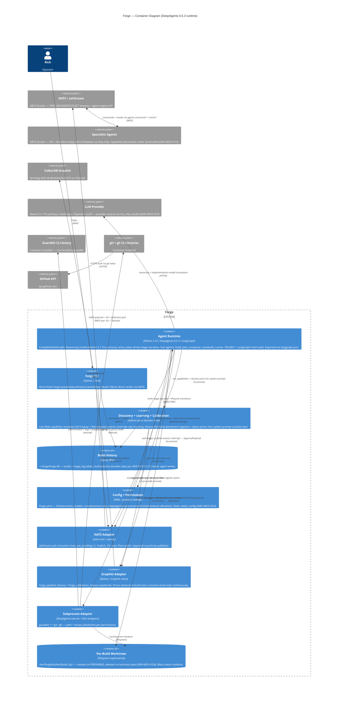

# Forge — C4 Level 2 (Container Diagram)

> **Generated:** 2026-04-18 via `/system-arch`
> **Approved by:** Rich (diagram review gate, this session)

## What to look for

`agent` is the hub (expected — DeepAgents graph orchestrates everything); no adapters talk to each other directly (clean Hexagonal — all cross-adapter coordination goes through `agent` or `discovery`). `sqlite` has 2 accessors (`agent` write, `cli` read) — clean ownership. `worktrees` touched by both `agent` (via DeepAgents filesystem tools) and `subprocess_adapter` (via shell commands in `/var/forge/builds/{build_id}`) — deliberate, these are two legitimate access modes to the same filesystem. Externals cluster around their trust boundaries: NATS infrastructure on GB10, Graphiti on Synology, LLM + GitHub across the public internet.

Node count: 17 / 30 threshold.

## Async / inbound paths

- **Build trigger inbound:** Jarvis → nats_server → nats_adapter → agent (shown fully in [system-context.md](system-context.md); NATS aggregates into `nats_server` here)
- **Approval inbound:** nats_server → nats_adapter → agent `interrupt()` resume
- **Fleet capability changes:** `fleet.register` / `deregister` / `heartbeat` events → nats_adapter → discovery (live cache invalidation, ADR-ARCH-017)

## Module mapping

Each container maps to modules described in [ARCHITECTURE.md §3](ARCHITECTURE.md#3-module-map-15-modules-in-5-groups):

| Container | Modules |
|---|---|
| Agent Runtime | `forge.agent`, `forge.prompts`, `forge.subagents`, `forge.gating`, `forge.state_machine`, `forge.notifications`, `forge.history_labels`, `forge.tools.*` (all) |
| Discovery + Learning + Calibration | `forge.discovery`, `forge.learning`, `forge.calibration` |
| NATS Adapter | `forge.adapters.nats`, `forge.fleet` |
| Graphiti Adapter | `forge.adapters.graphiti`, `forge.adapters.history_parser` |
| Subprocess Adapter | `forge.adapters.guardkit` |
| Build History DB | `forge.adapters.sqlite` |
| Forge CLI | `forge.cli` |
| Config + Permissions | `forge.config` + `forge.yaml` file |

## Related

- [system-context.md](system-context.md) — C4 Level 1
- [ARCHITECTURE.md](ARCHITECTURE.md) — index, module map, decision list
- [forge-pipeline-architecture.md §6](../research/forge-pipeline-architecture.md#6-forge-state-machine) — state-machine diagram
