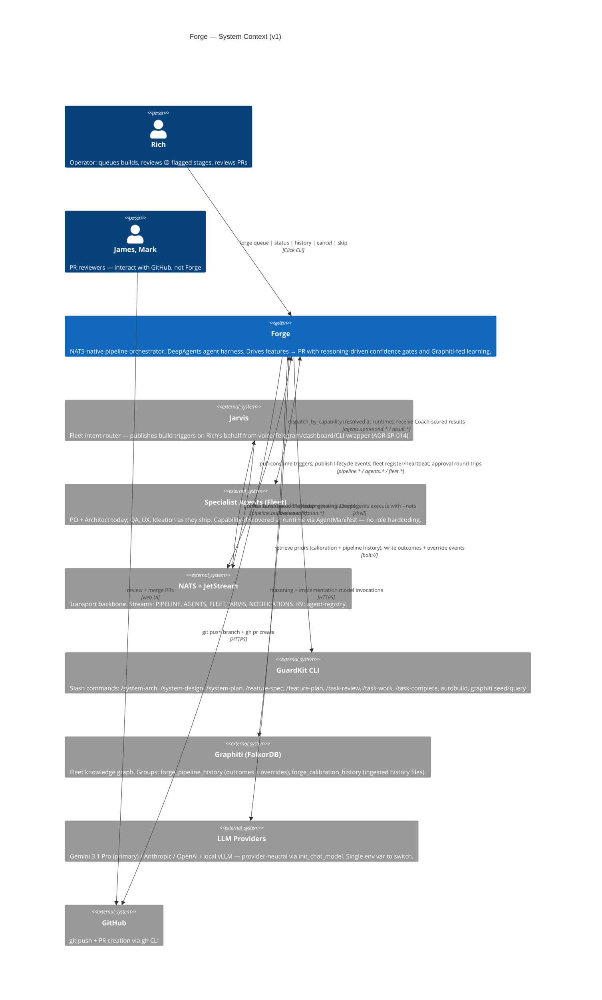

# Forge — C4 Level 1 (System Context)

> **Generated:** 2026-04-18 via `/system-arch`
> **Approved by:** Rich (diagram review gate, this session)

## What to look for

Forge is bidirectionally-connected to NATS, specialists, and Graphiti — these are the three load-bearing external dependencies. Jarvis interacts only via NATS (not directly with Forge — ADR-SP-014 Pattern A). LLM is a one-way call-out (requests; responses implicit). GitHub is one-way via git/gh. James & Mark interact only with GitHub — deliberate (they don't touch pipeline internals). GuardKit is subprocess-only, no NATS round-trip from Forge's side.

Node count: 10 / 30 threshold.

## Trust boundaries

- **Forge + NATS + specialists** run inside the APPMILLA NATS account (D13) — fleet-boundary trust.
- **Graphiti (FalkorDB on Synology)** reachable via Tailscale mesh from GB10.
- **LLM providers + GitHub** — public internet, HTTPS, token-authenticated.
- **Jarvis** — fellow APPMILLA fleet agent; trust inherited from fleet boundary.

## Related diagrams

- [container.md](container.md) — C4 Level 2 (Forge's internal containers)
- [forge-pipeline-architecture.md §6](../research/forge-pipeline-architecture.md#6-forge-state-machine) — state-machine diagram (anchor)
