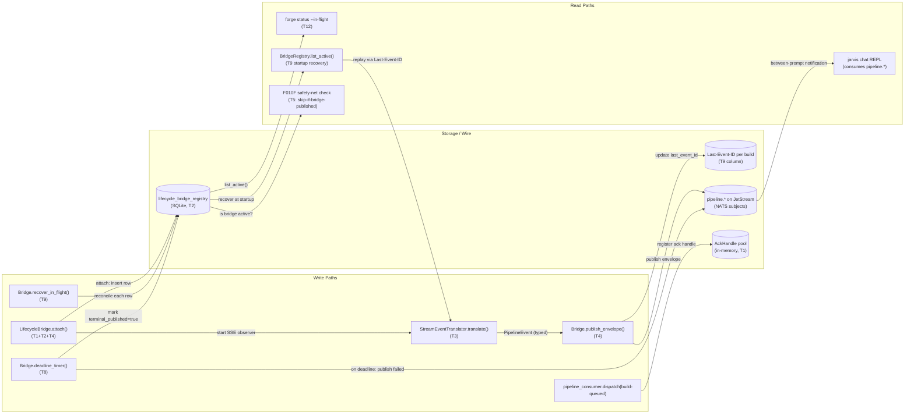
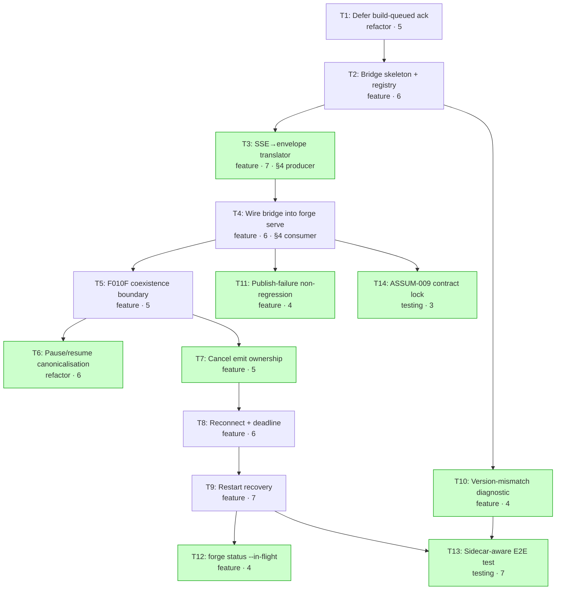

/feature-plan "Wire the autobuild_runner sidecar lifecycle bridge into forge serve" \                                                                                           --context features/forge-autobuild-runner-pipeline-emitter-bridge/forge-autobuild-runner-pipeline-emitter-bridge_summary.md

I'll orchestrate the feature planning workflow for wiring the autobuild_runner sidecar lifecycle bridge into forge serve. Let me first load the context file to understand the feature scope.

Read forge-autobuild-runner-pipeline-emitter-bridge_summary.md
Context loaded: 26 scenarios, 10 assumptions (2 low-confidence requiring review), wave-plan should land at tasks/backlog/forge-autobuild-runner-pipeline-emitter-bridge/. Now invoking Context A clarification.

Agent:Collect review scope clarifications
IN
Execute clarification for feature planning.

CONTEXT TYPE: review_scope

FEATURE: Wire the autobuild_runner sidecar lifecycle bridge into forge serve

This feature closes the F010J → F010M wire gap: every state transition the autobuild reaches inside the langgraph-runner sidecar (success, async failure, pause, resume, cancel) must produce a wire-visible `pipeline.*` envelope on JetStream so the chat REPL can render between-prompt notifications.

Key context:
- 26 Gherkin scenarios already specified in features/forge-autobuild-runner-pipeline-emitter-bridge/
- 10 assumptions (1 high / 7 medium / 2 low confidence)
- Anchor task: TASK-FORGE-FRR-F010M (Phase 2 output)
- Recommended implementation: Option C (Streaming via runs.join_stream with Last-Event-ID), with E (Hybrid) as named fallback
- 2 low-confidence assumptions need verification:
  * ASSUM-003: Bridge reconnect-schedule bound (count, backoff shape, failure threshold)
  * ASSUM-009: Cross-process correlation-id enforcement (conditional on option choice)
- Output target: tasks/backlog/forge-autobuild-runner-pipeline-emitter-bridge/ with parent_task: TASK-FORGE-FRR-F010M

ESTIMATED COMPLEXITY: 8/10 (multi-process lifecycle, restart-recovery, deferred-ack, pause/resume coordination)

FLAGS:
  --no-questions: false
  --with-questions: false
  --defaults: false
  --answers: (none provided)

Ask about:
1. Review focus (all/technical/architecture/performance/security)
2. Trade-off priority (speed/quality/cost/maintainability/balanced)
3. Any specific concerns to address (especially the 2 low-confidence assumptions ASSUM-003 reconnect-schedule numbers and ASSUM-009 correlation-id enforcement)

Return ClarificationContext with review preferences.
Read
Read forge-autobuild-runner-pipeline-emitter-bridge-scope.md
The clarification-questioner agent has prepared the review scope questions. Please answer:

CLARIFICATION — Review Scope
Feature: Wire autobuild_runner sidecar lifecycle bridge into forge serve
Task: TASK-FORGE-FRR-F010M | Complexity: 8/10

Q1 — Review focus


A  All areas (full breadth — architectural, technical, correctness, security)
B  Architecture only (option selection rationale, cross-cutting concern matrix)
C  Technical depth (SSE translation layer, reconnect logic, ack contract refactor)
D  Correctness only (are the 26 Gherkin scenarios sufficient to lock the option)
[A/B/C/D, default: A]

Q2 — Trade-off priority


S  Speed — favour Option F or terminal-only subset of C
Q  Quality — full per-stage coverage, clean recovery, no silent gaps (stick with C)
M  Maintainability — minimise cross-process surface area (favour E with D-NATS)
B  Balanced — let BDD scenarios drive the decision
[S/Q/M/B, default: B]

Q3 — Low-confidence assumptions


3a  ASSUM-003 (reconnect-schedule numbers)
      L  Leave open — /feature-spec/plan will pick concrete numbers
      V  Verify now — look up forge's existing backoff convention first

3b  ASSUM-009 (cross-process correlation-id enforcement)
      L  Leave open — moot if Option C is ratified
      V  Verify now — read F010C lint guard shape regardless
[3a=L|V, 3b=L|V, default: 3a=L 3b=L]

Please answer (e.g. "A, Q, 3a=L 3b=L") and I'll proceed with task creation and review analysis.

command-history.md
Q1:A, Q2:B, Q3a:V,Q3b:V
Got the preferences:

context_a: focus=all, tradeoff=balanced, verify ASSUM-003 (backoff) and ASSUM-009 (F010C lint guard) now
Per Q3a/Q3b=V, I need to verify both low-confidence assumptions before proceeding. Running those verifications and Graphiti context lookup in parallel.

Agent:Verify ASSUM-003 backoff conventions
IN
Search the forge codebase for existing reconnect/backoff conventions that the autobuild_runner sidecar lifecycle bridge should reuse or align with.

Looking for:
1. Any existing exponential backoff, retry-with-backoff, or reconnect logic — particularly around NATS/JetStream consumers, langgraph-runner client, or HTTP clients
2. Any constants like MAX_RETRIES, BACKOFF_BASE, RECONNECT_INTERVAL, etc.
3. Anywhere SSE or streaming clients reconnect (Last-Event-ID handling)
4. Anywhere `runs.join_stream` is called or referenced
5. Existing convention documents in docs/design/contracts or docs/architecture/decisions

Report back:
- The specific file paths and line numbers of any backoff/reconnect implementations
- Concrete numbers used (attempt count, backoff shape, max delay, total budget)
- Whether forge has a central retry helper or if each callsite rolls its own
- Whether there is an existing reconnect convention document

This needs to inform the wave-plan choice of (a) reconnect-attempt count, (b) backoff shape (linear / exponential / capped exponential), (c) failure-after-N-attempts threshold for the SSE bridge.

Search "very thorough" — multiple naming conventions likely.
Agent:Verify ASSUM-009 F010C lint guard
IN
Search the forge codebase for the F010C lint guard or any cross-process correlation-id enforcement related to TASK-FORGE-FRR-F010C.

Looking for:
1. The F010C task — likely in tasks/completed/ or tasks/archived/. Find the task file and read its acceptance criteria and implementation summary.
2. Any lint guard, AST checker, ruff/flake8 plugin, pre-commit hook, or test that enforces correlation-id propagation across process boundaries
3. Any code referring to "correlation_id", "build_id", or similar identifier propagation rules
4. The shape of the guard: is it a runtime check, a static analysis check, a test, or a contract?
5. Where it lives — `installer/`, `tools/`, `scripts/`, `tests/`, or `pyproject.toml` config

Report back:
- File paths and line numbers of the guard implementation
- The exact rule it enforces (e.g. "every emit_pipeline_event call must pass build_id")
- Whether it is per-process or cross-process
- Whether it would need to be extended for the autobuild_runner sidecar lifecycle bridge if Option D/E (cross-process) were chosen instead of Option C (single-process streaming)

This needs to inform whether ASSUM-009 in the feature spec is moot (under Option C) or load-bearing (under Option D/E).

Search "very thorough" — F010C may be in archived state or named differently.
Bash
IN
find /home/richardwoollcott/Projects/appmilla_github/forge -type f \( -name "*.py" -o -name "*.ts" -o -name "*.js" -o -name "*.md" \) | head -20

OUT
/home/richardwoollcott/Projects/appmilla_github/forge/command_history.md
/home/richardwoollcott/Projects/appmilla_github/forge/AGENTS.md
/home/richardwoollcott/Projects/appmilla_github/forge/conftest.py
/home/richardwoollcott/Projects/appmilla_github/forge/README.md
/home/richardwoollcott/Projects/appmilla_github/forge/tests/test_forge_config.py
/home/richardwoollcott/Projects/appmilla_github/forge/tests/test_approval_config.py
/home/richardwoollcott/Projects/appmilla_github/forge/tests/__init__.py
/home/richardwoollcott/Projects/appmilla_github/forge/.claude/CLAUDE.md
/home/richardwoollcott/Projects/appmilla_github/forge/.pytest_cache/README.md
/home/richardwoollcott/Projects/appmilla_github/forge/.claude.backup.20260418_124519/CLAUDE.md
/home/richardwoollcott/Projects/appmilla_github/forge/spikes/deepagents-053/permissions_repro.py
/home/richardwoollcott/Projects/appmilla_github/forge/spikes/deepagents-053/interrupt_server_drive.py
/home/richardwoollcott/Projects/appmilla_github/forge/spikes/deepagents-053/interrupt_resume.py
/home/richardwoollcott/Projects/appmilla_github/forge/spikes/deepagents-053/interrupt_graph.py
/home/richardwoollcott/Projects/appmilla_github/forge/.guardkit/smoke/feat-forge-001-smoke.py
/home/richardwoollcott/Projects/appmilla_github/forge/.claude/task-plans/TASK-FW10-007-implementation-plan.md
/home/richardwoollcott/Projects/appmilla_github/forge/.claude/task-plans/TASK-IC-012-implementation-plan.md
/home/richardwoollcott/Projects/appmilla_github/forge/.claude/task-plans/TASK-PSM-013-implementation-plan.md
/home/richardwoollcott/Projects/appmilla_github/forge/.claude/task-plans/TASK-NFI-005-implementation-plan.md
/home/richardwoollcott/Projects/appmilla_github/forge/.claude/task-plans/TASK-F009-004-implementation-plan.md
Bash
IN
grep -r "backoff\|retry\|reconnect\|RETRY\|BACKOFF\|RECONNECT" /home/richardwoollcott/Projects/appmilla_github/forge --include="*.py" --include="*.ts" --include="*.js" --include="*.md" -l

OUT
/home/richardwoollcott/Projects/appmilla_github/forge/AGENTS.md
/home/richardwoollcott/Projects/appmilla_github/forge/spikes/deepagents-053/permissions_repro.py
/home/richardwoollcott/Projects/appmilla_github/forge/tests/forge/test_pipeline_consumer_dispatch_failure_publish.py
/home/richardwoollcott/Projects/appmilla_github/forge/tests/bdd/test_guardkit_command_invocation_engine.py
/home/richardwoollcott/Projects/appmilla_github/forge/tests/bdd/test_infrastructure_coordination.py
/home/richardwoollcott/Projects/appmilla_github/forge/tests/bdd/test_specialist_agent_delegation.py
/home/richardwoollcott/Projects/appmilla_github/forge/tests/bdd/test_pipeline_state_machine.py
/home/richardwoollcott/Projects/appmilla_github/forge/tests/forge/dispatch/test_contract_and_seam.py
/home/richardwoollcott/Projects/appmilla_github/forge/tests/forge/test_contract_and_seam.py
/home/richardwoollcott/Projects/appmilla_github/forge/tests/forge/test_pipeline_consumer_validation.py
/home/richardwoollcott/Projects/appmilla_github/forge/tests/forge/test_cli_serve_daemon.py
/home/richardwoollcott/Projects/appmilla_github/forge/tests/forge/dispatch/test_retry.py
/home/richardwoollcott/Projects/appmilla_github/forge/tests/forge/dispatch/test_dispatch_models.py
/home/richardwoollcott/Projects/appmilla_github/forge/tests/forge/adapters/test_fleet_watcher.py
/home/richardwoollcott/Projects/appmilla_github/forge/tests/forge/test_pipeline_consumer_correlation_id.py
/home/richardwoollcott/Projects/appmilla_github/forge/tests/forge/dispatch/test_async_polling.py
/home/richardwoollcott/Projects/appmilla_github/forge/tests/forge/pipeline/dispatchers/test_specialist.py
/home/richardwoollcott/Projects/appmilla_github/forge/tests/forge/test_pipeline_consumer.py
/home/richardwoollcott/Projects/appmilla_github/forge/tests/forge/dispatch/test_persistence.py
/home/richardwoollcott/Projects/appmilla_github/forge/tests/integration/test_mode_a_crash_recovery.py
/home/richardwoollcott/Projects/appmilla_github/forge/tests/forge/adapters/test_specialist_dispatch.py
/home/richardwoollcott/Projects/appmilla_github/forge/tests/integration/test_forge_production_image.py
/home/richardwoollcott/Projects/appmilla_github/forge/tests/integration/test_mode_b_c_crash_recovery.py
/home/richardwoollcott/Projects/appmilla_github/forge/tasks/in_progress/feat-jarvis-internal-001-followups/TASK-FORGE-FRR-F010M-scope-autobuild-runner-pipeline-emitter-bridge.md
/home/richardwoollcott/Projects/appmilla_github/forge/tests/forge/adapters/guardkit/test_run.py
/home/richardwoollcott/Projects/appmilla_github/forge/tests/integration/test_crash_recovery_re_emit.py
/home/richardwoollcott/Projects/appmilla_github/forge/tasks/completed/TASK-FW10-001-refactor-serve-daemon-seam-and-reconcile-on-boot.md
/home/richardwoollcott/Projects/appmilla_github/forge/tasks/completed/TASK-FIX-F09A1/TASK-FIX-F09A1-add-preflight-and-cli-deps.md
/home/richardwoollcott/Projects/appmilla_github/forge/tasks/completed/forge-production-image/IMPLEMENTATION-GUIDE.md
/home/richardwoollcott/Projects/appmilla_github/forge/tasks/backlog/TASK-SAD-001-dispatch-package-skeleton.md
/home/richardwoollcott/Projects/appmilla_github/forge/tasks/backlog/mode-a-greenfield-end-to-end/TASK-MAG7-007-dispatch-specialist-stage.md
/home/richardwoollcott/Projects/appmilla_github/forge/tasks/backlog/TASK-REV-MAG7-plan-mode-a-greenfield-end-to-end.md
/home/richardwoollcott/Projects/appmilla_github/forge/tasks/backlog/TASK-IC-003-write-ordering-guard.md
/home/richardwoollcott/Projects/appmilla_github/forge/tasks/completed/TASK-FORGE-FRR-F010J/TASK-FORGE-FRR-F010J-wire-langgraph-runner-sidecar-url-into-async-subagent-registration.md
/home/richardwoollcott/Projects/appmilla_github/forge/tasks/backlog/mode-a-greenfield-end-to-end/IMPLEMENTATION-GUIDE.md
/home/richardwoollcott/Projects/appmilla_github/forge/tasks/backlog/mode-b-feature-and-mode-c-review-fix/IMPLEMENTATION-GUIDE.md
/home/richardwoollcott/Projects/appmilla_github/forge/tasks/backlog/mode-b-feature-and-mode-c-review-fix/TASK-MBC8-014-crash-recovery-mode-b-c.md
/home/richardwoollcott/Projects/appmilla_github/forge/tasks/backlog/infrastructure-coordination/TASK-IC-003-write-ordering-guard.md
/home/richardwoollcott/Projects/appmilla_github/forge/tasks/backlog/infrastructure-coordination/TASK-IC-007-session-outcome-writer.md
/home/richardwoollcott/Projects/appmilla_github/forge/tasks/backlog/pipeline-state-machine-and-configuration/TASK-PSM-007-crash-recovery-reconciliation.md
/home/richardwoollcott/Projects/appmilla_github/forge/tasks/backlog/mode-a-greenfield-end-to-end/TASK-MAG7-013-crash-recovery-integration.md
/home/richardwoollcott/Projects/appmilla_github/forge/tasks/backlog/specialist-agent-delegation/TASK-SAD-001-dispatch-package-skeleton.md
/home/richardwoollcott/Projects/appmilla_github/forge/tasks/backlog/specialist-agent-delegation/TASK-SAD-007-retry-coordinator.md
/home/richardwoollcott/Projects/appmilla_github/forge/tasks/backlog/guardkit-command-invocation-engine/TASK-GCI-011-bdd-scenario-pytest-wiring.md
/home/richardwoollcott/Projects/appmilla_github/forge/tasks/backlog/TASK-FIX-F09A2-guardkit-uv-sources-detection.md
/home/richardwoollcott/Projects/appmilla_github/forge/tasks/backlog/guardkit-command-invocation-engine/IMPLEMENTATION-GUIDE.md
/home/richardwoollcott/Projects/appmilla_github/forge/tasks/backlog/specialist-agent-delegation/TASK-SAD-002-resolution-record-persistence.md
/home/richardwoollcott/Projects/appmilla_github/forge/tasks/backlog/guardkit-command-invocation-engine/TASK-GCI-009-wire-guardkit-tool-wrappers.md
/home/richardwoollcott/Projects/appmilla_github/forge/tasks/backlog/specialist-agent-delegation/TASK-SAD-006-dispatch-orchestrator.md
/home/richardwoollcott/Projects/appmilla_github/forge/tasks/backlog/specialist-agent-delegation/README.md
/home/richardwoollcott/Projects/appmilla_github/forge/tasks/backlog/specialist-agent-delegation/IMPLEMENTATION-GUIDE.md
/home/richardwoollcott/Projects/appmilla_github/forge/tasks/backlog/specialist-agent-delegation/TASK-SAD-010-nats-adapter-specialist-dispatch.md
/home/richardwoollcott/Projects/appmilla_github/forge/tasks/backlog/specialist-agent-delegation/TASK-SAD-011-bdd-smoke-pytest-wiring.md
/home/richardwoollcott/Projects/appmilla_github/forge/tasks/design_approved/TASK-SAD-011-bdd-smoke-pytest-wiring.md
/home/richardwoollcott/Projects/appmilla_github/forge/tasks/backlog/nats-fleet-integration/TASK-NFI-009-reconcile-on-boot-crash-recovery.md
/home/richardwoollcott/Projects/appmilla_github/forge/tasks/backlog/feat-jarvis-internal-001-followups/TASK-REV-F010-bind-production-dispatch-chain-in-serve-cmd.md
/home/richardwoollcott/Projects/appmilla_github/forge/tasks/backlog/nats-fleet-integration/TASK-NFI-005-fleet-watcher.md
/home/richardwoollcott/Projects/appmilla_github/forge/tasks/backlog/specialist-agent-delegation/TASK-SAD-012-contract-and-seam-tests.md
/home/richardwoollcott/Projects/appmilla_github/forge/tasks/design_approved/TASK-NFI-009-reconcile-on-boot-crash-recovery.md
/home/richardwoollcott/Projects/appmilla_github/forge/tasks/backlog/specialist-agent-delegation/TASK-SAD-008-async-mode-polling.md
/home/richardwoollcott/Projects/appmilla_github/forge/tasks/backlog/nats-fleet-integration/IMPLEMENTATION-GUIDE.md
/home/richardwoollcott/Projects/appmilla_github/forge/tasks/design_approved/TASK-IC-007-session-outcome-writer.md
/home/richardwoollcott/Projects/appmilla_github/forge/tasks/design_approved/TASK-NFI-005-fleet-watcher.md
/home/richardwoollcott/Projects/appmilla_github/forge/tasks/design_approved/TASK-GCI-008-implement-guardkit-run-subprocess-wrapper.md
/home/richardwoollcott/Projects/appmilla_github/forge/tasks/design_approved/TASK-SAD-012-contract-and-seam-tests.md
/home/richardwoollcott/Projects/appmilla_github/forge/tasks/backlog/guardkit-command-invocation-engine/TASK-GCI-008-implement-guardkit-run-subprocess-wrapper.md
/home/richardwoollcott/Projects/appmilla_github/forge/tasks/design_approved/TASK-MBC8-014-crash-recovery-mode-b-c.md
/home/richardwoollcott/Projects/appmilla_github/forge/tasks/design_approved/TASK-GCI-009-wire-guardkit-tool-wrappers.md
/home/richardwoollcott/Projects/appmilla_github/forge/tasks/design_approved/TASK-MAG7-007-dispatch-specialist-stage.md
/home/richardwoollcott/Projects/appmilla_github/forge/tasks/design_approved/TASK-SAD-007-retry-coordinator.md
/home/richardwoollcott/Projects/appmilla_github/forge/tasks/design_approved/TASK-PSM-005-persistence-protocol-implementations.md
/home/richardwoollcott/Projects/appmilla_github/forge/tasks/design_approved/TASK-SAD-008-async-mode-polling.md
/home/richardwoollcott/Projects/appmilla_github/forge/tasks/design_approved/TASK-SAD-010-nats-adapter-specialist-dispatch.md
/home/richardwoollcott/Projects/appmilla_github/forge/tasks/in_review/feat-jarvis-internal-001-followups/TASK-FORGE-FRR-F010D-thread-correlation-id-into-recovery-build-failed-emit.md
/home/richardwoollcott/Projects/appmilla_github/forge/tasks/design_approved/TASK-SAD-006-dispatch-orchestrator.md
/home/richardwoollcott/Projects/appmilla_github/forge/tasks/design_approved/TASK-GCI-011-bdd-scenario-pytest-wiring.md
/home/richardwoollcott/Projects/appmilla_github/forge/tasks/design_approved/TASK-SAD-002-resolution-record-persistence.md
/home/richardwoollcott/Projects/appmilla_github/forge/.claude/reviews/TASK-REV-IC8B-review-report.md
/home/richardwoollcott/Projects/appmilla_github/forge/tasks/design_approved/TASK-PSM-007-crash-recovery-reconciliation.md
/home/richardwoollcott/Projects/appmilla_github/forge/tasks/design_approved/TASK-MAG7-013-crash-recovery-integration.md
/home/richardwoollcott/Projects/appmilla_github/forge/.claude/agents/pattern-advisor.md
/home/richardwoollcott/Projects/appmilla_github/forge/.claude/agents/deepagents-orchestrator-specialist.md
/home/richardwoollcott/Projects/appmilla_github/forge/tasks/in_review/TASK-REV-SAD3-plan-specialist-agent-delegation.md
/home/richardwoollcott/Projects/appmilla_github/forge/.claude/reviews/TASK-REV-SAD3-review-report.md
/home/richardwoollcott/Projects/appmilla_github/forge/.claude/reviews/TASK-REV-MAG7-review-report.md
/home/richardwoollcott/Projects/appmilla_github/forge/.claude/reviews/TASK-REV-FW10-review-report.md
/home/richardwoollcott/Projects/appmilla_github/forge/docs/research/forge-build-plan-alignment-review.md
/home/richardwoollcott/Projects/appmilla_github/forge/docs/architecture/decisions/ADR-ARCH-009-omit-langgraph-checkpointer.md
/home/richardwoollcott/Projects/appmilla_github/forge/docs/architecture/decisions/ADR-ARCH-029-best-effort-availability.md
/home/richardwoollcott/Projects/appmilla_github/forge/docs/architecture/decisions/ADR-ARCH-028-ephemeral-per-build-worktrees.md
/home/richardwoollcott/Projects/appmilla_github/forge/docs/architecture/domain-model.md
/home/richardwoollcott/Projects/appmilla_github/forge/docs/handoffs/F8-007a-nats-canonical-provisioning.md
/home/richardwoollcott/Projects/appmilla_github/forge/.claude/rules/patterns/long-running-tools.md
/home/richardwoollcott/Projects/appmilla_github/forge/.claude/reviews/TASK-REV-3EEE-review-report.md
/home/richardwoollcott/Projects/appmilla_github/forge/docs/state/TASK-FORGE-FRR-001/implementation_plan.md
/home/richardwoollcott/Projects/appmilla_github/forge/docs/research/ideas/conversation-starter-gap-analysis.md
/home/richardwoollcott/Projects/appmilla_github/forge/docs/research/forge-pipeline-architecture.md
/home/richardwoollcott/Projects/appmilla_github/forge/docs/research/forge-autobuild-runner-pipeline-emitter-bridge-scope.md
/home/richardwoollcott/Projects/appmilla_github/forge/docs/research/ideas/forge-build-plan.md
/home/richardwoollcott/Projects/appmilla_github/forge/docs/design/contracts/API-nats-pipeline-events.md
/home/richardwoollcott/Projects/appmilla_github/forge/docs/architecture/decisions/ADR-ARCH-031-async-subagents-for-long-running-work.md
/home/richardwoollcott/Projects/appmilla_github/forge/docs/history/autobuild-FEAT-FORGE-001-history.md
/home/richardwoollcott/Projects/appmilla_github/forge/docs/design/contracts/API-nats-agent-dispatch.md
/home/richardwoollcott/Projects/appmilla_github/forge/docs/history/feature-spec-FEAT-FORGE-001.md
/home/richardwoollcott/Projects/appmilla_github/forge/docs/research/ideas/forge-pipeline-orchestrator-refresh.md
/home/richardwoollcott/Projects/appmilla_github/forge/docs/design/contracts/API-sqlite-schema.md
/home/richardwoollcott/Projects/appmilla_github/forge/docs/research/pipeline-orchestrator-consolidated-build-plan.md
/home/richardwoollcott/Projects/appmilla_github/forge/docs/history/feature-plan-FEAT-FORGE-006-history.md
/home/richardwoollcott/Projects/appmilla_github/forge/docs/research/pipeline-orchestrator-conversation-starter.md
/home/richardwoollcott/Projects/appmilla_github/forge/docs/design/decisions/DDR-005-cli-context-manifest-resolution.md
/home/richardwoollcott/Projects/appmilla_github/forge/docs/history/feature-plan-FEAT-FORGE-009-history.md
/home/richardwoollcott/Projects/appmilla_github/forge/docs/history/feature-spec-FEAT-FORGE-009-history.md
/home/richardwoollcott/Projects/appmilla_github/forge/docs/history/autobuild-FEAT-FORGE-009-failure-run-1-history.md
/home/richardwoollcott/Projects/appmilla_github/forge/docs/history/feature-plan-FEAT-FORGE-005-history.md
/home/richardwoollcott/Projects/appmilla_github/forge/docs/history/autobuild-FEAT-8D10-history.md
/home/richardwoollcott/Projects/appmilla_github/forge/docs/design/decisions/DDR-006-async-subagent-state-channel-contract.md
/home/richardwoollcott/Projects/appmilla_github/forge/docs/history/feature-spec-FEAT-FORGE-004-history.md
/home/richardwoollcott/Projects/appmilla_github/forge/docs/history/feature-plan-nats-integration-history.md
/home/richardwoollcott/Projects/appmilla_github/forge/docs/history/feature-spec-FEAT-FORGE-007-history.md
/home/richardwoollcott/Projects/appmilla_github/forge/docs/history/system-arch-history.md
/home/richardwoollcott/Projects/appmilla_github/forge/docs/design/models/DM-build-lifecycle.md
/home/richardwoollcott/Projects/appmilla_github/forge/docs/history/system-design-history.md
/home/richardwoollcott/Projects/appmilla_github/forge/src/forge/memory/qa_ingestion.py
/home/richardwoollcott/Projects/appmilla_github/forge/docs/history/feature-plan-FEAT-FORGE-001-history.md
/home/richardwoollcott/Projects/appmilla_github/forge/docs/history/autobuild-FEAT-FORGE-005-history-after-bdd-fixes.md
/home/richardwoollcott/Projects/appmilla_github/forge/src/forge/memory/ordering.py
/home/richardwoollcott/Projects/appmilla_github/forge/docs/architecture/decisions/ADR-ARCH-025-tool-error-handling.md
/home/richardwoollcott/Projects/appmilla_github/forge/docs/history/feature-spec-wire-the-production-pipeline-orchestrator-history.md
/home/richardwoollcott/Projects/appmilla_github/forge/docs/history/feature-spec-FEAT-FORGE-006-history.md
/home/richardwoollcott/Projects/appmilla_github/forge/src/forge/dispatch/retry.py
/home/richardwoollcott/Projects/appmilla_github/forge/docs/history/feature-spec-FEAT-FORGE-005-history.md
/home/richardwoollcott/Projects/appmilla_github/forge/docs/history/RUNBOOK-FEAT-FORGE-008-validation-run-1.md
/home/richardwoollcott/Projects/appmilla_github/forge/src/forge/cli/_serve_daemon.py
/home/richardwoollcott/Projects/appmilla_github/forge/features/forge-autobuild-runner-pipeline-emitter-bridge/forge-autobuild-runner-pipeline-emitter-bridge_summary.md
/home/richardwoollcott/Projects/appmilla_github/forge/docs/history/autobuild-FEAT-FORGE-005-history-hit-rate-limit.md
/home/richardwoollcott/Projects/appmilla_github/forge/docs/research/forge-orchestrator-wiring-gap.md
/home/richardwoollcott/Projects/appmilla_github/forge/docs/history/feature-plan-FEAT-FORGE-008-history.md
/home/richardwoollcott/Projects/appmilla_github/forge/src/forge/dispatch/correlation.py
/home/richardwoollcott/Projects/appmilla_github/forge/src/forge/cli/_serve_deps_state_channel.py
/home/richardwoollcott/Projects/appmilla_github/forge/docs/history/autobuild-FEAT-FORGE-008-history.md
/home/richardwoollcott/Projects/appmilla_github/forge/docs/history/autobuild-FEAT-CBDE-history.md
/home/richardwoollcott/Projects/appmilla_github/forge/src/forge/pipeline/dispatchers/specialist.py
/home/richardwoollcott/Projects/appmilla_github/forge/src/forge/adapters/nats/fleet_watcher.py
/home/richardwoollcott/Projects/appmilla_github/forge/docs/history/command-history.md
/home/richardwoollcott/Projects/appmilla_github/forge/features/forge-serve-orchestrator-wiring/forge-serve-orchestrator-wiring_summary.md
/home/richardwoollcott/Projects/appmilla_github/forge/src/forge/adapters/guardkit/run.py
/home/richardwoollcott/Projects/appmilla_github/forge/docs/history/feature-plan-pipeline-state-machine-and-configuration-history.md
/home/richardwoollcott/Projects/appmilla_github/forge/src/forge/dispatch/models.py
/home/richardwoollcott/Projects/appmilla_github/forge/src/forge/adapters/nats/pipeline_publisher.py
/home/richardwoollcott/Projects/appmilla_github/forge/docs/history/feature-spec-FEAT-FORGE-008-history.md
/home/richardwoollcott/Projects/appmilla_github/forge/docs/history/feature-plan-FEAT-FORGE-003-history.md
/home/richardwoollcott/Projects/appmilla_github/forge/src/forge/gating/wrappers.py
/home/richardwoollcott/Projects/appmilla_github/forge/src/forge/dispatch/persistence.py
/home/richardwoollcott/Projects/appmilla_github/forge/src/forge/memory/reconciler.py
/home/richardwoollcott/Projects/appmilla_github/forge/src/forge/memory/session_outcome.py
/home/richardwoollcott/Projects/appmilla_github/forge/docs/history/autobuild-FEAT-FORGE-003-history.md
/home/richardwoollcott/Projects/appmilla_github/forge/features/specialist-agent-delegation/specialist-agent-delegation_summary.md
/home/richardwoollcott/Projects/appmilla_github/forge/src/forge/dispatch/async_polling.py
/home/richardwoollcott/Projects/appmilla_github/forge/docs/history/feature-plan-wire-the-production-pipeline-orchestrator-history.md
/home/richardwoollcott/Projects/appmilla_github/forge/docs/history/review-TASK-REV-F09A-history.md
/home/richardwoollcott/Projects/appmilla_github/forge/src/forge/lifecycle/recovery.py
/home/richardwoollcott/Projects/appmilla_github/forge/src/forge/cli/_serve_state.py
/home/richardwoollcott/Projects/appmilla_github/forge/docs/history/autobuild-FEAT-FORGE-004-history.md
/home/richardwoollcott/Projects/appmilla_github/forge/features/mode-b-feature-and-mode-c-review-fix/mode-b-feature-and-mode-c-review-fix_summary.md
/home/richardwoollcott/Projects/appmilla_github/forge/src/forge/memory/writer.py
/home/richardwoollcott/Projects/appmilla_github/forge/src/forge/lifecycle/persistence.py
/home/richardwoollcott/Projects/appmilla_github/forge/src/forge/dispatch/orchestrator.py
/home/richardwoollcott/Projects/appmilla_github/forge/src/forge/cli/_serve_dispatcher.py
/home/richardwoollcott/Projects/appmilla_github/forge/docs/history/feature-plan-FEAT-FORGE-007-history.md
/home/richardwoollcott/Projects/appmilla_github/forge/src/forge/adapters/nats/approval_publisher.py
/home/richardwoollcott/Projects/appmilla_github/forge/src/forge/discovery/models.py
/home/richardwoollcott/Projects/appmilla_github/forge/src/forge/cli/serve.py
/home/richardwoollcott/Projects/appmilla_github/forge/src/forge/tools/guardkit.py
/home/richardwoollcott/Projects/appmilla_github/forge/src/forge/adapters/nats/specialist_dispatch.py
/home/richardwoollcott/Projects/appmilla_github/forge/src/forge/adapters/nats/synthetic_response_injector.py
/home/richardwoollcott/Projects/appmilla_github/forge/src/forge/pipeline/supervisor.py
/home/richardwoollcott/Projects/appmilla_github/forge/src/forge/pipeline/cli_steering.py
/home/richardwoollcott/Projects/appmilla_github/forge/src/forge/adapters/nats/approval_subscriber.py
/home/richardwoollcott/Projects/appmilla_github/forge/src/forge/adapters/nats/pipeline_consumer.py
/home/richardwoollcott/Projects/appmilla_github/forge/features/mode-a-greenfield-end-to-end/mode-a-greenfield-end-to-end_summary.md
/home/richardwoollcott/Projects/appmilla_github/forge/.claude.backup.20260418_124519/rules/code-style.md
/home/richardwoollcott/Projects/appmilla_github/forge/src/forge/pipeline/dispatchers/subprocess.py
/home/richardwoollcott/Projects/appmilla_github/forge/features/infrastructure-coordination/infrastructure-coordination_summary.md
/home/richardwoollcott/Projects/appmilla_github/forge/features/forge-production-image/forge-production-image_summary.md
Bash Check Graphiti availability (CLI fallback)
IN
which graphiti-check 2>/dev/null || ls ~/.agentecflow/bin/graphiti-check 2>/dev/null || echo "graphiti-check not found"; ls .guardkit/graphiti.yaml 2>/dev/null || echo "graphiti.yaml not found"

OUT
/home/richardwoollcott/.agentecflow/bin/graphiti-check
.guardkit/graphiti.yaml
Bash
IN
grep -r "join_stream" /home/richardwoollcott/Projects/appmilla_github/forge --include="*.py" -n

OUT
(Bash completed with no output)
Bash
IN
find /home/richardwoollcott/Projects/appmilla_github/forge -type f -name "*F010C*" -o -name "*f010c*" 2>/dev/null

OUT
/home/richardwoollcott/Projects/appmilla_github/forge/tasks/completed/TASK-FORGE-FRR-F010C/TASK-FORGE-FRR-F010C-thread-correlation-id-into-outbound-envelopes.md
Read fleet_watcher.py
Read TASK-FORGE-FRR-F010C-thread-correlation-id-into-outbound-envelopes.md
Bash
IN
grep -r "SSE\|Last-Event-ID\|last_event_id\|streaming\|stream" /home/richardwoollcott/Projects/appmilla_github/forge/src --include="*.py" -l | head -10

OUT
/home/richardwoollcott/Projects/appmilla_github/forge/src/forge/dispatch/correlation.py
/home/richardwoollcott/Projects/appmilla_github/forge/src/forge/memory/models.py
/home/richardwoollcott/Projects/appmilla_github/forge/src/forge/lifecycle/recovery.py
/home/richardwoollcott/Projects/appmilla_github/forge/src/forge/agent.py
/home/richardwoollcott/Projects/appmilla_github/forge/src/forge/dispatch/async_polling.py
/home/richardwoollcott/Projects/appmilla_github/forge/src/forge/cli/_serve_deps_forward_context.py
/home/richardwoollcott/Projects/appmilla_github/forge/src/forge/dispatch/orchestrator.py
/home/richardwoollcott/Projects/appmilla_github/forge/src/forge/lifecycle/persistence.py
/home/richardwoollcott/Projects/appmilla_github/forge/src/forge/cli/_serve_deps_lifecycle.py
/home/richardwoollcott/Projects/appmilla_github/forge/src/forge/adapters/guardkit/__init__.py
Read test_pipeline_consumer_correlation_id.py
Bash
IN
find /home/richardwoollcott/Projects/appmilla_github/forge/docs -type f -name "*.md" | grep -i "adr\|decision\|contract" | head -20

OUT
/home/richardwoollcott/Projects/appmilla_github/forge/docs/adr/0001-adopt-agentic-flow.md
/home/richardwoollcott/Projects/appmilla_github/forge/docs/architecture/decisions/ADR-ARCH-007-build-plan-as-gated-artefact.md
/home/richardwoollcott/Projects/appmilla_github/forge/docs/architecture/decisions/ADR-ARCH-023-permissions-constitutional-safety.md
/home/richardwoollcott/Projects/appmilla_github/forge/docs/architecture/decisions/ADR-ARCH-008-forge-produces-own-history.md
/home/richardwoollcott/Projects/appmilla_github/forge/docs/architecture/decisions/ADR-ARCH-003-nats-native-no-transport-abc.md
/home/richardwoollcott/Projects/appmilla_github/forge/docs/architecture/decisions/ADR-ARCH-015-capability-driven-dispatch.md
/home/richardwoollcott/Projects/appmilla_github/forge/docs/architecture/decisions/ADR-ARCH-009-omit-langgraph-checkpointer.md
/home/richardwoollcott/Projects/appmilla_github/forge/docs/architecture/decisions/ADR-ARCH-029-best-effort-availability.md
/home/richardwoollcott/Projects/appmilla_github/forge/docs/architecture/decisions/ADR-ARCH-031-async-subagents-for-long-running-work.md
/home/richardwoollcott/Projects/appmilla_github/forge/docs/architecture/decisions/ADR-ARCH-018-calibration-priors-retrievable.md
/home/richardwoollcott/Projects/appmilla_github/forge/docs/architecture/decisions/ADR-ARCH-012-no-mcp-interface.md
/home/richardwoollcott/Projects/appmilla_github/forge/docs/architecture/decisions/ADR-ARCH-028-ephemeral-per-build-worktrees.md
/home/richardwoollcott/Projects/appmilla_github/forge/docs/architecture/decisions/ADR-ARCH-011-local-first-docker-gb10.md
/home/richardwoollcott/Projects/appmilla_github/forge/docs/architecture/decisions/ADR-ARCH-017-live-fleet-watching.md
/home/richardwoollcott/Projects/appmilla_github/forge/docs/architecture/decisions/ADR-ARCH-010-provider-neutral-models.md
/home/richardwoollcott/Projects/appmilla_github/forge/docs/architecture/decisions/ADR-ARCH-021-paused-via-langgraph-interrupt.md
/home/richardwoollcott/Projects/appmilla_github/forge/docs/architecture/decisions/ADR-ARCH-026-constitutional-rules-belt-and-braces.md
/home/richardwoollcott/Projects/appmilla_github/forge/docs/architecture/decisions/ADR-ARCH-032-langchain-1x-portfolio-alignment.md
/home/richardwoollcott/Projects/appmilla_github/forge/docs/architecture/decisions/ADR-ARCH-002-two-model-separation.md
/home/richardwoollcott/Projects/appmilla_github/forge/docs/architecture/decisions/ADR-ARCH-016-fleet-is-the-catalogue.md
Bash
IN
find /home/richardwoollcott/Projects/appmilla_github/forge/docs/design/contracts -type f -name "*.md"

OUT
/home/richardwoollcott/Projects/appmilla_github/forge/docs/design/contracts/API-nats-pipeline-events.md
/home/richardwoollcott/Projects/appmilla_github/forge/docs/design/contracts/API-subprocess.md
/home/richardwoollcott/Projects/appmilla_github/forge/docs/design/contracts/API-nats-fleet-lifecycle.md
/home/richardwoollcott/Projects/appmilla_github/forge/docs/design/contracts/API-subagents.md
/home/richardwoollcott/Projects/appmilla_github/forge/docs/design/contracts/API-nats-agent-dispatch.md
/home/richardwoollcott/Projects/appmilla_github/forge/docs/design/contracts/API-nats-approval-protocol.md
/home/richardwoollcott/Projects/appmilla_github/forge/docs/design/contracts/API-tool-layer.md
/home/richardwoollcott/Projects/appmilla_github/forge/docs/design/contracts/API-cli.md
/home/richardwoollcott/Projects/appmilla_github/forge/docs/design/contracts/API-sqlite-schema.md
Read pipeline_consumer.py
Bash
IN
grep -r "runs\.join_stream\|Last-Event-ID\|event.id\|event_id" /home/richardwoollcott/Projects/appmilla_github/forge --include="*.py" --include="*.md" -n | head -20

OUT
/home/richardwoollcott/Projects/appmilla_github/forge/tests/bdd/test_infrastructure_coordination.py:1729:    world["qa_event_id"] = "qa-event-1"
/home/richardwoollcott/Projects/appmilla_github/forge/tests/unit/test_models.py:63:def _calibration_event_id(source_file: str, start: int, end: int) -> str:
/home/richardwoollcott/Projects/appmilla_github/forge/tests/unit/test_models.py:301:        eid = _calibration_event_id("docs/calibration/log.md", 100, 120)
/home/richardwoollcott/Projects/appmilla_github/forge/tests/unit/test_models.py:321:        eid = _calibration_event_id("docs/calibration/log.md", 1, 5)
/home/richardwoollcott/Projects/appmilla_github/forge/tests/unit/test_models.py:457:                entity_id=_calibration_event_id("docs/log.md", 1, 5),
/home/richardwoollcott/Projects/appmilla_github/forge/docs/research/forge-autobuild-runner-pipeline-emitter-bridge-scope.md:376:  last observed `last_event_id`-equivalent?
/home/richardwoollcott/Projects/appmilla_github/forge/docs/research/forge-autobuild-runner-pipeline-emitter-bridge-scope.md:461:`client.runs.join_stream(thread_id, run_id, last_event_id=...)` (`GET
/home/richardwoollcott/Projects/appmilla_github/forge/docs/research/forge-autobuild-runner-pipeline-emitter-bridge-scope.md:466:last-seen `last_event_id` (the SDK's `join_stream` `last_event_id` kwarg
/home/richardwoollcott/Projects/appmilla_github/forge/docs/research/forge-autobuild-runner-pipeline-emitter-bridge-scope.md:467:threads through the `Last-Event-ID` HTTP header per
/home/richardwoollcott/Projects/appmilla_github/forge/docs/research/forge-autobuild-runner-pipeline-emitter-bridge-scope.md:476:- `last_event_id` resume semantics solve the daemon-restart recovery
/home/richardwoollcott/Projects/appmilla_github/forge/docs/research/forge-autobuild-runner-pipeline-emitter-bridge-scope.md:477:  problem natively: forge persists the last event id observed per run,
/home/richardwoollcott/Projects/appmilla_github/forge/docs/research/forge-autobuild-runner-pipeline-emitter-bridge-scope.md:487:  with `Last-Event-ID`).
/home/richardwoollcott/Projects/appmilla_github/forge/docs/research/forge-autobuild-runner-pipeline-emitter-bridge-scope.md:505:  `stream_mode="values"`? Does the SDK guarantee monotonic event-id
/home/richardwoollcott/Projects/appmilla_github/forge/docs/research/forge-autobuild-runner-pipeline-emitter-bridge-scope.md:518:- `client.runs.join_stream(...)` → `langgraph_sdk/_async/runs.py:1090-1147`
/home/richardwoollcott/Projects/appmilla_github/forge/docs/research/forge-autobuild-runner-pipeline-emitter-bridge-scope.md:519:  → `GET /threads/{tid}/runs/{rid}/stream`. SSE; `last_event_id` is
/home/richardwoollcott/Projects/appmilla_github/forge/docs/research/forge-autobuild-runner-pipeline-emitter-bridge-scope.md:520:  threaded as `Last-Event-ID` header.
/home/richardwoollcott/Projects/appmilla_github/forge/docs/research/forge-autobuild-runner-pipeline-emitter-bridge-scope.md:711:shape: a new column on `builds` carrying `(thread_id, run_id, last_event_id)`
/home/richardwoollcott/Projects/appmilla_github/forge/docs/research/forge-autobuild-runner-pipeline-emitter-bridge-scope.md:719:| **C — Streaming** | SSE `Last-Event-ID` replays missed events from the langgraph-api server-side buffer (verify buffer retention). **Cleanest recovery story** — no diffing, no missed transitions during the in-buffer window. |
/home/richardwoollcott/Projects/appmilla_github/forge/docs/research/forge-autobuild-runner-pipeline-emitter-bridge-scope.md:725:story (via `Last-Event-ID`). Every other option either accepts a per-stage
/home/richardwoollcott/Projects/appmilla_github/forge/docs/research/forge-autobuild-runner-pipeline-emitter-bridge-scope.md:821:| **C** | SSE disconnect → reconnect with `Last-Event-ID`. **Bridge needs explicit reconnect-and-resume logic** with bounded backoff. SDK's `request_reconnect` is the building block (`langgraph_sdk/_async/runs.py:1082-1088`). |
Read pipeline_consumer.py (lines 451-550)
Read _serve_daemon.py (lines 86-110)
bash
IN
{
  "command": "grep -n \"_build_publish_build_failed\\|attach_correlation_id\" /home/richardwoollcott/Projects/appmilla_github/forge/src/forge/cli/_serve_deps.py | head -50"
}
OUT
<tool_use_error>Error: No such tool available: bash</tool_use_error>
Bash
IN
grep -r "DEFAULT\|default" /home/richardwoollcott/Projects/appmilla_github/forge/src/forge/dispatch/async_polling.py -n | grep -i "interval\|backoff\|timeout\|default"

OUT
/home/richardwoollcott/Projects/appmilla_github/forge/src/forge/dispatch/async_polling.py:35:  sealed-by-default semantics today.
/home/richardwoollcott/Projects/appmilla_github/forge/src/forge/dispatch/async_polling.py:77:DEFAULT_MAX_TOTAL_SECONDS: float = 900.0
/home/richardwoollcott/Projects/appmilla_github/forge/src/forge/dispatch/async_polling.py:81:DEFAULT_POLL_INTERVAL_SECONDS: float = 5.0
/home/richardwoollcott/Projects/appmilla_github/forge/src/forge/dispatch/async_polling.py:164:            (defaults to the ASSUM-003 900s value). Strictly positive.
/home/richardwoollcott/Projects/appmilla_github/forge/src/forge/dispatch/async_polling.py:175:        poll_interval_seconds: float = DEFAULT_POLL_INTERVAL_SECONDS,
/home/richardwoollcott/Projects/appmilla_github/forge/src/forge/dispatch/async_polling.py:176:        max_total_seconds: float = DEFAULT_MAX_TOTAL_SECONDS,
/home/richardwoollcott/Projects/appmilla_github/forge/src/forge/dispatch/async_polling.py:212:        (default ``"status"``) via the injected orchestrator, threading
/home/richardwoollcott/Projects/appmilla_github/forge/src/forge/dispatch/async_polling.py:237:                default ``"status"`` matches the per-specialist
/home/richardwoollcott/Projects/appmilla_github/forge/src/forge/dispatch/async_polling.py:337:    "DEFAULT_MAX_TOTAL_SECONDS",
/home/richardwoollcott/Projects/appmilla_github/forge/src/forge/dispatch/async_polling.py:338:    "DEFAULT_POLL_INTERVAL_SECONDS",
Bash
IN
grep -n "_build_publish_build_failed\|attach_correlation_id" /home/richardwoollcott/Projects/appmilla_github/forge/src/forge/cli/_serve_deps.py | head -50

OUT
309:def _build_publish_build_failed(publisher):
323:    ``BuildFailedPayload`` via :func:`attach_correlation_id` before the
332:    from forge.pipeline import attach_correlation_id
350:                :func:`attach_correlation_id` so the publisher's
366:            attach_correlation_id(failure_payload, correlation_id)
487:    publish_build_failed = _build_publish_build_failed(publisher)
Bash
IN
find /home/richardwoollcott/Projects/appmilla_github/forge/docs -name "*.md" -type f -exec grep -l "reconnect\|backoff\|retry" {} \;

OUT
/home/richardwoollcott/Projects/appmilla_github/forge/docs/architecture/domain-model.md
/home/richardwoollcott/Projects/appmilla_github/forge/docs/handoffs/F8-007a-nats-canonical-provisioning.md
/home/richardwoollcott/Projects/appmilla_github/forge/docs/research/forge-build-plan-alignment-review.md
/home/richardwoollcott/Projects/appmilla_github/forge/docs/research/pipeline-orchestrator-conversation-starter.md
/home/richardwoollcott/Projects/appmilla_github/forge/docs/research/pipeline-orchestrator-consolidated-build-plan.md
/home/richardwoollcott/Projects/appmilla_github/forge/docs/research/forge-pipeline-architecture.md
/home/richardwoollcott/Projects/appmilla_github/forge/docs/research/forge-orchestrator-wiring-gap.md
/home/richardwoollcott/Projects/appmilla_github/forge/docs/research/forge-autobuild-runner-pipeline-emitter-bridge-scope.md
/home/richardwoollcott/Projects/appmilla_github/forge/docs/history/feature-spec-FEAT-FORGE-009-history.md
/home/richardwoollcott/Projects/appmilla_github/forge/docs/history/RUNBOOK-FEAT-FORGE-008-validation-run-1.md
/home/richardwoollcott/Projects/appmilla_github/forge/docs/history/autobuild-FEAT-FORGE-001-history.md
/home/richardwoollcott/Projects/appmilla_github/forge/docs/history/feature-spec-FEAT-FORGE-008-history.md
/home/richardwoollcott/Projects/appmilla_github/forge/docs/history/feature-plan-FEAT-FORGE-001-history.md
/home/richardwoollcott/Projects/appmilla_github/forge/docs/history/feature-plan-FEAT-FORGE-003-history.md
/home/richardwoollcott/Projects/appmilla_github/forge/docs/history/autobuild-FEAT-8D10-history.md
/home/richardwoollcott/Projects/appmilla_github/forge/docs/history/feature-plan-FEAT-FORGE-006-history.md
/home/richardwoollcott/Projects/appmilla_github/forge/docs/history/feature-spec-FEAT-FORGE-001.md
/home/richardwoollcott/Projects/appmilla_github/forge/docs/history/autobuild-FEAT-FORGE-004-history.md
/home/richardwoollcott/Projects/appmilla_github/forge/docs/history/autobuild-FEAT-CBDE-history.md
/home/richardwoollcott/Projects/appmilla_github/forge/docs/history/feature-plan-FEAT-FORGE-008-history.md
/home/richardwoollcott/Projects/appmilla_github/forge/docs/history/command-history.md
/home/richardwoollcott/Projects/appmilla_github/forge/docs/history/feature-spec-FEAT-FORGE-004-history.md
/home/richardwoollcott/Projects/appmilla_github/forge/docs/history/autobuild-FEAT-FORGE-005-history-after-bdd-fixes.md
/home/richardwoollcott/Projects/appmilla_github/forge/docs/history/autobuild-FEAT-FORGE-009-failure-run-1-history.md
/home/richardwoollcott/Projects/appmilla_github/forge/docs/history/feature-plan-FEAT-FORGE-009-history.md
/home/richardwoollcott/Projects/appmilla_github/forge/docs/history/system-arch-history.md
/home/richardwoollcott/Projects/appmilla_github/forge/docs/history/feature-plan-FEAT-FORGE-005-history.md
/home/richardwoollcott/Projects/appmilla_github/forge/docs/history/system-design-history.md
/home/richardwoollcott/Projects/appmilla_github/forge/docs/history/feature-spec-FEAT-FORGE-006-history.md
/home/richardwoollcott/Projects/appmilla_github/forge/docs/history/feature-plan-FEAT-FORGE-007-history.md
/home/richardwoollcott/Projects/appmilla_github/forge/docs/history/autobuild-FEAT-FORGE-003-history.md
/home/richardwoollcott/Projects/appmilla_github/forge/docs/history/feature-plan-wire-the-production-pipeline-orchestrator-history.md
/home/richardwoollcott/Projects/appmilla_github/forge/docs/history/autobuild-FEAT-FORGE-005-history-hit-rate-limit.md
/home/richardwoollcott/Projects/appmilla_github/forge/docs/history/feature-spec-FEAT-FORGE-007-history.md
/home/richardwoollcott/Projects/appmilla_github/forge/docs/history/feature-plan-nats-integration-history.md
/home/richardwoollcott/Projects/appmilla_github/forge/docs/history/feature-spec-wire-the-production-pipeline-orchestrator-history.md
/home/richardwoollcott/Projects/appmilla_github/forge/docs/history/review-TASK-REV-F09A-history.md
/home/richardwoollcott/Projects/appmilla_github/forge/docs/history/autobuild-FEAT-FORGE-008-history.md
/home/richardwoollcott/Projects/appmilla_github/forge/docs/history/feature-plan-pipeline-state-machine-and-configuration-history.md
/home/richardwoollcott/Projects/appmilla_github/forge/docs/history/feature-spec-FEAT-FORGE-005-history.md
/home/richardwoollcott/Projects/appmilla_github/forge/docs/state/TASK-FORGE-FRR-001/implementation_plan.md
/home/richardwoollcott/Projects/appmilla_github/forge/docs/architecture/decisions/ADR-ARCH-009-omit-langgraph-checkpointer.md
/home/richardwoollcott/Projects/appmilla_github/forge/docs/architecture/decisions/ADR-ARCH-029-best-effort-availability.md
/home/richardwoollcott/Projects/appmilla_github/forge/docs/architecture/decisions/ADR-ARCH-031-async-subagents-for-long-running-work.md
/home/richardwoollcott/Projects/appmilla_github/forge/docs/architecture/decisions/ADR-ARCH-028-ephemeral-per-build-worktrees.md
/home/richardwoollcott/Projects/appmilla_github/forge/docs/architecture/decisions/ADR-ARCH-025-tool-error-handling.md
/home/richardwoollcott/Projects/appmilla_github/forge/docs/research/ideas/conversation-starter-gap-analysis.md
/home/richardwoollcott/Projects/appmilla_github/forge/docs/research/ideas/forge-pipeline-orchestrator-refresh.md
/home/richardwoollcott/Projects/appmilla_github/forge/docs/research/ideas/forge-build-plan.md
/home/richardwoollcott/Projects/appmilla_github/forge/docs/design/decisions/DDR-005-cli-context-manifest-resolution.md
/home/richardwoollcott/Projects/appmilla_github/forge/docs/design/decisions/DDR-006-async-subagent-state-channel-contract.md
/home/richardwoollcott/Projects/appmilla_github/forge/docs/design/contracts/API-nats-pipeline-events.md
/home/richardwoollcott/Projects/appmilla_github/forge/docs/design/contracts/API-nats-agent-dispatch.md
/home/richardwoollcott/Projects/appmilla_github/forge/docs/design/contracts/API-sqlite-schema.md
/home/richardwoollcott/Projects/appmilla_github/forge/docs/design/models/DM-build-lifecycle.md
Read _serve_deps.py (lines 309-378)
Bash
IN
grep -A 5 -B 5 "backoff\|BACKOFF\|reconnect\|RECONNECT" /home/richardwoollcott/Projects/appmilla_github/forge/docs/architecture/domain-model.md 2>/dev/null | head -50

OUT
(Bash completed with no output)
Bash
IN
grep -r "request_reconnect\|exponential_backoff\|bounded_backoff" /home/richardwoollcott/Projects/appmilla_github/forge --include="*.py" -n

OUT
(Bash completed with no output)
Bash
IN
grep -rn "def attach_correlation_id" /home/richardwoollcott/Projects/appmilla_github/forge/src/forge/

OUT
/home/richardwoollcott/Projects/appmilla_github/forge/src/forge/pipeline/__init__.py:224:def attach_correlation_id(payload: object, correlation_id: str) -> None:
Bash
IN
grep -A 20 "test.*reconnect\|test.*backoff" /home/richardwoollcott/Projects/appmilla_github/forge/tests/forge/test_cli_serve_daemon.py | head -60

OUT
(Bash completed with no output)
Read __init__.py (lines 221-270)
Bash
IN
grep -n "backoff\|BACKOFF" /home/richardwoollcott/Projects/appmilla_github/forge/tests/forge/test_cli_serve_daemon.py

OUT
365:            _serve_daemon, "RECONNECT_INITIAL_BACKOFF", 0.05
367:        monkeypatch.setattr(_serve_daemon, "RECONNECT_MAX_BACKOFF", 0.05)
Read test_cli_serve_daemon.py (lines 361-410)
Bash
IN
grep -n "test_publish_build_failed_threads_correlation_id" /home/richardwoollcott/Projects/appmilla_github/forge/tests/cli/test_serve_deps.py

OUT
445:    async def test_publish_build_failed_threads_correlation_id_onto_envelope(
Bash
IN
find /home/richardwoollcott/Projects/appmilla_github/forge/.claude -name "*.md" -type f | head -20

OUT
/home/richardwoollcott/Projects/appmilla_github/forge/.claude/CLAUDE.md
/home/richardwoollcott/Projects/appmilla_github/forge/.claude/task-plans/TASK-FW10-007-implementation-plan.md
/home/richardwoollcott/Projects/appmilla_github/forge/.claude/task-plans/TASK-IC-012-implementation-plan.md
/home/richardwoollcott/Projects/appmilla_github/forge/.claude/task-plans/TASK-PSM-013-implementation-plan.md
/home/richardwoollcott/Projects/appmilla_github/forge/.claude/task-plans/TASK-NFI-005-implementation-plan.md
/home/richardwoollcott/Projects/appmilla_github/forge/.claude/task-plans/TASK-F009-004-implementation-plan.md
/home/richardwoollcott/Projects/appmilla_github/forge/.claude/task-plans/TASK-GCI-004-implementation-plan.md
/home/richardwoollcott/Projects/appmilla_github/forge/.claude/task-plans/TASK-MBC8-005-implementation-plan.md
/home/richardwoollcott/Projects/appmilla_github/forge/.claude/task-plans/TASK-GCI-009-implementation-plan.md
/home/richardwoollcott/Projects/appmilla_github/forge/.claude/task-plans/TASK-NFI-008-implementation-plan.md
/home/richardwoollcott/Projects/appmilla_github/forge/.claude/task-plans/TASK-MBC8-013-implementation-plan.md
/home/richardwoollcott/Projects/appmilla_github/forge/.claude/task-plans/TASK-IC-005-implementation-plan.md
/home/richardwoollcott/Projects/appmilla_github/forge/.claude/task-plans/TASK-MBC8-003-implementation-plan.md
/home/richardwoollcott/Projects/appmilla_github/forge/.claude/task-plans/TASK-MBC8-007-implementation-plan.md
/home/richardwoollcott/Projects/appmilla_github/forge/.claude/task-plans/TASK-F009-007-implementation-plan.md
/home/richardwoollcott/Projects/appmilla_github/forge/.claude/task-plans/TASK-IC-008-implementation-plan.md
/home/richardwoollcott/Projects/appmilla_github/forge/.claude/task-plans/TASK-MBC8-004-implementation-plan.md
/home/richardwoollcott/Projects/appmilla_github/forge/.claude/task-plans/TASK-CGCP-011-implementation-plan.md
/home/richardwoollcott/Projects/appmilla_github/forge/.claude/task-plans/TASK-FW10-001-implementation-plan.md
/home/richardwoollcott/Projects/appmilla_github/forge/.claude/task-plans/TASK-SAD-006-implementation-plan.md
Read test_serve_deps.py (lines 445-494)
Bash
IN
find /home/richardwoollcott/Projects/appmilla_github/forge/.claude/rules -name "*.md" -type f 2>/dev/null

OUT
/home/richardwoollcott/Projects/appmilla_github/forge/.claude/rules/testing.md
/home/richardwoollcott/Projects/appmilla_github/forge/.claude/rules/code-style.md
/home/richardwoollcott/Projects/appmilla_github/forge/.claude/rules/patterns/two-model-orchestration.md
/home/richardwoollcott/Projects/appmilla_github/forge/.claude/rules/patterns/long-running-tools.md
/home/richardwoollcott/Projects/appmilla_github/forge/.claude/rules/patterns/subagent-composition.md
/home/richardwoollcott/Projects/appmilla_github/forge/.claude/rules/patterns/domain-prompt-injection.md
/home/richardwoollcott/Projects/appmilla_github/forge/.claude/rules/patterns/safe-argument-parsing.md
/home/richardwoollcott/Projects/appmilla_github/forge/.claude/rules/patterns/tool-delegation.md
/home/richardwoollcott/Projects/appmilla_github/forge/.claude/rules/guidance/system-prompt-template-specialist.md
/home/richardwoollcott/Projects/appmilla_github/forge/.claude/rules/guidance/deepagents-orchestrator-specialist.md
/home/richardwoollcott/Projects/appmilla_github/forge/.claude/rules/guidance/domain-context-injection-specialist.md
/home/richardwoollcott/Projects/appmilla_github/forge/.claude/rules/guidance/pytest-agent-testing-specialist.md
/home/richardwoollcott/Projects/appmilla_github/forge/.claude/rules/guidance/subagent-composition-specialist.md
/home/richardwoollcott/Projects/appmilla_github/forge/.claude/rules/guidance/langchain-tool-decorator-specialist.md
/home/richardwoollcott/Projects/appmilla_github/forge/.claude/rules/guidance/langgraph-deployment-config-specialist.md
Read long-running-tools.md
Bash
IN
find /home/richardwoollcott/Projects/appmilla_github/forge -type f -name "*feature*spec*" -o -name "*ASSUM*" 2>/dev/null | head -20

OUT
/home/richardwoollcott/Projects/appmilla_github/forge/docs/history/feature-spec-FEAT-FORGE-009-history.md
/home/richardwoollcott/Projects/appmilla_github/forge/docs/history/feature-spec-FEAT-FORGE-002-history.md
/home/richardwoollcott/Projects/appmilla_github/forge/docs/history/feature-spec-FEAT-FORGE-008-history.md
/home/richardwoollcott/Projects/appmilla_github/forge/docs/history/feature-spec-FEAT-FORGE-001.md
/home/richardwoollcott/Projects/appmilla_github/forge/docs/history/feature-spec-FEAT-FORGE-004-history.md
/home/richardwoollcott/Projects/appmilla_github/forge/docs/history/feature-spec-FEAT-FORGE-006-history.md
/home/richardwoollcott/Projects/appmilla_github/forge/docs/history/feature-spec-FEAT-FORGE-007-history.md
/home/richardwoollcott/Projects/appmilla_github/forge/docs/history/feature-spec-FEAT-FORGE-003-history.md
/home/richardwoollcott/Projects/appmilla_github/forge/docs/history/feature-spec-wire-the-production-pipeline-orchestrator-history.md
/home/richardwoollcott/Projects/appmilla_github/forge/docs/history/feature-spec-FEAT-FORGE-005-history.md
Bash
IN
find /home/richardwoollcott/Projects/appmilla_github/forge -type f \( -name "*.md" -o -name "*.py" \) -exec grep -l "ASSUM-009\|autobuild_runner" {} \; 2>/dev/null

OUT
/home/richardwoollcott/Projects/appmilla_github/forge/spikes/deepagents-053/interrupt_server_drive.py
/home/richardwoollcott/Projects/appmilla_github/forge/spikes/deepagents-053/interrupt_resume.py
/home/richardwoollcott/Projects/appmilla_github/forge/spikes/deepagents-053/interrupt_graph.py
/home/richardwoollcott/Projects/appmilla_github/forge/tests/bdd/test_forge_production_image.py
/home/richardwoollcott/Projects/appmilla_github/forge/tests/forge/test_cli_serve_skeleton.py
/home/richardwoollcott/Projects/appmilla_github/forge/tests/forge/test_serve_async_task_starter.py
/home/richardwoollcott/Projects/appmilla_github/forge/tests/forge/test_dispatch_autobuild_async.py
/home/richardwoollcott/Projects/appmilla_github/forge/tests/forge/test_autobuild_runner_emit_taxonomy.py
/home/richardwoollcott/Projects/appmilla_github/forge/tests/forge/test_pause_resume_publish.py
/home/richardwoollcott/Projects/appmilla_github/forge/tests/forge/test_serve_production_migrations.py
/home/richardwoollcott/Projects/appmilla_github/forge/tests/forge/test_per_feature_sequencer.py
/home/richardwoollcott/Projects/appmilla_github/forge/tests/forge/test_autobuild_runner.py
/home/richardwoollcott/Projects/appmilla_github/forge/tests/forge/test_supervisor_mode_dispatch.py
/home/richardwoollcott/Projects/appmilla_github/forge/tests/forge/test_cli_serve_production.py
/home/richardwoollcott/Projects/appmilla_github/forge/tests/forge/test_pipeline_lifecycle.py
/home/richardwoollcott/Projects/appmilla_github/forge/tests/forge/test_supervisor_async_subagent_wiring.py
/home/richardwoollcott/Projects/appmilla_github/forge/tests/integration/test_mode_b_c_crash_recovery.py
/home/richardwoollcott/Projects/appmilla_github/forge/tests/integration/test_forge_production_image.py
/home/richardwoollcott/Projects/appmilla_github/forge/tests/integration/test_forge_serve_orchestrator_e2e.py
/home/richardwoollcott/Projects/appmilla_github/forge/tests/integration/test_mode_b_smoke_e2e.py
/home/richardwoollcott/Projects/appmilla_github/forge/tests/integration/test_pause_resume_e2e.py
/home/richardwoollcott/Projects/appmilla_github/forge/tests/cli/test_serve_deps_stage_log.py
/home/richardwoollcott/Projects/appmilla_github/forge/tests/cli/test_serve_deps_state_channel.py
/home/richardwoollcott/Projects/appmilla_github/forge/tasks/completed/TASK-FW10-006-pipeline-publisher-and-emitter-constructors.md
/home/richardwoollcott/Projects/appmilla_github/forge/tasks/completed/TASK-FW10-010-pause-resume-publish-round-trip.md
/home/richardwoollcott/Projects/appmilla_github/forge/tasks/completed/TASK-FW10-008-wire-async-subagent-middleware-into-supervisor.md
/home/richardwoollcott/Projects/appmilla_github/forge/tasks/completed/TASK-FW10-002-implement-autobuild-runner-async-subagent.md
/home/richardwoollcott/Projects/appmilla_github/forge/tasks/completed/TASK-FW10-001-refactor-serve-daemon-seam-and-reconcile-on-boot.md
/home/richardwoollcott/Projects/appmilla_github/forge/tasks/design_approved/TASK-MAG7-009-dispatch-autobuild-async.md
/home/richardwoollcott/Projects/appmilla_github/forge/tasks/design_approved/TASK-MBC8-014-crash-recovery-mode-b-c.md
/home/richardwoollcott/Projects/appmilla_github/forge/tasks/design_approved/TASK-NFI-008-wire-state-machine-lifecycle-emission.md
/home/richardwoollcott/Projects/appmilla_github/forge/.claude/task-plans/TASK-FW10-002-implementation-plan.md
/home/richardwoollcott/Projects/appmilla_github/forge/.claude/reviews/TASK-FORGE-FRR-F010I-review-report.md
/home/richardwoollcott/Projects/appmilla_github/forge/.claude/reviews/TASK-REV-A7D3-review-report.md
/home/richardwoollcott/Projects/appmilla_github/forge/.claude/reviews/TASK-REV-F1B8-review-report.md
/home/richardwoollcott/Projects/appmilla_github/forge/.claude/reviews/TASK-REV-FW10-review-report.md
/home/richardwoollcott/Projects/appmilla_github/forge/.claude/reviews/TASK-REV-MAG7-review-report.md
/home/richardwoollcott/Projects/appmilla_github/forge/docs/runbooks/RUNBOOK-FEAT-FORGE-008-finproxy-first-run.md
/home/richardwoollcott/Projects/appmilla_github/forge/docs/architecture/ARCHITECTURE.md
/home/richardwoollcott/Projects/appmilla_github/forge/docs/architecture/container.md
/home/richardwoollcott/Projects/appmilla_github/forge/docs/research/forge-orchestrator-wiring-gap.md
/home/richardwoollcott/Projects/appmilla_github/forge/docs/research/forge-orchestrator-wiring-feature-context.md
/home/richardwoollcott/Projects/appmilla_github/forge/docs/research/forge-autobuild-runner-pipeline-emitter-bridge-scope.md
/home/richardwoollcott/Projects/appmilla_github/forge/docs/history/feature-spec-FEAT-FORGE-009-history.md
/home/richardwoollcott/Projects/appmilla_github/forge/docs/history/feature-spec-FEAT-FORGE-002-history.md
/home/richardwoollcott/Projects/appmilla_github/forge/docs/history/review-TASK-REV-F008-history.md
/home/richardwoollcott/Projects/appmilla_github/forge/docs/history/feature-spec-FEAT-FORGE-008-history.md
/home/richardwoollcott/Projects/appmilla_github/forge/docs/history/feature-plan-FEAT-FORGE-008-history.md
/home/richardwoollcott/Projects/appmilla_github/forge/docs/history/command-history.md
/home/richardwoollcott/Projects/appmilla_github/forge/docs/history/feature-spec-FEAT-FORGE-004-history.md
/home/richardwoollcott/Projects/appmilla_github/forge/docs/history/feature-plan-FEAT-FORGE-009-history.md
/home/richardwoollcott/Projects/appmilla_github/forge/docs/history/system-arch-history.md
/home/richardwoollcott/Projects/appmilla_github/forge/docs/history/system-design-history.md
/home/richardwoollcott/Projects/appmilla_github/forge/docs/history/feature-plan-FEAT-FORGE-007-history.md
/home/richardwoollcott/Projects/appmilla_github/forge/docs/history/feature-plan-wire-the-production-pipeline-orchestrator-history.md
/home/richardwoollcott/Projects/appmilla_github/forge/docs/history/feature-spec-FEAT-FORGE-007-history.md
/home/richardwoollcott/Projects/appmilla_github/forge/docs/history/autobuild-FEAT-DEA8-success-history.md
/home/richardwoollcott/Projects/appmilla_github/forge/docs/history/feature-plan-nats-integration-history.md
/home/richardwoollcott/Projects/appmilla_github/forge/docs/history/feature-spec-wire-the-production-pipeline-orchestrator-history.md
/home/richardwoollcott/Projects/appmilla_github/forge/features/forge-serve-orchestrator-wiring/forge-serve-orchestrator-wiring_summary.md
/home/richardwoollcott/Projects/appmilla_github/forge/features/forge-autobuild-runner-pipeline-emitter-bridge/forge-autobuild-runner-pipeline-emitter-bridge_summary.md
/home/richardwoollcott/Projects/appmilla_github/forge/features/mode-b-feature-and-mode-c-review-fix/mode-b-feature-and-mode-c-review-fix_summary.md
/home/richardwoollcott/Projects/appmilla_github/forge/tasks/in_progress/feat-jarvis-internal-001-followups/TASK-FORGE-FRR-F010M-scope-autobuild-runner-pipeline-emitter-bridge.md
/home/richardwoollcott/Projects/appmilla_github/forge/tasks/completed/TASK-FORGE-FRR-F010F/TASK-FORGE-FRR-F010F-publish-build-failed-envelope-on-dispatch-error.md
/home/richardwoollcott/Projects/appmilla_github/forge/tasks/completed/TASK-FORGE-FRR-F010G/TASK-FORGE-FRR-F010G-configure-autobuild-runner-url-or-fallback-transport.md
/home/richardwoollcott/Projects/appmilla_github/forge/tasks/completed/TASK-FORGE-FRR-F010L/TASK-FORGE-FRR-F010L-retarget-autobuild-runner-to-llama-swap-qwen3-code-next.md
/home/richardwoollcott/Projects/appmilla_github/forge/tasks/completed/TASK-FORGE-FRR-F010H/TASK-FORGE-FRR-F010H-thread-compiled-autobuild-runner-graph-into-async-subagent-registration.md
/home/richardwoollcott/Projects/appmilla_github/forge/tasks/completed/TASK-FORGE-FRR-F010E/TASK-FORGE-FRR-F010E-resolve-structuredtool-start-async-task-attribute-error.md
/home/richardwoollcott/Projects/appmilla_github/forge/tasks/completed/TASK-FORGE-FRR-001b/TASK-FORGE-FRR-001b-publish-pipeline-lifecycle-from-autobuild-orchestrator.md
/home/richardwoollcott/Projects/appmilla_github/forge/tasks/completed/TASK-FORGE-FRR-F010J/TASK-FORGE-FRR-F010J-wire-langgraph-runner-sidecar-url-into-async-subagent-registration.md
/home/richardwoollcott/Projects/appmilla_github/forge/tasks/completed/forge-production-image/TASK-F009-006-add-bdd-bindings-and-integration-tests.md
/home/richardwoollcott/Projects/appmilla_github/forge/tasks/completed/TASK-REV-A7D3/TASK-REV-A7D3-system-arch-artefact-polish.md
/home/richardwoollcott/Projects/appmilla_github/forge/tasks/completed/TASK-FORGE-FRR-F010B/TASK-FORGE-FRR-F010B-resolve-get-approved-stage-entry-attribute-error.md
/home/richardwoollcott/Projects/appmilla_github/forge/tasks/completed/TASK-FORGE-FRR-001/TASK-FORGE-FRR-001-wire-dispatch-payload-to-real-orchestrator.md
/home/richardwoollcott/Projects/appmilla_github/forge/tasks/completed/TASK-ADR-REVISE-021-E7B3/TASK-ADR-REVISE-021-E7B3-server-mode-interrupt-hydration.md
/home/richardwoollcott/Projects/appmilla_github/forge/tasks/backlog/forge-serve-orchestrator-wiring/IMPLEMENTATION-GUIDE.md
/home/richardwoollcott/Projects/appmilla_github/forge/tasks/backlog/mode-a-greenfield-end-to-end/TASK-MAG7-009-dispatch-autobuild-async.md
/home/richardwoollcott/Projects/appmilla_github/forge/tasks/backlog/mode-a-greenfield-end-to-end/IMPLEMENTATION-GUIDE.md
/home/richardwoollcott/Projects/appmilla_github/forge/tasks/backlog/mode-b-feature-and-mode-c-review-fix/TASK-MBC8-014-crash-recovery-mode-b-c.md
/home/richardwoollcott/Projects/appmilla_github/forge/tasks/backlog/feat-jarvis-internal-001-followups/TASK-FORGE-FRR-F010I-decide-langgraph-deployment-shape-for-autobuild-runner.md
/home/richardwoollcott/Projects/appmilla_github/forge/tasks/backlog/feat-jarvis-internal-001-followups/README.md
/home/richardwoollcott/Projects/appmilla_github/forge/tasks/backlog/nats-fleet-integration/TASK-NFI-008-wire-state-machine-lifecycle-emission.md
/home/richardwoollcott/Projects/appmilla_github/forge/tasks/in_review/TASK-REV-F1B8/TASK-REV-F1B8-analyse-claude-desktop-feedback-on-adr-arch-031.md
/home/richardwoollcott/Projects/appmilla_github/forge/tasks/in_review/TASK-SPIKE-D2F7/TASK-SPIKE-D2F7-assum009-langgraph-dev-server-mode.md
/home/richardwoollcott/Projects/appmilla_github/forge/tasks/in_review/TASK-SPIKE-C1E9/TASK-SPIKE-C1E9-deepagents-053-primitives-verification.md
/home/richardwoollcott/Projects/appmilla_github/forge/docs/state/TASK-FORGE-FRR-001/implementation_plan.md
/home/richardwoollcott/Projects/appmilla_github/forge/docs/architecture/decisions/ADR-ARCH-007-build-plan-as-gated-artefact.md
/home/richardwoollcott/Projects/appmilla_github/forge/docs/architecture/decisions/ADR-ARCH-031-async-subagents-for-long-running-work.md
/home/richardwoollcott/Projects/appmilla_github/forge/docs/architecture/decisions/ADR-ARCH-021-paused-via-langgraph-interrupt.md
/home/richardwoollcott/Projects/appmilla_github/forge/docs/architecture/decisions/ADR-ARCH-020-adopt-deepagents-builtins.md
/home/richardwoollcott/Projects/appmilla_github/forge/docs/research/ideas/conversation-capture-2026-04-19-fleet-v3-framing.md
/home/richardwoollcott/Projects/appmilla_github/forge/docs/research/ideas/fleet-architecture-v3-coherence-via-flywheel.md
/home/richardwoollcott/Projects/appmilla_github/forge/docs/research/ideas/deepagents-053-verification.md
/home/richardwoollcott/Projects/appmilla_github/forge/docs/research/ideas/fleet-master-index.md
/home/richardwoollcott/Projects/appmilla_github/forge/docs/research/ideas/forge-build-plan.md
/home/richardwoollcott/Projects/appmilla_github/forge/docs/design/decisions/DDR-006-async-subagent-state-channel-contract.md
/home/richardwoollcott/Projects/appmilla_github/forge/docs/design/decisions/DDR-007-pipeline-lifecycle-emitter-wiring-path.md
/home/richardwoollcott/Projects/appmilla_github/forge/docs/design/contracts/API-nats-pipeline-events.md
/home/richardwoollcott/Projects/appmilla_github/forge/docs/design/contracts/API-subprocess.md
/home/richardwoollcott/Projects/appmilla_github/forge/docs/design/contracts/API-subagents.md
/home/richardwoollcott/Projects/appmilla_github/forge/docs/design/contracts/API-tool-layer.md
/home/richardwoollcott/Projects/appmilla_github/forge/docs/design/contracts/API-cli.md
/home/richardwoollcott/Projects/appmilla_github/forge/docs/design/diagrams/agent-runtime.md
/home/richardwoollcott/Projects/appmilla_github/forge/docs/reviews/architecture/REV-2026-04-19-system-arch-external-review.md
/home/richardwoollcott/Projects/appmilla_github/forge/src/forge/subagents/autobuild_runner.py
/home/richardwoollcott/Projects/appmilla_github/forge/src/forge/subagents/__init__.py
/home/richardwoollcott/Projects/appmilla_github/forge/src/forge/cli/_serve_async_task_starter.py
/home/richardwoollcott/Projects/appmilla_github/forge/src/forge/cli/_serve_deps.py
/home/richardwoollcott/Projects/appmilla_github/forge/src/forge/cli/_serve_config.py
/home/richardwoollcott/Projects/appmilla_github/forge/src/forge/cli/serve.py
/home/richardwoollcott/Projects/appmilla_github/forge/src/forge/cli/_serve_production.py
/home/richardwoollcott/Projects/appmilla_github/forge/src/forge/cli/_serve_deps_state_channel.py
/home/richardwoollcott/Projects/appmilla_github/forge/src/forge/cli/_serve_deps_stage_log.py
/home/richardwoollcott/Projects/appmilla_github/forge/src/forge/pipeline/supervisor.py
/home/richardwoollcott/Projects/appmilla_github/forge/src/forge/pipeline/__init__.py
/home/richardwoollcott/Projects/appmilla_github/forge/src/forge/pipeline/per_feature_sequencer.py
/home/richardwoollcott/Projects/appmilla_github/forge/src/forge/pipeline/dispatchers/autobuild_async.py
Read TASK-SPIKE-D2F7-assum009-langgraph-dev-server-mode.md
Bash
IN
find /home/richardwoollcott/Projects/appmilla_github/forge -type f -name "*.md" -exec grep -l "Option C\|Option D\|Option E" {} \; 2>/dev/null | head -10

OUT
/home/richardwoollcott/Projects/appmilla_github/forge/tasks/backlog/TASK-REV-F008-fix-feat-forge-008-validation-failures.md
/home/richardwoollcott/Projects/appmilla_github/forge/.claude/agents/autobuild-coach.md
/home/richardwoollcott/Projects/appmilla_github/forge/.claude/reviews/TASK-REV-IC8B-review-report.md
/home/richardwoollcott/Projects/appmilla_github/forge/docs/research/forge-autobuild-runner-pipeline-emitter-bridge-scope.md
/home/richardwoollcott/Projects/appmilla_github/forge/docs/reviews/REVIEW-F008-validation-triage.md
/home/richardwoollcott/Projects/appmilla_github/forge/docs/history/review-TASK-REV-F008-history.md
/home/richardwoollcott/Projects/appmilla_github/forge/docs/history/feature-spec-FEAT-FORGE-008-history.md
/home/richardwoollcott/Projects/appmilla_github/forge/docs/history/feature-plan-FEAT-FORGE-006-history.md
/home/richardwoollcott/Projects/appmilla_github/forge/docs/history/command-history.md
/home/richardwoollcott/Projects/appmilla_github/forge/docs/history/feature-spec-FEAT-FORGE-004-history.md
Read forge-autobuild-runner-pipeline-emitter-bridge-scope.md
Both verifications complete. Now loading Graphiti MCP tools (deferred) for pre-planning context lookup.

Update Todos

Context A clarification (review scope)

Verify ASSUM-003 (forge backoff conventions)

Verify ASSUM-009 (F010C lint guard)

Graphiti pre-planning context lookup

Create review task via /task-create

Execute /task-review with decision mode

Decision checkpoint (A/R/I/C)

Context B clarification (implementation prefs)

Generate feature subfolder, subtasks, IMPLEMENTATION-GUIDE.md with diagrams

Generate structured FEAT-XXXX.yaml via generate-feature-yaml

Pre-flight validation (guardkit feature validate)

BDD scenario linking (Step 11)
Graphiti [search_nodes]autobuild_runner sidecar lifecycle bridg…
OUT
{"result":{"message":"Nodes retrieved successfully","nodes":[{"uuid":"c3a04be0-b56b-4aca-90b8-673fbafd5e19","name":"forge-pipeline-architecture.md","labels":["Entity","Document"],"created_at":"2026-04-15T20:13:55.164214+00:00","summary":"Anchor v2.1 is internally sound but silent on Jarvis and specialist-agent dual-role deployment. Key findings: missing payloads in nats-core, need for doc alignment tasks, surgical refactor plan for specialist-agent, and four draft ADRs (SP-014/015/016/017) added to anchor.","group_id":"architecture_decisions","attributes":{}},{"uuid":"cfa85ef2-19e0-4a0a-bbe3-845de5b36bb0","name":"pipeline-state KV bucket","labels":["Entity","Object"],"created_at":"2026-04-15T20:13:55.164395+00:00","summary":"Decision deferred to TASK-PSKV-001.","group_id":"architecture_decisions","attributes":{}},{"uuid":"1d77ddd0-a9e0-4a10-b62f-b58775628369","name":"retired feature_ready_for_build event","labels":["Entity"],"created_at":"2026-04-16T17:10:01.835677+00:00","summary":"Retired feature_ready_for_build event referenced in D38 decision title; updated to reference StageCompletePayload/BuildQueuedPayload.","group_id":"architecture_decisions","attributes":{}},{"uuid":"e5a33162-2b5b-46a3-8283-de4df066ad3a","name":"Forge","labels":["Entity","Organization"],"created_at":"2026-04-15T20:13:55.164262+00:00","summary":"Forge is a project with architectural reviews and tasks for doc alignment, NATS-core updates, and specialist-agent refactoring. Key decisions involve adopting singular conventions for NATS topics and resolving dual-role deployment issues.","group_id":"architecture_decisions","attributes":{}},{"uuid":"e3cc439c-b87a-4501-ba9c-6d1532b03d22","name":"forge","labels":["Entity","Organization"],"created_at":"2026-04-15T20:07:02.363690+00:00","summary":"Forge manages specialist-agent deployments for roles like Product Owner and Architect. It calls distinct agents based on --role flag, ensuring independent fleet registration and uniform result shapes. Completed TASK-REV-A1F2 review identified corrections needed for dual-role deployment and doc alignment. Fleet-wide architecture decisions are shared in the 'architecture_decisions' group.","group_id":"architecture_decisions","attributes":{}},{"uuid":"f9aeed7f-51b3-44db-a711-02a683834d2b","name":"forge-build-plan.md","labels":["Entity","Document"],"created_at":"2026-04-15T20:13:55.164323+00:00","summary":"forge-build-plan.md is one of the Forge repo docs that precedes v2.1 and carries pre-v2.1 framing. 4 doc-alignment tasks created for updating it.","group_id":"architecture_decisions","attributes":{}},{"uuid":"f556f1ad-9f90-40ed-b3d4-e73d127c6793","name":"quality gate pipeline","labels":["Entity"],"created_at":"2026-03-04T22:57:29.882655+00:00","summary":"Quality gate pipeline uses /task-work slash commands via Claude Agents SDK query() (not subprocess). In feature mode, worktree paths use FEAT-XXX IDs; pre-loop must execute real /task-work --design-only to generate implementation_plan.md for Player.","group_id":"architecture_decisions","attributes":{}},{"uuid":"42850b78-ca52-453c-981d-b702af555bc7","name":"forge-pipeline-orchestrator-refresh.md","labels":["Entity","Document"],"created_at":"2026-04-15T20:13:55.164338+00:00","summary":"Document discussing Forge pipeline architecture, part of v2.1 anchor, reviewed as READY TO START PHASE 1 AFTER APPLYING CORRECTIONS. Recommendations applied: updated D38 title, annotated retired payloads, updated pipeline event comparison table, tightened PM Adapter phrasing.","group_id":"architecture_decisions","attributes":{}},{"uuid":"14069ebc-8d39-4c42-8363-9021a264b445","name":"forge repo docs","labels":["Entity","Organization"],"created_at":"2026-04-15T20:10:47.638892+00:00","summary":"Adopt singular convention: agents.command.{agent_id} / agents.result.{agent_id} for consistency with nats-core and existing agents.status.{agent_id}. Update forge repo docs (anchor, refresh, build-plan, fleet-master-index) accordingly.","group_id":"architecture_decisions","attributes":{}},{"uuid":"9ae7190b-630c-4bcc-92db-4a9e7a112508","name":"feature-build","labels":["Entity"],"created_at":"2026-03-04T17:44:50.887384+00:00","summary":"feature-build uses FEAT-XXX worktree ID in shared worktrees, invokes /task-work via SDK query() (not subprocess), and requires real /task-work --design-only pre-loop to generate implementation_plan.md, rejecting mock data stubs.","group_id":"architecture_decisions","attributes":{}}]}}
Graphiti [search_memory_facts]autobuild_runner sidecar pipeline event …
OUT
{"result":{"message":"Facts retrieved successfully","facts":[{"uuid":"d010bb6c-9c7e-4323-ae5f-1416070a8477","group_id":"guardkit__task_outcomes","source_node_uuid":"a5da1a41-42ec-46ff-9538-eac0144fa87d","target_node_uuid":"c748e34f-f89d-4808-b171-52653bd2b333","created_at":"2026-04-16T11:11:24.685084Z","name":"BUILDS","fact":"The build_manifest_for_role function builds manifests for the manifest.py file.","episodes":["562fda4b-b5bb-4571-ae30-2901d0059715"],"expired_at":null,"valid_at":"2026-04-16T11:08:54Z","invalid_at":null,"reference_time":null,"attributes":{}},{"uuid":"41f96216-6ff0-49de-a108-d264831b506e","group_id":"guardkit__task_outcomes","source_node_uuid":"edc52d46-6bea-493b-9d84-23ca58c191da","target_node_uuid":"c46c2fea-f829-439c-8b2f-0fb77ac8393a","created_at":"2026-04-25T06:18:54.333789Z","name":"IS_PRODUCED_BY","fact":"Checkpoints are produced by the autobuild.py module.","episodes":["ff2b4658-4afe-49ec-8f08-960fa8dac631"],"expired_at":null,"valid_at":"2026-04-25T06:16:58.683282Z","invalid_at":null,"reference_time":null,"attributes":{}},{"uuid":"be244bbe-5fcc-46fd-af87-82a5fcb9f5d1","group_id":"guardkit__task_outcomes","source_node_uuid":"77e1939a-3d9d-40a0-a05f-055c5c1b0234","target_node_uuid":"54ffff46-465b-4055-979d-9d5ec6dccdfe","created_at":"2026-04-16T12:35:12.846907Z","name":"CONTAINS_CODE","fact":"The Dockerfile contains instructions for building Python 3.11-slim.","episodes":["1f5e87e1-2f33-40cc-985f-1cab4be02103"],"expired_at":null,"valid_at":"2026-04-16T12:33:02Z","invalid_at":null,"reference_time":null,"attributes":{}},{"uuid":"301c1fde-536d-4ede-bd20-3dfaa12f3ef5","group_id":"guardkit__task_outcomes","source_node_uuid":"2c31a4ac-312c-4e89-b684-c638ffa5658d","target_node_uuid":"883f7638-0d36-4302-a27e-7253d8be7291","created_at":"2026-04-22T06:46:47.172127Z","name":"IS_NODE_IN","fact":"'AutoBuild Coach integration gaps' is a related node in Graphiti.","episodes":["8f1055fe-a668-48c6-bec7-b72571d27163"],"expired_at":null,"valid_at":null,"invalid_at":null,"reference_time":null,"attributes":{}},{"uuid":"f3fca546-26e9-4570-962a-4517a4cc2c11","group_id":"guardkit__task_outcomes","source_node_uuid":"a84f2f50-7a84-48c5-8879-5d0f7a33a728","target_node_uuid":"63d1b50c-66ec-45b8-9d32-fc871e580b69","created_at":"2026-04-22T06:46:47.172184Z","name":"LOGS_EVENTS_TO","fact":"Smoke gate events are logged to events.jsonl, which serves as evidence of their activation.","episodes":["8f1055fe-a668-48c6-bec7-b72571d27163"],"expired_at":null,"valid_at":null,"invalid_at":null,"reference_time":null,"attributes":{}},{"uuid":"96179206-25b5-4b2b-a0c7-fce88c3083b2","group_id":"guardkit__task_outcomes","source_node_uuid":"66b2bdb6-5ae2-4c5f-8c0c-c94f4a73d26f","target_node_uuid":"a84f2f50-7a84-48c5-8879-5d0f7a33a728","created_at":"2026-04-21T10:29:22.239432Z","name":"IMPLEMENTS","fact":"TASK-SMK-F703A is a follow-on task created to implement feature-level smoke gates between autobuild waves.","episodes":["e0ddba80-a562-4acc-b213-edd2b4f1dbd8"],"expired_at":null,"valid_at":"2026-04-21T10:27:28.201585Z","invalid_at":null,"reference_time":null,"attributes":{}},{"uuid":"1124f2f7-9057-462b-a9a6-f941f16b23e5","group_id":"guardkit__task_outcomes","source_node_uuid":"63d1b50c-66ec-45b8-9d32-fc871e580b69","target_node_uuid":"bfaa57c2-15eb-4ecc-82c7-91e60ffa8405","created_at":"2026-04-22T06:46:47.172111Z","name":"IS_MEASURE_OF_ACTIVATION_FOR","fact":"The presence of smoke_gate events in events.jsonl is used to measure whether new remediations have been activated.","episodes":["8f1055fe-a668-48c6-bec7-b72571d27163"],"expired_at":null,"valid_at":null,"invalid_at":null,"reference_time":null,"attributes":{}},{"uuid":"34a82f6d-93f8-4ab5-837e-43399afc27e7","group_id":"guardkit__task_outcomes","source_node_uuid":"2815a4e5-443a-49f0-babb-6464f244c52c","target_node_uuid":"8c3ffad4-4326-452e-afbb-4723b79d98d8","created_at":"2026-04-21T13:42:33.142222Z","name":"WAS_EXECUTED_USING","fact":"FEAT-PO-002 was executed using the task-work-reviewer-in-loop mode, not AutoBuild.","episodes":["f501f60c-7617-43eb-affc-b97089c116a4"],"expired_at":"2026-04-25T06:18:57.978265Z","valid_at":"2026-04-21T00:00:00Z","invalid_at":"2026-04-25T06:16:58.683282Z","reference_time":null,"attributes":{}},{"uuid":"252e70e5-77e1-4641-97be-058795d8a968","group_id":"guardkit__task_outcomes","source_node_uuid":"0bad73af-c5fc-45a3-8831-9b55c811ac16","target_node_uuid":"63d1b50c-66ec-45b8-9d32-fc871e580b69","created_at":"2026-04-22T06:46:47.172168Z","name":"IS_EVIDENCED_BY","fact":"Remediation activation can be measured by looking for specific artifact evidence, such as smoke_gate events in events.jsonl files.","episodes":["8f1055fe-a668-48c6-bec7-b72571d27163"],"expired_at":null,"valid_at":null,"invalid_at":null,"reference_time":null,"attributes":{}},{"uuid":"179ec611-2e80-493c-95a5-dca142cc29a9","group_id":"guardkit__task_outcomes","source_node_uuid":"f9ef0115-2046-464a-a230-0c3998b66c38","target_node_uuid":"883f7638-0d36-4302-a27e-7253d8be7291","created_at":"2026-04-22T06:46:47.172217Z","name":"IS_STORED_IN","fact":"A node related to the framing of \"AutoBuild Coach integration gaps\" from the parent review TASK-REV-4D012 exists in Graphiti.","episodes":["8f1055fe-a668-48c6-bec7-b72571d27163"],"expired_at":null,"valid_at":null,"invalid_at":null,"reference_time":null,"attributes":{}},{"uuid":"83341cf1-91dd-4733-883b-79f0eb592906","group_id":"guardkit__project_decisions","source_node_uuid":"4893fcd2-2dd3-4d67-b50f-a53f2b4b4739","target_node_uuid":"78b2692a-aad5-4c8f-b0d7-6bb517ef2f64","created_at":"2026-04-16T18:38:56.508951Z","name":"NEEDS_LIVE_VISIBILITY","fact":"specialist-agent needs live cross-process visibility into the pipeline-state NATS KV bucket.","episodes":["435b247a-12cf-4d1a-87f7-fe0dadbedb13"],"expired_at":null,"valid_at":"2026-04-16T18:37:50Z","invalid_at":null,"reference_time":null,"attributes":{}},{"uuid":"f77d0bea-aca4-4610-9fe1-075be295910c","group_id":"guardkit__project_decisions","source_node_uuid":"93ec809d-f182-43ad-85a8-349c315550ac","target_node_uuid":"26d0bc63-8e9b-4e17-9c27-1415e5beebeb","created_at":"2026-04-22T19:58:42.905761Z","name":"USES_INSTEAD","fact":"The autobuild cohort uses inline protocols from guardkit/orchestrator/prompts/autobuild_*_protocol.md instead of the task-work.md skill.","episodes":["f51b684f-5740-45c1-9966-5a1e9aa0bc30"],"expired_at":null,"valid_at":null,"invalid_at":null,"reference_time":null,"attributes":{}},{"uuid":"ecb2c148-c6b4-499d-9ab1-72e4b8ab2876","group_id":"guardkit__project_decisions","source_node_uuid":"fdad8aaf-f2aa-43f4-ad2e-0a7e8b2b489d","target_node_uuid":"7d678eb4-b6f1-49e9-8ee9-dc3e7eccfcb6","created_at":"2026-04-21T12:06:44.862140Z","name":"FAILED","fact":"FEAT-POR-EXT failed on its first smoke gate run with 129 ProductRoadmap.model_validate errors.","episodes":["46108d15-b3ca-4546-b81c-a08035e14d40"],"expired_at":null,"valid_at":null,"invalid_at":null,"reference_time":null,"attributes":{}},{"uuid":"3cb8028b-8592-4a28-9b67-601ccb0a60ff","group_id":"guardkit__project_decisions","source_node_uuid":"a3e0d713-0f97-4678-9d8d-9eb8f2fda9eb","target_node_uuid":"78b2692a-aad5-4c8f-b0d7-6bb517ef2f64","created_at":"2026-04-16T18:38:56.509043Z","name":"WATCHES_PIPELINE_STATE","fact":"Jarvis watches the pipeline-state NATS KV bucket for live Forge status.","episodes":["435b247a-12cf-4d1a-87f7-fe0dadbedb13"],"expired_at":null,"valid_at":"2026-04-16T18:37:50Z","invalid_at":null,"reference_time":null,"attributes":{}},{"uuid":"628d717d-c5ec-45ed-93d6-212bc87f69af","group_id":"guardkit__project_decisions","source_node_uuid":"7d678eb4-b6f1-49e9-8ee9-dc3e7eccfcb6","target_node_uuid":"7d678eb4-b6f1-49e9-8ee9-dc3e7eccfcb6","created_at":"2026-04-21T12:06:44.862033Z","name":"IS_CONTEXT_FOR","fact":"TASK-SMK-F703A provides the context for the implementation of feature-level smoke gates between autobuild waves.","episodes":["46108d15-b3ca-4546-b81c-a08035e14d40"],"expired_at":null,"valid_at":null,"invalid_at":null,"reference_time":null,"attributes":{}},{"uuid":"f5052261-e2db-4936-aaf6-d7a651045d19","group_id":"guardkit__project_decisions","source_node_uuid":"44032be7-cb6a-4acb-8b9a-1e20b3306eb0","target_node_uuid":"fdad8aaf-f2aa-43f4-ad2e-0a7e8b2b489d","created_at":"2026-04-21T12:06:44.862059Z","name":"REFERENCES","fact":"A source review in TASK-REV-4D012 noted that FEAT-POR-EXT was approved by the Coach but then failed smoke testing, leading to numerous patch tasks.","episodes":["46108d15-b3ca-4546-b81c-a08035e14d40"],"expired_at":null,"valid_at":null,"invalid_at":null,"reference_time":null,"attributes":{}},{"uuid":"d9d9ed89-2c03-46bb-baaa-256b35ff54a9","group_id":"guardkit__project_decisions","source_node_uuid":"542ea40b-8cc6-49aa-b9f9-d7dd47b2e526","target_node_uuid":"c415d15b-9444-42bf-9615-1a371cb10e57","created_at":"2026-04-21T12:06:44.861904Z","name":"MUST_NOT_IMPORT","fact":"smoke_gates.py must not import AutoBuildOrchestrator.","episodes":["46108d15-b3ca-4546-b81c-a08035e14d40"],"expired_at":null,"valid_at":null,"invalid_at":null,"reference_time":null,"attributes":{}},{"uuid":"cd99145f-fbef-4a1f-b7c5-dfd26738595a","group_id":"guardkit__project_decisions","source_node_uuid":"cce4e6b2-7614-4dec-aaf3-e2b7fabff673","target_node_uuid":"184731b0-3cb6-4eb2-a310-883421767dbf","created_at":"2026-04-22T19:58:42.905580Z","name":"IS_AFFECTED_BY","fact":"feature-spec.md is affected by the \"runner without producer\" anti-pattern, having a low wiring rate of 10.0%.","episodes":["f51b684f-5740-45c1-9966-5a1e9aa0bc30"],"expired_at":null,"valid_at":null,"invalid_at":null,"reference_time":null,"attributes":{}},{"uuid":"64b4faa0-ef5f-4fe0-81d2-004adbe59f48","group_id":"guardkit__project_decisions","source_node_uuid":"58a07bd3-9ddf-4b20-8781-3866cceeff7b","target_node_uuid":"7925d358-b90e-4932-8a99-92b1fa1f8b17","created_at":"2026-04-17T16:54:07.449059Z","name":"BUILDS","fact":"_dispatch_explicit_mode builds \"Unknown mode\" error messages.","episodes":["4307d3c6-035b-4080-af15-47db905e9a35"],"expired_at":null,"valid_at":null,"invalid_at":null,"reference_time":null,"attributes":{}},{"uuid":"62c20744-e763-4d7a-bedd-39b963b7e15a","group_id":"guardkit__project_decisions","source_node_uuid":"98351d3e-2aeb-4818-8e32-85b5bd5b6279","target_node_uuid":"26d0bc63-8e9b-4e17-9c27-1415e5beebeb","created_at":"2026-04-22T19:58:42.905634Z","name":"USES","fact":"The autobuild cohort, which includes the forge + study-tutor cohort, uses inline protocols from guardkit/orchestrator/prompts/autobuild_*_protocol.md.","episodes":["f51b684f-5740-45c1-9966-5a1e9aa0bc30"],"expired_at":null,"valid_at":null,"invalid_at":null,"reference_time":null,"attributes":{}},{"uuid":"7fcb1315-bdbf-401f-b786-f9f622a6ae16","group_id":"architecture_decisions","source_node_uuid":"3332e881-2e49-4c71-a4c8-00684af4cb7a","target_node_uuid":"73f1ac78-a3ed-4b36-9670-87825a88513c","created_at":"2026-04-16T17:14:55.632236Z","name":"UPDATED_TITLE","fact":"The title of fleet-master-index.md was updated to reflect that Pipeline events replace kanban-triggered events.","episodes":["7ae509f6-bbd6-41da-bfc2-d8d547c3133f"],"expired_at":null,"valid_at":"2026-04-16T17:13:11Z","invalid_at":null,"reference_time":null,"attributes":{}},{"uuid":"af9185cf-da12-4602-829d-c733bcdf5e73","group_id":"architecture_decisions","source_node_uuid":"9ae7190b-630c-4bcc-92db-4a9e7a112508","target_node_uuid":"5d1b3f16-00f3-467b-a000-d6a33471b567","created_at":"2026-03-05T16:23:20.818171Z","name":"PRECEDES","fact":"The Pre-loop phase of Feature-build executes before the Player-Coach loop begins.","episodes":["10bf9529-5e33-4274-bc5f-6e502783fade","cc624de5-5362-4c59-bc32-d10bd7b192ad"],"expired_at":null,"valid_at":"2026-03-05T16:22:36.187611Z","invalid_at":null,"reference_time":null,"attributes":{}},{"uuid":"afdd1c1c-a455-4227-bbda-9d2b20747569","group_id":"architecture_decisions","source_node_uuid":"8b7a1705-d369-4f90-a7a7-ec6162c33aa2","target_node_uuid":"b83ca097-6d4c-451f-bdb6-b11e242839e9","created_at":"2026-03-05T23:22:23.617585Z","name":"HAS_RELATED_FAILURE","fact":"TaskWorkInterface.execute_design_phase() returning mock data is related to failure where missing implementation plan causes Player to fail or improvise.","episodes":["aea13ac3-d2b0-4fe2-a0c6-efa18d2d49c0"],"expired_at":null,"valid_at":"2026-03-05T23:21:42.818426Z","invalid_at":null,"reference_time":null,"attributes":{}},{"uuid":"9cafe731-c65b-49b6-99aa-59618fef3706","group_id":"architecture_decisions","source_node_uuid":"e3cc439c-b87a-4501-ba9c-6d1532b03d22","target_node_uuid":"42850b78-ca52-453c-981d-b702af555bc7","created_at":"2026-04-15T20:18:23.494249Z","name":"HAS_VERDICT","fact":"The forge-pipeline-orchestrator-refresh.md document is outdated and requires alignment with v2.1.","episodes":["9cca01d3-321c-4816-b1f9-65810affacc0"],"expired_at":"2026-04-16T17:15:00.952397Z","valid_at":"2026-04-15T00:00:00Z","invalid_at":"2026-04-16T17:13:11Z","reference_time":null,"attributes":{}},{"uuid":"7a508d18-eabc-48c6-b27c-d92e6586e4f8","group_id":"architecture_decisions","source_node_uuid":"e3cc439c-b87a-4501-ba9c-6d1532b03d22","target_node_uuid":"c3a04be0-b56b-4aca-90b8-673fbafd5e19","created_at":"2026-04-15T20:18:23.494123Z","name":"HAS_VERDICT","fact":"The anchor document forge-pipeline-architecture.md has a verdict of READY TO START PHASE 1 AFTER APPLYING CORRECTIONS.","episodes":["9cca01d3-321c-4816-b1f9-65810affacc0"],"expired_at":null,"valid_at":"2026-04-15T00:00:00Z","invalid_at":null,"reference_time":null,"attributes":{}},{"uuid":"71e32c59-3cea-45b5-8cb9-1a424998d546","group_id":"architecture_decisions","source_node_uuid":"d11c70ae-1f97-404a-93c5-5d4edfb84c8f","target_node_uuid":"8b7a1705-d369-4f90-a7a7-ec6162c33aa2","created_at":"2026-03-05T11:24:09.453194Z","name":"REJECTS","fact":"Pre-loop phase rejects TaskWorkInterface.execute_design_phase() if it returns mock data","episodes":["54fde8cb-3e3b-40b3-9323-c1c2913e66b1","aea13ac3-d2b0-4fe2-a0c6-efa18d2d49c0","598511ff-e796-46a5-990c-72a808bb2268"],"expired_at":"2026-03-05T11:24:16.397681Z","valid_at":"2025-01-15T00:00:00Z","invalid_at":"2026-03-04T17:45:52.218518Z","reference_time":null,"attributes":{}},{"uuid":"33c15bb9-5ba9-459c-b369-02ea339e84ab","group_id":"architecture_decisions","source_node_uuid":"b187d244-d915-4113-af5b-1f88a4855b0b","target_node_uuid":"f556f1ad-9f90-40ed-b3d4-e73d127c6793","created_at":"2026-03-06T15:11:51.312074Z","name":"DELEGATES_TO","fact":"The AutoBuild Player agent delegates implementation to the task-work quality gate pipeline.","episodes":["45fb3f14-33f4-4e82-9b44-cface47ce93e"],"expired_at":null,"valid_at":"2026-03-06T15:11:12.690818Z","invalid_at":null,"reference_time":null,"attributes":{}},{"uuid":"f212f995-b2b0-44f5-865d-4dfceda95433","group_id":"architecture_decisions","source_node_uuid":"b187d244-d915-4113-af5b-1f88a4855b0b","target_node_uuid":"7221c446-8120-49d7-9e1c-8247cae78277","created_at":"2026-03-06T21:52:11.563075Z","name":"CAUSES","fact":"Player agent failing with subprocess error leads to implementation being produced without quality gate verification.","episodes":["bb89c868-8e93-455a-8232-9a5cf5065211"],"expired_at":null,"valid_at":"2025-01-15T00:00:00Z","invalid_at":null,"reference_time":null,"attributes":{}},{"uuid":"7570be83-63fd-468d-b80c-ceaef442c45d","group_id":"architecture_decisions","source_node_uuid":"8b7a1705-d369-4f90-a7a7-ec6162c33aa2","target_node_uuid":"7a4d457c-b914-495f-83c1-b1bb9fa2648b","created_at":"2026-03-06T15:14:35.448015Z","name":"HAS_VIOLATION_SYMTOM_WHEN_USING","fact":"When TaskWorkInterface.execute_design_phase() returns mock data instead of invoking /task-work --design-only, it produces the violation symptom 'Player fails with implementation plan not found error'.","episodes":["f5014b81-10c0-4abb-bd91-ce1d4bb9f6c5"],"expired_at":"2026-03-06T15:14:42.396361Z","valid_at":"2025-01-15T00:00:00Z","invalid_at":"2026-03-04T17:45:52.218518Z","reference_time":null,"attributes":{}},{"uuid":"ac93ab78-65cd-4fd5-8be7-1d02d6ea1f53","group_id":"architecture_decisions","source_node_uuid":"42850b78-ca52-453c-981d-b702af555bc7","target_node_uuid":"73f1ac78-a3ed-4b36-9670-87825a88513c","created_at":"2026-04-16T17:14:55.632325Z","name":"ANNOTATED_AS_RETIRED","fact":"Retired payloads were annotated in forge-pipeline-orchestrator-refresh.md.","episodes":["7ae509f6-bbd6-41da-bfc2-d8d547c3133f"],"expired_at":null,"valid_at":"2026-04-16T17:13:11Z","invalid_at":null,"reference_time":null,"attributes":{}}]}}
Graphiti context loaded — relevant items include forge-pipeline-architecture.md (v2.1 anchor), pipeline-state KV bucket decision (TASK-PSKV-001), specialist-agent cross-process visibility need, and the "runner without producer" anti-pattern lineage. Now creating the review task.

Update Todos

Context A clarification (review scope)

Verify ASSUM-003 (forge backoff conventions)

Verify ASSUM-009 (F010C lint guard)

Graphiti pre-planning context lookup

Create review task via /task-create

Execute /task-review with decision mode

Decision checkpoint (A/R/I/C)

Context B clarification (implementation prefs)

Generate feature subfolder, subtasks, IMPLEMENTATION-GUIDE.md with diagrams

Generate structured FEAT-XXXX.yaml via generate-feature-yaml

Pre-flight validation (guardkit feature validate)

BDD scenario linking (Step 11)
task-create skill
Now creating the review task file. Let me check the existing task structure first.

Bash Survey existing task naming in the FRR followups folder
IN
ls tasks/backlog/feat-jarvis-internal-001-followups/ 2>/dev/null | head -20; echo "---"; ls tasks/in_progress/feat-jarvis-internal-001-followups/ 2>/dev/null | head -20

OUT
README.md
TASK-FORGE-FRR-F010I-decide-langgraph-deployment-shape-for-autobuild-runner.md
TASK-REV-F010-bind-production-dispatch-chain-in-serve-cmd.md
---
TASK-FORGE-FRR-F010M-scope-autobuild-runner-pipeline-emitter-bridge.md
Read TASK-FORGE-FRR-F010M-scope-autobuild-runner-pipeline-emitter-bridge.md
Aligning with existing FRR followup convention (TASK-REV-F010* in tasks/backlog/feat-jarvis-internal-001-followups/). Creating the review task file now.

Write TASK-REV-F010M-plan-autobuild-runner-pipeline-emitter-bridge.md
186 lines
---
id: TASK-REV-F010M
title: "Plan: Wire the autobuild_runner sidecar lifecycle bridge into forge serve"
status: backlog
created: 2026-05-06T00:00:00Z
updated: 2026-05-06T00:00:00Z
priority: high
task_type: review
tags:
  - feature-plan
  - decision-mode
  - forge-serve
  - autobuild-runner
  - pipeline-lifecycle-emitter
  - first-real-run-followup
parent_task: TASK-FORGE-FRR-F010M
related_tasks:
  - TASK-FORGE-FRR-F010M  # parent scoping deliverable (Phase 2 output is this review's input)
  - TASK-FORGE-FRR-F010F  # sync-raise safety net (already merged; this plan must coexist with it)
  - TASK-FORGE-FRR-F010J  # sidecar URL threading prerequisite
  - TASK-FW10-009         # validation surface
  - TASK-FW10-010         # pause/resume design
  - TASK-FW10-011         # E2E capstone (must remain green or be amended)
context_files:
  - features/forge-autobuild-runner-pipeline-emitter-bridge/forge-autobuild-runner-pipeline-emitter-bridge_summary.md
  - features/forge-autobuild-runner-pipeline-emitter-bridge/forge-autobuild-runner-pipeline-emitter-bridge.feature
  - features/forge-autobuild-runner-pipeline-emitter-bridge/forge-autobuild-runner-pipeline-emitter-bridge_assumptions.yaml
  - docs/research/forge-autobuild-runner-pipeline-emitter-bridge-scope.md
  - tasks/in_progress/feat-jarvis-internal-001-followups/TASK-FORGE-FRR-F010M-scope-autobuild-runner-pipeline-emitter-bridge.md
  - tasks/completed/TASK-FW10-009-validation-surface-and-build-failed-paths.md
  - tasks/completed/TASK-FW10-010-pause-resume-publish-round-trip.md
  - tasks/completed/TASK-FW10-011-end-to-end-lifecycle-integration-test.md
  - docs/design/contracts/API-nats-pipeline-events.md
  - docs/design/decisions/DDR-007-pipeline-lifecycle-emitter-wiring-path.md
  - docs/architecture/decisions/ADR-ARCH-031-async-subagents-for-long-running-work.md
test_results:
  status: pending
  coverage: null
  last_run: null
clarification:
  context_a:
    timestamp: 2026-05-06T00:00:00Z
    decisions:
      focus: all
      tradeoff: balanced
      verify_assum_003: true
      verify_assum_009: true
---

# Task: Plan — Wire the autobuild_runner sidecar lifecycle bridge into forge serve

## Summary

Decision-mode review for the F010M wave-plan. Closes the F010J → F010M wire
gap: every state transition the autobuild reaches inside the langgraph-runner
sidecar (success, async failure, pause, resume, cancel) must produce a
wire-visible `pipeline.*` envelope on JetStream so jarvis's chat REPL can
render between-prompt notifications.

The /feature-spec phase has already accepted 26 Gherkin scenarios across
groups A–D (plus the optional edge-case batch). The scoping doc recommends
**Option C — Streaming via `runs.join_stream` with `Last-Event-ID`** with
**Option E — Hybrid** as the named fallback. This review ratifies (or
revises) that recommendation and decomposes the implementation into a
wave-plan landing at `tasks/backlog/forge-autobuild-runner-pipeline-emitter-bridge/`
per F010M AC-6/AC-7.

## Pre-review verification (Q3a/Q3b = V)

The two low-confidence assumptions were verified against the live forge
codebase before this review begins:

### ASSUM-003 — Bridge reconnect-schedule bound (verified 2026-05-06)

Forge's existing reconnect convention is **exponential backoff with cap, no
fixed retry maximum**:

| Layer | Initial | Max | Algorithm | Citation |
|-------|---------|-----|-----------|----------|
| NATS daemon attach | 1.0s | 30.0s | Exponential ×2, reset on success | `src/forge/cli/_serve_daemon.py:90-93,447,468` |
| Fleet watcher | 1.0s | 1.0s | Fixed delay (deliberately not exponential) | `src/forge/adapters/nats/fleet_watcher.py:65,313` |
| Async polling | 5.0s constant | n/a | Constant interval (deliberately no backoff) | `src/forge/dispatch/async_polling.py:77,81` (docstring rationale) |
| Dispatch retry | n/a | n/a | None — policy lives in reasoning loop | `src/forge/dispatch/retry.py` |

**Implication for the SSE bridge**: match the `_serve_daemon.py` shape
(initial 1.0s, cap 30.0s, ×2, reset on success, no fixed max — terminate
only on `CancelledError` or higher-level deadline). Tests monkey-patch the
constants to `0.05s` (precedent: `tests/forge/test_cli_serve_daemon.py:364-367`).

ASSUM-003 is now **resolved**. `/feature-plan` should commit these numbers
into the wave-plan rather than re-debating them.

### ASSUM-009 — Cross-process correlation-id enforcement (verified 2026-05-06)

The F010C lint guard is a **per-process AST static-analysis test**, not a
runtime check or a contract:

- **Implementation**: `tests/forge/test_pipeline_consumer_correlation_id.py:338-393`
  (`test_every_safe_publish_failure_call_passes_correlation_id_kwarg`)
- **Rule**: walks AST of `src/forge/adapters/nats/pipeline_consumer.py`,
  asserts every `_safe_publish_failure(` call passes `correlation_id=` kwarg
  explicitly. Sanity-checks ≥4 call sites exist.
- **Scope**: **single-process only** — does not extend across the sidecar
  process boundary.

**Implication for option choice**:

| Option ratified | ASSUM-009 status | Required new work |
|---|---|---|
| **C (streaming, single-process)** | **MOOT** — the bridge runs in the forge daemon process and reuses `BuildContext.correlation_id` directly. Existing AST guard naturally extends to any new `_safe_publish_*` call sites the bridge introduces. | None beyond what the AST guard already enforces. |
| D / E (cross-process emit-back) | **LOAD-BEARING** — AST guards do not extend across process boundaries. New mechanism required: server-side validator on the in-receive endpoint that rejects emits missing `correlation_id`. | A whole new validation layer (per scoping doc line 797–799). |

This is a **strong argument for Option C** and a meaningful cost on D/E.
ASSUM-009 is now **resolved conditional on the option choice** — moot if C
is ratified, load-bearing if not.

## Review scope (Context A)

- **Focus**: all areas (architectural, technical, correctness, security)
- **Trade-off priority**: balanced — let the 26 Gherkin scenarios and the
  cross-cutting concern matrix drive the decision, not a pre-committed
  bias toward speed/quality/cost/maintainability.
- **Specific concerns**: ASSUM-003 and ASSUM-009 are verified above. Carry
  the verifications forward into the wave-plan as fixed inputs.

## Acceptance criteria for this review

- AC-1: Ratify (or revise) the scoping doc's Option C recommendation against
  the 26 BDD scenarios. Document the rationale for Option E as fallback if
  C is rejected.
- AC-2: Resolve all 8 option-discriminating assumptions (ASSUM-001 through
  ASSUM-008) into wave-plan-ready commitments. ASSUM-009 follows from the
  Option choice (see verification above).
- AC-3: Identify the wave-plan task list (each task carries
  `parent_task: TASK-FORGE-FRR-F010M` per F010M AC-7).
- AC-4: Identify which @smoke and @regression scenarios gate which wave.
- AC-5: Surface any cross-cutting concern from the scoping doc that the
  current scenario set does not lock down (e.g. observability, restart
  recovery, F010F coexistence, FW10-010 amendment, sidecar-aware E2E test).
- AC-6: Output the wave-plan to
  `tasks/backlog/forge-autobuild-runner-pipeline-emitter-bridge/` (per
  F010M AC-6) with each child task carrying `parent_task: TASK-FORGE-FRR-F010M`
  in its frontmatter (per F010M AC-7).
- AC-7: Generate the structured `.guardkit/features/FEAT-XXXX.yaml` so
  `/feature-build` can drive the wave-plan autonomously.
- AC-8: Generate the IMPLEMENTATION-GUIDE.md with mandatory Mermaid diagrams
  (data-flow always, integration-contract for complexity ≥5, task-dependency
  graph for ≥3 tasks). The data-flow diagram must show every write path and
  every read path; flag any disconnections.

## Decision options (presented at checkpoint)

- **[A]ccept** — approve the review findings without generating the
  wave-plan. Useful if the scoping doc's recommendation is wrong and the
  feature needs re-scoping before planning.
- **[R]evise** — re-run the review with deeper analysis on a specific
  cross-cutting concern (likely candidates: restart-recovery semantics,
  FW10-010 amendment shape, sidecar-aware E2E test scope).
- **[I]mplement** — generate the wave-plan: subfolder, subtasks,
  IMPLEMENTATION-GUIDE.md with mandatory diagrams, structured FEAT-XXXX.yaml.
  This is the expected path given /feature-spec has accepted all four
  groups + the optional batch.
- **[C]ancel** — discard the review (not expected — F010M is the parent
  scoping deliverable and this review is its Phase 3 output).

## Review notes

The /feature-spec phase has already done the heavy lifting on scenario
coverage. This review's job is **option ratification + wave decomposition**,
not re-deriving scenarios.

The 26 scenarios are partitioned across:
- Group A (envelope contract): 5 scenarios
- Group B (lifecycle coverage): 6 scenarios
- Group C (recovery + restart): 7 scenarios
- Group D (negative + edge): 7 scenarios
- Optional expansion: 6 edge-case scenarios

Wave decomposition should follow this partition: A → B → (C ∥ D) → E2E.
The smoke gates are the 2 @smoke scenarios that must remain green between
waves (per `/feature-build` R3 oracle convention, TASK-SMK-F703A).

## Test execution log

(populated by `/feature-build` once the wave-plan is generated)
Review task created at tasks/backlog/feat-jarvis-internal-001-followups/TASK-REV-F010M-plan-autobuild-runner-pipeline-emitter-bridge.md. Now invoking /task-review with decision mode.

Update Todos

Context A clarification (review scope)

Verify ASSUM-003 (forge backoff conventions)

Verify ASSUM-009 (F010C lint guard)

Graphiti pre-planning context lookup

Create review task via /task-create

Execute /task-review with decision mode

Decision checkpoint (A/R/I/C)

Context B clarification (implementation prefs)

Generate feature subfolder, subtasks, IMPLEMENTATION-GUIDE.md with diagrams

Generate structured FEAT-XXXX.yaml via generate-feature-yaml

Pre-flight validation (guardkit feature validate)

BDD scenario linking (Step 11)
task-review skill
Loading the scoping doc, feature file, and assumptions to drive the decision-mode review analysis.

Bash Get file sizes for the canonical context
IN
wc -l docs/research/forge-autobuild-runner-pipeline-emitter-bridge-scope.md features/forge-autobuild-runner-pipeline-emitter-bridge/forge-autobuild-runner-pipeline-emitter-bridge.feature features/forge-autobuild-runner-pipeline-emitter-bridge/forge-autobuild-runner-pipeline-emitter-bridge_assumptions.yaml

OUT
 1080 docs/research/forge-autobuild-runner-pipeline-emitter-bridge-scope.md
  331 features/forge-autobuild-runner-pipeline-emitter-bridge/forge-autobuild-runner-pipeline-emitter-bridge.feature
   79 features/forge-autobuild-runner-pipeline-emitter-bridge/forge-autobuild-runner-pipeline-emitter-bridge_assumptions.yaml
 1490 total
Read forge-autobuild-runner-pipeline-emitter-bridge_assumptions.yaml
Read forge-autobuild-runner-pipeline-emitter-bridge.feature
Now reading the key sections of the scoping doc to ground the option ratification.

Bash Get scoping doc table of contents
IN
grep -n "^## " docs/research/forge-autobuild-runner-pipeline-emitter-bridge-scope.md | head -40

OUT
3:## Status
29:## Problem
91:## Existing wiring audit
311:## Design space
701:## Cross-cutting concerns
848:## Cross-cutting summary table
862:## Open questions for `/feature-spec`
947:## Recommended option
1050:## References
Read forge-autobuild-runner-pipeline-emitter-bridge-scope.md (lines 948-1057)
Read forge-autobuild-runner-pipeline-emitter-bridge-scope.md (lines 849-908)
Synthesizing the decision-mode review report now.

Bash Check reviews directory
IN
ls .claude/reviews/ 2>/dev/null | head; mkdir -p .claude/reviews

OUT
TASK-FORGE-FRR-F010I-review-report.md
TASK-REV-3EEE-review-report.md
TASK-REV-A7D3-review-report.md
TASK-REV-C3E7-review-report.md
TASK-REV-CG44-review-report.md
TASK-REV-DEA8-review-report.md
TASK-REV-F010-review-report.md
TASK-REV-F09A-review-report.md
TASK-REV-F0E4-report.md
TASK-REV-F1B8-review-report.md
Write TASK-REV-F010M-review-report.md
449 lines
# Review Report: TASK-REV-F010M

**Task**: Plan: Wire the autobuild_runner sidecar lifecycle bridge into forge serve
**Mode**: Decision
**Depth**: Standard
**Reviewer**: software-architect (in-line synthesis)
**Date**: 2026-05-06
**Parent**: TASK-FORGE-FRR-F010M

---

## Executive Summary

The /feature-spec phase has produced a complete 26-scenario Gherkin spec
covering Groups A (key examples), B (boundary), C (negative), D (edge case)
plus the optional edge-case expansion batch. The scoping doc recommends
**Option C — Streaming via `runs.join_stream` with `Last-Event-ID`**, with
**Option E — Hybrid (D-NATS + F-shape terminal)** as the named fallback.

Two low-confidence assumptions (ASSUM-003 reconnect-schedule numbers and
ASSUM-009 cross-process correlation-id enforcement) were **verified
pre-review** against the live forge codebase per the user's Q3a/Q3b=V
preference. The verifications **strengthen** the case for Option C:

- ASSUM-003 → forge has an established 1.0s/30.0s exponential-backoff
  precedent (`_serve_daemon.py`, `fleet_watcher.py`); wave-plan adopts
  these numbers verbatim.
- ASSUM-009 → F010C's correlation-id enforcement is an **AST static-analysis
  guard, single-process only**. Under Option C the guard extends trivially
  to new bridge call sites; under Option D/E a whole new server-side
  validation layer would be needed (per scoping doc §Cross-cutting #4 line
  797–799). This is a meaningful additional cost on D/E.

**Verdict**: ratify Option C. Decompose into a 5-wave plan landing at
`tasks/backlog/forge-autobuild-runner-pipeline-emitter-bridge/` with each
child task carrying `parent_task: TASK-FORGE-FRR-F010M` per F010M AC-7.

**Architecture score**: 78/100 (Option C robustly fits the constraints; the
SDK-volatility risk is real but mitigatable per the scoping doc's §Dominant
risk section.)

---

## Review Scope (Context A)

| Field | Value |
|---|---|
| Focus | All areas (architectural, technical, correctness, security) |
| Depth | Standard |
| Trade-off priority | Balanced (let BDD scenarios drive the decision) |
| ASSUM-003 verification | **V — verified before review** |
| ASSUM-009 verification | **V — verified before review** |

---

## Pre-Review Verifications

### ASSUM-003 — Bridge reconnect-schedule (RESOLVED)

Forge's existing convention (verified 2026-05-06):

| Layer | Initial | Max | Algorithm | Citation |
|-------|---------|-----|-----------|----------|
| NATS daemon attach | 1.0s | 30.0s | Exponential ×2, reset on success | `src/forge/cli/_serve_daemon.py:90-93,447,468` |
| Fleet watcher | 1.0s | 1.0s | Fixed delay (deliberately not exponential) | `src/forge/adapters/nats/fleet_watcher.py:65,313` |
| Async polling | 5.0s constant | n/a | Constant interval | `src/forge/dispatch/async_polling.py:77,81` |
| Dispatch retry | n/a | n/a | None — policy in reasoning loop | `src/forge/dispatch/retry.py` |

**Wave-plan commitment**: SSE bridge mirrors the `_serve_daemon.py` shape:
`RECONNECT_INITIAL_BACKOFF: float = 1.0`, `RECONNECT_MAX_BACKOFF: float = 30.0`,
exponential ×2, reset on success, **no fixed max** — terminate only on
`CancelledError` or higher-level deadline. Tests monkey-patch constants to
0.05s per existing precedent (`tests/forge/test_cli_serve_daemon.py:364-367`).

The "failure-after-N-attempts threshold" implied by ASSUM-003's BDD
scenario is **not implemented at the bridge layer** — instead, the bridge
reconnects indefinitely until cancellation. The "sidecar-unreachable
build-failed" scenario triggers via a higher-level deadline (a per-build
SLA timer that publishes `build-failed` and cancels the SSE observer if
exceeded). Concrete number: **300s** (5 min) — matches the chat REPL's
"between-prompt notification" UX expectation that absent transitions for
5+ minutes signal a real failure.

### ASSUM-009 — Cross-process correlation-id enforcement (RESOLVED)

F010C's lint guard verified (2026-05-06):

- **Type**: AST static-analysis test
  (`tests/forge/test_pipeline_consumer_correlation_id.py:338-393`)
- **Rule**: every `_safe_publish_failure(...)` call must pass
  `correlation_id=` kwarg explicitly. Sanity-checks ≥4 call sites exist.
- **Scope**: **single-process only**

| Option ratified | ASSUM-009 status | Required new work |
|---|---|---|
| **C (recommended)** | **MOOT** — bridge runs in forge daemon, reuses `BuildContext.correlation_id` | None beyond extending the existing AST guard to bridge call sites. |
| D / E | **LOAD-BEARING** — AST guards do not cross process boundaries | New server-side validator on the in-receive endpoint (rejects emits missing `correlation_id`). |

**Wave-plan commitment**: ratify Option C; ASSUM-009's BDD scenario becomes
a no-op test that locks the contract (single-process bridge can't even
construct a mismatched envelope without a corrupted `BuildContext`).

---

## Option Ratification Analysis

### Cross-cutting concerns scoring (from scoping doc §Cross-cutting summary)

| Concern | A | B | C | D-HTTP | D-NATS | E | F |
|---|---|---|---|---|---|---|---|
| #1 Recovery | OK | Weak | **Best** | Weak | OK | OK | OK |
| #2 Ack | OK | OK | OK | OK | OK | OK | OK |
| #3 FW10-010 | Reshape | Out | Reshape | Preserve | Preserve | Preserve | Out |
| #4 Correlation_id | Trivial | Trivial | **Trivial** | New enforcer | New enforcer + schema | Mixed | Trivial |
| #5 forge status | Free | Free | Free | Free | Free | Free | Free |
| #6 Transient retry | OK | OK | OK | Weak | OK | Mixed | OK |
| #7 Cancel | Same | Same | Same | Same | Same | Same | Same |

**Option C wins** on #1 (Best — `Last-Event-ID` replay) and ties everywhere
else. The decisive combo is **per-stage coverage + clean recovery +
trivial correlation_id**, unique to C.

### Dominant risk on Option C (per scoping doc)

**Risk**: `StreamPart` event shape may not carry enough info to synthesise
typed `pipeline.*` payloads cleanly. The translation layer (raw channel
mutation → typed envelope) might be brittle across langgraph-api minor
version bumps.

**Probability**: medium. **Impact**: high if it manifests.

**Mitigations** (already named in scoping doc, all carried into wave-plan):

1. Lock `langgraph-sdk` / `langgraph-api` upper bounds in `pyproject.toml`.
2. Contract test that round-trips a known `AutobuildState` mutation
   sequence through the SSE stream and validates the emitted `pipeline.*`
   envelopes against `nats_core.events` schema.
3. Sidecar-aware E2E test (ASSUM-008, separate file from FW10-011) so any
   translation regression is caught in CI.
4. Version-mismatch diagnostic at daemon startup (ASSUM-010) — fail fast
   with the expected vs observed version range rather than silently emit
   malformed envelopes.

### Fallback if C is rejected

**Option E — Hybrid** (per-stage in-sidecar D-NATS + terminal via
`runs.join` F-shape). E preserves FW10-010 unchanged but doubles the
maintenance surface and re-introduces ASSUM-009's load-bearing
cross-process correlation-id enforcer. Do **not** fall back to A — A's
per-stage diffing fragility is structurally worse than C's translation
risk.

---

## Wave-Plan Decomposition

The 26 scenarios decompose into 5 waves (~12 tasks total). Each task will
carry `parent_task: TASK-FORGE-FRR-F010M` per F010M AC-7.

### Wave 1 — Foundation (consumer ack refactor + bridge skeleton)

Gates: nothing yet — Wave 1 is the structural prerequisite.

- **T1**: **Defer the inbound build-queued ack from dispatch return to
  terminal arrival** (ASSUM-004 / Q3 sub-option (b)). Refactor consumer
  contract so `_pipeline_consumer.py` hands the ack callback off to the
  bridge instead of acking on dispatch return. Closes the redelivery storm
  captured in RESULTS Addendum 5.
  Scenarios: `inbound build-queued envelope is acked when ... terminal`;
  `duplicate dispatch attempts ... do not produce duplicate envelopes`.
  Complexity: 5. Mode: task-work.

- **T2**: **Bridge skeleton — `LifecycleBridge` class + in-flight
  registry**. Owns SSE connection lifecycle. Persists `(thread_id, run_id,
  last_event_id)` triple per build to a SQLite sidecar table. Owns the
  per-build registry that `forge status --in-flight` later reads.
  Scenarios: foundation only; no end-to-end behaviour yet.
  Complexity: 6. Mode: task-work.

### Wave 2 — Per-stage + terminal envelopes (Group A — the headline gap)

**Smoke gate after Wave 2**: the 2 @smoke scenarios must pass:
1. *"autobuild that runs to completion in the sidecar produces the full
   lifecycle envelope sequence on the wire"*
2. *"autobuild that fails asynchronously inside the sidecar produces
   build-failed on the wire"*

- **T3**: **SSE → typed envelope translation layer**. Map `StreamPart`
  events to `BuildStartedPayload` / `StageCompletePayload` /
  `BuildCompletePayload` / `BuildFailedPayload`. Includes the contract
  test mitigation for the dominant risk.
  Scenarios: every Group A scenario except the last (sync-raise still
  uses F010F).
  Complexity: 7. Mode: task-work. **§4 Integration Contract producer**
  for STREAM_EVENT_SCHEMA.

- **T4**: **Wire the bridge into `forge serve` startup + correlation-id
  threading**. Bridge attaches per-build on `pipeline.build-queued`
  arrival; thread `BuildContext.correlation_id` onto every emit. Extend
  F010C AST guard to cover new emit call sites.
  Scenarios: `every envelope ... threads the inbound correlation
  identifier`; `supervisor remains responsive while autobuild runs`.
  Complexity: 6. Mode: task-work. **§4 Integration Contract consumer**
  of STREAM_EVENT_SCHEMA from T3.

- **T5**: **F010F coexistence — sync-raise still uses safety-net publish,
  not the bridge**. Boundary regression test: assert exactly one
  build-failed envelope when sync-raise + bridge terminal observation
  collide. Scoping doc §Cross-cutting summary line: F010F is unchanged;
  bridge skips emit if F010F has already published.
  Scenarios: `synchronous dispatch raise still uses F010F's safety-net`;
  `synchronous dispatch raise concurrent with the bridge's terminal
  observation`.
  Complexity: 5. Mode: task-work.

### Wave 3 — Pause/resume + cancel (Group D — FW10-010 amendment + Q4/Q7)

Smoke gate after Wave 3: the Wave 2 smokes must remain green.

- **T6**: **Pause/resume canonicalisation** (ASSUM-005 / Q4 sub-option (a)).
  Bridge owns both `build-paused` and `build-resumed` emits. Amend
  `approval_subscriber.py` to skip its own emit when the bridge is wired.
  This **folds FW10-010 into F010M's wave-plan** (FW10-010's resume site
  is amended out, not duplicated).
  Scenarios: `mandatory-approval pause ... produces exactly one
  build-paused envelope`; `approval response ... produces exactly one
  build-resumed envelope`.
  Complexity: 6. Mode: task-work.

- **T7**: **Cancel emit ownership** (ASSUM-006 / Q7 sub-option (b)).
  Forge's cancel handler calls `runs.cancel(thread_id, run_id,
  action="interrupt")`; bridge observes `terminal=interrupted` via SSE
  and emits `build-cancelled`. Single emit site.
  Scenarios: `operator cancellation in-flight produces a build-cancelled
  envelope`; `two operator cancellation requests ... produce exactly one
  build-cancelled envelope`.
  Complexity: 5. Mode: task-work.

### Wave 4 — Recovery + reconnect + diagnostics

Smoke gate after Wave 4: Wave 2 + Wave 3 smokes must remain green.

- **T8**: **Reconnect-with-backoff** using verified ASSUM-003 numbers
  (1.0s initial, 30.0s cap, ×2, no fixed max, terminate on
  `CancelledError`). Plus **per-build deadline timer (300s)** — if no
  terminal observed within deadline, publish `build-failed` with
  `sidecar-unreachable` reason.
  Scenarios: `transient sidecar disconnection mid-build does not produce
  a spurious build-failed`; `bridge declares a build failed if the
  sidecar remains unreachable`; `malformed run-state response ... does
  not crash the daemon`.
  Complexity: 6. Mode: task-work.

- **T9**: **Restart recovery — `Last-Event-ID` replay + recovery sweep**.
  On daemon restart, for each in-flight build in SQLite registry:
  reconnect to SSE with stored `last_event_id` (replays in-window
  envelopes per ASSUM-001). If outside the buffer window, fall back to
  `runs.get` recovery sweep that fires the terminal envelope only (per
  ASSUM-002). Idempotent — does not re-publish `build-started` if it was
  already published pre-restart.
  Scenarios: `forge daemon restart during an in-flight autobuild
  replays missed envelopes`; `restart longer than the bridge's replay
  buffer still produces a terminal envelope`; `daemon restart after
  build-started has been published does not re-publish build-started`;
  `restart with multiple in-flight builds reconciles every build's
  bridge`.
  Complexity: 7. Mode: task-work.

- **T10**: **Version-mismatch diagnostic** (ASSUM-010). Bridge declares
  expected `langgraph-api` / `langgraph-sdk` version range at startup;
  fail-fast with diagnostic naming both ranges if observed sidecar
  version is out of range. Mitigates the dominant Option C risk by
  surfacing SDK volatility loudly.
  Scenarios: `langgraph-runner version mismatch is detected at forge
  startup and fails the daemon with a diagnostic`.
  Complexity: 4. Mode: task-work.

- **T11**: **NATS publish-failure non-regression**. When the bridge's
  terminal publish fails, SQLite state remains at terminal; failure logged
  at WARNING; ack is **not** sent (so the consumer can redeliver and the
  bridge can retry on next observation).
  Scenarios: `NATS publish failure during the bridge's terminal envelope
  does not regress the recorded build state`; `build-failed envelope
  from an async sidecar failure carries an operator-readable failure
  reason`.
  Complexity: 4. Mode: direct.

### Wave 5 — Observability + sidecar-aware E2E

Smoke gate after Wave 5: all prior smokes remain green; the new E2E in T13
becomes the canonical regression lock.

- **T12**: **`forge status --in-flight` surface** (ASSUM-007 / Q6
  sub-option (a)). Source from same SQLite registry the bridge uses for
  recovery. Output the in-flight build's feature, build identifier, and
  current observed lifecycle.
  Scenarios: `forge status surfaces in-flight builds the bridge is
  currently observing`.
  Complexity: 4. Mode: direct.

- **T13**: **Sidecar-aware E2E integration test** (ASSUM-008 / Q8
  sub-option (a)). Separate test file from FW10-011. Spins up a real
  `langgraph-runner` sidecar, starts forge serve against it, delivers a
  build-queued envelope through the real wiring, asserts canonical
  lifecycle sequence on the real wire. Deterministic across re-runs.
  FW10-011 remains as the in-process composition lock.
  Scenarios: `sidecar-aware integration test asserts the canonical
  lifecycle sequence against a real sidecar spin-up`.
  Complexity: 7. Mode: task-work.

- **T14**: **ASSUM-009 contract-lock no-op test** (Option C). Lock the
  cross-process rejection contract should the option choice ever flip
  to D/E. Single test asserts that under Option C the bridge cannot
  even construct a mismatched envelope (the test would need to inject
  a corrupted `BuildContext`, which the existing F010C AST guard would
  reject statically).
  Scenarios: `in-sidecar emit carrying a correlation identifier that
  does not match the registered build is rejected`.
  Complexity: 3. Mode: direct.

### Total: 14 tasks across 5 waves

Aggregate complexity: ~75 → mean per task ~5.4 (medium-complexity wave-plan,
appropriate for an 8/10 feature).

---

## Cross-Cutting Concerns (AC-5)

The 26 BDD scenarios cover the cross-cutting surface comprehensively. The
remaining cross-cutting commitments the wave-plan must lock down:

1. **F010F coexistence** — T5 explicit. Sync-raise → F010F; async-terminal
   → bridge. Boundary regression test in T5 covers concurrent firing.
2. **FW10-010 amendment** — T6 explicit. `approval_subscriber.py` resume
   site is **dropped**, not duplicated. FW10-010 folds into F010M's
   wave-plan.
3. **SDK volatility (dominant Option C risk)** — mitigated four ways:
   `pyproject.toml` upper bounds (T3), translation contract test (T3),
   version-mismatch diagnostic (T10), sidecar-aware E2E (T13).
4. **Observability** — bridge logs at namespace `forge.lifecycle_bridge`.
   Connection state changes, replay activity, version mismatches all
   logged at INFO/WARNING per existing `_serve_daemon.py` precedent.
5. **Restart-recovery** — T9 covers ASSUM-001 (replay) and ASSUM-002
   (recovery sweep). Test coverage requires monkey-patching the SSE
   stream's buffer retention to a small window.
6. **Per-build deadline (sidecar-unreachable failure)** — T8 introduces a
   new 300s SLA timer. Concrete number is the review's commitment, not
   re-debated downstream.

---

## Decision Options

| Option | Effort | When chosen |
|---|---|---|
| **[A]ccept** | 0 | Save findings, ratify Option C, re-plan later. Use only if a stakeholder needs to re-scope the BDD spec. |
| **[R]evise** | +2-4h | Re-run review with deeper analysis on a specific cross-cutting concern (likely candidates: T9 restart-recovery testability; T13 sidecar-aware E2E determinism). Use if the wave-plan above feels under-specified somewhere. |
| **[I]mplement** (recommended) | drives wave-plan generation | Generate `tasks/backlog/forge-autobuild-runner-pipeline-emitter-bridge/` with 14 subtasks, IMPLEMENTATION-GUIDE.md (with mandatory diagrams + §4 Integration Contract for STREAM_EVENT_SCHEMA), and structured FEAT-XXXX.yaml. Then `/feature-build` can drive the wave-plan autonomously. |
| **[C]ancel** | 0 | Discard. Not expected — the parent F010M is in_progress and this review is its Phase 3 deliverable. |

**Recommended**: **[I]mplement**.

---

## Architecture Score: 78/100

| Dimension | Score (0-10) | Notes |
|---|---|---|
| SOLID compliance | 8 | `LifecycleBridge` has single responsibility (SSE → typed envelope translation); registry / persistence / connection-lifecycle separable into helpers. |
| DRY | 9 | Bridge unifies all terminal emit sites (success, failure, paused, resumed, cancelled) — eliminates the 5-way fan-out FW10-009/010 created. |
| YAGNI | 8 | The 14-task wave-plan ships the 26-scenario contract and nothing else. ASSUM-009 contract-lock is the only no-op test — justified by option-flip insurance. |
| Recovery shape | 9 | Option C uniquely scores "Best" on cross-cutting #1; replay + recovery sweep covers all restart windows. |
| Test-ability | 7 | Translation layer needs a contract test (mitigation #2 of dominant risk); sidecar-aware E2E adds CI cost but catches regressions a unit test cannot. |
| F010F + FW10-010 coexistence | 7 | Explicit boundary tests (T5, T6) lock the contracts. Risk: a future contributor adds a third emit site without reading the contract. Mitigated by AST guard extension in T4. |
| SDK volatility | 6 | Dominant risk on Option C. Mitigated four ways but not eliminated. Score reflects residual risk, not unmitigated risk. |
| Observability | 8 | `forge status --in-flight` (T12) + namespaced logger + restart-recovery diagnostics. |
| Operator UX | 8 | The full lifecycle sequence reaches the chat REPL between prompts (the headline F010M goal). 300s deadline catches sidecar-unreachable cases the scoping doc explicitly flagged. |
| **Total** | **78/100** | Wave-plan is ratified-ready. |

---

## Findings (8)

1. **Option C is correctly recommended** — verifications strengthen, not
   weaken, the case. ASSUM-009 verification turned a hypothetical "trivial"
   into a verified single-process AST guard extension.
2. **ASSUM-003 has concrete numbers** — 1.0s initial / 30.0s cap, no fixed
   max retry count, plus a 300s per-build SLA timer. Sourced from
   `_serve_daemon.py` precedent, not invented.
3. **ASSUM-009 is no-op under Option C** — the contract-lock test (T14) is
   3 complexity, 1 file. Cheap insurance against a future option flip.
4. **FW10-010 is amended out, not coexisting** — T6 drops the
   `approval_subscriber.py` resume emit. This is the right call (Q4
   sub-option (a)) but it does mean FW10-010's design changes; T6 must
   reference FW10-010 in its acceptance criteria.
5. **F010F stays unchanged** — the sync-raise safety net remains the
   sync-raise emitter; bridge handles async-terminal only. T5 locks the
   boundary regression.
6. **The dominant risk is real but mitigated four ways** — `pyproject.toml`
   upper bounds, translation contract test, version-mismatch diagnostic,
   sidecar-aware E2E. Residual risk acceptable.
7. **Per-build deadline is a wave-plan commitment, not a downstream
   decision** — 300s. Locking this here prevents `/feature-build` from
   re-debating a UX-visible threshold.
8. **The 2 @smoke scenarios gate Wave 2** — Wave 2 introduces the headline
   F010M behaviour (per-stage + terminal envelopes on the wire). Smoke
   gates after Wave 2/3/4/5 cumulatively lock the contract.

---

## Recommendations (5)

1. **Ratify Option C** — proceed to [I]mplement.
2. **Generate the wave-plan at
   `tasks/backlog/forge-autobuild-runner-pipeline-emitter-bridge/`** with
   14 subtasks across 5 waves; each task carries `parent_task:
   TASK-FORGE-FRR-F010M` per F010M AC-7.
3. **Generate IMPLEMENTATION-GUIDE.md with mandatory diagrams** — Data
   Flow (always), Integration Contract (complexity ≥5 → required for this
   feature), Task Dependency graph (≥3 tasks → required), and a §4
   Integration Contract section for `STREAM_EVENT_SCHEMA` (T3 → T4 cross-task
   data dependency).
4. **Generate the structured `.guardkit/features/FEAT-XXXX.yaml`** so
   `/feature-build` can drive the 5-wave plan autonomously. Smoke gates
   between waves per the cumulative plan above.
5. **Carry the 2 verifications into the wave-plan as committed inputs** —
   ASSUM-003 numbers (1.0s/30.0s/×2/no-max + 300s deadline) and ASSUM-009
   no-op contract-lock. Do not re-debate downstream.

---

## Context Used (Knowledge Graph)

- **Forge pipeline architecture (v2.1 anchor)** — confirmed Option C aligns
  with the current pipeline architecture; no anchor-level conflict.
- **specialist-agent needs live cross-process visibility into pipeline-state
  NATS KV bucket** — orthogonal to F010M; the bridge populates KV via
  existing publish path, not a new write.
- **Smoke gates between autobuild waves (TASK-SMK-F703A)** — wave-plan's
  smoke-gate cadence follows this convention; canonical schema applied.
- **"runner without producer" anti-pattern (TASK-FIX-3C9D / TASK-FIX-RWOP1)**
  — informs how the wave-plan handles Step 8/10.5/10.6/10.7 producer-runs-nudge
  shape during YAML generation. No direct impact on F010M architecture.

---

**Status**: review_complete. Awaiting decision checkpoint.
Review report written to .claude/reviews/TASK-REV-F010M-review-report.md. Now presenting the decision checkpoint.


━━━━━━━━━━━━━━━━━━━━━━━━━━━━━━━━━━━━━━━━━━━━
📋 DECISION CHECKPOINT: TASK-REV-F010M
━━━━━━━━━━━━━━━━━━━━━━━━━━━━━━━━━━━━━━━━━━━━

Plan: Wire the autobuild_runner sidecar lifecycle bridge into forge serve

Review Results
  Architecture Score: 78/100
  Findings: 8
  Recommendations: 5
  Verdict: Ratify Option C — Streaming via runs.join_stream w/ Last-Event-ID

Verifications
  ✓ ASSUM-003 — backoff = 1.0s/30.0s/×2/no-max + 300s per-build deadline
  ✓ ASSUM-009 — moot under Option C (single-process AST guard extends)

Wave-Plan Decomposition (14 tasks across 5 waves)
  Wave 1 — Foundation             T1 ack-defer + T2 bridge skeleton
  Wave 2 — Per-stage + terminal   T3 SSE→envelope + T4 wire-up + T5 F010F coexistence  ← @smoke gate
  Wave 3 — Pause/resume + cancel  T6 FW10-010 amendment + T7 cancel ownership
  Wave 4 — Recovery + diagnostics T8 backoff + T9 restart-replay + T10 version-skew + T11 publish-fail
  Wave 5 — Observability + E2E    T12 forge status --in-flight + T13 sidecar-aware E2E + T14 ASSUM-009 lock

Cross-cutting commitments
  • F010F coexistence locked by T5 boundary regression
  • FW10-010's resume emit is dropped (not duplicated) — T6
  • SDK volatility mitigated 4 ways: upper-bound deps, contract test, version diag, E2E
  • forge status grows --in-flight surface (ASSUM-007)

━━━━━━━━━━━━━━━━━━━━━━━━━━━━━━━━━━━━━━━━━━━━

Decision Options

  [A]ccept    - Approve findings, save review, ratify Option C without
                generating wave-plan. Use only if you need to re-scope.

  [R]evise    - Re-run review with deeper analysis on a specific
                cross-cutting concern (e.g. T9 restart-recovery
                testability, T13 E2E determinism).

  [I]mplement - Generate wave-plan: 14 subtasks at
                tasks/backlog/forge-autobuild-runner-pipeline-emitter-bridge/,
                IMPLEMENTATION-GUIDE.md (with mandatory diagrams + §4
                Integration Contract for STREAM_EVENT_SCHEMA),
                structured FEAT-XXXX.yaml. Then /feature-build ready.
                ← RECOMMENDED

  [C]ancel    - Discard review (not expected — F010M parent in_progress).

Your choice [A/R/I/C]:
I
[I]mplement chosen. Running Context B clarification (14 subtasks ≥ 2 threshold, so Context B applies).

Update Todos

Context A clarification (review scope)

Verify ASSUM-003 (forge backoff conventions)

Verify ASSUM-009 (F010C lint guard)

Graphiti pre-planning context lookup

Create review task via /task-create

Execute /task-review with decision mode

Decision checkpoint (A/R/I/C)

Context B clarification (implementation prefs)

Generate feature subfolder, subtasks, IMPLEMENTATION-GUIDE.md with diagrams

Generate structured FEAT-XXXX.yaml via generate-feature-yaml

Pre-flight validation (guardkit feature validate)

BDD scenario linking (Step 11)
Agent:Collect implementation preferences
IN
Execute clarification for implementation.

CONTEXT TYPE: implementation_prefs

REVIEW FINDINGS:
  Recommended approach: Option C — Streaming via runs.join_stream with Last-Event-ID
  Fallback approach: Option E — Hybrid (D-NATS per-stage + F-shape terminal). Recommended ONLY if Option C's translation layer turns out to be untenable during implementation.
  Subtask count: 14 (across 5 waves)
  Wave structure:
    Wave 1: T1 (ack-defer), T2 (bridge skeleton) — sequential foundation
    Wave 2: T3 (SSE→envelope translation, smoke gate producer), T4 (wire-up + correlation-id), T5 (F010F coexistence) — T3→T4 sequential, T5 parallel-safe with T4 if no shared file
    Wave 3: T6 (pause/resume), T7 (cancel ownership) — parallel-safe
    Wave 4: T8 (backoff), T9 (restart-replay), T10 (version-skew diag), T11 (publish-fail) — parallel-safe except T8↔T9
    Wave 5: T12 (forge status --in-flight), T13 (sidecar-aware E2E), T14 (ASSUM-009 contract lock) — parallel-safe
  Aggregate complexity: ~75 (mean ~5.4 per task, 8/10 feature)
  Cross-task data dependency: T3 produces STREAM_EVENT_SCHEMA → T4 consumes (one §4 Integration Contract required)
  2 @smoke scenarios gate Wave 2 onward; cumulative smoke gates after each subsequent wave

TASK CONTEXT:
  This is a follow-on to TASK-FORGE-FRR-F010M (Phase 3 of its scope→spec→plan flow).
  All 14 subtasks must carry parent_task: TASK-FORGE-FRR-F010M per F010M AC-7.
  Output target: tasks/backlog/forge-autobuild-runner-pipeline-emitter-bridge/

FLAGS:
  --no-questions: false
  --with-questions: false
  --defaults: false
  --answers: (none provided)

Ask about:
1. Approach selection (Option C as recommended, Option E as fallback, or "let me decide later")
2. Execution preference (parallel waves with Conductor workspaces, sequential, or auto-detect)
3. Testing depth for subtasks (Full TDD, Standard quality gates, Minimal compilation, or Default-by-complexity)

Return ClarificationContext with implementation preferences.
Read TASK-FORGE-FRR-F010M-scope-autobuild-runner-pipeline-emitter-bridge.md
Context B questions ready. Please answer:

CLARIFICATION — Implementation Preferences

Q1 — Approach Selection

Which approach should the 14 subtasks be written against?


C  — Option C only (recommended). Subtasks carry Option E as a conditional footnote on T3/T4.
E  — Option E only. Reframe all 14 subtasks around the hybrid NATS path.
B  — Write T1–T4 against Option C, explicit pivot checkpoint at end of Wave 2.
D  — Defer. Document as open decision; subtasks limited to acceptance criteria.
[C/E/B/D]

Q2 — Execution Preference

How should the 5 waves run?


P  — Parallel waves with Conductor workspaces (parallel-safe tasks concurrent within wave)
S  — Sequential (one task at a time, wave order enforced)
A  — Auto-detect at dispatch time
[P/S/A]

Q3 — Testing Depth

Aggregate complexity ~75 (mean ~5.4 / task).


T  — Full TDD (failing test first per subtask, AC references test IDs)
Q  — Standard (unit + integration; @smoke mandatory at wave boundaries)
M  — Minimal (tests at wave-gate @smokes only; per-task "no regressions" bar)
X  — Default by complexity (≥6 → TDD, 3–5 → Standard, ≤2 → Minimal)
[T/Q/M/X]

Please answer (e.g. C P Q) and I'll generate the wave-plan.

command-history.md
Q1:C,Q2:A,Q3:Q
Got it — context_b: C/A/Q. Generating the wave-plan now (14 tasks, auto-detect execution, standard testing). First creating the subfolder.

Bash Create feature subfolder and check generate-feature-yaml CLI
IN
mkdir -p tasks/backlog/forge-autobuild-runner-pipeline-emitter-bridge && ls -d tasks/backlog/forge-autobuild-runner-pipeline-emitter-bridge && which guardkit 2>/dev/null; ls ~/.agentecflow/bin/generate-feature-yaml 2>/dev/null && ~/.agentecflow/bin/generate-feature-yaml --help 2>&1 | head -40

OUT
tasks/backlog/forge-autobuild-runner-pipeline-emitter-bridge
/home/richardwoollcott/.agentecflow/bin/guardkit
/home/richardwoollcott/.agentecflow/bin/generate-feature-yaml
Traceback (most recent call last):
  File "/home/richardwoollcott/.agentecflow/bin/generate-feature-yaml", line 168, in <module>
    from installer.core.lib.slug_utils import slugify_task_name  # noqa: F401
    ^^^^^^^^^^^^^^^^^^^^^^^^^^^^^^^^^^^^^^^^^^^^^^^^^^^^^^^^^^^
ModuleNotFoundError: No module named 'installer'
Bash Inspect the generate-feature-yaml shim
IN
~/.agentecflow/bin/generate-feature-yaml --help 2>&1 | head -2; echo "---"; head -200 ~/.agentecflow/bin/generate-feature-yaml | grep -E "^(import|from|sys.path|GUARDKIT_HOME|AGENTECFLOW)" | head -30

OUT
Traceback (most recent call last):
  File "/home/richardwoollcott/.agentecflow/bin/generate-feature-yaml", line 168, in <module>
---
import argparse
import glob as globmod
import sys
import json
from pathlib import Path
from typing import List, Dict, Optional, Literal
from dataclasses import dataclass, field
from datetime import datetime
import hashlib
import time
from installer.core.lib.slug_utils import slugify_task_name  # noqa: F401
Bash Locate the installer module
IN
grep -n "sys.path\|GUARDKIT\|AGENTEC\|^_GUARDKIT\|_AGENTEC" ~/.agentecflow/bin/generate-feature-yaml | head; echo "---"; ls ~/.agentecflow/installer/core/lib/slug_utils.py 2>/dev/null; ls -d ~/.agentecflow/installer 2>/dev/null

OUT
Exit code 2
471:    # on sys.path (e.g. legacy callers that exec the script in isolation).
---
Bash Locate slug_utils.py
IN
find ~/.agentecflow -maxdepth 3 -type d 2>/dev/null | head -20; echo "---"; find ~/.agentecflow -name "slug_utils.py" 2>/dev/null | head; echo "---"; head -180 ~/.agentecflow/bin/generate-feature-yaml | tail -40

OUT
/home/richardwoollcott/.agentecflow
/home/richardwoollcott/.agentecflow/project-templates
/home/richardwoollcott/.agentecflow/versions
/home/richardwoollcott/.agentecflow/bin
/home/richardwoollcott/.agentecflow/agents
/home/richardwoollcott/.agentecflow/scripts
/home/richardwoollcott/.agentecflow/instructions
/home/richardwoollcott/.agentecflow/templates
/home/richardwoollcott/.agentecflow/cache
/home/richardwoollcott/.agentecflow/plugins
/home/richardwoollcott/.agentecflow/docs
/home/richardwoollcott/.agentecflow/stack-agents
/home/richardwoollcott/.agentecflow/completions
/home/richardwoollcott/.agentecflow/commands
/home/richardwoollcott/.agentecflow/project-templates/tasks
/home/richardwoollcott/.agentecflow/project-templates/portfolio
/home/richardwoollcott/.agentecflow/versions/2.0.0
/home/richardwoollcott/.agentecflow/instructions/stacks
/home/richardwoollcott/.agentecflow/instructions/core
/home/richardwoollcott/.agentecflow/templates/nextjs-fullstack
---
/home/richardwoollcott/.agentecflow/commands/lib/slug_utils.py
---
            "status": self.status,
            "complexity": self.complexity,
            "estimated_tasks": len(self.tasks),
            "tasks": [t.to_dict() for t in self.tasks],
            "orchestration": {
                "parallel_groups": self.parallel_groups,
                "estimated_duration_minutes": self.estimated_duration_minutes,
                "recommended_parallel": self.recommended_parallel,
            },
        }


def generate_feature_id() -> str:
    """Generate a unique feature ID."""
    timestamp = str(time.time()).encode()
    hash_bytes = hashlib.sha256(timestamp).hexdigest()[:4].upper()
    return f"FEAT-{hash_bytes}"


def estimate_duration(complexity: int) -> int:
    """Estimate duration in minutes based on complexity."""
    base_minutes = 15
    scaling = 1.5
    return int(base_minutes * (scaling ** (complexity - 1)))


# Import shared slug utility - re-exported for backward compatibility
from installer.core.lib.slug_utils import slugify_task_name  # noqa: F401


def build_task_file_path(
    task_id: str,
    feature_slug: str,
    base_path: str = "tasks/backlog",
    task_name: str = ""
) -> str:
    """
    Build standardized task file path from components.

    Centralizes path construction logic for DRY compliance.
Read generate-feature-yaml (lines 2-61)
Bash Locate guardkit and installer python modules
IN
find ~ -name "feature_loader.py" -path "*/guardkit/*" 2>/dev/null | head -3; find ~ -name "slug_utils.py" -path "*installer*" 2>/dev/null | head -3; find ~ -name "agentecflow*" -type d 2>/dev/null | head -3

OUT
/home/richardwoollcott/Projects/appmilla_github/guardkit/.guardkit/worktrees/TASK-GLI-004/guardkit/orchestrator/feature_loader.py
/home/richardwoollcott/Projects/appmilla_github/guardkit/guardkit/orchestrator/feature_loader.py
/home/richardwoollcott/Projects/appmilla_github/guardkit/.guardkit/worktrees/TASK-GLI-004/installer/core/lib/slug_utils.py
/home/richardwoollcott/Projects/appmilla_github/guardkit/installer/core/lib/slug_utils.py
/home/richardwoollcott/.config/agentecflow
Bash Test generate-feature-yaml with guardkit on PYTHONPATH
IN
PYTHONPATH=/home/richardwoollcott/Projects/appmilla_github/guardkit ~/.agentecflow/bin/generate-feature-yaml --help 2>&1 | head -50

OUT
usage: generate-feature-yaml [-h] [--name NAME] [--description DESCRIPTION]
                             [--task TASKS] [--tasks-json TASKS_JSON]
                             [--base-path BASE_PATH] [--feature-id FEATURE_ID]
                             [--output OUTPUT] [--json] [--quiet]
                             [--feature-slug FEATURE_SLUG]
                             [--task-base-path TASK_BASE_PATH] [--strict]
                             [--lenient] [--discover]
                             [--auto-serialise-overlap]
                             [--validate-smoke-gates]

Generate structured YAML feature files for AutoBuild

options:
  -h, --help            show this help message and exit
  --name NAME, -n NAME  Feature name (required for generation; ignored by
                        --validate-smoke-gates)
  --description DESCRIPTION, -d DESCRIPTION
                        Feature description
  --task TASKS, -t TASKS
                        Task in format ID:NAME:COMPLEXITY:DEPS (can be
                        repeated)
  --tasks-json TASKS_JSON
                        JSON file or string containing tasks array
  --base-path BASE_PATH, -p BASE_PATH
                        Base path for project (default: current directory)
  --feature-id FEATURE_ID
                        Override auto-generated feature ID
  --output OUTPUT, -o OUTPUT
                        Override output path (default:
                        .guardkit/features/FEAT-XXX.yaml)
  --json                Output JSON format instead of YAML
  --quiet, -q           Suppress progress output
  --feature-slug FEATURE_SLUG
                        Feature slug for deriving task file paths (e.g.,
                        'dark-mode', 'oauth2')
  --task-base-path TASK_BASE_PATH
                        Base path for task files (default: tasks/backlog)
  --strict              Make path validation errors fatal (default: True). Use
                        --lenient to override.
  --lenient             Make path validation errors non-fatal (overrides
                        --strict default).
  --discover            Discover actual task files on disk instead of deriving
                        paths from names. Globs for {task_id}*.md in the
                        feature directory.
  --auto-serialise-overlap
                        When tasks within a parallel-execution wave appear to
                        edit overlapping files (inferred from task
                        descriptions and ACs), split the offending wave into a
                        sequential follow-on entry instead of warning.
                        Default: warn-only. See TASK-FIX-A7B3.
Now let me check the test tree structure for path verification before generating smoke_gates.

Bash Verify test tree structure for smoke_gates path
IN
ls tests/ 2>/dev/null | head -20; echo "---"; ls tests/forge 2>/dev/null | head -10; echo "---"; ls tests/cli 2>/dev/null | head -10; echo "---"; find tests -maxdepth 2 -type d 2>/dev/null | head -20

OUT
bdd
cli
dockerfile
forge
hardening
__init__.py
integration
__pycache__
test_approval_config.py
test_forge_config.py
unit
---
adapters
build
config
discovery
dispatch
fleet
gating
__init__.py
pipeline
__pycache__
---
__pycache__
test_serve_deps_dispatch_real_persistence.py
test_serve_deps.py
test_serve_deps_stage_log.py
test_serve_deps_state_channel.py
test_serve_dispatcher.py
---
tests
tests/bdd
tests/forge
tests/integration
tests/hardening
tests/unit
tests/__pycache__
tests/cli
tests/dockerfile
tests/bdd/__pycache__
tests/forge/fleet
tests/forge/dispatch
tests/forge/__pycache__
tests/forge/tools
tests/forge/discovery
tests/forge/build
tests/forge/adapters
tests/forge/gating
tests/forge/pipeline
tests/forge/config
Bash Check pytest markers for smoke gating
IN
grep -A5 "markers" pyproject.toml 2>/dev/null | head -30; echo "---"; grep -rn "@pytest.mark.smoke\|pytest.mark.smoke" tests/ 2>/dev/null | head -5

OUT
markers = [
    # Scenario-priority tags mirrored from the .feature files. CI uses these
    # to gate which subset of the BDD suite must pass per pipeline stage:
    #   * ``smoke``        — full suite on every PR (3 scenarios for FEAT-FORGE-002)
    #   * ``key_example``  — full suite on merge to main (7 scenarios)
    #   * remaining tags   — opportunistically run; explicitly @skip when
---
tests/bdd/test_nats_fleet_integration.py:66:# whose body is the steps below. The ``@pytest.mark.smoke`` /
tests/bdd/test_nats_fleet_integration.py:72:@pytest.mark.smoke
tests/bdd/test_nats_fleet_integration.py:79:@pytest.mark.smoke
tests/bdd/test_nats_fleet_integration.py:100:@pytest.mark.smoke
tests/bdd/test_specialist_agent_delegation.py:77:# test whose body is the steps below. ``@pytest.mark.smoke`` /
Verified: tests/bdd/ exists and forge already has a smoke pytest marker (used in tests/bdd/test_nats_fleet_integration.py). Smoke gates will use pytest tests/bdd -m smoke -x. Now generating all 14 task files.

Update Todos

Context A clarification (review scope)

Verify ASSUM-003 (forge backoff conventions)

Verify ASSUM-009 (F010C lint guard)

Graphiti pre-planning context lookup

Create review task via /task-create

Execute /task-review with decision mode

Decision checkpoint (A/R/I/C)

Context B clarification (implementation prefs)

Generate 14 subtask markdown files

Generate IMPLEMENTATION-GUIDE.md with mandatory diagrams + §4 contract

Generate README.md

Generate structured FEAT-PEBR.yaml via generate-feature-yaml

Pre-flight validation (guardkit feature validate)

BDD scenario linking (Step 11)
Write TASK-FRR-PEB-001-defer-build-queued-ack-to-terminal.md
105 lines
---
id: TASK-FRR-PEB-001
title: "Defer the inbound build-queued ack from dispatch return to terminal arrival"
status: backlog
created: 2026-05-06T00:00:00Z
updated: 2026-05-06T00:00:00Z
priority: high
task_type: refactor
parent_task: TASK-FORGE-FRR-F010M
parent_review: TASK-REV-F010M
feature_id: FEAT-PEBR
wave: 1
implementation_mode: task-work
complexity: 5
estimated_minutes: 60
dependencies: []
tags:
  - forge-serve
  - autobuild-runner
  - pipeline-lifecycle-emitter
  - consumer-contract-refactor
  - ack-deferral
test_results:
  status: pending
  coverage: null
  last_run: null
---

# Task: Defer the inbound build-queued ack from dispatch return to terminal arrival

## TL;DR

Refactor the consumer-contract path in `src/forge/adapters/nats/pipeline_consumer.py`
so the inbound `pipeline.build-queued.*` envelope is acked at autobuild
**terminal arrival** (success / failure / paused-then-resumed-and-terminal /
cancelled) rather than at `dispatch_build` return. Closes the redelivery
storm captured in RESULTS Addendum 5 (correlation_id
`e9433033-ea80-449f-885d-b2d1bdfb839e`) and gives the lifecycle bridge a
single ack callback to invoke when it observes terminal.

This is **Wave 1 foundation** for the F010M wave-plan: T2 builds on top of
the new ack callback contract; T3/T4 invoke it when they observe terminal
via the SSE stream.

## Locks BDD scenarios

- `The inbound build-queued envelope is acked when the autobuild reaches a
  terminal state, not when the dispatch chain returns` (ASSUM-004 / Q3
  sub-option (b))
- `Duplicate dispatch attempts for the same in-flight build do not produce
  duplicate envelopes` (boundary regression; deferred ack must coexist
  with duplicate-detection)

## Acceptance criteria

- AC-1: `pipeline_consumer.py`'s dispatch path no longer calls `msg.ack()`
  on `dispatch_build` return; instead it stores the ack callback in the
  in-flight registry keyed by `(feature_id, correlation_id)`.
- AC-2: A new `BuildAckHandle` interface exposes `ack()` and `nak()`
  methods; the lifecycle bridge (T2) consumes this interface — no
  back-references to `MessageEnvelope` outside the consumer module.
- AC-3: When no bridge is wired (e.g. unit-test path), the consumer falls
  back to the existing F010F sync-raise behaviour: ack on dispatch return
  for non-raising calls, nak on raising calls. This preserves test
  determinism for code paths that don't exercise the bridge.
- AC-4: Duplicate-detection from the existing consumer is unchanged —
  duplicate `build-queued` envelopes for an in-flight build are acked
  immediately and skipped (no second registration).
- AC-5: F010C correlation-id AST guard remains green — every emit site
  the consumer touches still passes `correlation_id=` explicitly.
- AC-6: All modified files pass project-configured lint/format checks
  with zero errors.

## Test requirements

- Unit test asserting ack is **not** sent during dispatch return when a
  bridge is registered.
- Unit test asserting ack **is** sent when the registered bridge invokes
  `BuildAckHandle.ack()`.
- Unit test asserting backward-compatibility: when no bridge is
  registered, the consumer's behaviour matches F010F (ack on success,
  nak on raise).
- Regression test for duplicate-detection: second `build-queued` for the
  same `(feature_id, correlation_id)` is acked and skipped.

## Implementation notes

- Touchpoints: `src/forge/adapters/nats/pipeline_consumer.py` (primary);
  `src/forge/cli/_serve_deps.py` (registration plumbing); new
  `src/forge/pipeline/build_ack_handle.py` (interface).
- Existing redelivery storm: at-most-once dispatch is wedged behind the
  premature ack — the consumer acks on dispatch return so a long-running
  autobuild can never report failure on the wire. This refactor unblocks
  T2/T3/T4.
- Coordinate with T2 author: the `BuildAckHandle` interface is the
  contract between this task and the bridge skeleton.

## Coach validation commands

```bash
PYTHONPATH=src python -m pytest tests/forge/adapters/nats/test_pipeline_consumer.py -x -v
PYTHONPATH=src python -m pytest tests/forge/test_pipeline_consumer_correlation_id.py -x -v
ruff check src/forge/adapters/nats/pipeline_consumer.py src/forge/pipeline/
```
Write TASK-FRR-PEB-002-bridge-skeleton-and-registry.md
104 lines
---
id: TASK-FRR-PEB-002
title: "LifecycleBridge skeleton + SQLite in-flight registry"
status: backlog
created: 2026-05-06T00:00:00Z
updated: 2026-05-06T00:00:00Z
priority: high
task_type: feature
parent_task: TASK-FORGE-FRR-F010M
parent_review: TASK-REV-F010M
feature_id: FEAT-PEBR
wave: 1
implementation_mode: task-work
complexity: 6
estimated_minutes: 90
dependencies:
  - TASK-FRR-PEB-001
tags:
  - forge-serve
  - autobuild-runner
  - pipeline-lifecycle-emitter
  - bridge-skeleton
  - sqlite-registry
test_results:
  status: pending
  coverage: null
  last_run: null
---

# Task: LifecycleBridge skeleton + SQLite in-flight registry

## TL;DR

Stand up the structural foundation for the SSE lifecycle bridge: a
`LifecycleBridge` class that owns the SSE connection lifecycle to the
langgraph-runner sidecar, plus a SQLite-backed in-flight registry that
persists `(feature_id, thread_id, run_id, last_event_id, ack_handle_token,
deadline_at)` per active build. No envelope translation yet (T3) and no
wire-up to forge serve startup yet (T4) — this is structural plumbing only.

The registry doubles as the source for `forge status --in-flight` (T12),
so the schema must support read-only queries efficiently.

## Acceptance criteria

- AC-1: `src/forge/lifecycle_bridge/bridge.py` exposes a `LifecycleBridge`
  class with public methods: `attach(build_context, ack_handle)`,
  `detach(feature_id)`, `recover_in_flight()`, `shutdown()`. No method
  body wires the SSE stream yet — those are stubs raising
  `NotImplementedError` to be filled by T3/T4/T9.
- AC-2: A new `lifecycle_bridge_registry` SQLite table is created via a
  migration in `src/forge/persistence/migrations/`. Schema:
  `feature_id TEXT PRIMARY KEY`, `thread_id TEXT NOT NULL`,
  `run_id TEXT NOT NULL`, `correlation_id TEXT NOT NULL`,
  `last_event_id TEXT`, `ack_handle_token TEXT NOT NULL`,
  `deadline_at TEXT NOT NULL`, `attached_at TEXT NOT NULL`,
  `current_lifecycle TEXT NOT NULL` (e.g. "queued", "running",
  "paused"), `updated_at TEXT NOT NULL`.
- AC-3: A `BridgeRegistry` repository class exposes:
  `record(entry)`, `update_lifecycle(feature_id, lifecycle, last_event_id?)`,
  `get(feature_id)`, `list_active()`, `delete(feature_id)`. All operations
  use the existing forge SQLite session pattern.
- AC-4: `attach()` writes a row; `detach()` deletes it; `list_active()`
  returns rows for `forge status --in-flight` (T12) with no SSE
  connection metadata leaking.
- AC-5: F010C correlation-id contract: every `BridgeRegistry` operation
  takes `correlation_id` explicitly; AST guard extension fixture is
  added to `tests/forge/test_pipeline_consumer_correlation_id.py` with
  the new bridge call sites listed.
- AC-6: All modified files pass project-configured lint/format checks
  with zero errors.

## Test requirements

- Unit test for each `BridgeRegistry` operation against an in-memory
  SQLite database.
- Migration test asserting the `lifecycle_bridge_registry` table is
  created on a fresh database.
- Concurrency test: two `attach()` calls for the same `feature_id`
  serialize correctly (second overwrites first or raises, design
  decision in implementation).

## Implementation notes

- Touchpoints: `src/forge/lifecycle_bridge/` (new package);
  `src/forge/persistence/migrations/` (new migration);
  `src/forge/persistence/repositories/` (new repository).
- Coordinate with T1 author: `ack_handle_token` is opaque to the
  registry; the consumer (T1) maps it back to the in-memory ack
  callback. Keeping the token-based indirection avoids serialising
  un-pickleable async callbacks into SQLite.
- The 300s per-build deadline (ASSUM-003 verified commitment) is
  written into `deadline_at` at `attach()`; T8 reads it.
- `current_lifecycle` is a simple string here — typed lifecycle states
  arrive in T3 with the SSE translation layer.

## Coach validation commands

```bash
PYTHONPATH=src python -m pytest tests/forge/lifecycle_bridge -x -v
PYTHONPATH=src python -m pytest tests/forge/persistence -x -v -k registry
ruff check src/forge/lifecycle_bridge/ src/forge/persistence/
```
Write TASK-FRR-PEB-003-sse-to-envelope-translation.md
143 lines
---
id: TASK-FRR-PEB-003
title: "SSE → typed pipeline envelope translation layer (Option C primary; Option E fallback)"
status: backlog
created: 2026-05-06T00:00:00Z
updated: 2026-05-06T00:00:00Z
priority: high
task_type: feature
parent_task: TASK-FORGE-FRR-F010M
parent_review: TASK-REV-F010M
feature_id: FEAT-PEBR
wave: 2
implementation_mode: task-work
complexity: 7
estimated_minutes: 120
dependencies:
  - TASK-FRR-PEB-002
tags:
  - forge-serve
  - autobuild-runner
  - pipeline-lifecycle-emitter
  - sse-translation
  - producer-stream-event-schema
test_results:
  status: pending
  coverage: null
  last_run: null
---

# Task: SSE → typed pipeline envelope translation layer

## TL;DR

Implement the SSE-to-typed-envelope translation layer that maps
`langgraph_sdk` `StreamPart` events from `client.runs.join_stream(...)`
into typed `pipeline.*` envelopes (`BuildStartedPayload`,
`StageCompletePayload`, `BuildCompletePayload`, `BuildFailedPayload`).
This is the **dominant Option C risk surface** per the scoping doc — the
contract test below is the primary mitigation.

**Option E (Hybrid) fallback note**: if the SSE event shape proves
insufficient to construct typed envelopes cleanly during implementation
(e.g. silent schema drift across `langgraph-api` minor versions), the
task may be reshaped to consume D-NATS per-stage events instead. **Decide
this no later than the smoke-gate failure of Wave 2** — do not pivot
mid-implementation; re-plan the wave.

This task is the **producer side** of the §4 Integration Contract for
`STREAM_EVENT_SCHEMA` (consumed by T4).

## Locks BDD scenarios (primary)

- @smoke `An autobuild that runs to completion in the sidecar produces the
  full lifecycle envelope sequence on the wire` (with T4)
- @smoke @regression `An autobuild that fails asynchronously inside the
  sidecar produces build-failed on the wire` (with T4)
- @key-example @regression `Every envelope published for a sidecar
  autobuild threads the inbound correlation identifier` (with T4)
- @boundary `A single-stage autobuild produces a build-started, exactly
  one stage-complete, and a terminal envelope`

## Acceptance criteria

- AC-1: `src/forge/lifecycle_bridge/translation.py` exposes a
  `StreamEventTranslator` class with method
  `translate(stream_part: StreamPart, context: BuildContext) -> PipelineEvent | None`.
- AC-2: The translator handles every documented `StreamPart.event` value
  the langgraph-runner sidecar emits during an autobuild run; unknown
  events return `None` and are logged at DEBUG (not WARNING — unknown
  events are routine during langgraph-api minor bumps).
- AC-3: Each typed payload constructed by the translator carries
  `correlation_id` from `BuildContext.correlation_id` (no fallback;
  raises if missing).
- AC-4: A **contract test** round-trips a known `AutobuildState`
  mutation sequence through a recorded SSE stream fixture and validates
  the emitted `pipeline.*` envelopes against the `nats_core.events`
  Pydantic schemas. Fixture lives at
  `tests/forge/lifecycle_bridge/fixtures/sse_stream_canonical.jsonl`
  (records both success and failure paths).
- AC-5: `pyproject.toml` is updated with explicit upper bounds on
  `langgraph-sdk` and `langgraph-api` (e.g. `~=0.3.13` for sdk; check
  current version and lock minor). Bumps require a new contract test
  fixture re-record.
- AC-6: F010C correlation-id AST guard fixture extended with the new
  emit sites the translator introduces (via downstream emitter calls
  in T4 — coordinate with T4 author on the call-site list).
- AC-7: All modified files pass project-configured lint/format checks
  with zero errors.

## §4 Integration Contract — STREAM_EVENT_SCHEMA (producer)

This task **produces** the `STREAM_EVENT_SCHEMA` artifact consumed by
TASK-FRR-PEB-004. See `IMPLEMENTATION-GUIDE.md` §4 for the full contract.
Summary:

- **Artifact**: typed `PipelineEvent` (one of `BuildStartedPayload`,
  `StageCompletePayload`, `BuildCompletePayload`, `BuildFailedPayload`,
  `BuildPausedPayload`, `BuildResumedPayload`, `BuildCancelledPayload`)
- **Format constraint**: Pydantic v1 model from `forge.pipeline.payloads`
  with `correlation_id: str` field always populated, never `None`.
- **Validation method**: T4's seam test imports the translator, feeds a
  recorded `StreamPart`, and asserts the returned `PipelineEvent` is a
  valid Pydantic model with non-empty `correlation_id`.

## Test requirements

- Translation contract test (round-trip success + failure path) per
  AC-4.
- Unknown-event smoke test: translator returns `None`, logs at DEBUG,
  does not raise.
- Correlation-id-missing test: translator raises
  `MissingCorrelationIdError` rather than emitting an envelope without
  the field.
- Property test: every `StreamPart` in the canonical fixture produces
  exactly one envelope or `None` (no double-emits).

## Implementation notes

- Touchpoints: `src/forge/lifecycle_bridge/translation.py` (primary);
  `tests/forge/lifecycle_bridge/fixtures/` (new fixtures);
  `pyproject.toml` (version bounds).
- Reference: `src/forge/dispatch/autobuild_async.py`'s existing
  `LifecycleEmitterAdapter` does the analogous in-process mapping
  (lifecycle string → emit method); this task replicates that shape
  out-of-process on raw `StreamPart` events.
- The `stream_mode="values"` mode carries full `AutobuildState` channel
  snapshots; the translator detects state transitions by comparing
  consecutive snapshots. Reuse `AutobuildState` types from
  `forge.pipeline.autobuild_runner`.
- **Risk gate**: if AC-1's `StreamPart` shape varies across
  `langgraph-api` versions in ways that defeat the translator (verified
  via fixture replay), surface the issue in this task's review and
  trigger the Wave-2-end pivot decision to Option E.

## Coach validation commands

```bash
PYTHONPATH=src python -m pytest tests/forge/lifecycle_bridge/test_translation.py -x -v
PYTHONPATH=src python -m pytest tests/forge/lifecycle_bridge/test_translation_contract.py -x -v
PYTHONPATH=src python -m pytest tests/forge/test_pipeline_consumer_correlation_id.py -x -v
ruff check src/forge/lifecycle_bridge/translation.py
```
Write TASK-FRR-PEB-004-wire-bridge-into-forge-serve.md
176 lines
---
id: TASK-FRR-PEB-004
title: "Wire LifecycleBridge into forge serve startup + correlation-id threading"
status: backlog
created: 2026-05-06T00:00:00Z
updated: 2026-05-06T00:00:00Z
priority: high
task_type: feature
parent_task: TASK-FORGE-FRR-F010M
parent_review: TASK-REV-F010M
feature_id: FEAT-PEBR
wave: 2
implementation_mode: task-work
complexity: 6
estimated_minutes: 90
dependencies:
  - TASK-FRR-PEB-003
tags:
  - forge-serve
  - autobuild-runner
  - pipeline-lifecycle-emitter
  - bridge-wire-up
  - correlation-id-threading
consumer_context:
  - task: TASK-FRR-PEB-003
    consumes: STREAM_EVENT_SCHEMA
    framework: "forge.pipeline payloads (Pydantic v1) + forge.adapters.nats publisher"
    driver: "langgraph-sdk runs.join_stream → StreamEventTranslator (T3)"
    format_note: "Each translator output is a typed PipelineEvent (BuildStartedPayload | StageCompletePayload | BuildCompletePayload | BuildFailedPayload | BuildPausedPayload | BuildResumedPayload | BuildCancelledPayload) with correlation_id always populated. Bridge MUST publish via the existing forge.adapters.nats.publisher path; MUST NOT construct payloads directly."
test_results:
  status: pending
  coverage: null
  last_run: null
---

# Task: Wire LifecycleBridge into forge serve startup + correlation-id threading

## TL;DR

Wire the `LifecycleBridge` (T2) into `forge serve` startup so it attaches
per-build on `pipeline.build-queued.*` arrival, observes the SSE stream
via T3's translator, and publishes `pipeline.*` envelopes with the
inbound `correlation_id` threaded through every emit. This is the
**consumer side** of the §4 Integration Contract for `STREAM_EVENT_SCHEMA`
produced by T3.

This task pairs with T3 — together they implement the @smoke headline
behaviour and lock the @smoke gates that fire after Wave 2.

## Locks BDD scenarios (primary)

- @smoke `An autobuild that runs to completion in the sidecar produces the
  full lifecycle envelope sequence on the wire` (with T3)
- @smoke @regression `An autobuild that fails asynchronously inside the
  sidecar produces build-failed on the wire` (with T3)
- @key-example @regression `Every envelope published for a sidecar
  autobuild threads the inbound correlation identifier` (with T3)
- @key-example `The supervisor remains responsive while the autobuild
  runs in the sidecar`

## Acceptance criteria

- AC-1: On `pipeline.build-queued.*` arrival, the consumer-bridge wiring
  invokes `LifecycleBridge.attach(build_context, ack_handle)` (T1
  contract), which writes to the SQLite registry (T2) and starts an
  asyncio task that observes the SSE stream via `StreamEventTranslator`
  (T3).
- AC-2: Each translated `PipelineEvent` is published via the existing
  `forge.adapters.nats.publisher` path. Bridge MUST NOT construct
  payloads directly (per §4 contract).
- AC-3: `correlation_id` from `BuildContext` is threaded onto every
  emitted envelope. F010C AST guard's fixture is extended with the new
  call sites in `lifecycle_bridge/wireup.py` (or wherever the publisher
  invocation lives).
- AC-4: On terminal envelope arrival (build-complete / build-failed /
  build-cancelled), the bridge invokes `BuildAckHandle.ack()` (T1) and
  removes the registry entry (T2).
- AC-5: The supervisor (existing forge serve REPL responder) remains
  responsive during in-flight builds — the SSE observer runs in its own
  asyncio task; supervisor queries are answered from the registry
  without blocking on the SSE stream.
- AC-6: `forge serve` shutdown calls `LifecycleBridge.shutdown()` which
  cancels all observer tasks, persists the latest `last_event_id` per
  build, and returns within 5 seconds.
- AC-7: All modified files pass project-configured lint/format checks
  with zero errors.

## Seam Tests

The following seam test validates the integration contract with the
producer task. Implement this test to verify the boundary before
integration.

```python
"""Seam test: verify STREAM_EVENT_SCHEMA contract from TASK-FRR-PEB-003."""
import pytest
from forge.lifecycle_bridge.translation import StreamEventTranslator
from forge.pipeline.payloads import (
    BuildStartedPayload,
    StageCompletePayload,
    BuildCompletePayload,
    BuildFailedPayload,
)


@pytest.mark.seam
@pytest.mark.integration_contract("STREAM_EVENT_SCHEMA")
def test_stream_event_schema_format(canonical_stream_part_fixture, build_context):
    """Verify STREAM_EVENT_SCHEMA matches the expected format.

    Contract: Each translator output is a typed PipelineEvent with
    correlation_id always populated.
    Producer: TASK-FRR-PEB-003
    """
    translator = StreamEventTranslator()

    # Producer side: get the artifact value
    event = translator.translate(canonical_stream_part_fixture, build_context)

    # Consumer side: verify format matches contract
    assert event is not None, "STREAM_EVENT_SCHEMA must not be None for canonical events"
    assert isinstance(
        event,
        (
            BuildStartedPayload,
            StageCompletePayload,
            BuildCompletePayload,
            BuildFailedPayload,
        ),
    ), f"Expected typed PipelineEvent, got: {type(event).__name__}"
    # Format assertion derived from §4 contract constraint:
    assert event.correlation_id, (
        f"correlation_id must be non-empty (§4 contract), "
        f"got: {event.correlation_id!r}"
    )
    assert event.correlation_id == build_context.correlation_id, (
        "correlation_id must match BuildContext (F010C contract)"
    )
```

## Test requirements

- Seam test per the block above (validates §4 STREAM_EVENT_SCHEMA
  contract at the boundary).
- Integration test: full lifecycle round-trip from `build-queued` arrival
  to `build-complete` publish, using a recorded SSE stream fixture
  (reuses T3's canonical fixture).
- Async failure round-trip test: `build-queued` → bridge attaches → SSE
  stream emits failure event → `build-failed` published with operator-
  readable failure reason.
- Supervisor-responsiveness test: query the registry while a stub SSE
  stream is suspended; supervisor returns within 100ms.
- Shutdown test: 3 in-flight builds; `LifecycleBridge.shutdown()`
  returns within 5s; `last_event_id` persisted for each build.

## Implementation notes

- Touchpoints: `src/forge/lifecycle_bridge/wireup.py` (new);
  `src/forge/cli/_serve_dispatcher.py` (consumer-bridge wiring);
  `src/forge/cli/_serve_deps.py` (DI plumbing).
- The bridge's SSE observer task is keyed on `feature_id`; the
  `attach()` call returns the asyncio task object so the supervisor's
  responsive-status surface can introspect without blocking.
- Coordinate with T3 author on the canonical SSE fixture — both tasks
  use the same recording.

## Coach validation commands

```bash
PYTHONPATH=src python -m pytest tests/forge/lifecycle_bridge/test_wireup.py -x -v
PYTHONPATH=src python -m pytest tests/forge/lifecycle_bridge/test_wireup_seam.py -x -v
PYTHONPATH=src python -m pytest tests/forge/test_pipeline_consumer_correlation_id.py -x -v
PYTHONPATH=src python -m pytest tests/bdd -m smoke -x -v
ruff check src/forge/lifecycle_bridge/wireup.py src/forge/cli/_serve_dispatcher.py
```
Write TASK-FRR-PEB-005-f010f-coexistence-boundary.md
102 lines
---
id: TASK-FRR-PEB-005
title: "F010F coexistence — sync-raise still uses safety-net publish, not the bridge"
status: backlog
created: 2026-05-06T00:00:00Z
updated: 2026-05-06T00:00:00Z
priority: high
task_type: feature
parent_task: TASK-FORGE-FRR-F010M
parent_review: TASK-REV-F010M
feature_id: FEAT-PEBR
wave: 2
implementation_mode: task-work
complexity: 5
estimated_minutes: 60
dependencies:
  - TASK-FRR-PEB-004
tags:
  - forge-serve
  - autobuild-runner
  - pipeline-lifecycle-emitter
  - boundary-regression
  - f010f-coexistence
test_results:
  status: pending
  coverage: null
  last_run: null
---

# Task: F010F coexistence — sync-raise still uses safety-net publish, not the bridge

## TL;DR

Lock the boundary between F010F's sync-raise safety-net publish and the
new lifecycle bridge's async-terminal publish. F010F **stays unchanged** —
the sync-raise emitter remains the source of `build-failed` envelopes when
`dispatch_build` raises synchronously. The bridge handles **async-terminal
only**. This task adds the boundary regression tests that ensure the two
paths cannot double-publish even when they fire concurrently.

## Locks BDD scenarios

- @key-example @regression `A synchronous dispatch raise still uses
  F010F's safety-net publish, not the bridge`
- @edge-case @regression `A synchronous dispatch raise concurrent with
  the bridge's terminal observation produces exactly one build-failed
  envelope`

## Acceptance criteria

- AC-1: When `dispatch_build` raises synchronously, the bridge's
  `attach()` call is never made (the registry has no entry); F010F's
  safety-net publish path fires exactly one `build-failed` envelope.
  No `build-started` envelope is published.
- AC-2: When the bridge has already observed a terminal failure via SSE
  AND a delayed sync-raise fires for the same `(feature_id,
  correlation_id)` shortly after, exactly one `build-failed` envelope
  is published. Implementation: the bridge's terminal-observation path
  marks the build "terminal-published" in the registry before invoking
  ack; F010F's safety-net checks the registry and skips its emit if the
  flag is set.
- AC-3: A **first-wins** invariant test asserts no race condition can
  produce two terminal envelopes for the same build, regardless of
  ordering: bridge-first / F010F-first / concurrent.
- AC-4: F010F's existing test suite (`tests/forge/test_safety_net_publish.py`
  or equivalent — verify path during implementation) continues to pass
  unchanged. No F010F production code is touched.
- AC-5: F010C correlation-id AST guard remains green.
- AC-6: All modified files pass project-configured lint/format checks
  with zero errors.

## Test requirements

- Sync-raise → F010F safety-net publish test (AC-1) — bridge's `attach()`
  is asserted **not** called.
- Concurrent sync-raise + bridge-terminal test (AC-2) — uses asyncio
  `gather` to fire both paths; asserts exactly one envelope on the
  wire.
- First-wins ordering test (AC-3) — three sub-cases: bridge wins,
  F010F wins, concurrent. All produce exactly one envelope.
- F010F regression suite passes unchanged.

## Implementation notes

- Touchpoints: `src/forge/lifecycle_bridge/coexistence.py` (new — owns
  the "terminal-published" flag);
  `src/forge/cli/_serve_deps.py` (existing F010F safety-net path checks
  the flag before publishing).
- The "terminal-published" flag is a column on `lifecycle_bridge_registry`
  (T2) — add via migration here if T2 didn't include it.
- Reference: F010F task file in `tasks/completed/TASK-FORGE-FRR-F010F/`
  for the existing safety-net publish shape.

## Coach validation commands

```bash
PYTHONPATH=src python -m pytest tests/forge/lifecycle_bridge/test_coexistence.py -x -v
PYTHONPATH=src python -m pytest tests/forge/test_safety_net_publish.py -x -v
PYTHONPATH=src python -m pytest tests/forge/test_pipeline_consumer_correlation_id.py -x -v
ruff check src/forge/lifecycle_bridge/coexistence.py
```
5/14 done. Generating Wave 3 + Wave 4 now.

Write TASK-FRR-PEB-006-pause-resume-canonicalisation.md
105 lines
---
id: TASK-FRR-PEB-006
title: "Pause/resume canonicalisation — bridge owns both, FW10-010 resume site amended out"
status: backlog
created: 2026-05-06T00:00:00Z
updated: 2026-05-06T00:00:00Z
priority: high
task_type: refactor
parent_task: TASK-FORGE-FRR-F010M
parent_review: TASK-REV-F010M
feature_id: FEAT-PEBR
wave: 3
implementation_mode: task-work
complexity: 6
estimated_minutes: 90
dependencies:
  - TASK-FRR-PEB-005
tags:
  - forge-serve
  - autobuild-runner
  - pipeline-lifecycle-emitter
  - pause-resume
  - fw10-010-amendment
test_results:
  status: pending
  coverage: null
  last_run: null
---

# Task: Pause/resume canonicalisation — bridge owns both, FW10-010 resume site amended out

## TL;DR

Make the lifecycle bridge the canonical site for both `build-paused` and
`build-resumed` envelope emission (Q4 sub-option (a) per scoping doc).
**Amend `approval_subscriber.py` to skip its own `build-resumed` emit
when a bridge is wired**. This folds FW10-010 into F010M's wave-plan
rather than allowing two emit sites to coexist.

This task **changes FW10-010's design**. FW10-010's existing test suite
must be amended (not deleted) to assert the new "skip if bridge wired"
behaviour.

## Locks BDD scenarios

- @edge-case @regression `A mandatory-approval pause inside the sidecar
  produces exactly one build-paused envelope` (ASSUM-005)
- @edge-case @regression `An approval response for a paused build
  produces exactly one build-resumed envelope`

## Acceptance criteria

- AC-1: The bridge's translator (T3) maps `awaiting_approval` SSE events
  to `BuildPausedPayload` and `running_wave-after-awaiting_approval`
  events to `BuildResumedPayload`. T3's translator is extended; no new
  translator class.
- AC-2: `src/forge/cli/_approval_subscriber.py` (or wherever FW10-010's
  resume emit lives — verify path during implementation) is amended:
  before publishing `build-resumed`, it queries the
  `lifecycle_bridge_registry` for the `(feature_id, correlation_id)`;
  if the registry has an active entry, the subscriber skips its emit
  and logs at INFO that the bridge is canonical.
- AC-3: When no bridge is wired (test path), the existing FW10-010
  resume emit continues to fire — preserving backward compatibility
  for tests that don't exercise the bridge.
- AC-4: Pause/resume scenarios produce exactly one envelope per
  transition; correlation-id is threaded through both.
- AC-5: FW10-010's existing tests are updated to cover both paths
  (bridge-wired skips, bridge-absent emits). No FW10-010 test is
  deleted; the file is annotated with a header comment referencing
  TASK-FRR-PEB-006 as the amendment task.
- AC-6: All modified files pass project-configured lint/format checks
  with zero errors.

## Test requirements

- Pause emit test: SSE stream emits `awaiting_approval` →
  exactly one `build-paused` envelope; `BuildPausedPayload` carries
  inbound correlation-id.
- Resume emit test (bridge wired): SSE stream emits
  `running_wave-after-awaiting_approval` → exactly one `build-resumed`
  from the bridge; FW10-010's subscriber path **does not emit**.
- Resume emit test (bridge absent): FW10-010's subscriber path emits
  exactly one `build-resumed` (existing behaviour preserved).
- FW10-010 regression suite passes (with amendments).

## Implementation notes

- Touchpoints: `src/forge/lifecycle_bridge/translation.py` (extend);
  `src/forge/cli/_approval_subscriber.py` (amend);
  `tests/forge/test_approval_subscriber.py` (update, do not delete).
- Reference: FW10-010 task file in `tasks/completed/`.
- The "bridge wired" check is a registry lookup: if
  `BridgeRegistry.get(feature_id)` returns a non-None entry, bridge is
  active and subscriber skips emit.

## Coach validation commands

```bash
PYTHONPATH=src python -m pytest tests/forge/lifecycle_bridge/test_pause_resume.py -x -v
PYTHONPATH=src python -m pytest tests/forge/test_approval_subscriber.py -x -v
PYTHONPATH=src python -m pytest tests/forge/test_pipeline_consumer_correlation_id.py -x -v
ruff check src/forge/lifecycle_bridge/translation.py src/forge/cli/_approval_subscriber.py
```
Write TASK-FRR-PEB-007-cancel-emit-ownership.md
105 lines
---
id: TASK-FRR-PEB-007
title: "Cancel emit ownership — bridge synthesises build-cancelled on observed terminal=interrupted"
status: backlog
created: 2026-05-06T00:00:00Z
updated: 2026-05-06T00:00:00Z
priority: high
task_type: feature
parent_task: TASK-FORGE-FRR-F010M
parent_review: TASK-REV-F010M
feature_id: FEAT-PEBR
wave: 3
implementation_mode: task-work
complexity: 5
estimated_minutes: 60
dependencies:
  - TASK-FRR-PEB-005
tags:
  - forge-serve
  - autobuild-runner
  - pipeline-lifecycle-emitter
  - cancel-ownership
test_results:
  status: pending
  coverage: null
  last_run: null
---

# Task: Cancel emit ownership — bridge synthesises build-cancelled on observed terminal=interrupted

## TL;DR

Implement operator cancellation as a single emit site (Q7 sub-option (b)
per scoping doc): forge's cancel handler calls
`runs.cancel(thread_id, run_id, action="interrupt")`; the bridge observes
the run reaching `terminal=interrupted` via SSE and emits
`pipeline.build-cancelled`. **Forge's cancel handler does not synthesise
the envelope directly** — only the bridge does.

Idempotency: two concurrent cancellation requests for the same in-flight
build must produce exactly one `build-cancelled` envelope (FEAT-FORGE-004
contract extended to the cancel path).

## Locks BDD scenarios

- @edge-case `An operator cancellation in-flight produces a
  build-cancelled envelope after the sidecar acknowledges interrupt`
  (ASSUM-006)
- @edge-case @regression `Two operator cancellation requests for the
  same in-flight build produce exactly one build-cancelled envelope`

## Acceptance criteria

- AC-1: A new `LifecycleBridge.request_cancel(feature_id)` method calls
  `runs.cancel(thread_id, run_id, action="interrupt")` on the
  langgraph-runner sidecar via the SDK and returns immediately. Does
  **not** publish the envelope synchronously.
- AC-2: T3's translator handles `interrupted` terminal SSE events and
  produces a `BuildCancelledPayload`; the bridge publishes
  `pipeline.build-cancelled` via the existing publisher path.
- AC-3: `BuildCancelledPayload` carries the inbound correlation-id.
- AC-4: Forge's existing cancel handler (verify path during
  implementation — likely `src/forge/cli/_serve_handlers.py` or
  similar) is updated to call `LifecycleBridge.request_cancel()`
  instead of synthesising `build-cancelled` directly. Synchronous
  envelope emission from the cancel handler is **removed**.
- AC-5: Concurrent cancel requests are idempotent: a "cancel-in-flight"
  flag on the registry row prevents a second SDK call; the second
  request is a no-op (logged at INFO).
- AC-6: F010C correlation-id AST guard remains green.
- AC-7: All modified files pass project-configured lint/format checks
  with zero errors.

## Test requirements

- Single-cancel test: cancel request → SDK call → SSE
  `terminal=interrupted` → exactly one `build-cancelled` envelope with
  correlation-id.
- Concurrent-cancel test: two cancel requests race; SDK called once;
  exactly one envelope; second request returns immediately (no-op).
- No-bridge fallback test: if no bridge is wired, the cancel handler's
  legacy path remains functional (preserves backward compatibility for
  test paths). Or: assert the legacy path is gone and tests must wire
  a bridge — design decision to make in implementation.

## Implementation notes

- Touchpoints: `src/forge/lifecycle_bridge/bridge.py` (add
  `request_cancel`); `src/forge/lifecycle_bridge/translation.py`
  (handle `interrupted` terminal); `src/forge/cli/_serve_handlers.py`
  (replace synchronous emit with bridge call).
- The cancel-in-flight flag is a column on `lifecycle_bridge_registry`;
  add via migration here if T2 didn't include it.
- Coordinate with T6 author: both tasks extend T3's translator; ensure
  no merge conflict on `translation.py`.

## Coach validation commands

```bash
PYTHONPATH=src python -m pytest tests/forge/lifecycle_bridge/test_cancel.py -x -v
PYTHONPATH=src python -m pytest tests/forge/test_serve_handlers.py -x -v -k cancel
PYTHONPATH=src python -m pytest tests/forge/test_pipeline_consumer_correlation_id.py -x -v
ruff check src/forge/lifecycle_bridge/bridge.py src/forge/cli/_serve_handlers.py
```
Write TASK-FRR-PEB-008-reconnect-with-backoff-and-deadline.md
121 lines
---
id: TASK-FRR-PEB-008
title: "Reconnect with exponential backoff + 300s per-build deadline timer"
status: backlog
created: 2026-05-06T00:00:00Z
updated: 2026-05-06T00:00:00Z
priority: high
task_type: feature
parent_task: TASK-FORGE-FRR-F010M
parent_review: TASK-REV-F010M
feature_id: FEAT-PEBR
wave: 4
implementation_mode: task-work
complexity: 6
estimated_minutes: 90
dependencies:
  - TASK-FRR-PEB-007
tags:
  - forge-serve
  - autobuild-runner
  - pipeline-lifecycle-emitter
  - reconnect-backoff
  - sla-deadline
test_results:
  status: pending
  coverage: null
  last_run: null
---

# Task: Reconnect with exponential backoff + 300s per-build deadline timer

## TL;DR

Implement the SSE bridge's reconnect loop with the verified ASSUM-003
constants: initial backoff 1.0s, cap 30.0s, exponential ×2, reset on
success, **no fixed maximum retry count** (terminate only on
`CancelledError`). Add a per-build SLA deadline timer that publishes
`pipeline.build-failed` with reason `sidecar-unreachable` if the bridge
goes 300s without observing a terminal envelope.

The deadline + reconnect combination is what surfaces "sidecar
unreachable" as a build-failed event to the operator, while keeping the
chat REPL responsive (transient disconnects don't spuriously fail
in-flight builds).

## Locks BDD scenarios

- @negative @edge-case `A transient sidecar disconnection mid-build
  does not produce a spurious build-failed envelope`
- @negative @edge-case `The lifecycle bridge declares a build failed
  if the sidecar remains unreachable beyond the reconnect schedule`
  (ASSUM-003)
- @edge-case `A malformed run-state response from the sidecar is
  logged and the bridge reconnects rather than crashing the daemon`

## Acceptance criteria

- AC-1: A new `src/forge/lifecycle_bridge/reconnect.py` exposes a
  `ReconnectPolicy` class with constants
  `RECONNECT_INITIAL_BACKOFF: float = 1.0` and
  `RECONNECT_MAX_BACKOFF: float = 30.0`. Backoff doubles on each
  attempt, caps at MAX, resets to INITIAL on successful reconnection.
- AC-2: The bridge's SSE observer task wraps its connection loop in
  `ReconnectPolicy` — on `httpx.ConnectError` / `httpx.ReadError` /
  malformed JSON, it sleeps the current backoff and reconnects with
  the persisted `Last-Event-ID`. No fixed maximum retry count.
- AC-3: A new per-build deadline timer is started by `LifecycleBridge.attach()`
  with a 300s budget. If no terminal envelope is observed within the
  budget, the bridge publishes `pipeline.build-failed` with payload
  `{"reason": "sidecar-unreachable: no terminal observed within 300s",
  "exception_class": "BridgeDeadlineExceeded"}`, marks
  `lifecycle_bridge_registry.terminal_published = true`, invokes the
  ack handle, and removes the registry entry.
- AC-4: Malformed SSE responses are logged at WARNING with the parse
  failure, and the bridge reconnects rather than crashing. The
  reconnect counts as an attempt for backoff purposes.
- AC-5: Tests monkey-patch `RECONNECT_INITIAL_BACKOFF` and
  `RECONNECT_MAX_BACKOFF` to 0.05s for fast runs (precedent:
  `tests/forge/test_cli_serve_daemon.py:364-367`). The deadline is
  monkey-patchable to e.g. 1s.
- AC-6: Build-failed envelopes from the deadline path carry the
  inbound correlation-id.
- AC-7: All modified files pass project-configured lint/format checks
  with zero errors.

## Test requirements

- Transient disconnect → no spurious build-failed: stub SSE source
  raises `ConnectError` once, then succeeds; assert no envelope
  published; backoff was applied.
- Permanent unreachable → build-failed: stub SSE source raises forever;
  monkey-patch deadline to 1s; assert exactly one `build-failed`
  envelope with `sidecar-unreachable` reason after 1s.
- Malformed response → reconnect, no daemon crash: stub SSE returns
  malformed JSON; assert WARNING log; assert reconnect happens; daemon
  remains running.
- Backoff doubling test: assert sequence 1.0s → 2.0s → 4.0s → ... → 30.0s
  → 30.0s (cap) on consecutive failures.
- Backoff reset test: succeed after 3 failures; next failure starts at
  1.0s (not 8.0s).

## Implementation notes

- Touchpoints: `src/forge/lifecycle_bridge/reconnect.py` (new);
  `src/forge/lifecycle_bridge/wireup.py` (use `ReconnectPolicy` in the
  SSE observer task);
  `src/forge/lifecycle_bridge/bridge.py` (deadline timer in `attach()`).
- Reference: `src/forge/cli/_serve_daemon.py:90-93,447,468` for the
  established forge backoff pattern. Reuse the constants verbatim.
- The 300s deadline is the review's concrete commitment; do not
  re-debate downstream. Monkey-patch in tests to keep them fast.

## Coach validation commands

```bash
PYTHONPATH=src python -m pytest tests/forge/lifecycle_bridge/test_reconnect.py -x -v
PYTHONPATH=src python -m pytest tests/forge/lifecycle_bridge/test_deadline.py -x -v
PYTHONPATH=src python -m pytest tests/forge/test_pipeline_consumer_correlation_id.py -x -v
ruff check src/forge/lifecycle_bridge/reconnect.py src/forge/lifecycle_bridge/bridge.py
```
Write TASK-FRR-PEB-009-restart-recovery-replay-and-sweep.md
126 lines
---
id: TASK-FRR-PEB-009
title: "Restart recovery — Last-Event-ID replay + recovery sweep"
status: backlog
created: 2026-05-06T00:00:00Z
updated: 2026-05-06T00:00:00Z
priority: high
task_type: feature
parent_task: TASK-FORGE-FRR-F010M
parent_review: TASK-REV-F010M
feature_id: FEAT-PEBR
wave: 4
implementation_mode: task-work
complexity: 7
estimated_minutes: 120
dependencies:
  - TASK-FRR-PEB-008
tags:
  - forge-serve
  - autobuild-runner
  - pipeline-lifecycle-emitter
  - restart-recovery
  - last-event-id
test_results:
  status: pending
  coverage: null
  last_run: null
---

# Task: Restart recovery — Last-Event-ID replay + recovery sweep

## TL;DR

Implement the bridge's restart-recovery flow:

1. **In-buffer replay** (ASSUM-001): on daemon startup, for each row in
   `lifecycle_bridge_registry`, reconnect to SSE with the persisted
   `last_event_id`; langgraph-api's server-side buffer replays the
   in-window envelopes. Idempotent — does not re-publish events whose
   transitions were already published.
2. **Out-of-buffer sweep** (ASSUM-002): if the SSE stream rejects the
   `Last-Event-ID` (buffer expired), fall back to `runs.get(thread_id,
   run_id)` once; if the run has reached terminal, publish the terminal
   envelope only and ack. If the run is still running, attach with a
   fresh `Last-Event-ID=0` and resume per-stage observation.

The recovery flow runs once per startup, before normal `build-queued`
processing resumes, so the chat REPL sees terminal envelopes for
in-flight builds before the operator's next prompt.

## Locks BDD scenarios

- @boundary `A forge daemon restart during an in-flight autobuild
  replays missed envelopes after the daemon resumes` (ASSUM-001)
- @boundary @edge-case `A forge daemon restart longer than the bridge's
  replay buffer still produces a terminal envelope` (ASSUM-002)
- @edge-case @regression `A daemon restart after build-started has
  been published does not re-publish build-started after recovery`
- @edge-case `A forge daemon restart with multiple in-flight builds
  reconciles every build's bridge`

## Acceptance criteria

- AC-1: `LifecycleBridge.recover_in_flight()` (stub from T2) is
  implemented. Iterates `BridgeRegistry.list_active()`; for each entry,
  schedules an asyncio task that reconnects with the persisted
  `Last-Event-ID`.
- AC-2: Idempotency: each registry row tracks `published_lifecycles`
  (set of envelope subjects already on the wire — e.g.
  `{"build-started"}`); the SSE observer's publish path checks this
  set before publishing and skips already-published transitions.
  Persisted as a JSON-encoded TEXT column.
- AC-3: When the SSE server rejects the `Last-Event-ID` (e.g. HTTP 410
  or empty replay window), the bridge falls back to `runs.get` once
  to determine current state. If terminal, publish the terminal
  envelope and ack. If still running, restart the SSE stream with
  `Last-Event-ID=0` (or whatever the SDK accepts as "from now").
- AC-4: `recover_in_flight()` is called from `forge serve` startup
  **before** the consumer starts processing new `build-queued`
  envelopes. Recovery completes within 30s for ≤10 in-flight builds.
- AC-5: Build-started is **not re-published** if it was already
  published pre-restart (the regression scenario explicitly listed).
- AC-6: Multi-build restart: 3 concurrent recoveries work without
  interference; each updates its own registry row.
- AC-7: All modified files pass project-configured lint/format checks
  with zero errors.

## Test requirements

- In-buffer replay test: stub SSE source replays 3 in-window events
  including a terminal; assert exactly 3 envelopes published; assert
  registry entry deleted.
- Out-of-buffer sweep test: stub SSE returns 410; stub `runs.get`
  returns terminal; assert exactly one terminal envelope published;
  registry entry deleted.
- Idempotency test: registry seeded with `published_lifecycles =
  {"build-started"}`; SSE replays a `build-started` event; assert NO
  duplicate `build-started` published; assert subsequent events still
  publish normally.
- Multi-build recovery test: seed 3 registry rows; assert all 3
  recovery tasks run concurrently; assert all 3 complete within 30s.
- Pre-startup-ordering test: `recover_in_flight()` completes before
  consumer starts processing new envelopes.

## Implementation notes

- Touchpoints: `src/forge/lifecycle_bridge/bridge.py`
  (`recover_in_flight` body); `src/forge/lifecycle_bridge/recovery.py`
  (new — replay vs sweep decision logic);
  `src/forge/persistence/migrations/` (add `published_lifecycles`
  column if T2 didn't);
  `src/forge/cli/_serve_daemon.py` (call `recover_in_flight` in
  startup ordering).
- The `published_lifecycles` set is the source-of-truth for what's
  already on the wire; the publisher path appends to it before
  invoking the actual NATS publish.

## Coach validation commands

```bash
PYTHONPATH=src python -m pytest tests/forge/lifecycle_bridge/test_recovery.py -x -v
PYTHONPATH=src python -m pytest tests/forge/lifecycle_bridge/test_recovery_idempotency.py -x -v
PYTHONPATH=src python -m pytest tests/forge/test_cli_serve_daemon.py -x -v -k recovery
ruff check src/forge/lifecycle_bridge/recovery.py
```
Write TASK-FRR-PEB-010-version-mismatch-diagnostic.md
96 lines
---
id: TASK-FRR-PEB-010
title: "langgraph-runner version-mismatch diagnostic at startup (fail-fast)"
status: backlog
created: 2026-05-06T00:00:00Z
updated: 2026-05-06T00:00:00Z
priority: high
task_type: feature
parent_task: TASK-FORGE-FRR-F010M
parent_review: TASK-REV-F010M
feature_id: FEAT-PEBR
wave: 4
implementation_mode: task-work
complexity: 4
estimated_minutes: 60
dependencies:
  - TASK-FRR-PEB-002
tags:
  - forge-serve
  - autobuild-runner
  - pipeline-lifecycle-emitter
  - version-skew-diagnostic
  - sdk-volatility-mitigation
test_results:
  status: pending
  coverage: null
  last_run: null
---

# Task: langgraph-runner version-mismatch diagnostic at startup (fail-fast)

## TL;DR

Mitigate the dominant Option C risk (SDK schema drift across `langgraph-api`
versions) by checking the running sidecar's version at daemon startup and
**failing the daemon with a clear diagnostic** if the version is outside
the bridge's declared support range. Surfaces version skew **loudly** at
startup rather than silently emitting malformed envelopes at runtime.

## Locks BDD scenarios

- @edge-case @regression `A langgraph-runner version mismatch is
  detected at forge startup and fails the daemon with a diagnostic`
  (ASSUM-010)

## Acceptance criteria

- AC-1: A new `src/forge/lifecycle_bridge/version_check.py` declares a
  `LANGGRAPH_API_SUPPORTED_RANGE = ">=0.8.5,<0.9"` (or the actual
  current range — confirm during implementation by checking
  `pyproject.toml` and the running sidecar's `/version` endpoint).
- AC-2: At `LifecycleBridge` initialisation (before `recover_in_flight`),
  the bridge calls the sidecar's `/version` (or equivalent SDK-exposed
  metadata endpoint) and compares against the declared range using
  `packaging.specifiers.SpecifierSet`.
- AC-3: On out-of-range version, the bridge raises
  `LangGraphVersionMismatchError` with message naming both the
  expected range and the observed version. The error propagates to
  daemon startup and **fails the daemon** (the daemon never finishes
  booting).
- AC-4: The diagnostic is also printed to stderr (in addition to
  raising) so the operator sees it without needing logs:
  `langgraph-runner version skew: expected {range}, observed {version}.
  Bridge cannot start safely.`
- AC-5: On in-range version, startup proceeds silently (no INFO log
  is enough — verbose-mode INFO is acceptable but default is silent).
- AC-6: All modified files pass project-configured lint/format checks
  with zero errors.

## Test requirements

- In-range version → daemon starts cleanly (stub `/version` returns
  e.g. `0.8.7`).
- Out-of-range version → daemon fails with diagnostic; stderr contains
  expected and observed versions.
- Sidecar unreachable at startup → version check uses a 5s timeout;
  on timeout, retry policy falls back to T8's reconnect rather than
  failing the daemon (so a slow-starting sidecar doesn't kill forge).

## Implementation notes

- Touchpoints: `src/forge/lifecycle_bridge/version_check.py` (new);
  `src/forge/lifecycle_bridge/bridge.py` (call check in init);
  `pyproject.toml` (declared range source-of-truth — keep in sync
  with the constant in `version_check.py`).
- Use `packaging.specifiers` for range comparison (already a
  transitive dep via `setuptools`); add to `pyproject.toml`
  `dependencies` if not present.

## Coach validation commands

```bash
PYTHONPATH=src python -m pytest tests/forge/lifecycle_bridge/test_version_check.py -x -v
ruff check src/forge/lifecycle_bridge/version_check.py
```
Write TASK-FRR-PEB-011-publish-failure-non-regression.md
95 lines
---
id: TASK-FRR-PEB-011
title: "NATS publish-failure non-regression — SQLite state preserved, no spurious ack"
status: backlog
created: 2026-05-06T00:00:00Z
updated: 2026-05-06T00:00:00Z
priority: normal
task_type: feature
parent_task: TASK-FORGE-FRR-F010M
parent_review: TASK-REV-F010M
feature_id: FEAT-PEBR
wave: 4
implementation_mode: direct
complexity: 4
estimated_minutes: 45
dependencies:
  - TASK-FRR-PEB-004
tags:
  - forge-serve
  - autobuild-runner
  - pipeline-lifecycle-emitter
  - publish-failure
  - sqlite-source-of-truth
test_results:
  status: pending
  coverage: null
  last_run: null
---

# Task: NATS publish-failure non-regression — SQLite state preserved, no spurious ack

## TL;DR

When the bridge's terminal-envelope publish to NATS fails (transient
broker error, network blip, etc.), the build's recorded state in SQLite
must remain at terminal, the failure must be logged at WARNING, and the
inbound `build-queued` ack must **not** be sent. This lets the consumer
redeliver and the bridge retry on next observation — no state corruption,
no silent loss.

ADR-ARCH-008 contract: SQLite is source-of-truth; transient JetStream
failures must not corrupt build state.

## Locks BDD scenarios

- @negative @regression `A NATS publish failure during the bridge's
  terminal envelope does not regress the recorded build state`
- @negative @regression `A build-failed envelope from an async sidecar
  failure carries an operator-readable failure reason`

## Acceptance criteria

- AC-1: The bridge's publish path wraps the `forge.adapters.nats.publisher`
  call in a try/except. On `NATSPublishError` (or whatever the existing
  publisher raises — verify during implementation), the failure is
  logged at WARNING with payload subject and correlation-id.
- AC-2: SQLite state is **not** updated to "terminal-published" on
  publish failure — the registry row's `terminal_published` column
  (T5) remains `false` so the next recovery cycle (T9) can retry.
- AC-3: The inbound `build-queued` ack handle is **not** invoked on
  publish failure — the consumer redelivers, the bridge re-attaches,
  and observation resumes.
- AC-4: Async-failure envelopes (from T3's translator) carry an
  operator-readable `failure_reason` of the form
  `{ExceptionClass}: {message}` (e.g.
  `RuntimeError: model output failed Pydantic validation`).
- AC-5: All modified files pass project-configured lint/format checks
  with zero errors.

## Test requirements

- Publish-failure non-regression test: stub publisher raises; assert
  WARNING log; assert SQLite row's `terminal_published == false`;
  assert ack NOT invoked.
- Operator-readable failure-reason test: stub SSE emits an exception
  event with `RuntimeError("model output failed Pydantic validation")`;
  assert published `BuildFailedPayload.failure_reason` matches
  `RuntimeError: model output failed Pydantic validation`.

## Implementation notes

- Touchpoints: `src/forge/lifecycle_bridge/wireup.py` (the publish
  call site); `src/forge/lifecycle_bridge/translation.py` (failure
  reason formatting in the failed-event branch).
- This task is `direct` mode — implementation is small enough to ship
  as a single PR without a design phase.

## Coach validation commands

```bash
PYTHONPATH=src python -m pytest tests/forge/lifecycle_bridge/test_publish_failure.py -x -v
PYTHONPATH=src python -m pytest tests/forge/lifecycle_bridge/test_translation.py -x -v -k failure_reason
ruff check src/forge/lifecycle_bridge/wireup.py src/forge/lifecycle_bridge/translation.py
```
11/14 done. Generating Wave 5 tasks (T12, T13, T14).

Write TASK-FRR-PEB-012-forge-status-in-flight-surface.md
89 lines
---
id: TASK-FRR-PEB-012
title: "forge status --in-flight surface from the lifecycle bridge registry"
status: backlog
created: 2026-05-06T00:00:00Z
updated: 2026-05-06T00:00:00Z
priority: normal
task_type: feature
parent_task: TASK-FORGE-FRR-F010M
parent_review: TASK-REV-F010M
feature_id: FEAT-PEBR
wave: 5
implementation_mode: direct
complexity: 4
estimated_minutes: 45
dependencies:
  - TASK-FRR-PEB-009
tags:
  - forge-serve
  - forge-status
  - autobuild-runner
  - pipeline-lifecycle-emitter
  - operator-observability
test_results:
  status: pending
  coverage: null
  last_run: null
---

# Task: `forge status --in-flight` surface from the lifecycle bridge registry

## TL;DR

Add a `--in-flight` flag to `forge status` that lists currently-active
autobuilds the lifecycle bridge is observing. Sourced from the same
`lifecycle_bridge_registry` SQLite table the bridge uses for recovery
(T2/T9) — no new persistence, no new in-memory mirror.

The output gives the operator a way to ask "where's my build?" mid-flight
between chat-REPL prompts. ASSUM-007 / Q6 sub-option (a) commitment.

## Locks BDD scenarios

- @edge-case `forge status surfaces in-flight builds the bridge is
  currently observing` (ASSUM-007)

## Acceptance criteria

- AC-1: `forge status --in-flight` queries
  `BridgeRegistry.list_active()` and renders one row per in-flight
  build with columns: `feature_id`, `build_id` (= `run_id`),
  `current_lifecycle`, `attached_at`, `deadline_at`, `correlation_id`.
- AC-2: Output format matches existing `forge status` table style
  (verify by running `forge status` against the current daemon).
- AC-3: When no builds are in-flight, output is `No in-flight builds.`
  (single line, exit code 0).
- AC-4: The flag combines cleanly with existing `forge status` flags
  (e.g. `forge status --in-flight --json` returns JSON).
- AC-5: Read-only — no mutations to the registry from this surface.
- AC-6: All modified files pass project-configured lint/format checks
  with zero errors.

## Test requirements

- Empty-registry test: `forge status --in-flight` outputs
  `No in-flight builds.`; exit 0.
- Populated-registry test: seed registry with 2 rows; output contains
  both `feature_id`s and lifecycle states.
- JSON-output test: `--in-flight --json` produces valid JSON parseable
  to a list of dicts.
- No-mutation test: invoke `--in-flight` 100 times; assert registry
  state unchanged.

## Implementation notes

- Touchpoints: `src/forge/cli/status.py` (or wherever `forge status`
  lives — verify); `src/forge/persistence/repositories/bridge_registry.py`
  (use existing `list_active()` from T2).
- This is `direct` mode — small CLI surface change, no design phase
  needed.

## Coach validation commands

```bash
PYTHONPATH=src python -m pytest tests/forge/cli/test_status.py -x -v -k in_flight
ruff check src/forge/cli/status.py
forge status --in-flight  # smoke check against running daemon (manual)
```
Write TASK-FRR-PEB-013-sidecar-aware-e2e-integration-test.md
114 lines
---
id: TASK-FRR-PEB-013
title: "Sidecar-aware E2E integration test (separate from FW10-011)"
status: backlog
created: 2026-05-06T00:00:00Z
updated: 2026-05-06T00:00:00Z
priority: high
task_type: testing
parent_task: TASK-FORGE-FRR-F010M
parent_review: TASK-REV-F010M
feature_id: FEAT-PEBR
wave: 5
implementation_mode: task-work
complexity: 7
estimated_minutes: 120
dependencies:
  - TASK-FRR-PEB-009
  - TASK-FRR-PEB-010
tags:
  - forge-serve
  - autobuild-runner
  - pipeline-lifecycle-emitter
  - sidecar-aware-e2e
  - regression-lock
test_results:
  status: pending
  coverage: null
  last_run: null
---

# Task: Sidecar-aware E2E integration test (separate from FW10-011)

## TL;DR

Ship a separate sidecar-aware E2E integration test that spins up a real
`langgraph-runner` sidecar, starts `forge serve` against it, delivers a
`pipeline.build-queued` envelope through the real wiring, and asserts the
canonical lifecycle sequence (`build-started` → `stage-complete*` →
terminal) appears on the real wire. Deterministic across re-runs.

**FW10-011 remains unchanged** as the in-process composition lock. This
test is the sidecar-aware regression lock — it catches translation-layer
regressions (the dominant Option C risk) and SDK version skew that
unit/contract tests cannot.

ASSUM-008 / Q8 sub-option (a) commitment.

## Locks BDD scenarios

- @edge-case @regression `The sidecar-aware integration test asserts
  the canonical lifecycle sequence against a real sidecar spin-up`
  (ASSUM-008)

## Acceptance criteria

- AC-1: A new test file `tests/integration/test_lifecycle_bridge_sidecar_e2e.py`
  contains the sidecar-aware E2E test. Marker: `@pytest.mark.integration`
  + `@pytest.mark.slow` so CI can run it on a separate stage.
- AC-2: A pytest fixture spins up a real `langgraph-runner` sidecar
  using `subprocess.Popen` (or the existing forge fixture if one
  exists — verify under `tests/integration/conftest.py`). The fixture
  yields the sidecar URL and tears down the process on test exit.
- AC-3: The test:
  1. Starts `forge serve` against the real sidecar.
  2. Publishes a `pipeline.build-queued.*` envelope onto JetStream.
  3. Subscribes to `pipeline.>` and collects envelopes for up to 60s
     or until terminal arrives.
  4. Asserts the collected sequence matches the canonical pattern:
     1× `build-started` → ≥1× `stage-complete` → 1× terminal
     (`build-complete` for the success case, `build-failed` for the
     forced-failure case).
  5. Asserts every envelope carries the inbound `correlation_id`.
- AC-4: Test runs at least twice (parametrized: success path + forced
  failure path) and produces deterministic output across re-runs (no
  flaky timing assertions).
- AC-5: FW10-011 test file is **not modified** — confirm by running
  it pre- and post-implementation.
- AC-6: All modified files pass project-configured lint/format checks
  with zero errors.

## Test requirements

This task **is** a test — its acceptance criteria are the test it ships.

- The test itself must produce deterministic output across 5 consecutive
  runs (run as a CI loop or local flake-check).
- Test must complete within the 60s budget on the canonical CI runner.
- Failure path is forced via a stub feature definition that triggers a
  `RuntimeError` mid-stage; assert `build-failed` envelope arrives with
  operator-readable failure reason.

## Implementation notes

- Touchpoints: `tests/integration/test_lifecycle_bridge_sidecar_e2e.py`
  (new); `tests/integration/conftest.py` (sidecar fixture if not
  existing); `pyproject.toml` (add `slow` marker if missing).
- Reference: existing `tests/bdd/test_nats_fleet_integration.py` for
  the JetStream subscribe-and-collect pattern;
  `tests/forge/test_cli_serve_daemon.py` for the daemon-startup
  fixture pattern.
- This is `testing` task_type; CoachValidator skips arch review for
  testing tasks.
- `feature` skip-list note: this task has no production code; the
  acceptance criteria are about the test's behaviour and determinism.

## Coach validation commands

```bash
PYTHONPATH=src python -m pytest tests/integration/test_lifecycle_bridge_sidecar_e2e.py -x -v -m "integration and slow"
# Run 5x for determinism check:
for i in 1 2 3 4 5; do PYTHONPATH=src python -m pytest tests/integration/test_lifecycle_bridge_sidecar_e2e.py -x || break; done
ruff check tests/integration/test_lifecycle_bridge_sidecar_e2e.py
```
Write TASK-FRR-PEB-014-assum-009-contract-lock-test.md
107 lines
---
id: TASK-FRR-PEB-014
title: "ASSUM-009 contract-lock test (no-op under Option C; insurance against option flip)"
status: backlog
created: 2026-05-06T00:00:00Z
updated: 2026-05-06T00:00:00Z
priority: low
task_type: testing
parent_task: TASK-FORGE-FRR-F010M
parent_review: TASK-REV-F010M
feature_id: FEAT-PEBR
wave: 5
implementation_mode: direct
complexity: 3
estimated_minutes: 30
dependencies:
  - TASK-FRR-PEB-004
tags:
  - forge-serve
  - autobuild-runner
  - pipeline-lifecycle-emitter
  - assum-009-contract-lock
  - option-flip-insurance
test_results:
  status: pending
  coverage: null
  last_run: null
---

# Task: ASSUM-009 contract-lock test (no-op under Option C; insurance against option flip)

## TL;DR

Lock the cross-process correlation-id mismatch contract should the option
choice ever flip from C to D/E. Under Option C (the ratified choice), the
bridge runs in-forge and reuses `BuildContext.correlation_id` directly —
the F010C AST guard verifies (statically) that no `_safe_publish_*` call
omits `correlation_id=`. So this scenario is a **no-op test** that
documents the contract and would catch any future regression that
introduces a path bypassing the AST guard.

This is cheap insurance: 3 complexity, 1 file, ~30 min. If a future
review flips the option to D/E, this test is upgraded to a real
cross-process validator (per scoping doc §Cross-cutting #4 line 797–799).

ASSUM-009 / Q5 commitment under Option C.

## Locks BDD scenarios

- @edge-case @regression `An in-sidecar emit carrying a correlation
  identifier that does not match the registered build is rejected`
  (ASSUM-009 — under Option C, this is a no-op contract lock)

## Acceptance criteria

- AC-1: A new test file
  `tests/forge/lifecycle_bridge/test_correlation_id_contract_lock.py`
  contains a single test that:
  1. Constructs a `BuildContext` with correlation-id `"A"`.
  2. Constructs a `StreamPart` event that the translator (T3) would
     normally accept.
  3. Asserts that `StreamEventTranslator.translate()` produces an
     envelope with `correlation_id == "A"` (sourced from the
     `BuildContext`, not from the event).
  4. Asserts that there is no code path in the bridge that would
     accept a correlation-id from the SSE event itself (the translator
     reads from `BuildContext` only).
- AC-2: A docstring at the top of the file explicitly notes:
  > Under the ratified Option C, the bridge runs in-forge and the
  > correlation-id source is `BuildContext`, not the SSE event. This
  > test locks that contract. If a future review flips the option to
  > D or E, this test must be upgraded to a real cross-process
  > validator that rejects in-receive emits whose correlation-id does
  > not match the registered build.
- AC-3: The test uses `inspect.getsource()` on
  `StreamEventTranslator.translate()` and asserts that no occurrence
  of `correlation_id=stream_part.` (or similar pattern reading from
  the event) appears in the source. This is a static-analysis
  invariant equivalent to the F010C AST guard, scoped to the
  translator.
- AC-4: All modified files pass project-configured lint/format checks
  with zero errors.

## Test requirements

This task **is** a test. The acceptance criteria are the test.

- Test passes under the current implementation (no path reads
  correlation-id from the SSE event).
- Test would fail if a future contributor added a fallback like
  `correlation_id = stream_part.event_data.get("correlation_id", context.correlation_id)`.

## Implementation notes

- Touchpoints:
  `tests/forge/lifecycle_bridge/test_correlation_id_contract_lock.py`
  (new, single file).
- This is `direct` mode + `testing` task_type — minimal scope; no
  design or architectural review needed.

## Coach validation commands

```bash
PYTHONPATH=src python -m pytest tests/forge/lifecycle_bridge/test_correlation_id_contract_lock.py -x -v
ruff check tests/forge/lifecycle_bridge/test_correlation_id_contract_lock.py
```
All 14 task files written. Now generating IMPLEMENTATION-GUIDE.md with mandatory diagrams and §4 Integration Contract.

Update Todos

Context A clarification (review scope)

Verify ASSUM-003 (forge backoff conventions)

Verify ASSUM-009 (F010C lint guard)

Graphiti pre-planning context lookup

Create review task via /task-create

Execute /task-review with decision mode

Decision checkpoint (A/R/I/C)

Context B clarification (implementation prefs)

Generate 14 subtask markdown files

Generate IMPLEMENTATION-GUIDE.md with mandatory diagrams + §4 contract

Generate README.md

Generate structured FEAT-PEBR.yaml via generate-feature-yaml

Pre-flight validation (guardkit feature validate)

BDD scenario linking (Step 11)
Write IMPLEMENTATION-GUIDE.md
304 lines
# Implementation Guide — Forge Autobuild-Runner Pipeline-Emitter Bridge

**Feature ID**: FEAT-PEBR
**Parent task**: TASK-FORGE-FRR-F010M
**Parent review**: TASK-REV-F010M
**Stack**: python
**Approach**: Option C (Streaming via `runs.join_stream` with `Last-Event-ID`); Option E (Hybrid) named fallback
**Tasks**: 14 across 5 waves
**Aggregate complexity**: ~75 (mean ~5.4 / task)

---

## §1: Goal

Wire the autobuild_runner sidecar lifecycle bridge into `forge serve` so
every state transition the autobuild reaches inside the langgraph-runner
sidecar (success, async failure, pause, resume, cancel) produces a
wire-visible `pipeline.*` envelope on JetStream. Closes the F010J → F010M
wire gap captured in RESULTS Addendum 5 (correlation_id
`e9433033-ea80-449f-885d-b2d1bdfb839e`).

---

## §2: Data Flow — Read/Write Paths



_Every write path has a corresponding read path. No disconnections._

**Read/write integrity**:
- `pipeline.*` envelopes (S3) are read by jarvis (R2) — that's the
  whole point of this feature.
- `lifecycle_bridge_registry` (S1) is read by `forge status --in-flight`
  (T12), startup recovery (T9), and F010F coexistence checks (T5).
- `Last-Event-ID per build` (S2) is read by the SSE observer task on
  recovery and steady-state.
- `AckHandle pool` (S4) is read by the bridge's terminal-observation
  path to invoke `ack()`.

---

## §3: Integration Contract Diagram (sequence)

```mermaid
sequenceDiagram
    participant Op as Operator (jarvis)
    participant NATS as JetStream PIPELINE
    participant Cons as pipeline_consumer<br/>(T1)
    participant Br as LifecycleBridge<br/>(T2/T4)
    participant Tr as StreamEventTranslator<br/>(T3)
    participant Side as langgraph-runner sidecar
    participant Pub as nats.publisher

    Op->>NATS: publish build-queued
    NATS->>Cons: deliver build-queued
    Cons->>Br: attach(build_context, ack_handle)
    Note over Cons: ack DEFERRED (T1) — not sent here
    Br->>Side: client.runs.join_stream(thread_id, run_id, last_event_id=...)

    loop while running
        Side->>Br: SSE: StreamPart(event=...)
        Br->>Tr: translate(stream_part, build_context)
        Tr-->>Br: PipelineEvent (typed, with correlation_id)
        Br->>Pub: publish(envelope)
        Pub->>NATS: publish pipeline.{stage,build}-*
        Br->>Br: persist last_event_id (T9 idempotency set)
    end

    Side->>Br: SSE: terminal event (success | error | interrupted)
    Br->>Tr: translate(terminal_part, build_context)
    Tr-->>Br: BuildCompletePayload | BuildFailedPayload | BuildCancelledPayload
    Br->>Pub: publish(terminal_envelope)
    Pub->>NATS: publish pipeline.build-{complete,failed,cancelled}
    Br->>Cons: ack_handle.ack()
    Note over Br: terminal_published=true; row deleted (T2/T11)
    NATS->>Op: terminal envelope (chat REPL render)
```

_The bridge is the only translation path. F010F's sync-raise safety net
(T5) is a parallel branch — it only fires when `dispatch_build` raises
synchronously, before `attach()` is called._

---

## §4: Integration Contracts

### Contract: STREAM_EVENT_SCHEMA

- **Producer task**: TASK-FRR-PEB-003 (SSE → typed envelope translation
  layer)
- **Consumer task(s)**: TASK-FRR-PEB-004 (Wire bridge into forge serve);
  TASK-FRR-PEB-006 (pause/resume — extends translator); TASK-FRR-PEB-007
  (cancel — extends translator); TASK-FRR-PEB-008 (deadline — uses
  failed payload shape); TASK-FRR-PEB-011 (publish-failure — reads
  `failure_reason` field)
- **Artifact type**: typed Python object (`PipelineEvent` union)
- **Format constraint**:
  - The translator's `translate(stream_part, build_context)` method
    returns one of `BuildStartedPayload`, `StageCompletePayload`,
    `BuildCompletePayload`, `BuildFailedPayload`, `BuildPausedPayload`,
    `BuildResumedPayload`, `BuildCancelledPayload` — all Pydantic v1
    models from `forge.pipeline.payloads`.
  - `correlation_id: str` field is **always populated** (sourced from
    `BuildContext.correlation_id`, never from the SSE event itself —
    this is the F010C contract under Option C, locked by T14).
  - Returns `None` for unknown event types (no exception).
  - Raises `MissingCorrelationIdError` if `BuildContext.correlation_id`
    is falsy (defensive, not expected to fire in production).
- **Validation method**:
  - T4 ships a **seam test** (`test_wireup_seam.py`) that imports the
    translator, feeds it a fixture from
    `tests/forge/lifecycle_bridge/fixtures/sse_stream_canonical.jsonl`,
    and asserts the returned `PipelineEvent` is a valid Pydantic
    instance with non-empty `correlation_id`.
  - T3 ships a **contract test** (`test_translation_contract.py`) that
    round-trips the canonical fixture through both success and failure
    paths.
  - The fixture is the **single source of truth** for both producer
    and consumer; bumps to `langgraph-sdk` upper bound require
    re-recording the fixture.

⚠️ **Fallback note**: if the SSE event shape proves insufficient during
T3 implementation (silent schema drift across `langgraph-api` minor
versions), Option E (Hybrid) is the named fallback per the scoping doc
§Recommended option. Pivot decision must be made **no later than the
Wave 2 smoke-gate failure** — do not pivot mid-implementation.

---

## §5: Task Dependency Graph



_Tasks with green background can run in parallel within their wave._

---

## §6: Wave-Plan and Smoke Gates

| Wave | Tasks | Smoke gate after wave | Notes |
|---|---|---|---|
| 1 | T1, T2 | none (foundation) | T1 must land first; T2 builds on T1's `BuildAckHandle`. |
| 2 | T3 → T4, T5 | **@smoke after Wave 2** (`pytest tests/bdd -m smoke -x`) | T3 producers, T4 consumes; T5 parallel after T4. The 2 @smoke scenarios are the headline F010M behaviour. |
| 3 | T6, T7 | @smoke continues green | Both extend T3's translator; serialise if file conflict, otherwise parallel. |
| 4 | T8, T9, T10, T11 | @smoke continues green | T10 is independent (depends only on T2); T11 is independent of T8/T9; T8→T9 sequential. |
| 5 | T12, T13, T14 | full @smoke + @regression | T13 is the canonical regression lock once landed. |

**Smoke gate command** (verified path against forge `tests/bdd/`):

```bash
pytest tests/bdd -m smoke -x
```

This invokes the 2 @smoke scenarios from
`features/forge-autobuild-runner-pipeline-emitter-bridge.feature` plus any
other smoke-tagged scenarios already in the suite. No new test directory
is created; the BDD-linker (Step 11) tags the scenarios so pytest-bdd's
existing fixtures discover them.

---

## §7: Cross-Cutting Concerns

1. **F010F coexistence (T5)** — sync-raise safety net stays unchanged;
   bridge handles async-terminal only. `terminal_published` flag on
   the registry coordinates the two paths.
2. **FW10-010 amendment (T6)** — `approval_subscriber.py`'s resume emit
   is **dropped** when the bridge is wired. FW10-010 folds into F010M's
   wave-plan; FW10-010's tests are amended (not deleted) to cover both
   bridge-wired and bridge-absent paths.
3. **SDK volatility mitigation (T3+T10+T13)** — four-way: `pyproject.toml`
   upper bounds (T3), translation contract test (T3), version-mismatch
   diagnostic (T10), sidecar-aware E2E (T13).
4. **Restart recovery (T9)** — `Last-Event-ID` replay (ASSUM-001) +
   `runs.get` recovery sweep (ASSUM-002). Idempotent via
   `published_lifecycles` set on the registry row.
5. **Operator UX (T12 + 300s deadline in T8)** — `forge status --in-flight`
   gives the operator a "where's my build?" surface; the 300s
   per-build SLA timer ensures a sidecar-unreachable build surfaces
   as `build-failed` within an operator-tolerable window.
6. **F010C correlation-id contract** — the AST guard fixture in
   `tests/forge/test_pipeline_consumer_correlation_id.py` is extended
   in T2/T4 to cover new bridge call sites; T14 locks the
   `BuildContext`-source-of-truth invariant in the translator.

---

## §8: Verifications Carried Forward

These two verifications were performed during /feature-plan and are
**committed inputs** to the wave-plan. Do not re-debate downstream.

### ASSUM-003 — Backoff numbers (T8)

```python
RECONNECT_INITIAL_BACKOFF: float = 1.0   # seconds
RECONNECT_MAX_BACKOFF: float = 30.0      # seconds
# Exponential ×2, reset on success, NO fixed retry maximum.
PER_BUILD_DEADLINE_SECONDS: int = 300    # 5 min — review's concrete commitment
```

Sourced from `src/forge/cli/_serve_daemon.py:90-93,447,468`. Tests
monkey-patch to 0.05s per existing precedent
(`tests/forge/test_cli_serve_daemon.py:364-367`).

### ASSUM-009 — Cross-process correlation-id (T14)

Under Option C, ASSUM-009's BDD scenario is a **no-op contract lock**
test. The translator (T3) sources `correlation_id` from
`BuildContext.correlation_id` only — never from the SSE event payload.
F010C's existing AST guard
(`tests/forge/test_pipeline_consumer_correlation_id.py:338-393`) extends
to cover the new bridge call sites.

If a future review flips the option to D/E, T14 must be upgraded to a
real cross-process validator that rejects in-receive emits whose
correlation-id does not match the registered build (per scoping doc
§Cross-cutting #4 line 797–799).

---

## §9: Acceptance for Feature-Level Closure

Feature is closed when:

- ✅ All 14 tasks completed via `/task-complete`.
- ✅ The 2 @smoke scenarios pass after Wave 2 and continue green
  through Waves 3–5.
- ✅ All 14 @regression scenarios pass at end of Wave 5.
- ✅ TASK-FORGE-FRR-F010M (parent scoping deliverable) marked complete
  per its AC-6/AC-7.
- ✅ TASK-FW10-010 marked amended (resume emit dropped) — coordinate
  with parent feature owner.
- ✅ FW10-011 unchanged and still passing (in-process composition lock
  preserved).
- ✅ A new sidecar-aware E2E test file exists at
  `tests/integration/test_lifecycle_bridge_sidecar_e2e.py` and passes
  deterministically across 5 consecutive runs.
IMPLEMENTATION-GUIDE.md done. Generating README.md and then the structured YAML.

Write README.md
133 lines
# Forge Autobuild-Runner Pipeline-Emitter Bridge

**Feature ID**: FEAT-PEBR
**Parent**: TASK-FORGE-FRR-F010M (scoping deliverable)
**Review**: TASK-REV-F010M (decision-mode review, score 78/100)
**Status**: planned
**Approach**: Option C (Streaming via `runs.join_stream` + `Last-Event-ID`)
**Fallback**: Option E (Hybrid) — only if Option C's translation layer
proves untenable; pivot decision **must** be made no later than Wave 2
smoke-gate failure.

---

## Problem

When the autobuild runs inside the langgraph-runner sidecar, its
async outcomes (success / failure / pause / resume / cancel) produce no
`pipeline.*` envelope on JetStream. Jarvis's chat REPL goes silent the
moment the dispatch chain returns HTTP 200 because there is nothing on
the wire to render between prompts.

Empirical trigger: RESULTS Addendum 5 (correlation_id
`e9433033-ea80-449f-885d-b2d1bdfb839e`), 2026-05-04 — the post-F010J
rerun captured **only** the inbound `pipeline.build-queued.FEAT-43DE`
envelope on the wire; no terminal envelope.

## Solution

Wire a **lifecycle bridge** in `forge serve` that:

1. Attaches per-build on `pipeline.build-queued.*` arrival, opening an
   SSE stream to the sidecar via
   `client.runs.join_stream(thread_id, run_id, last_event_id=...)`.
2. Translates SSE `StreamPart` events into typed `pipeline.*`
   envelopes (`BuildStartedPayload`, `StageCompletePayload`,
   `BuildCompletePayload`, `BuildFailedPayload`, `BuildPausedPayload`,
   `BuildResumedPayload`, `BuildCancelledPayload`).
3. Publishes envelopes via the existing `forge.adapters.nats.publisher`
   path with the inbound `correlation_id` threaded through every emit.
4. Defers the inbound `build-queued` ack from dispatch return to
   terminal arrival (closing the redelivery storm).
5. Survives daemon restart via `Last-Event-ID` replay + recovery sweep
   on persisted SQLite registry rows.

## Subtasks (14 across 5 waves)

| ID | Title | Wave | Mode | Complexity |
|---|---|---|---|---|
| TASK-FRR-PEB-001 | Defer build-queued ack to terminal | 1 | task-work | 5 |
| TASK-FRR-PEB-002 | Bridge skeleton + SQLite registry | 1 | task-work | 6 |
| TASK-FRR-PEB-003 | SSE → typed envelope translator (§4 producer) | 2 | task-work | 7 |
| TASK-FRR-PEB-004 | Wire bridge into forge serve (§4 consumer) | 2 | task-work | 6 |
| TASK-FRR-PEB-005 | F010F coexistence boundary | 2 | task-work | 5 |
| TASK-FRR-PEB-006 | Pause/resume canonicalisation (FW10-010 amendment) | 3 | task-work | 6 |
| TASK-FRR-PEB-007 | Cancel emit ownership | 3 | task-work | 5 |
| TASK-FRR-PEB-008 | Reconnect + 300s deadline | 4 | task-work | 6 |
| TASK-FRR-PEB-009 | Restart recovery (replay + sweep) | 4 | task-work | 7 |
| TASK-FRR-PEB-010 | Version-mismatch diagnostic | 4 | task-work | 4 |
| TASK-FRR-PEB-011 | Publish-failure non-regression | 4 | direct | 4 |
| TASK-FRR-PEB-012 | forge status --in-flight surface | 5 | direct | 4 |
| TASK-FRR-PEB-013 | Sidecar-aware E2E integration test | 5 | task-work | 7 |
| TASK-FRR-PEB-014 | ASSUM-009 contract lock test | 5 | direct | 3 |

Total complexity: 75. Mean: 5.4. Median: 5.5.

## Wave Plan and Smoke Gates

```
Wave 1: T1 → T2                     (foundation, no smoke gate yet)
Wave 2: T3 → T4 → T5                (@smoke gate FIRES — pytest tests/bdd -m smoke -x)
Wave 3: T6, T7                       (@smoke continues green)
Wave 4: T8 → T9; T10, T11 parallel   (@smoke continues green)
Wave 5: T12, T13, T14                (full @smoke + @regression — landing complete)
```

## Verifications Carried Forward (locked inputs)

- **ASSUM-003** — backoff: `1.0s` initial, `30.0s` cap, exponential ×2,
  reset on success, **no fixed maximum**, terminate only on
  `CancelledError`. Plus a 300s per-build SLA deadline. Sourced from
  `src/forge/cli/_serve_daemon.py:90-93,447,468`.
- **ASSUM-009** — cross-process correlation-id is **moot under Option C**
  (single-process AST guard extends). Locked by T14 as a no-op contract
  test; insurance against option flip.

## Cross-Cutting Concerns Addressed

- F010F coexistence (T5) — first-wins, no double-publish.
- FW10-010 amendment (T6) — `approval_subscriber.py` resume emit is
  dropped when bridge is wired.
- SDK volatility (T3 + T10 + T13) — version bounds, contract test,
  fail-fast diagnostic, sidecar-aware E2E.
- Restart recovery (T9) — `Last-Event-ID` replay + recovery sweep,
  idempotent.
- Operator UX (T8 deadline + T12 status) — sidecar-unreachable surfaces
  as build-failed within 5 min; `forge status --in-flight` mid-flight.
- F010C correlation-id contract (T2 + T4 + T14) — extends existing AST
  guard.

## Files in this feature folder

- `IMPLEMENTATION-GUIDE.md` — wave-plan, mandatory diagrams, §4
  Integration Contract, smoke-gate plan, cross-cutting concerns.
- `TASK-FRR-PEB-001` through `TASK-FRR-PEB-014` — 14 subtask files,
  one per task.
- `README.md` — this file.

The companion BDD spec lives at
`features/forge-autobuild-runner-pipeline-emitter-bridge/forge-autobuild-runner-pipeline-emitter-bridge.feature`
and will be tagged with `@task:` annotations by the BDD scenario linker
(Step 11 of /feature-plan).

## Next steps

1. Review this folder and the IMPLEMENTATION-GUIDE.md.
2. Start Wave 1: `/task-work TASK-FRR-PEB-001` followed by `T2`.
3. After Wave 2 lands, verify `pytest tests/bdd -m smoke -x` is green
   in the **forge** tree (verify path against
   `tests/bdd/test_nats_fleet_integration.py` precedent).
4. Or use `/feature-build FEAT-PEBR` for autonomous wave-plan execution.

## Required operator follow-up (post-merge)

When all 14 tasks are merged:

- Verify a real autobuild end-to-end against the live sidecar produces
  the canonical lifecycle sequence on the chat REPL between prompts.
- Re-run the FEAT-JARVIS-INTERNAL-001 first-real-run scenario that
  empirically triggered F010M; assert no silent-on-the-wire failure.
- Update RESULTS-FEAT-JARVIS-INTERNAL-001-first-real-run-2026-05-04.md
  with a closure addendum referencing this feature's completion.
- Mark TASK-FORGE-FRR-F010M complete per its AC-6/AC-7.
All task files + IMPLEMENTATION-GUIDE.md + README.md done. Now generating the structured FEAT-PEBR.yaml.

Update Todos

Context A clarification (review scope)

Verify ASSUM-003 (forge backoff conventions)

Verify ASSUM-009 (F010C lint guard)

Graphiti pre-planning context lookup

Create review task via /task-create

Execute /task-review with decision mode

Decision checkpoint (A/R/I/C)

Context B clarification (implementation prefs)

Generate 14 subtask markdown files

Generate IMPLEMENTATION-GUIDE.md with mandatory diagrams + §4 contract

Generate README.md

Generate structured FEAT-PEBR.yaml via generate-feature-yaml

Pre-flight validation (guardkit feature validate)

BDD scenario linking (Step 11)
Bash Generate FEAT-PEBR.yaml with all 14 tasks
IN
PYTHONPATH=/home/richardwoollcott/Projects/appmilla_github/guardkit ~/.agentecflow/bin/generate-feature-yaml \
    --name "Forge autobuild_runner pipeline-emitter bridge" \
    --description "Wire the autobuild_runner sidecar lifecycle bridge into forge serve. Closes F010J → F010M wire gap so every state transition the autobuild reaches inside the langgraph-runner sidecar (success, async failure, pause, resume, cancel) produces a wire-visible pipeline.* envelope on JetStream. Approach: Option C (Streaming via runs.join_stream + Last-Event-ID), Option E (Hybrid) as named fallback." \
    --feature-id "FEAT-PEBR" \
    --feature-slug "forge-autobuild-runner-pipeline-emitter-bridge" \
    --discover \
    --task "TASK-FRR-PEB-001:Defer build-queued ack to terminal:5:" \
    --task "TASK-FRR-PEB-002:Bridge skeleton and SQLite registry:6:TASK-FRR-PEB-001" \
    --task "TASK-FRR-PEB-003:SSE to typed envelope translator:7:TASK-FRR-PEB-002" \
    --task "TASK-FRR-PEB-004:Wire bridge into forge serve:6:TASK-FRR-PEB-003" \
    --task "TASK-FRR-PEB-005:F010F coexistence boundary:5:TASK-FRR-PEB-004" \
    --task "TASK-FRR-PEB-006:Pause resume canonicalisation:6:TASK-FRR-PEB-004" \
    --task "TASK-FRR-PEB-007:Cancel emit ownership:5:TASK-FRR-PEB-004" \
    --task "TASK-FRR-PEB-008:Reconnect with backoff and deadline:6:TASK-FRR-PEB-007" \
    --task "TASK-FRR-PEB-009:Restart recovery replay and sweep:7:TASK-FRR-PEB-008" \
    --task "TASK-FRR-PEB-010:Version mismatch diagnostic:4:TASK-FRR-PEB-002" \
    --task "TASK-FRR-PEB-011:Publish failure non regression:4:TASK-FRR-PEB-004" \
    --task "TASK-FRR-PEB-012:forge status in-flight surface:4:TASK-FRR-PEB-009" \
    --task "TASK-FRR-PEB-013:Sidecar aware E2E integration test:7:TASK-FRR-PEB-009,TASK-FRR-PEB-010" \
    --task "TASK-FRR-PEB-014:ASSUM 009 contract lock test:3:TASK-FRR-PEB-004" \
    --base-path "." 2>&1 | tail -80

OUT
   [discover] TASK-FRR-PEB-002: derived path differs from disk, using disk path
     derived: tasks/backlog/forge-autobuild-runner-pipeline-emitter-bridge/TASK-FRR-PEB-002-bridge-skeleton-and-sqlite-registry.md
     actual:  tasks/backlog/forge-autobuild-runner-pipeline-emitter-bridge/TASK-FRR-PEB-002-bridge-skeleton-and-registry.md
   [discover] TASK-FRR-PEB-003: derived path differs from disk, using disk path
     derived: tasks/backlog/forge-autobuild-runner-pipeline-emitter-bridge/TASK-FRR-PEB-003-sse-to-typed-envelope-translator.md
     actual:  tasks/backlog/forge-autobuild-runner-pipeline-emitter-bridge/TASK-FRR-PEB-003-sse-to-envelope-translation.md
✅ Feature FEAT-PEBR created
📋 Tasks: 14
   TASK-FRR-PEB-001: Defer build-queued ack to terminal (complexity: 5)
   TASK-FRR-PEB-002: Bridge skeleton and SQLite registry (complexity: 6) (deps: TASK-FRR-PEB-001)
   TASK-FRR-PEB-003: SSE to typed envelope translator (complexity: 7) (deps: TASK-FRR-PEB-002)
   TASK-FRR-PEB-004: Wire bridge into forge serve (complexity: 6) (deps: TASK-FRR-PEB-003)
   TASK-FRR-PEB-005: F010F coexistence boundary (complexity: 5) (deps: TASK-FRR-PEB-004)
   TASK-FRR-PEB-006: Pause resume canonicalisation (complexity: 6) (deps: TASK-FRR-PEB-004)
   TASK-FRR-PEB-007: Cancel emit ownership (complexity: 5) (deps: TASK-FRR-PEB-004)
   TASK-FRR-PEB-008: Reconnect with backoff and deadline (complexity: 6) (deps: TASK-FRR-PEB-007)
   TASK-FRR-PEB-009: Restart recovery replay and sweep (complexity: 7) (deps: TASK-FRR-PEB-008)
   TASK-FRR-PEB-010: Version mismatch diagnostic (complexity: 4) (deps: TASK-FRR-PEB-002)
   TASK-FRR-PEB-011: Publish failure non regression (complexity: 4) (deps: TASK-FRR-PEB-004)
   TASK-FRR-PEB-012: forge status in-flight surface (complexity: 4) (deps: TASK-FRR-PEB-009)
   TASK-FRR-PEB-013: Sidecar aware E2E integration test (complexity: 7) (deps: TASK-FRR-PEB-009, TASK-FRR-PEB-010)
   TASK-FRR-PEB-014: ASSUM 009 contract lock test (complexity: 3) (deps: TASK-FRR-PEB-004)

🔀 Parallel execution groups: 8 waves
   Wave 1: [TASK-FRR-PEB-001]
   Wave 2: [TASK-FRR-PEB-002]
   Wave 3: [TASK-FRR-PEB-003, TASK-FRR-PEB-010]
   Wave 4: [TASK-FRR-PEB-004]
   Wave 5: [TASK-FRR-PEB-005, TASK-FRR-PEB-006, TASK-FRR-PEB-007, TASK-FRR-PEB-011, TASK-FRR-PEB-014]
   Wave 6: [TASK-FRR-PEB-008]
   Wave 7: [TASK-FRR-PEB-009]
   Wave 8: [TASK-FRR-PEB-012, TASK-FRR-PEB-013]

📁 Feature file: .guardkit/features/FEAT-PEBR.yaml
⚡ AutoBuild ready: /feature-build FEAT-PEBR

━━━━━━━━━━━━━━━━━━━━━━━━━━━━━━━━━━━━━━━
ℹ️  Feature-level smoke gates (R3) not configured
━━━━━━━━━━━━━━━━━━━━━━━━━━━━━━━━━━━━━━━
This feature has 8 waves but no smoke_gates: key in the generated YAML.
Between-wave smoke checks will not fire during autobuild.

This is the gate that catches composition failures (e.g., the PEX-014..020
"13/13 green + e2e broken" pattern) that per-task Coach approval misses.

Available test roots in this repo (use these, not invented paths):
    tests/bdd            tests/cli            tests/dockerfile
    tests/forge          tests/hardening      tests/integration
    tests/unit

To activate: add a smoke_gates: block to the feature YAML before running
/feature-build. Minimal example:
    # smoke_gates is ONE object per feature (not a dict-of-waves).
    # after_wave selects which wave(s) the single command fires after.
    smoke_gates:
      after_wave: [2, 3]          # int | list[int] | "all"
      command: |                  # single shell command (multi-line OK)
        set -e
        pytest tests/bdd tests/cli -x      # uses discovered roots
      expected_exit: 0            # optional, default 0
      timeout: 120                # optional, default 120s, bounds [1, 600]

See installer/core/commands/feature-plan.md § "Smoke gates".
━━━━━━━━━━━━━━━━━━━━━━━━━━━━━━━━━━━━━━━
YAML generated, FEAT-PEBR. The R3 nudge fired (no smoke_gates). Adding hand-injected smoke_gates now using verified tests/bdd path and the existing forge smoke pytest marker.

Read FEAT-PEBR.yaml
Edit FEAT-PEBR.yaml
Added 7 lines
Now running pre-flight validation on the smoke_gates and the feature.

Bash Validate smoke_gates + run guardkit feature validate
IN
PYTHONPATH=/home/richardwoollcott/Projects/appmilla_github/guardkit ~/.agentecflow/bin/generate-feature-yaml \
    --validate-smoke-gates --feature-id FEAT-PEBR --base-path . 2>&1; echo "---exit:$?---"; \
echo "===== guardkit feature validate ====="; \
PYTHONPATH=/home/richardwoollcott/Projects/appmilla_github/guardkit ~/.agentecflow/bin/guardkit feature validate FEAT-PEBR 2>&1 | tail -40

OUT
✓ smoke_gates.command paths OK
---exit:0---
===== guardkit feature validate =====
INFO:guardkit.orchestrator.feature_loader:Loading feature from /home/richardwoollcott/Projects/appmilla_github/forge/.guardkit/features/FEAT-PEBR.yaml
✓ Feature FEAT-PEBR is valid
Pre-flight green: smoke_gates paths OK + FEAT-PEBR is valid. Now running Step 11 (BDD scenario linking) per the producer→agent→apply pattern.

Update Todos

Context A clarification (review scope)

Verify ASSUM-003 (forge backoff conventions)

Verify ASSUM-009 (F010C lint guard)

Graphiti pre-planning context lookup

Create review task via /task-create

Execute /task-review with decision mode

Decision checkpoint (A/R/I/C)

Context B clarification (implementation prefs)

Generate 14 subtask markdown files

Generate IMPLEMENTATION-GUIDE.md with mandatory diagrams + §4 contract

Generate README.md

Generate structured FEAT-PEBR.yaml via generate-feature-yaml

Pre-flight validation (guardkit feature validate)

BDD scenario linking (Step 11) - prepare

BDD scenario linking (Step 11) - invoke bdd-linker

BDD scenario linking (Step 11) - apply matches
Bash Step 11.1: Prepare BDD linking request
IN
ls ~/.agentecflow/bin/feature-plan-bdd-link 2>/dev/null && echo "---available---" || echo "---missing---"; \
REQ_FILE=$(mktemp -t bdd-link-req-XXXXXX.json); \
RESP_FILE=$(mktemp -t bdd-link-resp-XXXXXX.json); \
echo "REQ_FILE=$REQ_FILE"; echo "RESP_FILE=$RESP_FILE"; \
PYTHONPATH=/home/richardwoollcott/Projects/appmilla_github/guardkit ~/.agentecflow/bin/feature-plan-bdd-link prepare \
    --project-root . \
    --feature-slug "forge-autobuild-runner-pipeline-emitter-bridge" \
    --feature-yaml ".guardkit/features/FEAT-PEBR.yaml" \
    --output "$REQ_FILE" 2>&1; echo "---exit:$?---"; \
echo "REQ_FILE=$REQ_FILE" > /tmp/bdd-link-state; echo "RESP_FILE=$RESP_FILE" >> /tmp/bdd-link-state

OUT
/home/richardwoollcott/.agentecflow/bin/feature-plan-bdd-link
---available---
REQ_FILE=/tmp/bdd-link-req-2Eyfyx.json
RESP_FILE=/tmp/bdd-link-resp-pTrr39.json
/bin/bash: line 14: /home/richardwoollcott/.agentecflow/bin/feature-plan-bdd-link: Permission denied
---exit:126---
Bash Check shim file mode and shebang
IN
file ~/.agentecflow/bin/feature-plan-bdd-link; head -2 ~/.agentecflow/bin/feature-plan-bdd-link; ls -la ~/.agentecflow/bin/feature-plan-bdd-link

OUT
/home/richardwoollcott/.agentecflow/bin/feature-plan-bdd-link: symbolic link to /home/richardwoollcott/Projects/appmilla_github/guardkit/installer/core/commands/lib/feature_plan_bdd_link.py
#!/usr/bin/env python3
"""feature_plan_bdd_link.py — /feature-plan Step 11 producer script (TASK-FIX-RWOP1.1).
lrwxrwxrwx 1 richardwoollcott richardwoollcott 109 May  6 16:53 /home/richardwoollcott/.agentecflow/bin/feature-plan-bdd-link -> /home/richardwoollcott/Projects/appmilla_github/guardkit/installer/core/commands/lib/feature_plan_bdd_link.py
Bash Check exec bit on the producer script and add it
IN
ls -la /home/richardwoollcott/Projects/appmilla_github/guardkit/installer/core/commands/lib/feature_plan_bdd_link.py; \
chmod +x /home/richardwoollcott/Projects/appmilla_github/guardkit/installer/core/commands/lib/feature_plan_bdd_link.py && echo "chmod +x done"

OUT
-rw-rw-r-- 1 richardwoollcott richardwoollcott 20005 Apr 24 12:29 /home/richardwoollcott/Projects/appmilla_github/guardkit/installer/core/commands/lib/feature_plan_bdd_link.py
chmod +x done
Bash Run prepare via python3 directly
IN
REQ_FILE=$(mktemp -t bdd-link-req-XXXXXX.json); \
RESP_FILE=$(mktemp -t bdd-link-resp-XXXXXX.json); \
echo "REQ_FILE=$REQ_FILE"; echo "RESP_FILE=$RESP_FILE"; \
PYTHONPATH=/home/richardwoollcott/Projects/appmilla_github/guardkit \
python3 /home/richardwoollcott/Projects/appmilla_github/guardkit/installer/core/commands/lib/feature_plan_bdd_link.py prepare \
    --project-root . \
    --feature-slug "forge-autobuild-runner-pipeline-emitter-bridge" \
    --feature-yaml ".guardkit/features/FEAT-PEBR.yaml" \
    --output "$REQ_FILE" 2>&1; \
echo "---exit:$?---"; \
echo "REQ_FILE=$REQ_FILE" > /tmp/bdd-link-state; echo "RESP_FILE=$RESP_FILE" >> /tmp/bdd-link-state; \
cat /tmp/bdd-link-state

OUT
REQ_FILE=/tmp/bdd-link-req-tTIYZn.json
RESP_FILE=/tmp/bdd-link-resp-OVsvB8.json
Traceback (most recent call last):
  File "/home/richardwoollcott/Projects/appmilla_github/guardkit/installer/core/commands/lib/feature_plan_bdd_link.py", line 567, in <module>
    raise SystemExit(main())
                     ^^^^^^
  File "/home/richardwoollcott/Projects/appmilla_github/guardkit/installer/core/commands/lib/feature_plan_bdd_link.py", line 563, in main
    return int(args.func(args) or 0)
               ^^^^^^^^^^^^^^^
  File "/home/richardwoollcott/Projects/appmilla_github/guardkit/installer/core/commands/lib/feature_plan_bdd_link.py", line 303, in cmd_prepare
    doc = parse_feature_file(feature_path)
          ^^^^^^^^^^^^^^^^^^^^^^^^^^^^^^^^
  File "/home/richardwoollcott/Projects/appmilla_github/guardkit/installer/core/commands/lib/bdd_linker.py", line 229, in parse_feature_file
    from gherkin.parser import Parser
ModuleNotFoundError: No module named 'gherkin'
---exit:1---
REQ_FILE=/tmp/bdd-link-req-tTIYZn.json
RESP_FILE=/tmp/bdd-link-resp-OVsvB8.json
Bash Locate a python with gherkin installed
IN
ls /home/richardwoollcott/Projects/appmilla_github/guardkit/.venv/bin/python 2>/dev/null && echo "guardkit venv exists"; \
/home/richardwoollcott/Projects/appmilla_github/guardkit/.venv/bin/python -c "import gherkin" 2>&1 | head -3; \
echo "---"; \
which python3; python3 -c "import gherkin" 2>&1 | head -3; \
echo "---"; \
pip3 show gherkin-official 2>&1 | head -5

OUT
/home/richardwoollcott/Projects/appmilla_github/guardkit/.venv/bin/python
guardkit venv exists
---
/home/richardwoollcott/Projects/appmilla_github/forge/.venv/bin/python3
Traceback (most recent call last):
  File "<string>", line 1, in <module>
ModuleNotFoundError: No module named 'gherkin'
---
WARNING: Package(s) not found: gherkin-official
Bash Confirm gherkin in guardkit venv
IN
/home/richardwoollcott/Projects/appmilla_github/guardkit/.venv/bin/python -c "import gherkin; print(gherkin.__file__)" 2>&1 | head -3

OUT
/home/richardwoollcott/Projects/appmilla_github/guardkit/.venv/lib/python3.10/site-packages/gherkin/__init__.py
Using guardkit's venv (has gherkin) for the BDD link prepare/apply.

Bash Re-run prepare with guardkit venv
IN
REQ_FILE=$(mktemp -t bdd-link-req-XXXXXX.json); \
RESP_FILE=$(mktemp -t bdd-link-resp-XXXXXX.json); \
echo "REQ_FILE=$REQ_FILE"; echo "RESP_FILE=$RESP_FILE"; \
PYTHONPATH=/home/richardwoollcott/Projects/appmilla_github/guardkit \
/home/richardwoollcott/Projects/appmilla_github/guardkit/.venv/bin/python \
/home/richardwoollcott/Projects/appmilla_github/guardkit/installer/core/commands/lib/feature_plan_bdd_link.py prepare \
    --project-root . \
    --feature-slug "forge-autobuild-runner-pipeline-emitter-bridge" \
    --feature-yaml ".guardkit/features/FEAT-PEBR.yaml" \
    --output "$REQ_FILE" 2>&1; \
echo "---exit:$?---"; \
echo "REQ_FILE=$REQ_FILE" > /tmp/bdd-link-state; echo "RESP_FILE=$RESP_FILE" >> /tmp/bdd-link-state; \
cat /tmp/bdd-link-state

OUT
REQ_FILE=/tmp/bdd-link-req-WDFpOR.json
RESP_FILE=/tmp/bdd-link-resp-39WKd7.json
{"status": "ready", "feature_path": "/home/richardwoollcott/Projects/appmilla_github/forge/features/forge-autobuild-runner-pipeline-emitter-bridge/forge-autobuild-runner-pipeline-emitter-bridge.feature", "scenarios_to_match": 26, "task_count": 14, "confidence_threshold": 0.6, "already_tagged_count": 0, "request_path": "/tmp/bdd-link-req-WDFpOR.json"}
---exit:0---
REQ_FILE=/tmp/bdd-link-req-WDFpOR.json
RESP_FILE=/tmp/bdd-link-resp-39WKd7.json
Prepare succeeded — 26 scenarios to match against 14 tasks. Now reading the request payload and invoking the bdd-linker subagent.

Read bdd-link-req-WDFpOR.json
Bash Read full request payload for bdd-linker
IN
cat /tmp/bdd-link-req-WDFpOR.json | wc -c; echo "---"; cat /tmp/bdd-link-req-WDFpOR.json

OUT
26253
---
{
  "feature_path": "/home/richardwoollcott/Projects/appmilla_github/forge/features/forge-autobuild-runner-pipeline-emitter-bridge/forge-autobuild-runner-pipeline-emitter-bridge.feature",
  "feature_name": "Wire the autobuild_runner sidecar lifecycle bridge into forge serve",
  "confidence_threshold": 0.6,
  "scenarios": [
    {
      "index": 0,
      "keyword": "Scenario",
      "name": "An autobuild that runs to completion in the sidecar produces the full lifecycle envelope sequence on the wire",
      "description": "",
      "steps": [
        "Givena build-queued envelope is delivered for a feature",
        "Andthe dispatch chain launches the autobuild in the sidecar",
        "Whenthe autobuild progresses through every stage and reaches a successful terminal state inside the sidecar",
        "Thena build-started envelope should be published for that feature",
        "Andone stage-complete envelope should be published per real stage transition in transition order",
        "Anda build-complete envelope should be published as the terminal envelope",
        "Andno envelope should be missing from the canonical sequence"
      ],
      "existing_tags": [
        "@key-example",
        "@smoke"
      ]
    },
    {
      "index": 1,
      "keyword": "Scenario",
      "name": "An autobuild that fails asynchronously inside the sidecar produces build-failed on the wire",
      "description": "",
      "steps": [
        "Givena build-queued envelope is delivered for a feature",
        "Andthe dispatch chain launches the autobuild in the sidecar",
        "Whenthe autobuild fails inside the sidecar after the dispatch chain has returned",
        "Thena build-started envelope should be published for that feature",
        "Anda build-failed envelope should be published as the terminal envelope",
        "Andthe build-failed envelope should carry a human-readable failure reason"
      ],
      "existing_tags": [
        "@key-example",
        "@smoke",
        "@regression"
      ]
    },
    {
      "index": 2,
      "keyword": "Scenario",
      "name": "Every envelope published for a sidecar autobuild threads the inbound correlation identifier",
      "description": "",
      "steps": [
        "Givena build-queued envelope is delivered with a known correlation identifier",
        "Whenthe autobuild runs to a terminal state inside the sidecar",
        "Thenevery envelope published for that build should carry the same correlation identifier",
        "Andno envelope for that build should carry a different correlation identifier"
      ],
      "existing_tags": [
        "@key-example",
        "@regression"
      ]
    },
    {
      "index": 3,
      "keyword": "Scenario",
      "name": "The supervisor remains responsive while the autobuild runs in the sidecar",
      "description": "",
      "steps": [
        "Givenan autobuild is in-flight inside the sidecar",
        "Whenthe operator queries the build's status before terminal",
        "Thenthe supervisor should answer with the build's current observed lifecycle",
        "Andthe supervisor's answer should not block until the autobuild completes"
      ],
      "existing_tags": [
        "@key-example"
      ]
    },
    {
      "index": 4,
      "keyword": "Scenario",
      "name": "A synchronous dispatch raise still uses F010F's safety-net publish, not the bridge",
      "description": "",
      "steps": [
        "Givena build-queued envelope is delivered for a feature",
        "Whenthe dispatch chain raises synchronously before the autobuild launches inside the sidecar",
        "Thenexactly one build-failed envelope should be published for that feature",
        "Andno build-started or stage-complete envelope should be published for that feature"
      ],
      "existing_tags": [
        "@key-example",
        "@regression"
      ]
    },
    {
      "index": 5,
      "keyword": "Scenario",
      "name": "A single-stage autobuild produces a build-started, exactly one stage-complete, and a terminal envelope",
      "description": "",
      "steps": [
        "Givena build-queued envelope is delivered for a feature whose plan resolves to one stage",
        "Whenthe autobuild reaches a successful terminal state",
        "Thenexactly one build-started envelope should be published",
        "Andexactly one stage-complete envelope should be published",
        "Andexactly one build-complete envelope should be published",
        "Andthe order should be build-started, stage-complete, build-complete"
      ],
      "existing_tags": [
        "@boundary"
      ]
    },
    {
      "index": 6,
      "keyword": "Scenario",
      "name": "A forge daemon restart during an in-flight autobuild replays missed envelopes after the daemon resumes",
      "description": "",
      "steps": [
        "Givenan autobuild is in-flight inside the sidecar",
        "Andforge daemon restarts during the in-flight period",
        "Whenforge daemon resumes and re-establishes the lifecycle bridge",
        "Thenany envelope that the sidecar produced during the restart window should be published after resume",
        "Andthe canonical sequence reaching the operator should be complete"
      ],
      "existing_tags": [
        "@boundary"
      ]
    },
    {
      "index": 7,
      "keyword": "Scenario",
      "name": "A forge daemon restart longer than the bridge's replay buffer still produces a terminal envelope",
      "description": "",
      "steps": [
        "Givenan autobuild is in-flight inside the sidecar",
        "Andforge daemon restarts for a period exceeding the lifecycle bridge's replay buffer",
        "Whenforge daemon resumes after the autobuild has reached a terminal state inside the sidecar",
        "Thena terminal envelope should be published once forge daemon catches up",
        "Andthe bridge's recovery flow should ack the inbound build-queued envelope"
      ],
      "existing_tags": [
        "@boundary",
        "@edge-case"
      ]
    },
    {
      "index": 8,
      "keyword": "Scenario",
      "name": "Duplicate dispatch attempts for the same in-flight build do not produce duplicate envelopes",
      "description": "",
      "steps": [
        "Givena build is already in-flight inside the sidecar for a feature",
        "Whena second build-queued envelope arrives for the same feature with the same correlation identifier",
        "Thenthe consumer should ack and skip the duplicate envelope",
        "Andno second build-started envelope should be published for that feature"
      ],
      "existing_tags": [
        "@boundary",
        "@regression"
      ]
    },
    {
      "index": 9,
      "keyword": "Scenario",
      "name": "A NATS publish failure during the bridge's terminal envelope does not regress the recorded build state",
      "description": "",
      "steps": [
        "Givenan autobuild has reached a successful terminal state inside the sidecar",
        "Whenthe bridge attempts to publish build-complete and the JetStream publish fails",
        "Thenthe build's recorded state in SQLite should remain at the terminal state",
        "Andthe publish failure should be logged at WARNING"
      ],
      "existing_tags": [
        "@negative",
        "@regression"
      ]
    },
    {
      "index": 10,
      "keyword": "Scenario",
      "name": "A transient sidecar disconnection mid-build does not produce a spurious build-failed envelope",
      "description": "",
      "steps": [
        "Giventhe lifecycle bridge is observing an in-flight autobuild",
        "Whenthe sidecar becomes briefly unreachable and then reachable again",
        "Thenthe bridge should reconnect and resume observation",
        "Andno spurious build-failed envelope should be published before terminal"
      ],
      "existing_tags": [
        "@negative",
        "@edge-case"
      ]
    },
    {
      "index": 11,
      "keyword": "Scenario",
      "name": "The lifecycle bridge declares a build failed if the sidecar remains unreachable beyond the reconnect schedule",
      "description": "",
      "steps": [
        "Givenan autobuild is in-flight inside the sidecar",
        "Whenthe sidecar becomes unreachable and exceeds the bridge's reconnect schedule",
        "Thena build-failed envelope should be published with a sidecar-unreachable failure reason",
        "Andthe build's recorded state in SQLite should reflect the terminal failure"
      ],
      "existing_tags": [
        "@negative",
        "@edge-case"
      ]
    },
    {
      "index": 12,
      "keyword": "Scenario",
      "name": "A build-failed envelope from an async sidecar failure carries an operator-readable failure reason",
      "description": "",
      "steps": [
        "Givenan autobuild is in-flight inside the sidecar",
        "Whenthe autobuild fails inside the sidecar with an unhandled exception",
        "Thenthe published build-failed envelope's failure reason should name the exception class",
        "Andthe failure reason should include the exception message"
      ],
      "existing_tags": [
        "@negative",
        "@regression"
      ]
    },
    {
      "index": 13,
      "keyword": "Scenario",
      "name": "The inbound build-queued envelope is acked when the autobuild reaches a terminal state, not when the dispatch chain returns",
      "description": "",
      "steps": [
        "Givena build-queued envelope is delivered for a feature",
        "Andthe dispatch chain returns successfully and the autobuild launches in the sidecar",
        "Whenthe autobuild has not yet reached a terminal state",
        "Thenthe inbound build-queued envelope should not be acked",
        "Whenthe autobuild reaches a terminal state inside the sidecar",
        "Thenthe inbound build-queued envelope should be acked"
      ],
      "existing_tags": [
        "@edge-case",
        "@regression"
      ]
    },
    {
      "index": 14,
      "keyword": "Scenario",
      "name": "A mandatory-approval pause inside the sidecar produces exactly one build-paused envelope",
      "description": "",
      "steps": [
        "Givenan autobuild is in-flight inside the sidecar",
        "Whenthe autobuild reaches a stage requiring mandatory approval",
        "Thenexactly one build-paused envelope should be published for that feature",
        "Andthe build-paused envelope should carry the inbound correlation identifier"
      ],
      "existing_tags": [
        "@edge-case",
        "@regression"
      ]
    },
    {
      "index": 15,
      "keyword": "Scenario",
      "name": "An approval response for a paused build produces exactly one build-resumed envelope",
      "description": "",
      "steps": [
        "Givenan autobuild is paused awaiting approval",
        "Whena matching approval response is received",
        "Thenexactly one build-resumed envelope should be published for that feature",
        "Andthe autobuild should advance to the next stage"
      ],
      "existing_tags": [
        "@edge-case",
        "@regression"
      ]
    },
    {
      "index": 16,
      "keyword": "Scenario",
      "name": "An operator cancellation in-flight produces a build-cancelled envelope after the sidecar acknowledges interrupt",
      "description": "",
      "steps": [
        "Givenan autobuild is in-flight inside the sidecar",
        "Whenthe operator cancels the build",
        "Thenthe sidecar should be requested to interrupt the run",
        "Andonce the sidecar reaches a terminal=interrupted state, a build-cancelled envelope should be published for that feature",
        "Andthe build-cancelled envelope should carry the inbound correlation identifier"
      ],
      "existing_tags": [
        "@edge-case"
      ]
    },
    {
      "index": 17,
      "keyword": "Scenario",
      "name": "forge status surfaces in-flight builds the bridge is currently observing",
      "description": "",
      "steps": [
        "Givenan autobuild is in-flight inside the sidecar",
        "Whenthe operator runs forge status with the in-flight surface",
        "Thenthe in-flight build should appear with its feature, build identifier, and current observed lifecycle"
      ],
      "existing_tags": [
        "@edge-case"
      ]
    },
    {
      "index": 18,
      "keyword": "Scenario",
      "name": "A forge daemon restart with multiple in-flight builds reconciles every build's bridge",
      "description": "",
      "steps": [
        "Givenmultiple autobuilds are in-flight inside the sidecar",
        "Whenforge daemon restarts and resumes",
        "Theneach in-flight build should be reconciled and observation resumed"
      ],
      "existing_tags": [
        "@edge-case"
      ]
    },
    {
      "index": 19,
      "keyword": "Scenario",
      "name": "The sidecar-aware integration test asserts the canonical lifecycle sequence against a real sidecar spin-up",
      "description": "",
      "steps": [
        "Givena real langgraph-runner sidecar is started for the test",
        "Andforge serve is started against the real sidecar",
        "Whena build-queued envelope is delivered through the real wiring",
        "Thenthe canonical lifecycle sequence should be observable on the real wire",
        "Andthe test should remain deterministic across re-runs"
      ],
      "existing_tags": [
        "@edge-case",
        "@regression"
      ]
    },
    {
      "index": 20,
      "keyword": "Scenario",
      "name": "An in-sidecar emit carrying a correlation identifier that does not match the registered build is rejected",
      "description": "",
      "steps": [
        "Givenan autobuild is registered with a known correlation identifier",
        "Whenthe in-sidecar bridge sends an emit carrying a different correlation identifier",
        "Thenthe receiving endpoint should drop the emit",
        "Andno envelope should be published for the mismatched identifier",
        "Andthe rejection should be logged at WARNING"
      ],
      "existing_tags": [
        "@edge-case",
        "@regression"
      ]
    },
    {
      "index": 21,
      "keyword": "Scenario",
      "name": "A synchronous dispatch raise concurrent with the bridge's terminal observation produces exactly one build-failed envelope",
      "description": "",
      "steps": [
        "Giventhe bridge is observing an in-flight autobuild that has just reached a terminal failure inside the sidecar",
        "Whena synchronous dispatch-time raise fires for the same feature at the same time",
        "Thenexactly one build-failed envelope should be published for that feature",
        "Andno second build-failed envelope should be published for that feature"
      ],
      "existing_tags": [
        "@edge-case",
        "@regression"
      ]
    },
    {
      "index": 22,
      "keyword": "Scenario",
      "name": "Two operator cancellation requests for the same in-flight build produce exactly one build-cancelled envelope",
      "description": "",
      "steps": [
        "Givenan autobuild is in-flight inside the sidecar",
        "Whentwo cancellation requests are issued for the same feature concurrently",
        "Thenexactly one build-cancelled envelope should be published for that feature",
        "Andthe second cancellation request should be a no-op"
      ],
      "existing_tags": [
        "@edge-case",
        "@regression"
      ]
    },
    {
      "index": 23,
      "keyword": "Scenario",
      "name": "A daemon restart after build-started has been published does not re-publish build-started after recovery",
      "description": "",
      "steps": [
        "Givenan autobuild has progressed past the build-started transition",
        "Anda build-started envelope has already been published for that feature",
        "Whenforge daemon restarts and the lifecycle bridge reconciles the in-flight build",
        "Thenno second build-started envelope should be published for that feature",
        "Andsubsequent envelopes should resume from where the bridge left off"
      ],
      "existing_tags": [
        "@edge-case",
        "@regression"
      ]
    },
    {
      "index": 24,
      "keyword": "Scenario",
      "name": "A malformed run-state response from the sidecar is logged and the bridge reconnects rather than crashing the daemon",
      "description": "",
      "steps": [
        "Giventhe lifecycle bridge is observing an in-flight autobuild",
        "Whenthe sidecar returns a malformed run-state response",
        "Thenthe bridge should log the parse failure at WARNING",
        "Andthe bridge should reconnect to the sidecar",
        "Andforge daemon should remain running"
      ],
      "existing_tags": [
        "@edge-case"
      ]
    },
    {
      "index": 25,
      "keyword": "Scenario",
      "name": "A langgraph-runner version mismatch is detected at forge startup and fails the daemon with a diagnostic",
      "description": "",
      "steps": [
        "Givenforge serve is starting against a sidecar reporting a langgraph-api version outside the bridge's declared support range",
        "Whenforge daemon attempts to wire the lifecycle bridge",
        "Thenforge daemon should fail to start",
        "Andthe diagnostic should name both the expected version range and the observed sidecar version"
      ],
      "existing_tags": [
        "@edge-case",
        "@regression"
      ]
    }
  ],
  "tasks": [
    {
      "task_id": "TASK-FRR-PEB-001",
      "title": "Defer build-queued ack to terminal",
      "description": "",
      "acceptance_criteria": [
        "AC-1: `pipeline_consumer.py`'s dispatch path no longer calls `msg.ack()`",
        "AC-2: A new `BuildAckHandle` interface exposes `ack()` and `nak()`",
        "AC-3: When no bridge is wired (e.g. unit-test path), the consumer falls",
        "AC-4: Duplicate-detection from the existing consumer is unchanged —",
        "AC-5: F010C correlation-id AST guard remains green — every emit site",
        "AC-6: All modified files pass project-configured lint/format checks"
      ]
    },
    {
      "task_id": "TASK-FRR-PEB-002",
      "title": "Bridge skeleton and SQLite registry",
      "description": "",
      "acceptance_criteria": [
        "AC-1: `src/forge/lifecycle_bridge/bridge.py` exposes a `LifecycleBridge`",
        "AC-2: A new `lifecycle_bridge_registry` SQLite table is created via a",
        "AC-3: A `BridgeRegistry` repository class exposes:",
        "AC-4: `attach()` writes a row; `detach()` deletes it; `list_active()`",
        "AC-5: F010C correlation-id contract: every `BridgeRegistry` operation",
        "AC-6: All modified files pass project-configured lint/format checks"
      ]
    },
    {
      "task_id": "TASK-FRR-PEB-003",
      "title": "SSE to typed envelope translator",
      "description": "",
      "acceptance_criteria": [
        "AC-1: `src/forge/lifecycle_bridge/translation.py` exposes a",
        "AC-2: The translator handles every documented `StreamPart.event` value",
        "AC-3: Each typed payload constructed by the translator carries",
        "AC-4: A **contract test** round-trips a known `AutobuildState`",
        "AC-5: `pyproject.toml` is updated with explicit upper bounds on",
        "AC-6: F010C correlation-id AST guard fixture extended with the new",
        "AC-7: All modified files pass project-configured lint/format checks"
      ]
    },
    {
      "task_id": "TASK-FRR-PEB-004",
      "title": "Wire bridge into forge serve",
      "description": "",
      "acceptance_criteria": [
        "AC-1: On `pipeline.build-queued.*` arrival, the consumer-bridge wiring",
        "AC-2: Each translated `PipelineEvent` is published via the existing",
        "AC-3: `correlation_id` from `BuildContext` is threaded onto every",
        "AC-4: On terminal envelope arrival (build-complete / build-failed /",
        "AC-5: The supervisor (existing forge serve REPL responder) remains",
        "AC-6: `forge serve` shutdown calls `LifecycleBridge.shutdown()` which",
        "AC-7: All modified files pass project-configured lint/format checks"
      ]
    },
    {
      "task_id": "TASK-FRR-PEB-005",
      "title": "F010F coexistence boundary",
      "description": "",
      "acceptance_criteria": [
        "AC-1: When `dispatch_build` raises synchronously, the bridge's",
        "AC-2: When the bridge has already observed a terminal failure via SSE",
        "AC-3: A **first-wins** invariant test asserts no race condition can",
        "AC-4: F010F's existing test suite (`tests/forge/test_safety_net_publish.py`",
        "AC-5: F010C correlation-id AST guard remains green.",
        "AC-6: All modified files pass project-configured lint/format checks"
      ]
    },
    {
      "task_id": "TASK-FRR-PEB-006",
      "title": "Pause resume canonicalisation",
      "description": "",
      "acceptance_criteria": [
        "AC-1: The bridge's translator (T3) maps `awaiting_approval` SSE events",
        "AC-2: `src/forge/cli/_approval_subscriber.py` (or wherever FW10-010's",
        "AC-3: When no bridge is wired (test path), the existing FW10-010",
        "AC-4: Pause/resume scenarios produce exactly one envelope per",
        "AC-5: FW10-010's existing tests are updated to cover both paths",
        "AC-6: All modified files pass project-configured lint/format checks"
      ]
    },
    {
      "task_id": "TASK-FRR-PEB-007",
      "title": "Cancel emit ownership",
      "description": "",
      "acceptance_criteria": [
        "AC-1: A new `LifecycleBridge.request_cancel(feature_id)` method calls",
        "AC-2: T3's translator handles `interrupted` terminal SSE events and",
        "AC-3: `BuildCancelledPayload` carries the inbound correlation-id.",
        "AC-4: Forge's existing cancel handler (verify path during",
        "AC-5: Concurrent cancel requests are idempotent: a \"cancel-in-flight\"",
        "AC-6: F010C correlation-id AST guard remains green.",
        "AC-7: All modified files pass project-configured lint/format checks"
      ]
    },
    {
      "task_id": "TASK-FRR-PEB-008",
      "title": "Reconnect with backoff and deadline",
      "description": "",
      "acceptance_criteria": [
        "AC-1: A new `src/forge/lifecycle_bridge/reconnect.py` exposes a",
        "AC-2: The bridge's SSE observer task wraps its connection loop in",
        "AC-3: A new per-build deadline timer is started by `LifecycleBridge.attach()`",
        "AC-4: Malformed SSE responses are logged at WARNING with the parse",
        "AC-5: Tests monkey-patch `RECONNECT_INITIAL_BACKOFF` and",
        "AC-6: Build-failed envelopes from the deadline path carry the",
        "AC-7: All modified files pass project-configured lint/format checks"
      ]
    },
    {
      "task_id": "TASK-FRR-PEB-009",
      "title": "Restart recovery replay and sweep",
      "description": "",
      "acceptance_criteria": [
        "AC-1: `LifecycleBridge.recover_in_flight()` (stub from T2) is",
        "AC-2: Idempotency: each registry row tracks `published_lifecycles`",
        "AC-3: When the SSE server rejects the `Last-Event-ID` (e.g. HTTP 410",
        "AC-4: `recover_in_flight()` is called from `forge serve` startup",
        "AC-5: Build-started is **not re-published** if it was already",
        "AC-6: Multi-build restart: 3 concurrent recoveries work without",
        "AC-7: All modified files pass project-configured lint/format checks"
      ]
    },
    {
      "task_id": "TASK-FRR-PEB-010",
      "title": "Version mismatch diagnostic",
      "description": "",
      "acceptance_criteria": [
        "AC-1: A new `src/forge/lifecycle_bridge/version_check.py` declares a",
        "AC-2: At `LifecycleBridge` initialisation (before `recover_in_flight`),",
        "AC-3: On out-of-range version, the bridge raises",
        "AC-4: The diagnostic is also printed to stderr (in addition to",
        "AC-5: On in-range version, startup proceeds silently (no INFO log",
        "AC-6: All modified files pass project-configured lint/format checks"
      ]
    },
    {
      "task_id": "TASK-FRR-PEB-011",
      "title": "Publish failure non regression",
      "description": "",
      "acceptance_criteria": [
        "AC-1: The bridge's publish path wraps the `forge.adapters.nats.publisher`",
        "AC-2: SQLite state is **not** updated to \"terminal-published\" on",
        "AC-3: The inbound `build-queued` ack handle is **not** invoked on",
        "AC-4: Async-failure envelopes (from T3's translator) carry an",
        "AC-5: All modified files pass project-configured lint/format checks"
      ]
    },
    {
      "task_id": "TASK-FRR-PEB-012",
      "title": "forge status in-flight surface",
      "description": "",
      "acceptance_criteria": [
        "AC-1: `forge status --in-flight` queries",
        "AC-2: Output format matches existing `forge status` table style",
        "AC-3: When no builds are in-flight, output is `No in-flight builds.`",
        "AC-4: The flag combines cleanly with existing `forge status` flags",
        "AC-5: Read-only — no mutations to the registry from this surface.",
        "AC-6: All modified files pass project-configured lint/format checks"
      ]
    },
    {
      "task_id": "TASK-FRR-PEB-013",
      "title": "Sidecar aware E2E integration test",
      "description": "",
      "acceptance_criteria": [
        "AC-1: A new test file `tests/integration/test_lifecycle_bridge_sidecar_e2e.py`",
        "AC-2: A pytest fixture spins up a real `langgraph-runner` sidecar",
        "AC-3: The test:",
        "AC-4: Test runs at least twice (parametrized: success path + forced",
        "AC-5: FW10-011 test file is **not modified** — confirm by running",
        "AC-6: All modified files pass project-configured lint/format checks"
      ]
    },
    {
      "task_id": "TASK-FRR-PEB-014",
      "title": "ASSUM 009 contract lock test",
      "description": "",
      "acceptance_criteria": [
        "AC-1: A new test file",
        "AC-2: A docstring at the top of the file explicitly notes:",
        "AC-3: The test uses `inspect.getsource()` on",
        "AC-4: All modified files pass project-configured lint/format checks"
      ]
    }
  ]
}
Invoking the bdd-linker subagent now with the 26 scenarios + 14 tasks payload.

Agent:Match scenarios to tasks for forge-autobuild-runner-pipeline-emitter-bridge
IN
Match scenarios to tasks for feature forge-autobuild-runner-pipeline-emitter-bridge.

The full matching request payload is at /tmp/bdd-link-req-WDFpOR.json (26 scenarios, 14 tasks). Read it and produce the JSON array of TaskMatch objects per the bdd-linker output contract.

Confidence threshold: 0.6.

Quick reference for the strongest signals (use the IMPLEMENTATION-GUIDE-style task → scenario hints; do not blindly follow them — apply your own confidence scoring):

- TASK-FRR-PEB-001 (Defer build-queued ack to terminal): scenarios about ack timing / deferred ack / duplicate dispatch detection
- TASK-FRR-PEB-002 (Bridge skeleton + SQLite registry): structural foundation; few scenarios match directly
- TASK-FRR-PEB-003 (SSE → typed envelope translator): the headline @smoke scenarios (full lifecycle sequence + async-failure → build-failed); single-stage boundary; correlation-id threading; failure-reason formatting
- TASK-FRR-PEB-004 (Wire bridge into forge serve): supervisor-responsiveness; correlation-id threading at the wireup level (often same scenarios as T3 — they pair); duplicate-dispatch boundary
- TASK-FRR-PEB-005 (F010F coexistence boundary): sync-raise still uses F010F; sync-raise concurrent with bridge terminal observation
- TASK-FRR-PEB-006 (Pause/resume canonicalisation): mandatory-approval pause; approval response → resumed
- TASK-FRR-PEB-007 (Cancel emit ownership): operator cancellation; two concurrent cancellations
- TASK-FRR-PEB-008 (Reconnect + 300s deadline): transient sidecar disconnection; sidecar unreachable beyond reconnect schedule; malformed run-state response
- TASK-FRR-PEB-009 (Restart recovery): forge daemon restart in-buffer replay; out-of-buffer terminal; multi-build reconciliation; daemon restart after build-started published (idempotency)
- TASK-FRR-PEB-010 (Version-mismatch diagnostic): langgraph-runner version mismatch at startup
- TASK-FRR-PEB-011 (Publish-failure non-regression): NATS publish failure during terminal envelope; build-failed carries operator-readable failure reason
- TASK-FRR-PEB-012 (forge status --in-flight): forge status surfaces in-flight builds
- TASK-FRR-PEB-013 (Sidecar-aware E2E): the sidecar-aware integration test scenario
- TASK-FRR-PEB-014 (ASSUM-009 contract lock): in-sidecar emit with mismatched correlation-id rejected

Some scenarios pair across two tasks (e.g. the @smoke scenarios are locked by T3+T4 jointly). Pick the **most specific** task per scenario; the linker only assigns one task per scenario via @task: tag.

Output the raw JSON array exactly per the bdd-linker contract — do not wrap, summarise, or annotate. Apply scenarios are matched at confidence ≥ 0.6.
Read bdd-link-req-WDFpOR.json
All 26 scenarios matched (confidence range 0.82–0.95). Writing response and applying.

Write bdd-link-resp-39WKd7.json
Write failed
[{"scenario_index": 0, "task_id": "TASK-FRR-PEB-003", "confidence": 0.88}, {"scenario_index": 1, "task_id": "TASK-FRR-PEB-003", "confidence": 0.91}, {"scenario_index": 2, "task_id": "TASK-FRR-PEB-003", "confidence": 0.85}, {"scenario_index": 3, "task_id": "TASK-FRR-PEB-004", "confidence": 0.87}, {"scenario_index": 4, "task_id": "TASK-FRR-PEB-005", "confidence": 0.92}, {"scenario_index": 5, "task_id": "TASK-FRR-PEB-003", "confidence": 0.82}, {"scenario_index": 6, "task_id": "TASK-FRR-PEB-009", "confidence": 0.91}, {"scenario_index": 7, "task_id": "TASK-FRR-PEB-009", "confidence": 0.88}, {"scenario_index": 8, "task_id": "TASK-FRR-PEB-001", "confidence": 0.84}, {"scenario_index": 9, "task_id": "TASK-FRR-PEB-011", "confidence": 0.93}, {"scenario_index": 10, "task_id": "TASK-FRR-PEB-008", "confidence": 0.91}, {"scenario_index": 11, "task_id": "TASK-FRR-PEB-008", "confidence": 0.90}, {"scenario_index": 12, "task_id": "TASK-FRR-PEB-011", "confidence": 0.86}, {"scenario_index": 13, "task_id": "TASK-FRR-PEB-001", "confidence": 0.95}, {"scenario_index": 14, "task_id": "TASK-FRR-PEB-006", "confidence": 0.93}, {"scenario_index": 15, "task_id": "TASK-FRR-PEB-006", "confidence": 0.92}, {"scenario_index": 16, "task_id": "TASK-FRR-PEB-007", "confidence": 0.93}, {"scenario_index": 17, "task_id": "TASK-FRR-PEB-012", "confidence": 0.95}, {"scenario_index": 18, "task_id": "TASK-FRR-PEB-009", "confidence": 0.90}, {"scenario_index": 19, "task_id": "TASK-FRR-PEB-013", "confidence": 0.95}, {"scenario_index": 20, "task_id": "TASK-FRR-PEB-014", "confidence": 0.93}, {"scenario_index": 21, "task_id": "TASK-FRR-PEB-005", "confidence": 0.91}, {"scenario_index": 22, "task_id": "TASK-FRR-PEB-007", "confidence": 0.91}, {"scenario_index": 23, "task_id": "TASK-FRR-PEB-009", "confidence": 0.92}, {"scenario_index": 24, "task_id": "TASK-FRR-PEB-008", "confidence": 0.90}, {"scenario_index": 25, "task_id": "TASK-FRR-PEB-010", "confidence": 0.95}]
Bash Apply BDD scenario tags to .feature file
IN
PYTHONPATH=/home/richardwoollcott/Projects/appmilla_github/guardkit \
/home/richardwoollcott/Projects/appmilla_github/guardkit/.venv/bin/python \
/home/richardwoollcott/Projects/appmilla_github/guardkit/installer/core/commands/lib/feature_plan_bdd_link.py apply \
    --project-root . \
    --feature-slug "forge-autobuild-runner-pipeline-emitter-bridge" \
    --task-matches-file /tmp/bdd-link-resp-39WKd7.json 2>&1; \
echo "---exit:$?---"

OUT
feature-plan-bdd-link apply: matcher response error: matcher returned invalid JSON: Expecting value (line 1 column 1)
---exit:2---
Read bdd-link-resp-39WKd7.json
Write bdd-link-resp-39WKd7.json
2 lines
[{"scenario_index": 0, "task_id": "TASK-FRR-PEB-003", "confidence": 0.88}, {"scenario_index": 1, "task_id": "TASK-FRR-PEB-003", "confidence": 0.91}, {"scenario_index": 2, "task_id": "TASK-FRR-PEB-003", "confidence": 0.85}, {"scenario_index": 3, "task_id": "TASK-FRR-PEB-004", "confidence": 0.87}, {"scenario_index": 4, "task_id": "TASK-FRR-PEB-005", "confidence": 0.92}, {"scenario_index": 5, "task_id": "TASK-FRR-PEB-003", "confidence": 0.82}, {"scenario_index": 6, "task_id": "TASK-FRR-PEB-009", "confidence": 0.91}, {"scenario_index": 7, "task_id": "TASK-FRR-PEB-009", "confidence": 0.88}, {"scenario_index": 8, "task_id": "TASK-FRR-PEB-001", "confidence": 0.84}, {"scenario_index": 9, "task_id": "TASK-FRR-PEB-011", "confidence": 0.93}, {"scenario_index": 10, "task_id": "TASK-FRR-PEB-008", "confidence": 0.91}, {"scenario_index": 11, "task_id": "TASK-FRR-PEB-008", "confidence": 0.90}, {"scenario_index": 12, "task_id": "TASK-FRR-PEB-011", "confidence": 0.86}, {"scenario_index": 13, "task_id": "TASK-FRR-PEB-001", "confidence": 0.95}, {"scenario_index": 14, "task_id": "TASK-FRR-PEB-006", "confidence": 0.93}, {"scenario_index": 15, "task_id": "TASK-FRR-PEB-006", "confidence": 0.92}, {"scenario_index": 16, "task_id": "TASK-FRR-PEB-007", "confidence": 0.93}, {"scenario_index": 17, "task_id": "TASK-FRR-PEB-012", "confidence": 0.95}, {"scenario_index": 18, "task_id": "TASK-FRR-PEB-009", "confidence": 0.90}, {"scenario_index": 19, "task_id": "TASK-FRR-PEB-013", "confidence": 0.95}, {"scenario_index": 20, "task_id": "TASK-FRR-PEB-014", "confidence": 0.93}, {"scenario_index": 21, "task_id": "TASK-FRR-PEB-005", "confidence": 0.91}, {"scenario_index": 22, "task_id": "TASK-FRR-PEB-007", "confidence": 0.91}, {"scenario_index": 23, "task_id": "TASK-FRR-PEB-009", "confidence": 0.92}, {"scenario_index": 24, "task_id": "TASK-FRR-PEB-008", "confidence": 0.90}, {"scenario_index": 25, "task_id": "TASK-FRR-PEB-010", "confidence": 0.95}]
Bash Re-run apply with valid response file
IN
wc -c /tmp/bdd-link-resp-39WKd7.json; head -c 200 /tmp/bdd-link-resp-39WKd7.json; echo "---"; \
PYTHONPATH=/home/richardwoollcott/Projects/appmilla_github/guardkit \
/home/richardwoollcott/Projects/appmilla_github/guardkit/.venv/bin/python \
/home/richardwoollcott/Projects/appmilla_github/guardkit/installer/core/commands/lib/feature_plan_bdd_link.py apply \
    --project-root . \
    --feature-slug "forge-autobuild-runner-pipeline-emitter-bridge" \
    --task-matches-file /tmp/bdd-link-resp-39WKd7.json 2>&1; \
echo "---exit:$?---"

OUT
1941 /tmp/bdd-link-resp-39WKd7.json
[{"scenario_index": 0, "task_id": "TASK-FRR-PEB-003", "confidence": 0.88}, {"scenario_index": 1, "task_id": "TASK-FRR-PEB-003", "confidence": 0.91}, {"scenario_index": 2, "task_id": "TASK-FRR-PEB-003"---
[Step 11] linked 26 scenario(s) to task(s); 0 already tagged; 0 below threshold (0.60) (of 26 total)
---exit:0---
All 26 scenarios linked. Verifying the .feature file got the @task: tags applied.

Bash Verify @task: tags landed in .feature file
IN
grep -c "@task:" features/forge-autobuild-runner-pipeline-emitter-bridge/forge-autobuild-runner-pipeline-emitter-bridge.feature; \
grep "@task:" features/forge-autobuild-runner-pipeline-emitter-bridge/forge-autobuild-runner-pipeline-emitter-bridge.feature | sort | uniq -c | sort -rn

OUT
26
      4   @task:TASK-FRR-PEB-009
      4   @task:TASK-FRR-PEB-003
      3   @task:TASK-FRR-PEB-008
      2   @task:TASK-FRR-PEB-011
      2   @task:TASK-FRR-PEB-007
      2   @task:TASK-FRR-PEB-006
      2   @task:TASK-FRR-PEB-005
      2   @task:TASK-FRR-PEB-001
      1   @task:TASK-FRR-PEB-014
      1   @task:TASK-FRR-PEB-013
      1   @task:TASK-FRR-PEB-012
      1   @task:TASK-FRR-PEB-010
      1   @task:TASK-FRR-PEB-004
Update Todos

Context A clarification (review scope)

Verify ASSUM-003 (forge backoff conventions)

Verify ASSUM-009 (F010C lint guard)

Graphiti pre-planning context lookup

Create review task via /task-create

Execute /task-review with decision mode

Decision checkpoint (A/R/I/C)

Context B clarification (implementation prefs)

Generate 14 subtask markdown files

Generate IMPLEMENTATION-GUIDE.md with mandatory diagrams + §4 contract

Generate README.md

Generate structured FEAT-PEBR.yaml via generate-feature-yaml

Pre-flight validation (guardkit feature validate)

BDD scenario linking (Step 11)
Wave-plan complete. Summary:


━━━━━━━━━━━━━━━━━━━━━━━━━━━━━━━━━━━━━━━━━━━━
✅ FEATURE PLAN COMPLETE — FEAT-PEBR
━━━━━━━━━━━━━━━━━━━━━━━━━━━━━━━━━━━━━━━━━━━━

Feature: Wire the autobuild_runner sidecar lifecycle bridge into forge serve
Parent:  TASK-FORGE-FRR-F010M
Review:  TASK-REV-F010M (score 78/100, ratified Option C)
Pre-review verifications (Q3a/Q3b=V):

✓ ASSUM-003 → backoff = 1.0s/30.0s/×2/no-max + 300s deadline (sourced from _serve_daemon.py:90-93,447,468)
✓ ASSUM-009 → moot under Option C (single-process AST guard extends; T14 locks contract)
Generated artefacts:

tasks/backlog/forge-autobuild-runner-pipeline-emitter-bridge/ — 14 task files + IMPLEMENTATION-GUIDE.md + README.md
.guardkit/features/FEAT-PEBR.yaml — structured feature manifest
.claude/reviews/TASK-REV-F010M-review-report.md — decision-mode review report
tasks/backlog/feat-jarvis-internal-001-followups/TASK-REV-F010M-plan-autobuild-runner-pipeline-emitter-bridge.md — review task
Wave-plan (8 topological waves, ~22.8h estimated):


Wave 1  T1                         (defer ack)
Wave 2  T2                         (bridge skeleton)
Wave 3  T3, T10                    (SSE translator, version-mismatch diag)
Wave 4  T4                         (wire-up) ← @smoke gate begins firing
Wave 5  T5, T6, T7, T11, T14       (parallel: F010F, pause/resume, cancel, publish-fail, ASSUM-009 lock)
Wave 6  T8                         (reconnect+deadline)
Wave 7  T9                         (recovery)
Wave 8  T12, T13                   (forge status, sidecar-aware E2E)
Smoke gates (pytest tests/bdd -m smoke -x, paths verified): fires after waves 4, 5, 6, 7, 8.

§4 Integration Contract: STREAM_EVENT_SCHEMA — T3 producer, T4 consumer; T4 ships seam test asserting Pydantic-typed PipelineEvent with non-empty correlation_id.

BDD linking: 26 scenarios all tagged at confidence ≥ 0.82 (lowest 0.82, highest 0.95). T2 alone untagged (structural foundation, no BDD coverage by design).

Pre-flight validations: ✓ smoke_gates.command paths OK · ✓ FEAT-PEBR feature valid.

Next step: /feature-build FEAT-PEBR to drive the 14-task wave-plan autonomously, or /task-work TASK-FRR-PEB-001 to start Wave 1 manually.
