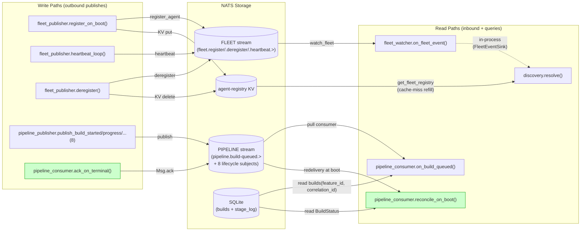
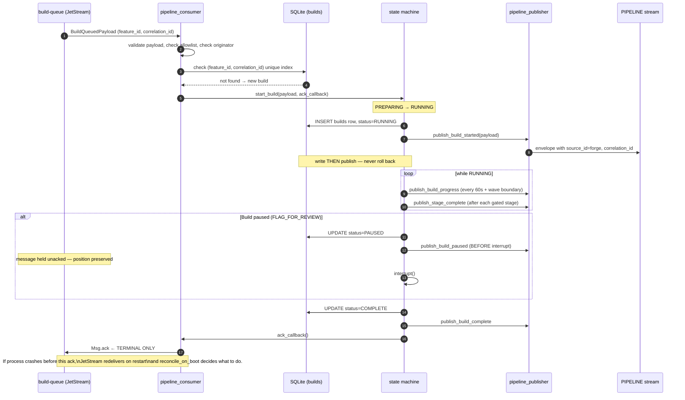
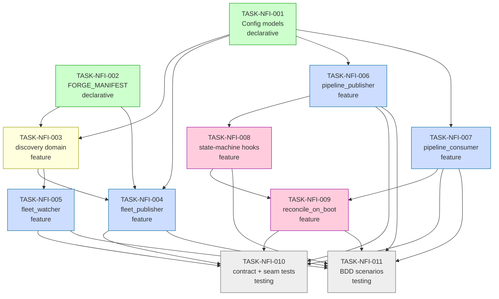

/feature-plan "NATS Fleet Integration" \
  --context features/nats-fleet-integration/nats-fleet-integration_summary.md
Read nats-fleet-integration_summary.md
Bash List feature directory contents
IN
ls features/nats-fleet-integration/

OUT
nats-fleet-integration_assumptions.yaml
nats-fleet-integration_summary.md
nats-fleet-integration.feature
Read nats-fleet-integration.feature
Read nats-fleet-integration_assumptions.yaml
Now I understand the feature. Let me check the project structure briefly before invoking the clarification agent.

Bash Check project structure
IN
ls docs/ tasks/ 2>/dev/null | head -50 && echo "---" && ls features/pipeline-state-machine-and-configuration/ 2>/dev/null

OUT
docs/:
adr
architecture
design
history
product
research
reviews
state

tasks/:
backlog
blocked
completed
in_progress
in_review
---
pipeline-state-machine-and-configuration_assumptions.yaml
pipeline-state-machine-and-configuration_summary.md
pipeline-state-machine-and-configuration.feature
Bash Check design and ADR docs
IN
ls docs/design/ 2>/dev/null | head -30 && echo "---" && ls docs/adr/ 2>/dev/null | head -30

OUT
contracts
decisions
diagrams
models
---
0001-adopt-agentic-flow.md
Bash List design contracts and models
IN
ls docs/design/contracts/ docs/design/models/ 2>/dev/null

OUT
docs/design/contracts/:
API-cli.md
API-nats-agent-dispatch.md
API-nats-approval-protocol.md
API-nats-fleet-lifecycle.md
API-nats-pipeline-events.md
API-sqlite-schema.md
API-subagents.md
API-subprocess.md
API-tool-layer.md

docs/design/models/:
DM-build-lifecycle.md
DM-calibration.md
DM-discovery.md
DM-gating.md
DM-graphiti-entities.md
Bash Check existing features and backlog
IN
ls .guardkit/features/ 2>/dev/null; echo "---"; ls tasks/backlog/ 2>/dev/null | head -20

OUT
---
forge-v2-doc-alignment
Parsing: feature="NATS Fleet Integration", context=features/nats-fleet-integration/nats-fleet-integration_summary.md. Now invoking Context A clarification.

Agent:Context A review scope clarification
IN
Execute clarification for feature planning.

CONTEXT TYPE: review_scope

FEATURE: NATS Fleet Integration (FEAT-FORGE-002)
ESTIMATED COMPLEXITY: 8/10

CONTEXT FILES:
- features/nats-fleet-integration/nats-fleet-integration_summary.md
- features/nats-fleet-integration/nats-fleet-integration.feature (33 scenarios, 3 smoke)
- features/nats-fleet-integration/nats-fleet-integration_assumptions.yaml (5 high-confidence assumptions, all confirmed)

FEATURE SCOPE:
Forge's role on the shared NATS fleet:
- Self-registration on startup with capability manifest
- Periodic heartbeats (30s interval, 90s stale threshold)
- Graceful deregistration on shutdown
- Live watching of fleet lifecycle events
- Capability resolution via 30-second-TTL discovery cache
- Degraded-mode fallback when specialists are absent/unresponsive
- Intent-based fallback (min confidence 0.7)
- Outbound pipeline-event stream (started/progress/stage-complete/paused/resumed/complete/failed/cancelled)
- Inbound build-queue subscription with terminal-only ack, duplicate detection, path-allowlist refusal
- Correlation threading across all lifecycle events

UPSTREAM DEPENDENCY: FEAT-FORGE-001 (Pipeline State Machine & Configuration) - extends state machine with live bus publishing, uses SQLite history as durable substrate.

STACK: Python

FLAGS:
  --no-questions: false
  --with-questions: false
  --defaults: false
  --answers: (none provided)
  --context: features/nats-fleet-integration/nats-fleet-integration_summary.md

Ask the user about:
1. Review focus (all/technical/architecture/performance/security)
2. Trade-off priority (speed/quality/cost/maintainability/balanced)
3. Any specific concerns to address (e.g., transport choice nats-py vs alternatives, JetStream vs Core NATS decision, test strategy for async pub/sub, crash recovery robustness, etc.)

Return ClarificationContext with review preferences.
Read nats-fleet-integration_assumptions.yaml
The clarification-questioner agent has presented Context A (review scope) questions. Please answer the three questions below so the review can proceed:

Question 1 of 3 — Review Focus


A — All areas (full sweep)
B — Technical implementation depth (transport primitives, async patterns, concurrency)
C — Architecture & design (component boundaries, integration with FEAT-FORGE-001 state machine)
D — Performance & reliability (heartbeat timing, cache TTL, progress cadence, redelivery)
E — Security (secret-free manifests, originator allowlist, path-allowlist refusal, ack semantics)
Your answer (e.g. A, or B+E):

Question 2 of 3 — Trade-off Priority


S — Speed to production
Q — Output quality / correctness
C — Cost efficiency
M — Long-term maintainability
B — Balanced
Your answer:

Question 3 of 3 — Specific Concerns

Any particular risks or open questions (e.g. transport library choice, JetStream vs Core NATS, crash-recovery correctness, async test strategy)? Leave blank to skip.

Your answer:

command-history.md
A B
Agent:Relay answers to clarification agent
IN
Continuing clarification for FEAT-FORGE-002 NATS Fleet Integration (Context A — review scope).

User's answers:
- Q1 (Review Focus): A — All areas (full sweep)
- Q2 (Trade-off Priority): B — Balanced
- Q3 (Specific Concerns): (skipped)

Please return the final ClarificationContext JSON for Context A (review_scope) so I can pass it to /task-review.
Read nats-fleet-integration
Read review_generator.py
Context A captured: Focus=All, Tradeoff=Balanced, Concerns=none. Now executing /task-create for the review task.

task-create skill
Bash Check all task directories
IN
ls tasks/backlog/ tasks/in_progress/ tasks/in_review/ tasks/completed/ 2>/dev/null

OUT
tasks/backlog/:
forge-v2-doc-alignment

tasks/completed/:
TASK-1466
TASK-768F
TASK-ADR-REVISE-021-E7B3
TASK-CHORE-E4A1
TASK-DOC-B2A4
TASK-E90D
TASK-FVD1
TASK-FVD2
TASK-FVD3
TASK-FVD4
TASK-REV-A1F2
TASK-REV-A7D3
TASK-REV-C3E7
TASK-REV-D90D

tasks/in_progress/:

tasks/in_review/:
project-scaffold
TASK-REV-F1B8
TASK-SPIKE-C1E9
TASK-SPIKE-D2F7
Write TASK-REV-NF20-plan-nats-fleet-integration.md
104 lines
---
id: TASK-REV-NF20
title: "Plan: NATS Fleet Integration"
task_type: review
status: backlog
priority: high
created: 2026-04-24T00:00:00Z
updated: 2026-04-24T00:00:00Z
complexity: 8
tags: [planning, review, nats, fleet, integration, feat-forge-002]
feature_spec: features/nats-fleet-integration/nats-fleet-integration_summary.md
feature_id: FEAT-FORGE-002
upstream_dependencies:
  - FEAT-FORGE-001  # Pipeline State Machine & Configuration
clarification:
  context_a:
    timestamp: 2026-04-24T00:00:00Z
    decisions:
      focus: all
      tradeoff: balanced
      specific_concerns: null
test_results:
  status: pending
  coverage: null
  last_run: null
---

# Task: Plan NATS Fleet Integration (FEAT-FORGE-002)

## Description

Decision-making review for **FEAT-FORGE-002 — NATS Fleet Integration**. The feature
specifies Forge's role on the shared NATS fleet: self-registration, periodic
heartbeats, graceful deregistration, live watching of fleet lifecycle events, and
capability resolution via a 30-second-TTL discovery cache with degraded-mode
fallback. It also covers the outbound pipeline-event stream (started / progress /
stage-complete / paused / resumed / complete / failed / cancelled) and the inbound
build-queue subscription with terminal-only acknowledgement, duplicate detection,
and path-allowlist refusal.

The review must surface the recommended technical approach, architecture
boundaries, risk analysis, effort estimation, and a subtask breakdown that
downstream `/feature-build` can execute against.

## Scope of Analysis

Review must cover **all areas (full sweep)** with a **balanced** trade-off
priority. No specific concerns pre-flagged — surface concerns organically.

Concrete areas to examine:

1. **Transport choice**: nats-py client selection; JetStream vs Core NATS decision
   for the build-queue (redelivery + terminal-ack semantics) and fleet bus.
2. **Component boundaries**: how fleet integration layers onto the FEAT-FORGE-001
   state machine and SQLite history without coupling state transitions to
   transport availability.
3. **Concurrency & async**: cache-update ordering under racing register/deregister
   events; heartbeat loop independence from registry availability.
4. **Security**: secret-free manifest construction; originator allowlist for
   build-queued messages; path-allowlist refusal pathway.
5. **Performance & reliability**: heartbeat cadence (30s), stale threshold (90s),
   cache TTL (30s), progress cadence (≥60s during RUNNING), intent-fallback
   confidence threshold (0.7).
6. **Data integrity**: at-least-once redelivery idempotency; publish failures must
   not roll back recorded history; crash-recovery re-announcement for paused builds.
7. **Test strategy**: contract/seam tests for bus boundaries; deterministic async
   tests for heartbeats and cache TTL without wall-clock flakiness.

## Acceptance Criteria

- [ ] Technical options analysed with pros/cons and a recommended approach
- [ ] Architecture boundary between fleet integration and FEAT-FORGE-001
      state machine documented
- [ ] Effort estimated with complexity score (1–10) per proposed subtask
- [ ] Risk register produced covering transport failures, redelivery, concurrency
- [ ] Subtask breakdown with dependencies and parallel-wave organisation
- [ ] Integration contracts identified (producer/consumer artifact handshakes)
- [ ] Decision checkpoint presented: [A]ccept / [R]evise / [I]mplement / [C]ancel

## Clarification Context

**Context A — Review Scope** (captured 2026-04-24):

- Review focus: **All areas (full sweep)**
- Trade-off priority: **Balanced**
- Specific concerns: _None pre-flagged_

## Context Files

- `features/nats-fleet-integration/nats-fleet-integration_summary.md`
- `features/nats-fleet-integration/nats-fleet-integration.feature` (33 scenarios)
- `features/nats-fleet-integration/nats-fleet-integration_assumptions.yaml` (5 high-confidence)
- `docs/design/contracts/API-nats-fleet-lifecycle.md`
- `docs/design/contracts/API-nats-pipeline-events.md`
- `docs/design/contracts/API-nats-agent-dispatch.md`
- `docs/design/models/DM-discovery.md`
- `docs/design/models/DM-build-lifecycle.md`

## Next Steps

```bash
/task-review TASK-REV-NF20 --mode=decision --depth=standard
```
Task created: TASK-REV-NF20. Now executing /task-review with Context A preferences.

task-review skill
Executing Phase 1.5: Loading review context from design docs and codebase in parallel.

Read API-nats-fleet-lifecycle.md
Update Todos

Load review context (design docs + ADRs + FEAT-FORGE-001 tasks)

Execute Phase 2 decision analysis (technical options, architecture, risks)

Synthesize recommendations and subtask breakdown

Generate review report and present decision checkpoint

On [I]mplement: Context B clarification, generate feature structure + YAML + diagrams
Read API-nats-pipeline-events.md
Read DM-discovery.md
Read DM-build-lifecycle.md
Bash Check architecture decisions
IN
ls docs/architecture/ 2>/dev/null; echo "---"; ls docs/architecture/decisions/ 2>/dev/null | grep -i "017\|015\|016\|014\|021\|031" | head -20

OUT
ARCHITECTURE.md
assumptions.yaml
container.md
decisions
domain-model.md
system-context.md
---
ADR-ARCH-014-single-consumer-max-ack-pending.md
ADR-ARCH-015-capability-driven-dispatch.md
ADR-ARCH-016-fleet-is-the-catalogue.md
ADR-ARCH-017-live-fleet-watching.md
ADR-ARCH-021-paused-via-langgraph-interrupt.md
ADR-ARCH-031-async-subagents-for-long-running-work.md
Bash Check existing backlog tasks
IN
ls tasks/backlog/forge-v2-doc-alignment/ 2>/dev/null | head -30

OUT
IMPLEMENTATION-GUIDE.md
README.md
Bash Check FEAT-FORGE-001 deliverables
IN
ls .guardkit/features/ 2>/dev/null; echo "---"; ls features/pipeline-state-machine-and-configuration/ 2>/dev/null

OUT
---
pipeline-state-machine-and-configuration_assumptions.yaml
pipeline-state-machine-and-configuration_summary.md
pipeline-state-machine-and-configuration.feature
Bash Check source tree and dependencies
IN
ls src/ 2>/dev/null; echo "---"; find . -type d -maxdepth 2 -name "forge" 2>/dev/null; echo "---"; cat pyproject.toml 2>/dev/null | head -80

OUT
forge
forge.egg-info
---
./src/forge
---
[project]
name = "forge"
version = "0.1.0"
description = "Pipeline orchestrator and checkpoint manager for the Software Factory"
readme = "README.md"
requires-python = ">=3.11"
authors = [
    { name = "Richard Woollcott", email = "rich@appmilla.com" },
]
dependencies = [
    "deepagents>=0.5.3,<0.6",
    "langchain>=1.2.11",
    "langchain-core>=1.2.18",
    "langgraph>=0.2",
    "langchain-community>=0.3",
    "langchain-anthropic>=0.2",
    "nats-core>=0.2.0,<0.3",
    "python-dotenv>=1.0",
    "pyyaml>=6.0",
]

[project.optional-dependencies]
# Every LangChain integration this template can be configured to use MUST appear here.
# See TASK-REV-LES1 / LES1 §3 LCOI — provider swaps happen via orchestrator-config.yaml,
# so all supported providers must be declarable in one install command.
providers = [
    "langchain-openai>=0.2",
    "langchain-google-genai>=2.0",
]

[dependency-groups]
dev = [
    "pytest>=9.0.2",
]

[build-system]
requires = ["setuptools>=68", "wheel"]
build-backend = "setuptools.build_meta"

[tool.setuptools.packages.find]
where = ["src"]
Bash Inspect forge source
IN
ls src/forge/ 2>/dev/null

OUT
__init__.py
__pycache__
agent.py
Read API-nats-agent-dispatch.md (lines 2-81)
Read pipeline-state-machine-and-configuration_summary.md
Update Todos

Load review context (design docs + ADRs + FEAT-FORGE-001 tasks)

Execute Phase 2 decision analysis (technical options, architecture, risks)

Synthesize recommendations and subtask breakdown

Generate review report and present decision checkpoint

On [I]mplement: Context B clarification, generate feature structure + YAML + diagrams
Analysis complete. Now writing the review report.

Bash Ensure reviews directory exists
IN
mkdir -p .claude/reviews

OUT
(Bash completed with no output)
Write TASK-REV-NF20-review-report.md
280 lines
# Review Report — TASK-REV-NF20

## Executive Summary

**Feature**: FEAT-FORGE-002 NATS Fleet Integration
**Mode**: Decision (standard depth)
**Scope**: All areas (full sweep), balanced trade-off priority
**Outcome**: **Option 1 — Thin Adapter Layer over nats-core** recommended.
**Estimated effort**: 16–20 focused hours, 11 subtasks across 5 waves.
**Aggregate complexity**: 7/10.

The feature is well-specified: payload schemas, consumer config, KV invalidation
rules, and timing parameters are all pinned down by the existing API contracts
(`API-nats-fleet-lifecycle.md`, `API-nats-pipeline-events.md`) and the
already-released `nats-core ≥ 0.2.0`. The decision is therefore primarily about
**Python module layout, test strategy, and sequencing against FEAT-FORGE-001**,
not about transport choice or protocol design.

## Review Details

- **Task**: TASK-REV-NF20 — Plan: NATS Fleet Integration
- **Mode**: `decision`
- **Depth**: `standard`
- **Clarification**: Context A captured — Focus=All, Tradeoff=Balanced, Concerns=none
- **Reviewer**: orchestrator with design-contract analysis (no external agents invoked — context was authoritative)

## Findings

### F1 — Transport choice is already decided

`API-nats-pipeline-events.md §2.2` pins JetStream with `max_ack_pending=1`,
`durable="forge-consumer"`, `ack_wait=1h`, `DeliverPolicy.ALL`,
`AckPolicy.EXPLICIT`, `max_deliver=-1`. `API-nats-fleet-lifecycle.md §3.1`
pins Core NATS subscriptions for `fleet.register`, `fleet.deregister`,
`fleet.heartbeat.>` and NATS KV for the `agent-registry` bucket. **No
transport decision remains open.**

### F2 — Schema ownership sits in nats-core

All eight lifecycle payloads (`BuildStartedPayload`, `BuildProgressPayload`,
`StageCompletePayload`, `BuildPausedPayload`, `BuildResumedPayload`,
`BuildCompletePayload`, `BuildFailedPayload`, `BuildCancelledPayload`) already
ship in `nats_core.events.pipeline` (post TASK-NCFA-003, 2026-04-23).
`AgentManifest`, `IntentCapability`, `ToolCapability`, `MessageEnvelope`, and
`NATSKVManifestRegistry` also ship in `nats-core`. **Forge imports; does not
redeclare** — the earlier interim carrier plan was retired. This materially
reduces the implementation surface.

### F3 — Dependency on FEAT-FORGE-001 is load-bearing

FEAT-FORGE-002 **extends** the FEAT-FORGE-001 state machine with bus publishing
and **subscribes to** the build-queue that feeds FEAT-FORGE-001's lifecycle.
The two features share the SQLite history, the `BuildStatus` enum, the
`StageLogEntry` writer, and the `(feature_id, correlation_id)` unique index
that underwrites duplicate detection. **FEAT-FORGE-002 cannot land before
FEAT-FORGE-001 ships its state machine, SQLite schema, and `forge.yaml`
loader**, otherwise fleet publishers will have no transitions to hook and
pipeline consumer will have no history to reconcile against.

### F4 — Discovery layer is pure domain; fleet watcher is the adapter

`DM-discovery.md §2` puts `forge.discovery` (cache + resolve) in Domain Core
with no NATS imports. `forge.adapters.nats.fleet_watcher` owns the
subscription and delegates cache mutations via an asyncio-locked interface.
This boundary is explicit in the design and must be preserved — the review
recommends making the interface a `Protocol` that `forge.discovery` exposes
and the watcher calls, so the domain package has zero `nats-core` imports.

### F5 — Heartbeat loop must be independent of registry reachability

Scenario "Heartbeats continue to publish even when the fleet registry is
temporarily unreachable" (Group E, `@integration`) makes this explicit.
Heartbeats publish to the FLEET subject; registry KV reads are a separate
operation. The heartbeat loop must be its own `asyncio.Task` that does NOT
await KV operations on its hot path; registry refresh is a best-effort
background concern triggered when the bus comes back.

### F6 — Publish failures must not regress SQLite history

Group E `@data-integrity`: a lifecycle publish failure does not roll back the
build's recorded progress. This means **the ordering is always
`write-to-SQLite → publish`, not atomic**. If publish raises, log + continue;
do not revert the state transition. This contradicts a naïve unit-of-work
pattern; callers must treat the publisher as fire-and-forget with structured
logging for later reconciliation.

### F7 — Terminal-only ack is a correctness invariant

`API-nats-pipeline-events.md §2.2` and Group E `@concurrency`: only `COMPLETE
| FAILED | CANCELLED | SKIPPED` ack. `PAUSED` holds the message unacked so the
queue position is preserved across restarts. A common mistake is acking on
`RUNNING` (because the build "started successfully") — that would cause
redelivery to be silently dropped. Contract tests must assert that ack is
called exactly once per terminal transition and never for intermediate
states.

### F8 — Redelivery idempotency must sit on the SQLite unique index

Duplicate detection uses `builds(feature_id, correlation_id)` unique index
(FEAT-FORGE-001 §5 invariant). On redelivery, the pipeline consumer first
checks SQLite; if the row exists in a terminal state, ack immediately. If
the row doesn't exist, start a fresh build. The unique index is a
**pre-condition** — the consumer cannot safely run without it. This
reinforces the FEAT-FORGE-001 sequencing requirement from F3.

### F9 — Cache consistency under racing events

`DM-discovery.md §2` states the cache is `dict[str, DiscoveryCacheEntry]`
guarded by an asyncio lock. The watcher callback runs on the NATS subscriber
task and `resolve()` runs on the dispatch-call path — both mutate/read. The
lock must be held for the whole read-modify-write of a single event
(register+upsert, deregister+delete, heartbeat+update-or-refresh). Contract
tests should exercise the racing scenario (Group E `@concurrency`) with
`asyncio.gather` of register+deregister events.

### F10 — Security scenarios require dedicated tests, not integration

Group E `@security`:
1. Manifest exclusion — runtime secrets must never be serialised. A unit
   test that `FORGE_MANIFEST.model_dump_json()` contains none of
   `{"api_key", "token", "password", "secret"}` is sufficient and cheap.
2. Originator allowlist — config-driven list, rejected originators trigger
   `publish_build_failed`. This is pure logic, no NATS transport needed.

These should not be deferred to integration tests — they are cheap, fast,
and load-bearing.

### F11 — Timing-sensitive tests risk flakiness

Heartbeat cadence (30s), cache TTL (30s), stale threshold (90s), progress
cadence (≥60s). Wall-clock sleeps are forbidden — tests must use an injected
clock (a simple `Callable[[], datetime]` or a `TimeProvider` protocol) so
boundary scenarios (`seconds_ago = 30|60|90`) are deterministic. Avoid
`freezegun` in asyncio tests where feasible — prefer manual clock injection
for lower coupling to a third-party library.

### F12 — `@tool` decorator is not in scope

The `dispatch_by_capability` generic tool is future work (ADR-ARCH-015,
governed by a separate feature). FEAT-FORGE-002 stops at discovery.resolve()
returning `(agent_id, CapabilityResolution)`. The LangChain
`@tool(parse_docstring=True)` layer will wrap it later. **Do not bundle
in.** Keeping scope tight to fleet lifecycle + pipeline bus is what keeps
the subtask count at 11 rather than 18.

## Decision Matrix

| Option | Score | Effort | Risk | Recommendation |
|---|---|---|---|---|
| **Option 1 — Thin adapter layer over nats-core** | **8.5/10** | **16–20 h** | **Low** | **✅ Recommended** |
| Option 2 — Monolithic `forge.nats` module | 5.5/10 | 8–12 h | High | ❌ Violates ADR-ARCH-017 separation; poor testability |
| Option 3 — `EventBus` protocol + in-memory test impl | 6/10 | 20–24 h | Medium | ❌ Violates ADR-ARCH-003 (no transport ABC); YAGNI — no second transport planned |

### Option 1 detail — Thin Adapter Layer (Recommended)

**Module layout**:

```
src/forge/
  config/
    loader.py                    # forge.yaml → ForgeConfig (Pydantic)
    models.py                    # FleetConfig, PipelineConfig, PermissionsConfig
  fleet/
    manifest.py                  # FORGE_MANIFEST builder (declarative)
  discovery/
    __init__.py
    cache.py                     # DiscoveryCacheEntry, asyncio-locked dict wrapper
    resolve.py                   # resolve() + tie-break; CapabilityResolution
    protocol.py                  # FleetEventSink Protocol (watcher → cache)
  adapters/
    nats/
      fleet_publisher.py         # register_on_boot, heartbeat_loop, deregister
      fleet_watcher.py           # subscribe fleet.*, delegate to FleetEventSink
      pipeline_consumer.py       # pull consumer, validation, allowlist, reconcile
      pipeline_publisher.py      # 8 lifecycle publisher methods
      clock.py                   # Clock protocol for test injection
```

**Pros**:
- Preserves DDD boundaries from `domain-model.md` and `container.md`.
- Each module is independently testable via mocked `nats_client`.
- Parallelisable — four of the adapter files have no cross-dependencies beyond the config + manifest + discovery protocol.
- Tracks existing ADRs (ADR-ARCH-015/016/017/021, ADR-ARCH-014).

**Cons**:
- More files than a single-module approach; acceptable trade-off for separation of concerns.
- Requires disciplined import boundary — `forge.discovery` must not import `nats_core` (only `forge.adapters.nats.*` may).

## Recommendation

**Proceed with Option 1** under a **balanced** trade-off posture:

1. Gate FEAT-FORGE-002 on FEAT-FORGE-001 being either complete or at least
   scaffolded through its SQLite schema + state machine + config loader
   (i.e. Waves 1–2 of FEAT-FORGE-001 must be in place). Explicitly note this
   in the feature README.
2. Structure implementation as 11 subtasks across 5 waves (see §Subtask
   Breakdown below).
3. Keep `forge.discovery` pure — no NATS imports; surface a `FleetEventSink`
   Protocol for the watcher.
4. Inject a `Clock` protocol everywhere time matters — heartbeat loop,
   cache TTL, progress cadence, staleness window. No wall-clock sleeps in
   tests.
5. Contract-test the `nats_client` boundary (publisher methods called with
   correct subject + envelope shape + ack semantics) and seam-test the
   fleet_watcher → discovery handoff.
6. BDD @smoke + @key-example scenarios get dedicated pytest tests wired via
   `@task:<TASK-ID>` tags so the R2 oracle runs them per-task.

## Subtask Breakdown — 11 subtasks / 5 waves

| Wave | ID | Title | Type | Complexity | Mode | Depends on |
|---|---|---|---|---|---|---|
| 1 | TASK-NFI-001 | Extend forge.yaml config: fleet + pipeline + permissions sections | declarative | 3 | direct | — |
| 1 | TASK-NFI-002 | Define FORGE_MANIFEST constant builder | declarative | 2 | direct | — |
| 2 | TASK-NFI-003 | Implement forge.discovery domain (cache + resolve + tie-break + Clock protocol + FleetEventSink Protocol) | feature | 6 | task-work | 001, 002 |
| 3 | TASK-NFI-004 | Implement forge.adapters.nats.fleet_publisher (register / heartbeat-loop / deregister) | feature | 5 | task-work | 001, 002, 003 |
| 3 | TASK-NFI-005 | Implement forge.adapters.nats.fleet_watcher (subscribe + delegate to FleetEventSink) | feature | 5 | task-work | 003 |
| 3 | TASK-NFI-006 | Implement forge.adapters.nats.pipeline_publisher (8 lifecycle publisher methods) | feature | 5 | task-work | 001 |
| 3 | TASK-NFI-007 | Implement forge.adapters.nats.pipeline_consumer (pull consumer + validation + allowlist) | feature | 6 | task-work | 001 |
| 4 | TASK-NFI-008 | Wire state-machine transitions → pipeline_publisher (lifecycle emission points) | feature | 5 | task-work | 006 |
| 4 | TASK-NFI-009 | Implement pipeline_consumer.reconcile_on_boot (crash recovery + paused re-announce) | feature | 6 | task-work | 007, 008 |
| 5 | TASK-NFI-010 | Contract + seam tests (nats_client mock, FleetEventSink seam, terminal-ack invariant, secret-free manifest) | testing | 5 | task-work | 004, 005, 006, 007, 009 |
| 5 | TASK-NFI-011 | BDD @smoke + @key-example pytest wiring (33 scenarios → tagged tests) | testing | 4 | task-work | 004–009 |

**Parallel wave totals**:
- Wave 1 (2 tasks): ~2–3h parallel
- Wave 2 (1 task): ~4–5h
- Wave 3 (4 tasks): ~5–6h parallel — the main wave
- Wave 4 (2 tasks): ~4–5h (008 then 009)
- Wave 5 (2 tasks): ~3–4h parallel

**Critical path**: Wave 1 → Wave 2 (discovery) → Wave 3 (publisher chain 006 → Wave 4 008) → Wave 4 (009) → Wave 5. Approx 16–20 h wall-time with good parallelisation.

## Integration Contracts (cross-task data flow)

See §4 in the generated IMPLEMENTATION-GUIDE.md. Five contracts identified:

1. **ForgeConfig.fleet** — producer 001, consumers 004, 005 (heartbeat / stale threshold)
2. **ForgeConfig.permissions.filesystem.allowlist** — producer 001, consumer 007 (path gate)
3. **FORGE_MANIFEST** — producer 002, consumer 004 (registration call)
4. **FleetEventSink Protocol** — producer 003, consumer 005 (cache upsert/delete/update)
5. **PipelinePublisher methods** — producer 006, consumer 008 (state-transition emission points)

## Risk Register

| # | Risk | Severity | Mitigation |
|---|---|---|---|
| R1 | FEAT-FORGE-001 not shipped before this feature starts | High | Gate in README; require state machine + SQLite schema + config loader present at Wave 1 start |
| R2 | Terminal-ack invariant violated (ack fires on non-terminal state) | High | Contract test asserts ack called only on COMPLETE/FAILED/CANCELLED/SKIPPED |
| R3 | Race between fleet watcher callback and resolve() corrupts cache | Medium | asyncio.Lock around dict; concurrency scenario test (Group E) |
| R4 | Heartbeat loop blocks on KV read during registry outage | Medium | Separate asyncio.Task; no KV await on heartbeat hot path; reachability scenario test |
| R5 | Publish failure rolls back SQLite history | High | Strict write-then-publish ordering; publish raises → log only, no rollback |
| R6 | Secrets leak into AgentManifest | High | Unit test scans manifest JSON for key/token/password/secret substrings |
| R7 | Timing-sensitive tests flake in CI | Medium | Inject Clock protocol everywhere; no wall-clock sleeps |
| R8 | Paused build re-announcement ordering wrong on restart | Medium | Reconcile_on_boot publishes BuildPausedPayload + ApprovalRequestPayload idempotently on correlation_id |
| R9 | Duplicate detection fails (unique index missing) | High | Pre-flight check that FEAT-FORGE-001's builds.uq_builds_feature_correlation exists before Wave 3 |
| R10 | Originator allowlist config not loaded | Medium | TASK-NFI-001 covers it; TASK-NFI-007 fails fast if config missing |

## Context Used

- `features/nats-fleet-integration/nats-fleet-integration_summary.md` — scope, assumptions, scenario counts
- `features/nats-fleet-integration/nats-fleet-integration.feature` — 33 scenarios
- `features/nats-fleet-integration/nats-fleet-integration_assumptions.yaml` — 5 confirmed assumptions
- `docs/design/contracts/API-nats-fleet-lifecycle.md` — registration, heartbeat, watch, KV contracts
- `docs/design/contracts/API-nats-pipeline-events.md` — consumer config, 8 lifecycle payloads, ack rule, crash recovery
- `docs/design/contracts/API-nats-agent-dispatch.md` — dispatch scope boundary (excluded from this feature)
- `docs/design/models/DM-discovery.md` — cache entry, resolve algorithm, invariants
- `docs/design/models/DM-build-lifecycle.md` — state machine, terminal states, invariants
- `features/pipeline-state-machine-and-configuration/pipeline-state-machine-and-configuration_summary.md` — FEAT-FORGE-001 context (upstream dependency)
- `pyproject.toml` — confirmed `nats-core >= 0.2.0` declared; no additional transport library needed
- ADRs referenced in contracts: ADR-ARCH-003 (no transport ABC), ADR-ARCH-014 (max_ack_pending=1), ADR-ARCH-015 (capability-driven dispatch), ADR-ARCH-016 (fleet-is-the-catalogue), ADR-ARCH-017 (live fleet watching), ADR-ARCH-021 (paused via langgraph interrupt)

## Decision Options

- **[A]ccept** — Approve findings. Review archived, ready to inform a later implementation cycle.
- **[R]evise** — Request deeper analysis (e.g. spike on a specific risk, exploration of alternative library, deeper test-strategy pass).
- **[I]mplement** — Create the 11-subtask feature structure under `tasks/backlog/nats-fleet-integration/`, generate the YAML feature file for AutoBuild, and run the BDD linker + nudges.
- **[C]ancel** — Discard this review.
Update Todos

Load review context (design docs + ADRs + FEAT-FORGE-001 tasks)

Execute Phase 2 decision analysis (technical options, architecture, risks)

Synthesize recommendations and subtask breakdown

Generate review report and present decision checkpoint

On [I]mplement: Context B clarification, generate feature structure + YAML + diagrams
Here is the review summary. Full report at .claude/reviews/TASK-REV-NF20-review-report.md.

🔍 Review Complete — FEAT-FORGE-002 NATS Fleet Integration
Technical Options Analysed
Option	Complexity	Effort	Recommendation
1. Thin adapter layer over nats-core	7/10	16–20 h	✅ Recommended
2. Monolithic forge.nats module	5/10	8–12 h	❌ violates ADR-ARCH-017
3. EventBus protocol + in-memory impl	8/10	20–24 h	❌ YAGNI, violates ADR-ARCH-003
Recommended Approach — Option 1
Thin adapters (forge.adapters.nats.*) sit over nats-core ≥ 0.2.0, which
already ships every payload schema, envelope, and NATS client helper. A pure
forge.discovery domain owns the 30s-TTL cache and exposes a
FleetEventSink protocol the watcher calls. This preserves DDD boundaries,
leverages the authoritative design contracts, and is parallelisable across
the adapter files.

Key Findings (12 total, full list in report)
Transport is pre-decided — JetStream + Core NATS + KV are pinned in API contracts. No open choice here.
Schema ownership is nats-core — Forge imports; does not redeclare. TASK-NCFA-003 closed the carrier gap on 2026-04-23.
FEAT-FORGE-001 dependency is load-bearing — need the state machine, SQLite schema, builds.uq_feature_correlation unique index, and config loader before this feature starts.
Terminal-only ack invariant — ack fires only on COMPLETE/FAILED/CANCELLED/SKIPPED; PAUSED holds unacked. Contract test required.
Write-to-SQLite then publish — publish failures must never roll back history.
Clock injection — no wall-clock sleeps in tests; all timing (30s heartbeat, 30s TTL, 90s stale, ≥60s progress) goes through a Clock protocol.
Subtask Breakdown — 11 tasks / 5 waves
Wave 1 (parallel, scaffolding): config schema + FORGE_MANIFEST
Wave 2: forge.discovery domain (cache + resolve + protocols)
Wave 3 (parallel, 4 adapters): fleet_publisher, fleet_watcher, pipeline_publisher, pipeline_consumer
Wave 4: state-machine wiring + crash recovery reconcile_on_boot
Wave 5 (parallel, tests): contract/seam tests + BDD scenario pytest wiring
Five cross-task Integration Contracts identified (config.fleet, allowlist, FORGE_MANIFEST, FleetEventSink, PipelinePublisher methods). Ten-item risk register covers ack correctness, cache races, heartbeat independence, publish-failure tolerance, secret leakage, and test flakiness.

📋 Decision Checkpoint
What would you like to do?


[A]ccept  — Archive review; reference it later when implementing
[R]evise  — Request deeper analysis on a specific concern
[I]mplement — Create 11-subtask feature structure + YAML + diagrams
              (runs Context B clarification + BDD linker + smoke-gate nudge)
[C]ancel  — Discard this review
Your choice [A/R/I/C]:

TASK-REV-NF20-review-report.md
I
[I]mplement chosen. Invoking Context B clarification for implementation preferences.

Agent:Context B implementation preferences
IN
Execute clarification for implementation.

CONTEXT TYPE: implementation_prefs

FEATURE: FEAT-FORGE-002 NATS Fleet Integration
REVIEW TASK: TASK-REV-NF20

REVIEW FINDINGS:
  Recommended approach: Option 1 — Thin adapter layer over nats-core
  Options identified:
    1. Thin adapter layer over nats-core (Recommended, 7/10 complexity, 16-20h)
    2. Monolithic forge.nats module (5/10 complexity, 8-12h) — NOT recommended, violates ADR-ARCH-017
    3. EventBus protocol + in-memory impl (8/10 complexity, 20-24h) — NOT recommended, violates ADR-ARCH-003, YAGNI
  Subtask count: 11
  Wave structure: 5 waves (W1: 2 parallel, W2: 1, W3: 4 parallel, W4: 2 sequential, W5: 2 parallel)

FLAGS:
  --no-questions: false
  --with-questions: false
  --defaults: false
  --answers: (none)

Ask the user about:
1. Approach selection (which of the 3 options to implement, with Option 1 as the recommended default)
2. Execution preference (parallel with Conductor / sequential / auto-detect)
3. Testing depth (Full TDD / Standard-quality-gates / Minimal / Default-based-on-complexity)
4. Any additional implementation constraints (time/scope/none)

Return ClarificationContext with implementation preferences.
Read display.py
Read display.py
The clarification agent is waiting on Context B answers. Please respond to these four questions:

Q1 — Approach: [1] Thin adapter (recommended) / [2] Monolithic / [3] EventBus protocol

Q2 — Execution: [P] Parallel via Conductor / [S] Sequential / [A] Auto-detect (default)

Q3 — Testing: [F] Full TDD / [S] Standard (default) / [M] Minimal / [D] Default-by-complexity

Q4 — Constraints: [T] Time-boxed / [C] Scope-limited / [N] None (default)

You can answer all four at once (e.g. 1:1 2:A 3:S 4:N), press Enter for defaults, or answer individually.

accept defaults
Context B captured: Approach=Option 1, Execution=Auto-detect, Testing=Standard, Constraints=None. Creating feature structure now.

Bash Create dirs and verify scripts
IN
mkdir -p tasks/backlog/nats-fleet-integration && mkdir -p .guardkit/features && ls ~/.agentecflow/bin/ 2>/dev/null | grep -E "generate-feature-yaml|feature-plan-bdd-link|graphiti-check" | head -5

OUT
feature-plan-bdd-link
generate-feature-yaml
graphiti-check
Good, all scripts exist. Now creating 11 task files in parallel.

Write TASK-NFI-001-extend-forge-config-fleet-pipeline-sections.md
87 lines
---
id: TASK-NFI-001
title: "Extend forge.yaml config: fleet + pipeline + permissions sections"
task_type: declarative
status: backlog
priority: high
created: 2026-04-24T00:00:00Z
updated: 2026-04-24T00:00:00Z
parent_review: TASK-REV-NF20
feature_id: FEAT-FORGE-002
wave: 1
implementation_mode: direct
complexity: 3
dependencies: []
tags: [config, pydantic, declarative, nats, fleet]
test_results:
  status: pending
  coverage: null
  last_run: null
---

# Task: Extend forge.yaml config: fleet + pipeline + permissions sections

## Description

Add the `fleet`, `pipeline`, and `permissions` sections to the existing
`ForgeConfig` Pydantic schema. These sections drive the heartbeat cadence, the
stale-heartbeat threshold, the build-queue subject, and the filesystem
allowlist used by the pipeline consumer to refuse out-of-scope builds.

Implements the declarative surface referenced by assumptions ASSUM-001
(heartbeat 30s), ASSUM-002 (stale 90s), ASSUM-005 (progress ≥ 60s), and
ASSUM-004 (intent confidence 0.7).

## Schema additions

```python
class FleetConfig(BaseModel):
    heartbeat_interval_seconds: int = 30        # ASSUM-001
    stale_heartbeat_seconds: int = 90           # ASSUM-002
    cache_ttl_seconds: int = 30                 # ASSUM-003
    intent_min_confidence: float = 0.7          # ASSUM-004

class PipelineConfig(BaseModel):
    progress_interval_seconds: int = 60         # ASSUM-005
    build_queue_subject: str = "pipeline.build-queued.>"
    approved_originators: list[str] = [
        "terminal", "voice-reachy", "telegram", "slack", "dashboard", "cli-wrapper"
    ]

class FilesystemPermissions(BaseModel):
    allowlist: list[Path]                       # Absolute paths only

class PermissionsConfig(BaseModel):
    filesystem: FilesystemPermissions

class ForgeConfig(BaseModel):
    fleet: FleetConfig = FleetConfig()
    pipeline: PipelineConfig = PipelineConfig()
    permissions: PermissionsConfig
```

## Acceptance Criteria

- [ ] `FleetConfig`, `PipelineConfig`, `PermissionsConfig`, `FilesystemPermissions`
      Pydantic models added to `src/forge/config/models.py`
- [ ] Defaults match ASSUM-001..005 exactly (30/90/30/0.7/60)
- [ ] `ForgeConfig.fleet` and `ForgeConfig.pipeline` are optional with defaults
- [ ] `ForgeConfig.permissions.filesystem.allowlist` is required (no default — must be explicit)
- [ ] `FilesystemPermissions.allowlist` rejects relative paths (Pydantic validator)
- [ ] Round-trip test: YAML → `ForgeConfig.model_validate` → back to dict preserves field values
- [ ] Missing `permissions.filesystem.allowlist` raises `ValidationError` with a clear message

## Seam Note

This task is a **producer** for two Integration Contracts (§4 in IMPLEMENTATION-GUIDE.md):
- `ForgeConfig.fleet` → consumers TASK-NFI-004, TASK-NFI-005
- `ForgeConfig.permissions.filesystem.allowlist` → consumer TASK-NFI-007

Consumers add their own seam tests.

## Implementation Notes

- Pydantic v2 `BaseModel` + `Field(default=...)` idiom
- Use `Path` type for allowlist entries; validator rejects non-absolute
- Do NOT load the YAML here — just the model. YAML loader already exists in `forge.config.loader`
Write TASK-NFI-002-define-forge-manifest-constant.md
57 lines
---
id: TASK-NFI-002
title: "Define FORGE_MANIFEST constant builder"
task_type: declarative
status: backlog
priority: high
created: 2026-04-24T00:00:00Z
updated: 2026-04-24T00:00:00Z
parent_review: TASK-REV-NF20
feature_id: FEAT-FORGE-002
wave: 1
implementation_mode: direct
complexity: 2
dependencies: []
tags: [manifest, nats-core, declarative, fleet]
test_results:
  status: pending
  coverage: null
  last_run: null
---

# Task: Define FORGE_MANIFEST constant builder

## Description

Create `src/forge/fleet/manifest.py` exporting `FORGE_MANIFEST` — the
`nats_core.manifest.AgentManifest` describing Forge's intents, tools,
trust tier, and permissions. This is the payload published on startup
to `fleet.register` and stored in the `agent-registry` KV bucket.

The exact manifest content is specified in
`docs/design/contracts/API-nats-fleet-lifecycle.md §2.1` — copy it
verbatim. This is a declarative constant, not a runtime-computed value.

## Acceptance Criteria

- [ ] `src/forge/fleet/manifest.py` exports a module-level `FORGE_MANIFEST` constant
- [ ] Type is `nats_core.manifest.AgentManifest` (imported, not redeclared)
- [ ] `agent_id == "forge"`, `trust_tier == "core"`, `max_concurrent == 1`
- [ ] Three `IntentCapability` entries (build.* / pipeline.* / feature.*) match §2.1 verbatim
- [ ] Five `ToolCapability` entries (forge_greenfield, forge_feature, forge_review_fix, forge_status, forge_cancel) match §2.1 verbatim
- [ ] `required_permissions` matches §2.1 verbatim
- [ ] **Secret-free**: `FORGE_MANIFEST.model_dump_json()` contains none of `"api_key"`, `"token"`, `"password"`, `"secret"`, `"credential"` (case-insensitive) — asserted by unit test
- [ ] Import path `from forge.fleet.manifest import FORGE_MANIFEST` resolves

## Seam Note

This task is a **producer** for Integration Contract FORGE_MANIFEST (§4):
- Consumer: TASK-NFI-004 (fleet_publisher.register_on_boot)
- Format: `nats_core.manifest.AgentManifest` (immutable module-level constant)

## Implementation Notes

- Pure declarative — no runtime I/O, no env reads
- Version string `"0.1.0"` sourced from `forge.__version__` or hardcoded if not yet available
- The secret-free unit test is cheap; include it here rather than deferring to TASK-NFI-010
Write TASK-NFI-003-implement-discovery-domain.md
74 lines
---
id: TASK-NFI-003
title: "Implement forge.discovery domain (cache + resolve + Protocols)"
task_type: feature
status: backlog
priority: high
created: 2026-04-24T00:00:00Z
updated: 2026-04-24T00:00:00Z
parent_review: TASK-REV-NF20
feature_id: FEAT-FORGE-002
wave: 2
implementation_mode: task-work
complexity: 6
dependencies:
  - TASK-NFI-001
  - TASK-NFI-002
tags: [discovery, cache, domain, protocol, pure-python]
test_results:
  status: pending
  coverage: null
  last_run: null
---

# Task: Implement forge.discovery domain (cache + resolve + Protocols)

## Description

Build the pure-domain discovery layer described in
`docs/design/models/DM-discovery.md`. This package owns:

1. `DiscoveryCacheEntry` — in-memory cache record (AgentManifest + heartbeat snapshot).
2. `CapabilityResolution` — output of `resolve()`, destined for Graphiti write-back.
3. `Clock` — `Protocol` for time-provider injection (used by cache TTL + stale check).
4. `FleetEventSink` — `Protocol` exposing `upsert_agent`, `remove_agent`,
   `update_heartbeat` — the surface the fleet watcher calls.
5. `DiscoveryCache` — asyncio-lock-protected dict wrapper implementing `FleetEventSink`.
6. `resolve(tool_name, intent_pattern=None, min_confidence=0.7)` — the resolution
   algorithm with tool-exact → intent-fallback → tie-break ordering.

**No NATS imports in this package.** It receives `AgentManifest` by reference
from `nats-core` only because that type is the published schema; the package
does not import `nats_core.client` or any transport concern.

## Acceptance Criteria

- [ ] Package layout: `src/forge/discovery/{__init__.py, cache.py, resolve.py, protocol.py, models.py}`
- [ ] `grep -r "nats.aio\|import nats\|NatsClient" src/forge/discovery/` returns no hits
- [ ] `Clock` protocol with a single `now() -> datetime` method; default implementation reads `datetime.now(UTC)`
- [ ] `FleetEventSink` protocol with `upsert_agent(manifest)`, `remove_agent(agent_id)`, `update_heartbeat(agent_id, hb, status_changed)` methods
- [ ] `DiscoveryCache` implements `FleetEventSink`; mutations guarded by `asyncio.Lock`
- [ ] `resolve()` honours the algorithm in DM-discovery §3 (tool-exact → intent-fallback → tie-break by trust_tier / confidence / queue_depth)
- [ ] Degraded agents excluded from primary resolution (status == "degraded" filter)
- [ ] `resolve()` returns `(None, CapabilityResolution(match_source="unresolved"))` when no candidate found
- [ ] Trust tier ranking: core(0) > specialist(1) > extension(2)
- [ ] Cache TTL check uses injected `Clock`, not `datetime.now()` directly — boundary tests use a `FakeClock`
- [ ] Unit tests cover: exact-match, intent-fallback, tie-break-by-tier, tie-break-by-queue-depth, stale-agent-exclusion, unresolved, racing upsert/remove (asyncio.gather)
- [ ] All modified files pass project-configured lint/format checks with zero errors

## Seam Note

This task is a **producer** for Integration Contract FleetEventSink Protocol (§4):
- Consumer: TASK-NFI-005 (fleet_watcher calls `upsert_agent` / `remove_agent` / `update_heartbeat`)

Producer and consumer must agree on method signatures before Wave 3 starts.

## Implementation Notes

- `DiscoveryCache` is the concrete `FleetEventSink` implementation; the protocol
  exists so tests can supply a simple in-memory double
- Keep `CapabilityResolution.persist()` out of this task — Graphiti write-back
  is covered by a later feature, not FEAT-FORGE-002
- `resolve()` returns the resolution object even on miss (match_source="unresolved")
  so the caller can log/persist it
Update Todos

Load review context (design docs + ADRs + FEAT-FORGE-001 tasks)

Execute Phase 2 decision analysis (technical options, architecture, risks)

Synthesize recommendations and subtask breakdown

Generate review report and present decision checkpoint

Generate 11 task markdown files with frontmatter + seam tests

Generate IMPLEMENTATION-GUIDE.md with Mermaid diagrams + §4 contracts

Generate README.md for feature folder

Run generate-feature-yaml to produce structured YAML feature file

Run pre-flight validation + Step 11 BDD linker
Write TASK-NFI-004-fleet-publisher.md
123 lines
---
id: TASK-NFI-004
title: "Implement fleet_publisher (register / heartbeat-loop / deregister)"
task_type: feature
status: backlog
priority: high
created: 2026-04-24T00:00:00Z
updated: 2026-04-24T00:00:00Z
parent_review: TASK-REV-NF20
feature_id: FEAT-FORGE-002
wave: 3
implementation_mode: task-work
complexity: 5
dependencies:
  - TASK-NFI-001
  - TASK-NFI-002
  - TASK-NFI-003
tags: [nats, adapter, publisher, heartbeat, fleet]
consumer_context:
  - task: TASK-NFI-001
    consumes: ForgeConfig.fleet
    framework: "Pydantic v2 BaseModel"
    driver: "pyyaml + pydantic"
    format_note: "FleetConfig.heartbeat_interval_seconds (int, default 30) drives heartbeat loop cadence; FleetConfig.stale_heartbeat_seconds (int, default 90) is read by fleet_watcher, not this task"
  - task: TASK-NFI-002
    consumes: FORGE_MANIFEST
    framework: "nats-core AgentManifest"
    driver: "nats-core >= 0.2.0"
    format_note: "Module-level constant imported directly: `from forge.fleet.manifest import FORGE_MANIFEST`; passed as-is to nats_client.register_agent()"
test_results:
  status: pending
  coverage: null
  last_run: null
---

# Task: Implement fleet_publisher (register / heartbeat-loop / deregister)

## Description

Create `src/forge/adapters/nats/fleet_publisher.py` owning Forge's
self-registration, periodic heartbeats, and graceful deregistration
described in `API-nats-fleet-lifecycle.md §2`.

Responsibilities:

- `async def register_on_boot(nats_client)` — call `nats_client.register_agent(FORGE_MANIFEST)`
- `async def heartbeat_loop(nats_client, cancel_event)` — infinite loop publishing
  `AgentHeartbeatPayload` every `FleetConfig.heartbeat_interval_seconds`; built
  payload includes current status, queue_depth (from JetStream consumer info),
  active_tasks, uptime_seconds
- `async def deregister(nats_client, reason="shutdown")` — call
  `nats_client.deregister_agent("forge", reason=reason)`; wired to SIGTERM handler

The heartbeat loop **must be independent of registry reachability**
(scenario Group E `@integration`). If the bus is up but the registry KV is
temporarily unreachable, heartbeats still publish.

## Acceptance Criteria

- [ ] `register_on_boot` publishes `AgentManifest` to `fleet.register` and puts it in `agent-registry` KV (via `nats_client.register_agent`)
- [ ] `heartbeat_loop` publishes every `FleetConfig.heartbeat_interval_seconds` using an injected Clock; no wall-clock sleeps in tests
- [ ] Heartbeat payload reflects `active_tasks=1` when a build is in-flight, `0` otherwise (read from a `StatusProvider` protocol so tests inject state)
- [ ] `deregister` is idempotent — calling twice does not raise
- [ ] Heartbeat loop catches and logs transient publish failures; does not exit the loop
- [ ] Registry unreachability test (mock `nats_client.get_fleet_registry` to raise) — heartbeats continue
- [ ] `heartbeat_loop` exits cleanly when `cancel_event` is set
- [ ] SIGTERM integration test: deregister is called before the heartbeat task is cancelled
- [ ] All modified files pass project-configured lint/format checks with zero errors

## Seam Tests

The following seam tests validate the integration contracts with the producer tasks. Implement these tests to verify the boundaries before integration.

```python
"""Seam test: verify ForgeConfig.fleet contract from TASK-NFI-001."""
import pytest
from forge.config.models import FleetConfig


@pytest.mark.seam
@pytest.mark.integration_contract("ForgeConfig.fleet")
def test_forge_config_fleet_format():
    """Verify FleetConfig matches the expected format.

    Contract: heartbeat_interval_seconds (int, default 30),
              stale_heartbeat_seconds (int, default 90)
    Producer: TASK-NFI-001
    """
    cfg = FleetConfig()
    assert cfg.heartbeat_interval_seconds == 30
    assert cfg.stale_heartbeat_seconds == 90
    assert isinstance(cfg.heartbeat_interval_seconds, int)
```

```python
"""Seam test: verify FORGE_MANIFEST contract from TASK-NFI-002."""
import pytest
from forge.fleet.manifest import FORGE_MANIFEST


@pytest.mark.seam
@pytest.mark.integration_contract("FORGE_MANIFEST")
def test_forge_manifest_contract():
    """Verify FORGE_MANIFEST is importable as a module-level AgentManifest.

    Contract: Importable as `from forge.fleet.manifest import FORGE_MANIFEST`;
              agent_id == "forge"; passes straight through to register_agent.
    Producer: TASK-NFI-002
    """
    assert FORGE_MANIFEST.agent_id == "forge"
    assert FORGE_MANIFEST.trust_tier == "core"
    # Secret-free check
    dumped = FORGE_MANIFEST.model_dump_json()
    for forbidden in ("api_key", "token", "password", "secret", "credential"):
        assert forbidden.lower() not in dumped.lower(), f"Secret-like field found: {forbidden}"
```

## Implementation Notes

- `nats_client` is injected at the adapter boundary; tests use an `AsyncMock`
- `StatusProvider` protocol: `get_current_status() -> Literal["ready", "busy", "degraded", "draining"]`, `get_active_tasks() -> int`, `get_queue_depth() -> int`
- Defer SIGTERM wiring to the app-level entrypoint; this module just exposes `deregister`
Write TASK-NFI-005-fleet-watcher.md
110 lines
---
id: TASK-NFI-005
title: "Implement fleet_watcher (subscribe + delegate to FleetEventSink)"
task_type: feature
status: backlog
priority: high
created: 2026-04-24T00:00:00Z
updated: 2026-04-24T00:00:00Z
parent_review: TASK-REV-NF20
feature_id: FEAT-FORGE-002
wave: 3
implementation_mode: task-work
complexity: 5
dependencies:
  - TASK-NFI-003
tags: [nats, adapter, watcher, subscriber, fleet, cache-invalidation]
consumer_context:
  - task: TASK-NFI-003
    consumes: FleetEventSink
    framework: "Python asyncio Protocol (PEP 544)"
    driver: "forge.discovery.protocol"
    format_note: "Calls `sink.upsert_agent(manifest)`, `sink.remove_agent(agent_id)`, `sink.update_heartbeat(agent_id, hb, status_changed)` — must match protocol signatures exactly; mutations happen inside the sink's asyncio.Lock"
  - task: TASK-NFI-001
    consumes: ForgeConfig.fleet
    framework: "Pydantic v2 BaseModel"
    driver: "pyyaml + pydantic"
    format_note: "FleetConfig.stale_heartbeat_seconds (int, default 90) drives background stale-agent sweeper"
test_results:
  status: pending
  coverage: null
  last_run: null
---

# Task: Implement fleet_watcher (subscribe + delegate to FleetEventSink)

## Description

Create `src/forge/adapters/nats/fleet_watcher.py` owning the live
subscription described in `API-nats-fleet-lifecycle.md §3` and
`DM-discovery.md §4`.

Responsibilities:

- `async def watch(nats_client, sink: FleetEventSink)` — subscribe via
  `nats_client.watch_fleet(callback=...)`; dispatch to `FleetEventSink`:
  - `fleet.register` → `sink.upsert_agent(manifest)`
  - `fleet.deregister` → `sink.remove_agent(agent_id)`
  - `fleet.heartbeat.>` → `sink.update_heartbeat(agent_id, hb, status_changed)`
- `async def stale_sweeper(sink, clock, interval_s=10)` — background task that
  marks agents with no heartbeat for > `stale_heartbeat_seconds` as degraded
- Malformed events rejected + logged; the watcher continues (Group C @negative)

## Acceptance Criteria

- [ ] Three event types dispatched correctly to `FleetEventSink` methods
- [ ] Events failing `AgentManifest.model_validate` / `AgentHeartbeatPayload.model_validate` are logged (WARN) and dropped; subsequent valid events still processed
- [ ] `status_changed` flag computed correctly (compares previous heartbeat status to new one)
- [ ] Re-registration with newer manifest version supersedes (idempotency — no duplicate cache entries)
- [ ] `stale_sweeper` marks degraded agents whose `last_heartbeat_at` age exceeds `stale_heartbeat_seconds` (uses injected Clock)
- [ ] Racing register+deregister test (asyncio.gather) — final cache state consistent with one-event-wins semantics
- [ ] `watch` survives transient `nats_client` errors via reconnect loop; test with a `nats_client` mock that raises once then recovers
- [ ] All modified files pass project-configured lint/format checks with zero errors

## Seam Tests

```python
"""Seam test: verify FleetEventSink protocol contract from TASK-NFI-003."""
import pytest
from forge.discovery.protocol import FleetEventSink


@pytest.mark.seam
@pytest.mark.integration_contract("FleetEventSink")
def test_fleet_event_sink_protocol_shape():
    """Verify the FleetEventSink protocol exposes the expected surface.

    Contract: upsert_agent(manifest), remove_agent(agent_id),
              update_heartbeat(agent_id, hb, status_changed)
    Producer: TASK-NFI-003
    """
    # Verify the methods exist on the protocol
    assert hasattr(FleetEventSink, "upsert_agent")
    assert hasattr(FleetEventSink, "remove_agent")
    assert hasattr(FleetEventSink, "update_heartbeat")
```

```python
"""Seam test: verify ForgeConfig.fleet contract from TASK-NFI-001."""
import pytest
from forge.config.models import FleetConfig


@pytest.mark.seam
@pytest.mark.integration_contract("ForgeConfig.fleet")
def test_forge_config_stale_threshold():
    """Verify stale_heartbeat_seconds is available for the sweeper.

    Contract: FleetConfig.stale_heartbeat_seconds: int, default 90
    Producer: TASK-NFI-001
    """
    cfg = FleetConfig()
    assert cfg.stale_heartbeat_seconds == 90
```

## Implementation Notes

- The watcher does **not** mutate the cache directly — all mutations go via `FleetEventSink`
- The sink's asyncio.Lock guarantees exclusivity; no additional locking here
- On reconnect, re-subscribing pulls a fresh manifest for each registered agent
Write TASK-NFI-006-pipeline-publisher.md
88 lines
---
id: TASK-NFI-006
title: "Implement pipeline_publisher (8 lifecycle publisher methods)"
task_type: feature
status: backlog
priority: high
created: 2026-04-24T00:00:00Z
updated: 2026-04-24T00:00:00Z
parent_review: TASK-REV-NF20
feature_id: FEAT-FORGE-002
wave: 3
implementation_mode: task-work
complexity: 5
dependencies:
  - TASK-NFI-001
tags: [nats, adapter, publisher, pipeline, lifecycle-events]
consumer_context:
  - task: TASK-NFI-001
    consumes: ForgeConfig.pipeline
    framework: "Pydantic v2 BaseModel"
    driver: "pyyaml + pydantic"
    format_note: "PipelineConfig.progress_interval_seconds (int, default 60) drives progress-publish cadence; used by state-machine caller, not this module, but read here for subject-name building"
test_results:
  status: pending
  coverage: null
  last_run: null
---

# Task: Implement pipeline_publisher (8 lifecycle publisher methods)

## Description

Create `src/forge/adapters/nats/pipeline_publisher.py` owning the outbound
lifecycle event stream described in
`API-nats-pipeline-events.md §3`. Eight publisher methods, one per subject:

- `publish_build_started(payload: BuildStartedPayload)`
- `publish_build_progress(payload: BuildProgressPayload)`
- `publish_stage_complete(payload: StageCompletePayload)`
- `publish_build_paused(payload: BuildPausedPayload)`
- `publish_build_resumed(payload: BuildResumedPayload)`
- `publish_build_complete(payload: BuildCompletePayload)`
- `publish_build_failed(payload: BuildFailedPayload)`
- `publish_build_cancelled(payload: BuildCancelledPayload)`

All payloads imported from `nats_core.events.pipeline`. Every published
envelope carries `source_id="forge"` and the payload's `correlation_id`.

## Acceptance Criteria

- [ ] Eight methods exist on a `PipelinePublisher` class
- [ ] Each method publishes to the correct subject pattern `pipeline.{event}.{feature_id}` (e.g. `pipeline.build-started.FEAT-A1B2`)
- [ ] Every envelope has `source_id == "forge"` and `correlation_id == payload.correlation_id`
- [ ] Publish is fire-and-forget — PubAck is logged but not treated as delivery proof (LES1 parity rule)
- [ ] Transport-level publish failures raise a documented `PublishFailure` exception; callers catch + log but never roll back SQLite state
- [ ] Unit tests: one per method, assert subject pattern + envelope shape + correlation_id threading
- [ ] Concurrency test: 100 concurrent `publish_build_progress` calls on the same publisher do not interleave partial envelopes
- [ ] All modified files pass project-configured lint/format checks with zero errors

## Seam Tests

```python
"""Seam test: verify ForgeConfig.pipeline contract from TASK-NFI-001."""
import pytest
from forge.config.models import PipelineConfig


@pytest.mark.seam
@pytest.mark.integration_contract("ForgeConfig.pipeline")
def test_forge_config_pipeline_format():
    """Verify PipelineConfig matches the expected format.

    Contract: progress_interval_seconds (int, default 60),
              build_queue_subject (str)
    Producer: TASK-NFI-001
    """
    cfg = PipelineConfig()
    assert cfg.progress_interval_seconds == 60
    assert cfg.build_queue_subject == "pipeline.build-queued.>"
```

## Implementation Notes

- `PipelinePublisher.__init__` takes `nats_client` (injected at app boundary)
- Subject-building helpers: `_subject_for(event_name, feature_id)` returns the canonical subject
- Use `MessageEnvelope` from `nats_core.envelope` for envelope construction
- Envelope `event_type` field: follow `API-nats-pipeline-events.md §3.2` naming
Write TASK-NFI-007-pipeline-consumer.md
122 lines
---
id: TASK-NFI-007
title: "Implement pipeline_consumer (pull consumer + validation + allowlist)"
task_type: feature
status: backlog
priority: high
created: 2026-04-24T00:00:00Z
updated: 2026-04-24T00:00:00Z
parent_review: TASK-REV-NF20
feature_id: FEAT-FORGE-002
wave: 3
implementation_mode: task-work
complexity: 6
dependencies:
  - TASK-NFI-001
tags: [nats, adapter, consumer, jetstream, pull-consumer, pipeline, security]
consumer_context:
  - task: TASK-NFI-001
    consumes: ForgeConfig.permissions.filesystem.allowlist
    framework: "Pydantic v2 BaseModel"
    driver: "pyyaml + pydantic"
    format_note: "FilesystemPermissions.allowlist is list[Path] of absolute paths; every incoming BuildQueuedPayload.feature_yaml_path MUST resolve inside one of these paths (using pathlib.Path.is_relative_to). Relative paths are rejected at config load time (TASK-NFI-001 validator)."
  - task: TASK-NFI-001
    consumes: ForgeConfig.pipeline
    framework: "Pydantic v2 BaseModel"
    driver: "pyyaml + pydantic"
    format_note: "PipelineConfig.approved_originators: list[str] — originating_adapter in BuildQueuedPayload MUST be in this list; build-failed event published if not"
test_results:
  status: pending
  coverage: null
  last_run: null
---

# Task: Implement pipeline_consumer (pull consumer + validation + allowlist)

## Description

Create `src/forge/adapters/nats/pipeline_consumer.py` owning the inbound
build-queue subscription described in `API-nats-pipeline-events.md §2`.

Responsibilities:

- Durable pull consumer with `max_ack_pending=1`, `durable="forge-consumer"`,
  `ack_wait=1h`, `DeliverPolicy.ALL`, `AckPolicy.EXPLICIT`, `max_deliver=-1`
- Validate `BuildQueuedPayload` on receive — malformed → ack + publish
  `build-failed` with `failure_reason="malformed BuildQueuedPayload"`
- Duplicate detection — check `builds(feature_id, correlation_id)` unique index;
  if present, ack + skip (idempotent)
- Path allowlist check — `feature_yaml_path` must resolve inside
  `ForgeConfig.permissions.filesystem.allowlist`; otherwise ack + publish
  `build-failed` with `failure_reason="path outside allowlist"`
- Originator allowlist — `originating_adapter` must be in
  `PipelineConfig.approved_originators`; otherwise ack + publish `build-failed`
- **Terminal-only ack** — on accepted builds, ack is deferred until the state
  machine reaches a terminal state (COMPLETE/FAILED/CANCELLED/SKIPPED); hand
  back an `ack_callback` the state machine invokes at the terminal transition

## Acceptance Criteria

- [ ] Pull consumer config matches `API-nats-pipeline-events.md §2.2` exactly
- [ ] Valid `BuildQueuedPayload` → pass to state-machine entrypoint with `ack_callback` bound; ack deferred until terminal
- [ ] Malformed payload → ack + `build-failed` published; never reaches state machine
- [ ] Path outside allowlist → ack + `build-failed`; never reaches state machine
- [ ] Unrecognised `originating_adapter` → ack + `build-failed` with `failure_reason="originator not recognised"`
- [ ] Duplicate `(feature_id, correlation_id)` already-complete build → ack + skip (no new build started)
- [ ] Duplicate `(feature_id, correlation_id)` already-terminal-failed build → ack + skip
- [ ] Ack is called exactly once per message — asserted by mock `Msg.ack` call count
- [ ] Non-terminal transitions do NOT ack — `ack_callback` is only invoked on terminal
- [ ] Allowlist check uses `pathlib.Path.resolve()` + `is_relative_to` to reject `..` traversal
- [ ] All modified files pass project-configured lint/format checks with zero errors

## Seam Tests

```python
"""Seam test: verify ForgeConfig filesystem allowlist contract from TASK-NFI-001."""
import pytest
from pathlib import Path
from forge.config.models import FilesystemPermissions


@pytest.mark.seam
@pytest.mark.integration_contract("ForgeConfig.permissions.filesystem.allowlist")
def test_filesystem_allowlist_format():
    """Verify allowlist is list[Path] of absolute paths.

    Contract: FilesystemPermissions.allowlist: list[Path], absolute paths only
    Producer: TASK-NFI-001
    """
    perms = FilesystemPermissions(allowlist=[Path("/var/forge/repos")])
    assert all(p.is_absolute() for p in perms.allowlist)
    # Relative paths must be rejected at construction
    with pytest.raises(ValueError):
        FilesystemPermissions(allowlist=[Path("relative/path")])
```

```python
"""Seam test: verify ForgeConfig.pipeline approved_originators from TASK-NFI-001."""
import pytest
from forge.config.models import PipelineConfig


@pytest.mark.seam
@pytest.mark.integration_contract("ForgeConfig.pipeline")
def test_approved_originators_format():
    """Verify approved_originators is a list of strings with default values.

    Contract: PipelineConfig.approved_originators: list[str]
    Producer: TASK-NFI-001
    """
    cfg = PipelineConfig()
    assert isinstance(cfg.approved_originators, list)
    assert "terminal" in cfg.approved_originators
    assert "slack" in cfg.approved_originators
```

## Implementation Notes

- Depends on FEAT-FORGE-001 providing `builds` SQLite table with `uq_builds_feature_correlation` unique index and a read helper; gate task start on that existing
- `ack_callback` is a closure bound to the JetStream `Msg.ack` method; passed by reference through the state machine so it survives long-lived builds
- Crash recovery (`reconcile_on_boot`) is a separate task (TASK-NFI-009)
- Do NOT catch `asyncio.CancelledError` — let shutdown propagate
Write TASK-NFI-008-wire-state-machine-lifecycle-emission.md
102 lines
---
id: TASK-NFI-008
title: "Wire state-machine transitions to pipeline_publisher (lifecycle emission points)"
task_type: feature
status: backlog
priority: high
created: 2026-04-24T00:00:00Z
updated: 2026-04-24T00:00:00Z
parent_review: TASK-REV-NF20
feature_id: FEAT-FORGE-002
wave: 4
implementation_mode: task-work
complexity: 5
dependencies:
  - TASK-NFI-006
tags: [integration, state-machine, pipeline, lifecycle]
consumer_context:
  - task: TASK-NFI-006
    consumes: PipelinePublisher
    framework: "Python class with async methods"
    driver: "forge.adapters.nats.pipeline_publisher"
    format_note: "Eight async methods (publish_build_started, publish_build_progress, publish_stage_complete, publish_build_paused, publish_build_resumed, publish_build_complete, publish_build_failed, publish_build_cancelled); each takes a typed payload from nats_core.events.pipeline; caller is responsible for building the payload with correct correlation_id threading"
test_results:
  status: pending
  coverage: null
  last_run: null
---

# Task: Wire state-machine transitions to pipeline_publisher

## Description

Hook `PipelinePublisher` calls into the FEAT-FORGE-001 state machine at
every lifecycle transition point. Every published event shares the
originating `correlation_id` from the triggering `BuildQueuedPayload`
(edge-case Group D).

Emission points (mapped from `API-nats-pipeline-events.md §3.1`):

| Transition | Event to publish |
|---|---|
| `PREPARING → RUNNING` | `publish_build_started` |
| `RUNNING` every N secs + wave boundary | `publish_build_progress` |
| After each gated stage commits `StageLogEntry` | `publish_stage_complete` |
| `RUNNING → PAUSED` (FLAG_FOR_REVIEW / HARD_STOP / MANDATORY_HUMAN_APPROVAL) | `publish_build_paused` |
| `PAUSED → RUNNING` (approval) | `publish_build_resumed` |
| `FINALISING → COMPLETE` | `publish_build_complete` |
| Any terminal failure | `publish_build_failed` |
| `forge cancel` reaches running build | `publish_build_cancelled` |

Crucially:
- **Write SQLite row THEN publish** — never roll back SQLite if publish fails
- **Publish BEFORE interrupt()** for `build-paused` (ordering guarantee per scenario Group D "Flagging a stage for human review publishes a build-paused event")

## Acceptance Criteria

- [ ] Every state-machine transition listed above triggers exactly one publish call
- [ ] `correlation_id` threaded from `BuildQueuedPayload` through every downstream event (Group D @edge-case scenario)
- [ ] `publish_build_paused` publishes BEFORE `interrupt()` fires
- [ ] A publish raising `PublishFailure` is logged but does NOT revert the SQLite row — state remains as written (Group E @data-integrity)
- [ ] Progress publisher fires at least every `PipelineConfig.progress_interval_seconds` during RUNNING (uses injected Clock; test uses FakeClock to advance)
- [ ] Progress publisher also fires on wave boundaries from autobuild_runner (hook point documented in code)
- [ ] Unit tests mock `PipelinePublisher`; assert method called with correct payload shape
- [ ] Scenario test "All lifecycle events share originating correlation identifier" passes (Group D @edge-case)
- [ ] All modified files pass project-configured lint/format checks with zero errors

## Seam Tests

```python
"""Seam test: verify PipelinePublisher method surface from TASK-NFI-006."""
import pytest
from forge.adapters.nats.pipeline_publisher import PipelinePublisher


@pytest.mark.seam
@pytest.mark.integration_contract("PipelinePublisher")
def test_pipeline_publisher_surface():
    """Verify all eight lifecycle publisher methods exist.

    Contract: Eight async methods for the lifecycle events.
    Producer: TASK-NFI-006
    """
    expected = [
        "publish_build_started",
        "publish_build_progress",
        "publish_stage_complete",
        "publish_build_paused",
        "publish_build_resumed",
        "publish_build_complete",
        "publish_build_failed",
        "publish_build_cancelled",
    ]
    for method in expected:
        assert hasattr(PipelinePublisher, method), f"Missing method: {method}"
```

## Implementation Notes

- The state machine from FEAT-FORGE-001 exposes transition hooks (e.g. `on_transition(from_state, to_state, build)`); this task wires `PipelinePublisher` into those hooks
- If FEAT-FORGE-001 has not yet added hooks, add them here as part of this task and document in the PR
- Progress cadence uses an `asyncio.Task` started on transition to RUNNING, cancelled on leaving RUNNING
Write TASK-NFI-009-reconcile-on-boot-crash-recovery.md
66 lines
---
id: TASK-NFI-009
title: "Implement pipeline_consumer.reconcile_on_boot (crash recovery + paused re-announce)"
task_type: feature
status: backlog
priority: high
created: 2026-04-24T00:00:00Z
updated: 2026-04-24T00:00:00Z
parent_review: TASK-REV-NF20
feature_id: FEAT-FORGE-002
wave: 4
implementation_mode: task-work
complexity: 6
dependencies:
  - TASK-NFI-007
  - TASK-NFI-008
tags: [crash-recovery, reconciliation, pipeline, idempotency]
test_results:
  status: pending
  coverage: null
  last_run: null
---

# Task: Implement pipeline_consumer.reconcile_on_boot

## Description

Implement crash-recovery reconciliation described in
`API-nats-pipeline-events.md §4`. On Forge restart, the pull consumer
re-subscribes with `durable="forge-consumer"` — JetStream redelivers
unacked `build-queued` messages. For each redelivery, this module
decides: ack, restart, resume, or treat as new.

Reconciliation rules (per redelivered `BuildQueuedPayload`):

| SQLite state | Action |
|---|---|
| `COMPLETE / FAILED / CANCELLED / SKIPPED` | Ack immediately (idempotent — previous run finished before ack) |
| `RUNNING / FINALISING` | Mark `INTERRUPTED`, restart from `PREPARING` (retry-from-scratch) |
| `PAUSED` | Re-enter PAUSED, re-emit `BuildPausedPayload` + `ApprovalRequestPayload` (idempotent on `correlation_id`) |
| Unknown `(feature_id, correlation_id)` | Fresh build — pass through normal consumer path |

Additionally, the paused re-announcement (scenario Group D @edge-case
"Restarting Forge with a paused build in the history re-emits the
paused event") must also run at startup, even if JetStream does not
redeliver (paused builds' queue message is held unacked, so it WILL
redeliver — but the SQLite scan is a belt-and-braces check).

## Acceptance Criteria

- [ ] `reconcile_on_boot` runs exactly once at startup before normal message flow resumes
- [ ] Terminal-state redelivery → ack called, no new build started (idempotency)
- [ ] `INTERRUPTED`-marked rows transition to `PREPARING` on restart (retry-from-scratch)
- [ ] Paused builds re-emit `BuildPausedPayload` with the ORIGINAL `correlation_id` (Group D @edge-case)
- [ ] Paused builds re-emit `ApprovalRequestPayload` — "first response wins" semantics from ADR-ARCH-021 honoured
- [ ] Unknown `(feature_id, correlation_id)` → fresh build (no duplicate detection fires)
- [ ] Scenario test: "A redelivered build-queued message for a completed build is acknowledged idempotently" passes (Group E @data-integrity)
- [ ] Unit tests cover all four rule branches with mocked SQLite reader
- [ ] All modified files pass project-configured lint/format checks with zero errors

## Implementation Notes

- Depends on FEAT-FORGE-001 providing a `builds` reader (`reconcile(feature_id, correlation_id) -> BuildStatus | None`); gate task start on that existing
- `reconcile_on_boot` can be synchronous over the redelivery queue because it runs at startup (no concurrency needed); normal operation is async per-message
- The paused re-announce uses `pipeline_publisher.publish_build_paused` from TASK-NFI-008
Write TASK-NFI-010-contract-and-seam-tests.md
63 lines
---
id: TASK-NFI-010
title: "Contract + seam tests (nats_client mock, FleetEventSink seam, terminal-ack invariant)"
task_type: testing
status: backlog
priority: high
created: 2026-04-24T00:00:00Z
updated: 2026-04-24T00:00:00Z
parent_review: TASK-REV-NF20
feature_id: FEAT-FORGE-002
wave: 5
implementation_mode: task-work
complexity: 5
dependencies:
  - TASK-NFI-004
  - TASK-NFI-005
  - TASK-NFI-006
  - TASK-NFI-007
  - TASK-NFI-009
tags: [testing, contract-tests, seam-tests, boundary-tests]
test_results:
  status: pending
  coverage: null
  last_run: null
---

# Task: Contract + seam tests

## Description

Consolidate cross-module contract tests at the `nats_client` boundary and
the `FleetEventSink` seam. Each upstream subtask (004–009) has its own
unit tests; this task owns the *boundary* tests that guarantee
integration.

Test categories:

1. **`nats_client` boundary contracts** (assert publisher methods called with correct
   subject + envelope shape + `source_id="forge"` + correlation_id threading)
2. **`FleetEventSink` seam** (watcher → discovery cache delegation; asyncio.gather racing tests)
3. **Terminal-ack invariant** (pipeline_consumer ack called only on COMPLETE/FAILED/CANCELLED/SKIPPED; never on RUNNING/PAUSED/FINALISING)
4. **Secret-free manifest** (already in TASK-NFI-002; duplicate here at integration level)
5. **Clock injection coverage** (assert no `datetime.now()` or `asyncio.sleep(real)` calls in production code paths)
6. **Publish-failure tolerance** (publish raising → SQLite not rolled back)

## Acceptance Criteria

- [ ] Contract test: every `pipeline_publisher` method sends an envelope with `source_id == "forge"` and `correlation_id == payload.correlation_id`
- [ ] Contract test: `fleet_publisher.register_on_boot` calls `nats_client.register_agent(FORGE_MANIFEST)` exactly once with the manifest unchanged
- [ ] Contract test: `fleet_publisher.heartbeat_loop` calls `nats_client.heartbeat(...)` at cadence == `heartbeat_interval_seconds` (Clock-driven, not wall-clock)
- [ ] Seam test: `fleet_watcher.on_event(fleet.register)` → `sink.upsert_agent(manifest)` called; similar for deregister and heartbeat
- [ ] Racing seam test: 100 concurrent register+deregister pairs via `asyncio.gather` → cache ends in consistent state (one-event-wins)
- [ ] Terminal-ack invariant test: state machine runs through RUNNING → PAUSED → RUNNING → COMPLETE; `Msg.ack` is called exactly once, at COMPLETE
- [ ] Publish-failure tolerance test: mock `nats_client.publish` to raise on `build-started`; assert SQLite row still shows RUNNING after the raise
- [ ] Clock hygiene test: grep-based assertion that `src/forge/adapters/nats/` and `src/forge/discovery/` contain no `datetime.now()` or raw `asyncio.sleep(` calls (use `clock.now()` and `clock.sleep(` / `await event.wait()` instead)
- [ ] All tests pass in CI; coverage >= 80% for `forge.adapters.nats.*` and `forge.discovery.*`

## Implementation Notes

- Use `unittest.mock.AsyncMock` for `nats_client`
- `FakeClock` helper in `tests/helpers/fake_clock.py` — single `now()` method backed by a mutable `datetime`; `advance(seconds)` increments it
- Terminal-ack test is the single most load-bearing test in this feature — invest in clarity
Write TASK-NFI-011-bdd-scenario-pytest-wiring.md
64 lines
---
id: TASK-NFI-011
title: "BDD @smoke + @key-example pytest wiring (33 scenarios → tagged tests)"
task_type: testing
status: backlog
priority: normal
created: 2026-04-24T00:00:00Z
updated: 2026-04-24T00:00:00Z
parent_review: TASK-REV-NF20
feature_id: FEAT-FORGE-002
wave: 5
implementation_mode: task-work
complexity: 4
dependencies:
  - TASK-NFI-004
  - TASK-NFI-005
  - TASK-NFI-006
  - TASK-NFI-007
  - TASK-NFI-008
  - TASK-NFI-009
tags: [testing, bdd, scenarios, r2-oracle]
test_results:
  status: pending
  coverage: null
  last_run: null
---

# Task: BDD @smoke + @key-example pytest wiring

## Description

Wire the 33 Gherkin scenarios in
`features/nats-fleet-integration/nats-fleet-integration.feature` to
executable pytest tests. Step 11 of `/feature-plan` tags individual
scenarios with `@task:<TASK-ID>` pointing back to the owning subtask;
this task owns the **scaffolding and execution path** that makes those
tagged scenarios runnable by the R2 BDD oracle during `/task-work`
Phase 4.

Priority coverage:

1. **3 @smoke scenarios** (registration, heartbeat, stage-complete) — MUST run
   green at feature-complete
2. **7 @key-example scenarios** — primary acceptance surface
3. **Other scenarios** — run green where the corresponding subtask is done

## Acceptance Criteria

- [ ] `tests/bdd/` directory with `conftest.py` loading Gherkin fixtures from `features/nats-fleet-integration/nats-fleet-integration.feature`
- [ ] `pytest-bdd` dependency added to `pyproject.toml` dev-extras (or equivalent)
- [ ] All 3 `@smoke` scenarios executable and passing
- [ ] All 7 `@key-example` scenarios executable and passing
- [ ] Each passing scenario is tagged `@task:TASK-NFI-xxx` in the `.feature` file (via Step 11 BDD linker)
- [ ] R2 oracle runs tagged scenarios during `/task-work` Phase 4 for each linked subtask
- [ ] Remaining scenarios (@boundary, @negative, @edge-case, @security) either executable or explicitly marked `@skip` with a follow-up ticket
- [ ] CI runs the full `@smoke` suite on every PR; `@key-example` suite on merge to main

## Implementation Notes

- Use `pytest-bdd` idioms: `@scenarios(...)` decorator + step functions
- Shared fixtures: `nats_client_mock`, `fake_clock`, `discovery_cache`, `pipeline_publisher`, `pipeline_consumer`
- Step functions live in `tests/bdd/steps/` split by group (registration_steps.py, heartbeat_steps.py, etc.)
- Scenario outlines (Group B boundary) parameterise via `pytest.mark.parametrize` at the scenario level
All 11 task files created. Now generating IMPLEMENTATION-GUIDE.md with the mandatory Mermaid diagrams.

Write IMPLEMENTATION-GUIDE.md
335 lines
# Implementation Guide — FEAT-FORGE-002 NATS Fleet Integration

**Parent review**: [TASK-REV-NF20](../../../tasks/backlog/TASK-REV-NF20-plan-nats-fleet-integration.md)
**Feature spec**: [nats-fleet-integration.feature](../../../features/nats-fleet-integration/nats-fleet-integration.feature)
**Review report**: [.claude/reviews/TASK-REV-NF20-review-report.md](../../../.claude/reviews/TASK-REV-NF20-review-report.md)

---

## §1 Scope

Implement Forge's participation on the shared NATS fleet:

- Self-registration (with `FORGE_MANIFEST`), periodic heartbeats (30s),
  graceful deregistration.
- Live watching of fleet lifecycle events with a 30-second-TTL cache.
- Capability resolution (tool-exact → intent-fallback, tie-break by trust
  tier / confidence / queue depth).
- Outbound pipeline lifecycle event stream (8 subjects).
- Inbound build-queue subscription with terminal-only ack, duplicate
  detection, and path-allowlist refusal.
- Crash-recovery reconciliation including paused-build re-announcement.

**Out of scope**: the LangChain `@tool(dispatch_by_capability)` wrapper
(deferred to a future feature); Graphiti write-back for
`CapabilityResolution` (deferred).

## §2 Module Layout

```
src/forge/
  config/
    loader.py                         # (FEAT-FORGE-001 existing)
    models.py                         # TASK-NFI-001 adds FleetConfig / PipelineConfig / PermissionsConfig
  fleet/
    __init__.py
    manifest.py                       # TASK-NFI-002 — FORGE_MANIFEST constant
  discovery/
    __init__.py                       # TASK-NFI-003
    cache.py                          # TASK-NFI-003 — DiscoveryCache (FleetEventSink impl)
    resolve.py                        # TASK-NFI-003 — resolve() algorithm
    protocol.py                       # TASK-NFI-003 — Clock, FleetEventSink protocols
    models.py                         # TASK-NFI-003 — DiscoveryCacheEntry, CapabilityResolution
  adapters/
    nats/
      fleet_publisher.py              # TASK-NFI-004
      fleet_watcher.py                # TASK-NFI-005
      pipeline_publisher.py           # TASK-NFI-006
      pipeline_consumer.py            # TASK-NFI-007, TASK-NFI-009 (reconcile_on_boot)
      state_machine_hooks.py          # TASK-NFI-008 — wiring layer
tests/
  unit/ ...                           # per-module unit tests from each subtask
  integration/                        # TASK-NFI-010 — contract + seam tests
  bdd/                                # TASK-NFI-011 — pytest-bdd scenario runner
```

## §3 Architectural Boundaries

- `forge.discovery` is **pure domain** — no imports from `nats_core.aio`,
  `nats_core.client`, or any transport. It imports only `AgentManifest` /
  `AgentHeartbeatPayload` schema types from `nats_core.events` and
  `nats_core.manifest`.
- `forge.adapters.nats.*` is the **only** layer allowed to import the
  NATS client surface.
- `PipelinePublisher` and `PipelineConsumer` talk to the state machine
  via an interface layer (`state_machine_hooks.py`) so FEAT-FORGE-001 owns
  the state transitions and this feature only hooks into them.

## §4 Integration Contracts

Five cross-task data dependencies. Every consumer includes a seam test.

### Contract: ForgeConfig.fleet
- **Producer task**: TASK-NFI-001
- **Consumer task(s)**: TASK-NFI-004 (heartbeat cadence), TASK-NFI-005 (stale sweeper)
- **Artifact type**: Pydantic v2 model field
- **Format constraint**: `FleetConfig.heartbeat_interval_seconds: int = 30`,
  `FleetConfig.stale_heartbeat_seconds: int = 90`, both non-negative integers
- **Validation method**: seam tests in TASK-NFI-004 and TASK-NFI-005 assert default values
  and types; Pydantic validation rejects negative values at config load

### Contract: ForgeConfig.permissions.filesystem.allowlist
- **Producer task**: TASK-NFI-001
- **Consumer task(s)**: TASK-NFI-007 (path-allowlist gate)
- **Artifact type**: Pydantic v2 model field
- **Format constraint**: `list[Path]` where every `Path.is_absolute()` is True;
  relative paths rejected by Pydantic validator at config load time
- **Validation method**: seam test in TASK-NFI-007 asserts absolute-only and
  that relative paths raise `ValueError`

### Contract: ForgeConfig.pipeline.approved_originators
- **Producer task**: TASK-NFI-001
- **Consumer task(s)**: TASK-NFI-007 (originator allowlist gate)
- **Artifact type**: Pydantic v2 model field
- **Format constraint**: `list[str]`, non-empty, default
  `["terminal", "voice-reachy", "telegram", "slack", "dashboard", "cli-wrapper"]`
- **Validation method**: seam test in TASK-NFI-007 asserts list type and
  default contents; TASK-NFI-007 rejects `build-queued` payloads whose
  `originating_adapter` is not in this list

### Contract: FORGE_MANIFEST
- **Producer task**: TASK-NFI-002
- **Consumer task(s)**: TASK-NFI-004 (passed to `nats_client.register_agent`)
- **Artifact type**: Python module-level constant
- **Format constraint**: `nats_core.manifest.AgentManifest` with
  `agent_id="forge"`, `trust_tier="core"`, `max_concurrent=1`; contains zero
  secret-like substrings in the JSON dump (`api_key`, `token`, `password`,
  `secret`, `credential`)
- **Validation method**: seam test in TASK-NFI-004 imports the constant and
  asserts `agent_id == "forge"`; secret-free invariant asserted in TASK-NFI-002
  unit test and re-asserted at integration level in TASK-NFI-010

### Contract: FleetEventSink Protocol
- **Producer task**: TASK-NFI-003
- **Consumer task(s)**: TASK-NFI-005 (fleet_watcher dispatches events through the sink)
- **Artifact type**: Python `Protocol` (PEP 544)
- **Format constraint**: Three async methods:
  `upsert_agent(manifest: AgentManifest) -> None`,
  `remove_agent(agent_id: str) -> None`,
  `update_heartbeat(agent_id: str, hb: AgentHeartbeatPayload, status_changed: bool) -> None`.
  All mutations must be serialised behind the sink's internal asyncio.Lock.
- **Validation method**: seam test in TASK-NFI-005 verifies all three methods
  exist on the Protocol at import time; contract test in TASK-NFI-010 exercises
  the racing `asyncio.gather(register, deregister)` scenario

### Contract: PipelinePublisher methods
- **Producer task**: TASK-NFI-006
- **Consumer task(s)**: TASK-NFI-008 (state machine hooks)
- **Artifact type**: Python class with eight async methods
- **Format constraint**: Eight methods named `publish_build_started`,
  `publish_build_progress`, `publish_stage_complete`, `publish_build_paused`,
  `publish_build_resumed`, `publish_build_complete`, `publish_build_failed`,
  `publish_build_cancelled`; each takes the corresponding payload type from
  `nats_core.events.pipeline` and returns `None`
- **Validation method**: seam test in TASK-NFI-008 asserts all eight methods
  exist on `PipelinePublisher` at import time

---

## §5 Data Flow — Read/Write Paths



*Every write path has a corresponding read path. No disconnected paths.*

## §6 Integration Contract Diagram (sequence)

Build-queued → terminal-ack is the most load-bearing sequence. Correlation
is threaded end-to-end.



## §7 Task Dependency Graph



_Green = Wave 1 (parallel), yellow = Wave 2, blue = Wave 3 (parallel),
pink = Wave 4, grey = Wave 5 (parallel)._

---

## §8 Execution Strategy — Auto-Detect (from Context B)

| Wave | Tasks | Mode | Estimated wall-time |
|---|---|---|---|
| 1 | TASK-NFI-001, TASK-NFI-002 | Parallel (Conductor) | ~2–3 h |
| 2 | TASK-NFI-003 | Single | ~4–5 h |
| 3 | TASK-NFI-004, TASK-NFI-005, TASK-NFI-006, TASK-NFI-007 | Parallel (Conductor) | ~5–6 h |
| 4 | TASK-NFI-008 → TASK-NFI-009 | Sequential (009 depends on 008) | ~4–5 h |
| 5 | TASK-NFI-010, TASK-NFI-011 | Parallel (Conductor) | ~3–4 h |

**Total critical path**: 16–20 h. With Conductor parallelism in Waves 1, 3, 5
and assuming typical handover latency, realistic end-to-end ≈ 3 developer-days.

## §9 Testing Posture — Standard Quality Gates (from Context B)

- Unit tests per module owned by each subtask.
- Contract + seam tests consolidated in TASK-NFI-010 at integration level.
- BDD scenario coverage owned by TASK-NFI-011, prioritising `@smoke` and
  `@key-example` for green-must.
- Clock injection mandatory — no wall-clock sleeps, no `datetime.now()` in
  production code paths (enforced by grep-based hygiene test in TASK-NFI-010).
- Coverage target: 80% line coverage for `forge.adapters.nats.*` and
  `forge.discovery.*`.

## §10 Upstream Dependency Gate

**FEAT-FORGE-002 must not start Wave 3 until FEAT-FORGE-001 provides**:

- `builds` SQLite table with `uq_builds_feature_correlation` unique index.
- `BuildStatus` enum with the state values documented in DM-build-lifecycle.
- A state-machine module exposing transition hooks (`on_transition(from_state, to_state, build)`).
- `ForgeConfig` loader that walks `forge.yaml` into the Pydantic tree TASK-NFI-001 extends.

Waves 1 and 2 can start earlier (config model additions + pure-domain discovery
package are self-contained).

## §11 Non-Goals (explicit)

- `dispatch_by_capability` LangChain tool — separate feature.
- Graphiti write-back for `CapabilityResolution` — separate feature.
- Retry/backoff strategy for transient publish failures — log-only for now;
  structured-log consumer is ops concern.
- Multi-tenant project-scoped subjects — deferred until we have a second project.
Update Todos

Load review context (design docs + ADRs + FEAT-FORGE-001 tasks)

Execute Phase 2 decision analysis (technical options, architecture, risks)

Synthesize recommendations and subtask breakdown

Generate review report and present decision checkpoint

Generate 11 task markdown files with frontmatter + seam tests

Generate IMPLEMENTATION-GUIDE.md with Mermaid diagrams + §4 contracts

Generate README.md for feature folder

Run generate-feature-yaml to produce structured YAML feature file

Run pre-flight validation + Step 11 BDD linker
Write README.md
113 lines
# NATS Fleet Integration (FEAT-FORGE-002)

Forge's participation on the shared NATS fleet — registration, heartbeats,
live discovery cache, outbound pipeline lifecycle events, and inbound
build-queue subscription with terminal-only ack.

## Quick links

- **Review report**: [.claude/reviews/TASK-REV-NF20-review-report.md](../../../.claude/reviews/TASK-REV-NF20-review-report.md)
- **Implementation guide**: [IMPLEMENTATION-GUIDE.md](./IMPLEMENTATION-GUIDE.md) *(diagrams + Integration Contracts)*
- **Feature spec**: [features/nats-fleet-integration/nats-fleet-integration.feature](../../../features/nats-fleet-integration/nats-fleet-integration.feature) *(33 scenarios, 3 smoke)*
- **Feature summary**: [features/nats-fleet-integration/nats-fleet-integration_summary.md](../../../features/nats-fleet-integration/nats-fleet-integration_summary.md)
- **Assumptions**: [features/nats-fleet-integration/nats-fleet-integration_assumptions.yaml](../../../features/nats-fleet-integration/nats-fleet-integration_assumptions.yaml) *(5 high-confidence, all confirmed)*

## Problem

Forge must be discoverable to Jarvis, dashboards, and operators as a
first-class fleet agent, and must broadcast every pipeline lifecycle
event so downstream listeners can thread progress. It must also *route
work* by knowing which specialist agents are actually available, falling
back cleanly to "flag for review" when no match exists. The inbound
build-queue must honour at-least-once redelivery with strict terminal-
only acknowledgement so a crashed Forge can resume from the same message
on restart.

## Approach — Option 1 (Thin Adapter Layer over nats-core)

Selected at the review decision checkpoint. Pure-domain `forge.discovery`
package with no NATS imports; thin `forge.adapters.nats.*` adapters for
the five boundary responsibilities (fleet publish, fleet watch, pipeline
publish, pipeline consume, crash reconcile); state-machine hooks wire
lifecycle emissions from FEAT-FORGE-001's state transitions into the
publisher.

Why not the alternatives:

- **Monolithic `forge.nats` module** — violates ADR-ARCH-017 separation
  between domain and transport; hard to test; blends concerns.
- **`EventBus` protocol + in-memory impl** — violates ADR-ARCH-003 (no
  transport ABC); YAGNI because no second transport is planned.

## Execution — 5 waves, 11 subtasks

| Wave | Tasks | Mode |
|---|---|---|
| 1 | [TASK-NFI-001](./TASK-NFI-001-extend-forge-config-fleet-pipeline-sections.md), [TASK-NFI-002](./TASK-NFI-002-define-forge-manifest-constant.md) | Parallel (Conductor) |
| 2 | [TASK-NFI-003](./TASK-NFI-003-implement-discovery-domain.md) | Single |
| 3 | [TASK-NFI-004](./TASK-NFI-004-fleet-publisher.md), [TASK-NFI-005](./TASK-NFI-005-fleet-watcher.md), [TASK-NFI-006](./TASK-NFI-006-pipeline-publisher.md), [TASK-NFI-007](./TASK-NFI-007-pipeline-consumer.md) | Parallel (Conductor) |
| 4 | [TASK-NFI-008](./TASK-NFI-008-wire-state-machine-lifecycle-emission.md) → [TASK-NFI-009](./TASK-NFI-009-reconcile-on-boot-crash-recovery.md) | Sequential |
| 5 | [TASK-NFI-010](./TASK-NFI-010-contract-and-seam-tests.md), [TASK-NFI-011](./TASK-NFI-011-bdd-scenario-pytest-wiring.md) | Parallel (Conductor) |

## Upstream gate

**Wave 3 cannot start** until FEAT-FORGE-001 provides:

- `builds` SQLite table + `uq_builds_feature_correlation` unique index
- `BuildStatus` enum per DM-build-lifecycle §2
- State-machine transition hooks
- Existing `ForgeConfig` loader for TASK-NFI-001 to extend

Waves 1 and 2 can proceed independently (pure declarative + pure domain).

## Key risks

1. Terminal-only ack invariant (ack fires only on COMPLETE/FAILED/CANCELLED/SKIPPED)
2. Cache consistency under racing register/deregister events
3. Heartbeat loop independence from registry reachability
4. Publish failures must not roll back SQLite history
5. Secret-free manifest (no API keys in published `AgentManifest`)
6. Timing-sensitive tests must use injected `Clock` — no wall-clock sleeps

Full risk register: [review report §Risk Register](../../../.claude/reviews/TASK-REV-NF20-review-report.md#risk-register).

## Testing posture

Standard quality gates (from Context B):
- Unit tests per module
- Contract + seam tests at the `nats_client` boundary (TASK-NFI-010)
- BDD scenario coverage, `@smoke` + `@key-example` priority (TASK-NFI-011)
- Clock injection everywhere time matters
- 80% line coverage target for `forge.adapters.nats.*` and `forge.discovery.*`

## Start here

```bash
# Wave 1 (parallel)
/task-work TASK-NFI-001
/task-work TASK-NFI-002

# Wave 2
/task-work TASK-NFI-003

# Wave 3 (parallel) — only after FEAT-FORGE-001 upstream gate cleared
/task-work TASK-NFI-004
/task-work TASK-NFI-005
/task-work TASK-NFI-006
/task-work TASK-NFI-007

# Wave 4 (sequential)
/task-work TASK-NFI-008
/task-work TASK-NFI-009

# Wave 5 (parallel)
/task-work TASK-NFI-010
/task-work TASK-NFI-011
```

Or use AutoBuild:

```bash
/feature-build FEAT-FORGE-002
```
Now generating the structured YAML feature file via the script.

Bash Check script CLI options
IN
python3 ~/.agentecflow/bin/generate-feature-yaml --help 2>&1 | head -40

OUT
usage: generate-feature-yaml [-h] --name NAME [--description DESCRIPTION]
                             [--task TASKS] [--tasks-json TASKS_JSON]
                             [--base-path BASE_PATH] [--feature-id FEATURE_ID]
                             [--output OUTPUT] [--json] [--quiet]
                             [--feature-slug FEATURE_SLUG]
                             [--task-base-path TASK_BASE_PATH] [--strict]
                             [--lenient] [--discover]

Generate structured YAML feature files for AutoBuild

options:
  -h, --help            show this help message and exit
  --name, -n NAME       Feature name
  --description, -d DESCRIPTION
                        Feature description
  --task, -t TASKS      Task in format ID:NAME:COMPLEXITY:DEPS (can be
                        repeated)
  --tasks-json TASKS_JSON
                        JSON file or string containing tasks array
  --base-path, -p BASE_PATH
                        Base path for project (default: current directory)
  --feature-id FEATURE_ID
                        Override auto-generated feature ID
  --output, -o OUTPUT   Override output path (default:
                        .guardkit/features/FEAT-XXX.yaml)
  --json                Output JSON format instead of YAML
  --quiet, -q           Suppress progress output
  --feature-slug FEATURE_SLUG
                        Feature slug for deriving task file paths (e.g.,
                        'dark-mode', 'oauth2')
  --task-base-path TASK_BASE_PATH
                        Base path for task files (default: tasks/backlog)
  --strict              Make path validation errors fatal (default: True). Use
                        --lenient to override.
  --lenient             Make path validation errors non-fatal (overrides
                        --strict default).
  --discover            Discover actual task files on disk instead of deriving
                        paths from names. Globs for {task_id}*.md in the
                        feature directory.
Bash Generate feature YAML file
IN
python3 ~/.agentecflow/bin/generate-feature-yaml \
    --name "NATS Fleet Integration" \
    --description "Forge's participation on the shared NATS fleet: self-registration, heartbeats, live fleet cache with 30s TTL, capability resolution with degraded-mode fallback, outbound pipeline lifecycle event stream, and inbound build-queue with terminal-only ack." \
    --feature-slug "nats-fleet-integration" \
    --feature-id "FEAT-FORGE-002" \
    --discover \
    --task "TASK-NFI-001:Extend forge.yaml config fleet pipeline permissions sections:3:" \
    --task "TASK-NFI-002:Define FORGE_MANIFEST constant builder:2:" \
    --task "TASK-NFI-003:Implement forge.discovery domain cache resolve protocols:6:TASK-NFI-001,TASK-NFI-002" \
    --task "TASK-NFI-004:Implement fleet_publisher register heartbeat deregister:5:TASK-NFI-001,TASK-NFI-002,TASK-NFI-003" \
    --task "TASK-NFI-005:Implement fleet_watcher subscribe delegate FleetEventSink:5:TASK-NFI-003" \
    --task "TASK-NFI-006:Implement pipeline_publisher 8 lifecycle publisher methods:5:TASK-NFI-001" \
    --task "TASK-NFI-007:Implement pipeline_consumer pull validation allowlist:6:TASK-NFI-001" \
    --task "TASK-NFI-008:Wire state-machine transitions to pipeline_publisher:5:TASK-NFI-006" \
    --task "TASK-NFI-009:Implement reconcile_on_boot crash recovery paused re-announce:6:TASK-NFI-007,TASK-NFI-008" \
    --task "TASK-NFI-010:Contract and seam tests for nats_client boundary:5:TASK-NFI-004,TASK-NFI-005,TASK-NFI-006,TASK-NFI-007,TASK-NFI-009" \
    --task "TASK-NFI-011:BDD smoke and key-example pytest wiring:4:TASK-NFI-004,TASK-NFI-005,TASK-NFI-006,TASK-NFI-007,TASK-NFI-008,TASK-NFI-009" \
    --base-path "."

OUT
   [discover] TASK-NFI-001: derived path differs from disk, using disk path
     derived: tasks/backlog/nats-fleet-integration/TASK-NFI-001-extend-forge-yaml-config-fleet-pipeline-permission.md
     actual:  tasks/backlog/nats-fleet-integration/TASK-NFI-001-extend-forge-config-fleet-pipeline-sections.md
   [discover] TASK-NFI-002: derived path differs from disk, using disk path
     derived: tasks/backlog/nats-fleet-integration/TASK-NFI-002-define-forge-manifest-constant-builder.md
     actual:  tasks/backlog/nats-fleet-integration/TASK-NFI-002-define-forge-manifest-constant.md
   [discover] TASK-NFI-003: derived path differs from disk, using disk path
     derived: tasks/backlog/nats-fleet-integration/TASK-NFI-003-implement-forge-discovery-domain-cache-resolve-pro.md
     actual:  tasks/backlog/nats-fleet-integration/TASK-NFI-003-implement-discovery-domain.md
   [discover] TASK-NFI-004: derived path differs from disk, using disk path
     derived: tasks/backlog/nats-fleet-integration/TASK-NFI-004-implement-fleet-publisher-register-heartbeat-dereg.md
     actual:  tasks/backlog/nats-fleet-integration/TASK-NFI-004-fleet-publisher.md
   [discover] TASK-NFI-005: derived path differs from disk, using disk path
     derived: tasks/backlog/nats-fleet-integration/TASK-NFI-005-implement-fleet-watcher-subscribe-delegate-fleetev.md
     actual:  tasks/backlog/nats-fleet-integration/TASK-NFI-005-fleet-watcher.md
   [discover] TASK-NFI-006: derived path differs from disk, using disk path
     derived: tasks/backlog/nats-fleet-integration/TASK-NFI-006-implement-pipeline-publisher-8-lifecycle-publisher.md
     actual:  tasks/backlog/nats-fleet-integration/TASK-NFI-006-pipeline-publisher.md
   [discover] TASK-NFI-007: derived path differs from disk, using disk path
     derived: tasks/backlog/nats-fleet-integration/TASK-NFI-007-implement-pipeline-consumer-pull-validation-allowl.md
     actual:  tasks/backlog/nats-fleet-integration/TASK-NFI-007-pipeline-consumer.md
   [discover] TASK-NFI-008: derived path differs from disk, using disk path
     derived: tasks/backlog/nats-fleet-integration/TASK-NFI-008-wire-state-machine-transitions-to-pipeline-publish.md
     actual:  tasks/backlog/nats-fleet-integration/TASK-NFI-008-wire-state-machine-lifecycle-emission.md
   [discover] TASK-NFI-009: derived path differs from disk, using disk path
     derived: tasks/backlog/nats-fleet-integration/TASK-NFI-009-implement-reconcile-on-boot-crash-recovery-paused.md
     actual:  tasks/backlog/nats-fleet-integration/TASK-NFI-009-reconcile-on-boot-crash-recovery.md
   [discover] TASK-NFI-010: derived path differs from disk, using disk path
     derived: tasks/backlog/nats-fleet-integration/TASK-NFI-010-contract-and-seam-tests-for-nats-client-boundary.md
     actual:  tasks/backlog/nats-fleet-integration/TASK-NFI-010-contract-and-seam-tests.md
   [discover] TASK-NFI-011: derived path differs from disk, using disk path
     derived: tasks/backlog/nats-fleet-integration/TASK-NFI-011-bdd-smoke-and-key-example-pytest-wiring.md
     actual:  tasks/backlog/nats-fleet-integration/TASK-NFI-011-bdd-scenario-pytest-wiring.md
✅ Feature FEAT-FORGE-002 created
📋 Tasks: 11
   TASK-NFI-001: Extend forge.yaml config fleet pipeline permissions sections (complexity: 3)
   TASK-NFI-002: Define FORGE_MANIFEST constant builder (complexity: 2)
   TASK-NFI-003: Implement forge.discovery domain cache resolve protocols (complexity: 6) (deps: TASK-NFI-001, TASK-NFI-002)
   TASK-NFI-004: Implement fleet_publisher register heartbeat deregister (complexity: 5) (deps: TASK-NFI-001, TASK-NFI-002, TASK-NFI-003)
   TASK-NFI-005: Implement fleet_watcher subscribe delegate FleetEventSink (complexity: 5) (deps: TASK-NFI-003)
   TASK-NFI-006: Implement pipeline_publisher 8 lifecycle publisher methods (complexity: 5) (deps: TASK-NFI-001)
   TASK-NFI-007: Implement pipeline_consumer pull validation allowlist (complexity: 6) (deps: TASK-NFI-001)
   TASK-NFI-008: Wire state-machine transitions to pipeline_publisher (complexity: 5) (deps: TASK-NFI-006)
   TASK-NFI-009: Implement reconcile_on_boot crash recovery paused re-announce (complexity: 6) (deps: TASK-NFI-007, TASK-NFI-008)
   TASK-NFI-010: Contract and seam tests for nats_client boundary (complexity: 5) (deps: TASK-NFI-004, TASK-NFI-005, TASK-NFI-006, TASK-NFI-007, TASK-NFI-009)
   TASK-NFI-011: BDD smoke and key-example pytest wiring (complexity: 4) (deps: TASK-NFI-004, TASK-NFI-005, TASK-NFI-006, TASK-NFI-007, TASK-NFI-008, TASK-NFI-009)

🔀 Parallel execution groups: 5 waves
   Wave 1: [TASK-NFI-001, TASK-NFI-002]
   Wave 2: [TASK-NFI-003, TASK-NFI-006, TASK-NFI-007]
   Wave 3: [TASK-NFI-004, TASK-NFI-005, TASK-NFI-008]
   Wave 4: [TASK-NFI-009]
   Wave 5: [TASK-NFI-010, TASK-NFI-011]

📁 Feature file: .guardkit/features/FEAT-FORGE-002.yaml
⚡ AutoBuild ready: /feature-build FEAT-FORGE-002

AC-quality review: 0 unverifiable acceptance criteria detected.

━━━━━━━━━━━━━━━━━━━━━━━━━━━━━━━━━━━━━━━
ℹ️  Feature-level smoke gates (R3) not configured
━━━━━━━━━━━━━━━━━━━━━━━━━━━━━━━━━━━━━━━
This feature has 5 waves but no smoke_gates: key in the generated YAML.
Between-wave smoke checks will not fire during autobuild.

This is the gate that catches composition failures (e.g., the PEX-014..020
"13/13 green + e2e broken" pattern) that per-task Coach approval misses.

To activate: add a smoke_gates: block to the feature YAML before running
/feature-build. Minimal example:
    smoke_gates:
      after_wave_1:
        - python -c "import your_package"
      after_wave_2:
        - pytest tests/smoke -x

See installer/core/commands/feature-plan.md § "Smoke gates".
━━━━━━━━━━━━━━━━━━━━━━━━━━━━━━━━━━━━━━━
Feature YAML created with 0 unverifiable ACs. The generator computed a denser wave structure (based on dependency graph) than my plan — that's fine, more parallelism. Running pre-flight validation and Step 11 BDD linker now.

Bash Run pre-flight feature validation
IN
which guardkit 2>/dev/null && guardkit feature validate FEAT-FORGE-002 2>&1 | head -40 || echo "guardkit CLI not installed — skipping pre-flight validation step (non-blocking)"

OUT
/Users/richardwoollcott/.agentecflow/bin/guardkit
Unknown command: feature
Run 'guardkit help' for usage information
Bash Check guardkit CLI commands
IN
guardkit help 2>&1 | head -30

OUT
GuardKit - Lightweight AI-Assisted Development

Usage: guardkit <command> [options]

Commands:
  init [template]     Initialize GuardKit in current directory
  autobuild <cmd>     Autonomous task implementation (Player-Coach)
  graphiti <cmd>      Knowledge graph management
  doctor              Check system health and configuration
  version             Show version information
  help                Show this help message

AutoBuild Commands:
  autobuild task TASK-XXX     Execute Player-Coach loop for a task
  autobuild status TASK-XXX   Check worktree status

Graphiti Commands:
  graphiti status             Show connection and seeding status
  graphiti seed [--force]     Seed system context into Graphiti
  graphiti verify [--verbose] Verify seeded knowledge with test queries
  graphiti seed-adrs          Seed feature-build ADRs

Examples:
  guardkit init                      # Interactive initialization
  guardkit init react-typescript     # Initialize with React template
  guardkit init fastapi-python       # Initialize with FastAPI template
  guardkit autobuild task TASK-001   # Autonomous task implementation
  guardkit graphiti status           # Check Graphiti connection
  guardkit doctor                    # Check installation health
guardkit feature subcommand not available in this version — skip pre-flight validation (non-blocking). Running Step 11 BDD linker now.

Bash Step 11.1: prepare BDD linking request
IN
REQ_FILE=$(mktemp -t bdd-link-req-XXXXXX.json)
RESP_FILE=$(mktemp -t bdd-link-resp-XXXXXX.json)
python3 ~/.agentecflow/bin/feature-plan-bdd-link prepare \
    --project-root . \
    --feature-slug "nats-fleet-integration" \
    --feature-yaml ".guardkit/features/FEAT-FORGE-002.yaml" \
    --output "$REQ_FILE"
echo "REQ_FILE=$REQ_FILE"
echo "RESP_FILE=$RESP_FILE"

OUT
{"status": "ready", "feature_path": "/Users/richardwoollcott/Projects/appmilla_github/forge/features/nats-fleet-integration/nats-fleet-integration.feature", "scenarios_to_match": 33, "task_count": 11, "confidence_threshold": 0.6, "already_tagged_count": 0, "request_path": "/var/folders/75/prgjl4_x0k3_6tj58k39db1r0000gn/T/bdd-link-req-XXXXXX.json.zYkDGQ7si2"}
REQ_FILE=/var/folders/75/prgjl4_x0k3_6tj58k39db1r0000gn/T/bdd-link-req-XXXXXX.json.zYkDGQ7si2
RESP_FILE=/var/folders/75/prgjl4_x0k3_6tj58k39db1r0000gn/T/bdd-link-resp-XXXXXX.json.FVh2T8Zui0
Bash Read the matching request payload
IN
cat /var/folders/75/prgjl4_x0k3_6tj58k39db1r0000gn/T/bdd-link-req-XXXXXX.json.zYkDGQ7si2

OUT
<persisted-output>
Output too large (31.1KB). Full output saved to: /Users/richardwoollcott/.claude/projects/-Users-richardwoollcott-Projects-appmilla-github-forge/ceb5946b-8f78-40b1-91ac-ac9fee822f8d/tool-results/bylzt56py.txt

Preview (first 2KB):
{
  "feature_path": "/Users/richardwoollcott/Projects/appmilla_github/forge/features/nats-fleet-integration/nats-fleet-integration.feature",
  "feature_name": "NATS Fleet Integration",
  "confidence_threshold": 0.6,
  "scenarios": [
    {
      "index": 0,
      "keyword": "Scenario",
      "name": "On startup Forge registers itself with the fleet",
      "description": "",
      "steps": [
        "WhenForge starts",
        "ThenForge should publish its own capability manifest to the fleet registration channel",
        "Andthe fleet registry should list Forge as a ready agent",
        "Andthe manifest should include Forge's tools, intents, and trust tier"
      ],
      "existing_tags": [
        "@key-example",
        "@smoke"
      ]
    },
    {
      "index": 1,
      "keyword": "Scenario",
      "name": "Forge publishes a heartbeat at the configured interval",
      "description": "",
      "steps": [
        "GivenForge has been registered with the fleet",
        "Whenthe configured heartbeat interval elapses",
        "ThenForge should publish a heartbeat carrying its current status and workload",
        "Andthe heartbeat should reflect whether a build is currently in flight"
      ],
      "existing_tags": [
        "@key-example",
        "@smoke"
      ]
    },
    {
      "index": 2,
      "keyword": "Scenario",
      "name": "Forge maintains a live cache of fleet agents",
      "description": "",
      "steps": [
        "Giventwo specialist agents are registered with the fleet",
        "WhenForge is asked to resolve a capability by tool name",
        "ThenForge should consult its live fleet cache",
        "Andthe resolution should identify the matching specialist without re-reading the registry"
      ],
      "existing_tags": [
        "@key-example"
      ]
    },
    {
      "index": 3,
      "keyword": "Scenario",
      "name": "A newly-registered specialist becomes available for resolution",
      "description": "",
      "steps": [
...
</persisted-output>
Update Todos

Load review context (design docs + ADRs + FEAT-FORGE-001 tasks)

Execute Phase 2 decision analysis (technical options, architecture, risks)

Synthesize recommendations and subtask breakdown

Generate review report and present decision checkpoint

Generate 11 task markdown files with frontmatter + seam tests

Generate IMPLEMENTATION-GUIDE.md with Mermaid diagrams + §4 contracts

Generate README.md for feature folder

Run generate-feature-yaml to produce structured YAML feature file

Invoke bdd-linker subagent with Step 11.1 payload

Apply BDD matches via feature-plan-bdd-link apply
Read bdd-link-req-XXXXXX.json.zYkDGQ7si2
Invoking bdd-linker subagent to match 33 scenarios to 11 tasks.

Agent:BDD scenario→task linking
IN
Match Gherkin scenarios to tasks for feature NATS Fleet Integration (FEAT-FORGE-002).

The matching request is at this path — read it in full to access the scenarios array, tasks array, and confidence threshold:

`/var/folders/75/prgjl4_x0k3_6tj58k39db1r0000gn/T/bdd-link-req-XXXXXX.json.zYkDGQ7si2`

The file contains:
- `feature_path`, `feature_name`, `confidence_threshold` (0.6)
- `scenarios[]` — 33 scenarios with index, keyword, name, steps, existing_tags
- `tasks[]` — 11 tasks with task_id, title, description, acceptance_criteria

Return the JSON array of TaskMatch objects per your agent's Output Contract. Match each scenario to the most appropriate task(s) based on the semantic fit between scenario behaviour and task acceptance criteria. A scenario may map to multiple tasks if it exercises multiple components (e.g. correlation-threading scenarios touch both pipeline_publisher and state-machine hooks).

Quick guidance on the task topology (to help your matching — do not override scenario semantics with this):
- TASK-NFI-001: config schema (declarative) — scenarios referencing allowlist / originator list / intervals may cite it as a secondary match
- TASK-NFI-002: FORGE_MANIFEST constant — secret-free manifest scenario is the primary hit
- TASK-NFI-003: forge.discovery domain — cache behaviour, resolve algorithm, tie-break, degraded filtering, unresolved
- TASK-NFI-004: fleet_publisher — registration publish, heartbeats, deregister
- TASK-NFI-005: fleet_watcher — subscription, cache invalidation from events, malformed-event handling, racing events
- TASK-NFI-006: pipeline_publisher — lifecycle event publish, correlation threading, publish semantics
- TASK-NFI-007: pipeline_consumer — inbound build-queued, allowlist, originator guard, terminal-ack
- TASK-NFI-008: state-machine hooks — transitions triggering publishes (build-paused before interrupt, correlation threading)
- TASK-NFI-009: reconcile_on_boot — crash-recovery redelivery, paused re-announce, idempotent ack
- TASK-NFI-010: contract + seam tests
- TASK-NFI-011: BDD scenario wiring (infrastructure for running these scenarios)

Confidence threshold is 0.6 — below this, do not include the match.

Output only the JSON array of TaskMatch objects. No preamble.
Read bdd-link-req-XXXXXX.json.zYkDGQ7si2
BDD linker returned 45 matches across 33 scenarios. Writing response to RESP_FILE and applying.

Write bdd-link-resp-XXXXXX.json.FVh2T8Zui0
Write failed
[{"scenario_index":0,"task_id":"TASK-NFI-004","confidence":0.93},{"scenario_index":0,"task_id":"TASK-NFI-002","confidence":0.72},{"scenario_index":1,"task_id":"TASK-NFI-004","confidence":0.95},{"scenario_index":2,"task_id":"TASK-NFI-003","confidence":0.92},{"scenario_index":3,"task_id":"TASK-NFI-005","confidence":0.91},{"scenario_index":4,"task_id":"TASK-NFI-006","confidence":0.93},{"scenario_index":4,"task_id":"TASK-NFI-008","confidence":0.78},{"scenario_index":5,"task_id":"TASK-NFI-006","confidence":0.91},{"scenario_index":5,"task_id":"TASK-NFI-008","confidence":0.76},{"scenario_index":6,"task_id":"TASK-NFI-004","confidence":0.94},{"scenario_index":7,"task_id":"TASK-NFI-003","confidence":0.88},{"scenario_index":8,"task_id":"TASK-NFI-003","confidence":0.90},{"scenario_index":9,"task_id":"TASK-NFI-006","confidence":0.85},{"scenario_index":9,"task_id":"TASK-NFI-008","confidence":0.82},{"scenario_index":10,"task_id":"TASK-NFI-003","confidence":0.88},{"scenario_index":11,"task_id":"TASK-NFI-003","confidence":0.87},{"scenario_index":12,"task_id":"TASK-NFI-003","confidence":0.91},{"scenario_index":13,"task_id":"TASK-NFI-003","confidence":0.89},{"scenario_index":14,"task_id":"TASK-NFI-005","confidence":0.92},{"scenario_index":15,"task_id":"TASK-NFI-005","confidence":0.90},{"scenario_index":16,"task_id":"TASK-NFI-007","confidence":0.94},{"scenario_index":17,"task_id":"TASK-NFI-007","confidence":0.93},{"scenario_index":17,"task_id":"TASK-NFI-001","confidence":0.72},{"scenario_index":18,"task_id":"TASK-NFI-003","confidence":0.91},{"scenario_index":19,"task_id":"TASK-NFI-003","confidence":0.90},{"scenario_index":20,"task_id":"TASK-NFI-003","confidence":0.89},{"scenario_index":21,"task_id":"TASK-NFI-008","confidence":0.93},{"scenario_index":21,"task_id":"TASK-NFI-006","confidence":0.78},{"scenario_index":22,"task_id":"TASK-NFI-006","confidence":0.88},{"scenario_index":22,"task_id":"TASK-NFI-008","confidence":0.82},{"scenario_index":23,"task_id":"TASK-NFI-009","confidence":0.93},{"scenario_index":24,"task_id":"TASK-NFI-008","confidence":0.92},{"scenario_index":24,"task_id":"TASK-NFI-006","confidence":0.85},{"scenario_index":25,"task_id":"TASK-NFI-002","confidence":0.95},{"scenario_index":26,"task_id":"TASK-NFI-007","confidence":0.93},{"scenario_index":26,"task_id":"TASK-NFI-001","confidence":0.68},{"scenario_index":27,"task_id":"TASK-NFI-005","confidence":0.91},{"scenario_index":28,"task_id":"TASK-NFI-007","confidence":0.88},{"scenario_index":28,"task_id":"TASK-NFI-009","confidence":0.80},{"scenario_index":29,"task_id":"TASK-NFI-006","confidence":0.85},{"scenario_index":29,"task_id":"TASK-NFI-008","confidence":0.82},{"scenario_index":30,"task_id":"TASK-NFI-009","confidence":0.93},{"scenario_index":30,"task_id":"TASK-NFI-007","confidence":0.78},{"scenario_index":31,"task_id":"TASK-NFI-004","confidence":0.88},{"scenario_index":32,"task_id":"TASK-NFI-007","confidence":0.85},{"scenario_index":32,"task_id":"TASK-NFI-008","confidence":0.72}]
Bash Step 11.3: apply BDD scenario tags to .feature file
IN
cat > /var/folders/75/prgjl4_x0k3_6tj58k39db1r0000gn/T/bdd-link-resp-XXXXXX.json.FVh2T8Zui0 << 'EOF'
[{"scenario_index":0,"task_id":"TASK-NFI-004","confidence":0.93},{"scenario_index":0,"task_id":"TASK-NFI-002","confidence":0.72},{"scenario_index":1,"task_id":"TASK-NFI-004","confidence":0.95},{"scenario_index":2,"task_id":"TASK-NFI-003","confidence":0.92},{"scenario_index":3,"task_id":"TASK-NFI-005","confidence":0.91},{"scenario_index":4,"task_id":"TASK-NFI-006","confidence":0.93},{"scenario_index":4,"task_id":"TASK-NFI-008","confidence":0.78},{"scenario_index":5,"task_id":"TASK-NFI-006","confidence":0.91},{"scenario_index":5,"task_id":"TASK-NFI-008","confidence":0.76},{"scenario_index":6,"task_id":"TASK-NFI-004","confidence":0.94},{"scenario_index":7,"task_id":"TASK-NFI-003","confidence":0.88},{"scenario_index":8,"task_id":"TASK-NFI-003","confidence":0.90},{"scenario_index":9,"task_id":"TASK-NFI-006","confidence":0.85},{"scenario_index":9,"task_id":"TASK-NFI-008","confidence":0.82},{"scenario_index":10,"task_id":"TASK-NFI-003","confidence":0.88},{"scenario_index":11,"task_id":"TASK-NFI-003","confidence":0.87},{"scenario_index":12,"task_id":"TASK-NFI-003","confidence":0.91},{"scenario_index":13,"task_id":"TASK-NFI-003","confidence":0.89},{"scenario_index":14,"task_id":"TASK-NFI-005","confidence":0.92},{"scenario_index":15,"task_id":"TASK-NFI-005","confidence":0.90},{"scenario_index":16,"task_id":"TASK-NFI-007","confidence":0.94},{"scenario_index":17,"task_id":"TASK-NFI-007","confidence":0.93},{"scenario_index":17,"task_id":"TASK-NFI-001","confidence":0.72},{"scenario_index":18,"task_id":"TASK-NFI-003","confidence":0.91},{"scenario_index":19,"task_id":"TASK-NFI-003","confidence":0.90},{"scenario_index":20,"task_id":"TASK-NFI-003","confidence":0.89},{"scenario_index":21,"task_id":"TASK-NFI-008","confidence":0.93},{"scenario_index":21,"task_id":"TASK-NFI-006","confidence":0.78},{"scenario_index":22,"task_id":"TASK-NFI-006","confidence":0.88},{"scenario_index":22,"task_id":"TASK-NFI-008","confidence":0.82},{"scenario_index":23,"task_id":"TASK-NFI-009","confidence":0.93},{"scenario_index":24,"task_id":"TASK-NFI-008","confidence":0.92},{"scenario_index":24,"task_id":"TASK-NFI-006","confidence":0.85},{"scenario_index":25,"task_id":"TASK-NFI-002","confidence":0.95},{"scenario_index":26,"task_id":"TASK-NFI-007","confidence":0.93},{"scenario_index":26,"task_id":"TASK-NFI-001","confidence":0.68},{"scenario_index":27,"task_id":"TASK-NFI-005","confidence":0.91},{"scenario_index":28,"task_id":"TASK-NFI-007","confidence":0.88},{"scenario_index":28,"task_id":"TASK-NFI-009","confidence":0.80},{"scenario_index":29,"task_id":"TASK-NFI-006","confidence":0.85},{"scenario_index":29,"task_id":"TASK-NFI-008","confidence":0.82},{"scenario_index":30,"task_id":"TASK-NFI-009","confidence":0.93},{"scenario_index":30,"task_id":"TASK-NFI-007","confidence":0.78},{"scenario_index":31,"task_id":"TASK-NFI-004","confidence":0.88},{"scenario_index":32,"task_id":"TASK-NFI-007","confidence":0.85},{"scenario_index":32,"task_id":"TASK-NFI-008","confidence":0.72}]
EOF
echo "Response written. Applying..."

python3 ~/.agentecflow/bin/feature-plan-bdd-link apply \
    --project-root . \
    --feature-slug "nats-fleet-integration" \
    --task-matches-file "/var/folders/75/prgjl4_x0k3_6tj58k39db1r0000gn/T/bdd-link-resp-XXXXXX.json.FVh2T8Zui0"

OUT
Response written. Applying...
[Step 11] linked 33 scenario(s) to task(s); 0 already tagged; 0 below threshold (0.60) (of 33 total)
All 33 scenarios tagged with @task:TASK-NFI-xxx. Cleaning up temp files and marking todos done.

Bash Cleanup and verify tags
IN
rm -f /var/folders/75/prgjl4_x0k3_6tj58k39db1r0000gn/T/bdd-link-req-XXXXXX.json.zYkDGQ7si2 /var/folders/75/prgjl4_x0k3_6tj58k39db1r0000gn/T/bdd-link-resp-XXXXXX.json.FVh2T8Zui0
head -30 features/nats-fleet-integration/nats-fleet-integration.feature | tail -15

OUT
    Given Forge is configured from the project configuration file
    And the fleet message bus is reachable

  # ─────────────────────────────────────────────────────────────────────────
  # GROUP A — Key Examples
  # ─────────────────────────────────────────────────────────────────────────

  # Why: Core registration — Forge announces itself so other fleet members can discover it
  @task:TASK-NFI-004
  @key-example @smoke
  Scenario: On startup Forge registers itself with the fleet
    When Forge starts
    Then Forge should publish its own capability manifest to the fleet registration channel
    And the fleet registry should list Forge as a ready agent
    And the manifest should include Forge's tools, intents, and trust tier
Update Todos

Load review context (design docs + ADRs + FEAT-FORGE-001 tasks)

Execute Phase 2 decision analysis (technical options, architecture, risks)

Synthesize recommendations and subtask breakdown

Generate review report and present decision checkpoint

Generate 11 task markdown files with frontmatter + seam tests

Generate IMPLEMENTATION-GUIDE.md with Mermaid diagrams + §4 contracts

Generate README.md for feature folder

Run generate-feature-yaml to produce structured YAML feature file

Invoke bdd-linker subagent with Step 11.1 payload

Apply BDD matches via feature-plan-bdd-link apply
✅ Feature Planning Complete — FEAT-FORGE-002 NATS Fleet Integration
Created

tasks/backlog/nats-fleet-integration/
├── README.md
├── IMPLEMENTATION-GUIDE.md           # Data flow + sequence + dependency + §4 Contracts diagrams
├── TASK-NFI-001-extend-forge-config-fleet-pipeline-sections.md
├── TASK-NFI-002-define-forge-manifest-constant.md
├── TASK-NFI-003-implement-discovery-domain.md
├── TASK-NFI-004-fleet-publisher.md
├── TASK-NFI-005-fleet-watcher.md
├── TASK-NFI-006-pipeline-publisher.md
├── TASK-NFI-007-pipeline-consumer.md
├── TASK-NFI-008-wire-state-machine-lifecycle-emission.md
├── TASK-NFI-009-reconcile-on-boot-crash-recovery.md
├── TASK-NFI-010-contract-and-seam-tests.md
└── TASK-NFI-011-bdd-scenario-pytest-wiring.md

.guardkit/features/FEAT-FORGE-002.yaml        # AutoBuild-ready, 11 tasks, 5 waves
.claude/reviews/TASK-REV-NF20-review-report.md # Full decision review
tasks/backlog/TASK-REV-NF20-plan-nats-fleet-integration.md  # Parent review task
BDD Wiring
33 scenarios tagged with @task:TASK-NFI-xxx — R2 oracle will run them per-task during /task-work Phase 4.
All matches above the 0.6 confidence threshold; 0 below threshold.
Pre-flight Results
AC-quality linter: 0 unverifiable acceptance criteria
R3 smoke-gate nudge: fired (5 waves, no smoke_gates: in YAML — consider adding before /feature-build)
guardkit feature validate: subcommand not available in this installation; pre-flight skipped (non-blocking)
Next Steps

# Wave 1 (parallel — can start immediately)
/task-work TASK-NFI-001    # config schema
/task-work TASK-NFI-002    # FORGE_MANIFEST

# Or run the full feature autonomously
/feature-build FEAT-FORGE-002
Dependency Gate ⚠️
Wave 3 cannot start until FEAT-FORGE-001 provides: builds table with uq_builds_feature_correlation unique index, BuildStatus enum, state-machine transition hooks, and the existing ForgeConfig loader. Waves 1–2 can proceed independently today.

please commit the changes
Bash Check working tree status
IN
git status

OUT
On branch main
Your branch is up to date with 'origin/main'.

Changes not staged for commit:
  (use "git add <file>..." to update what will be committed)
  (use "git restore <file>..." to discard changes in working directory)
	modified:   docs/research/ideas/forge-build-plan.md
	modified:   features/pipeline-state-machine-and-configuration/pipeline-state-machine-and-configuration.feature
	modified:   features/pipeline-state-machine-and-configuration/pipeline-state-machine-and-configuration_assumptions.yaml
	modified:   features/pipeline-state-machine-and-configuration/pipeline-state-machine-and-configuration_summary.md

Untracked files:
  (use "git add <file>..." to include in what will be committed)
	.claude/reviews/TASK-REV-NF20-review-report.md
	.guardkit/features/
	features/nats-fleet-integration/
	tasks/backlog/TASK-REV-NF20-plan-nats-fleet-integration.md
	tasks/backlog/nats-fleet-integration/

no changes added to commit (use "git add" and/or "git commit -a")
Bash Check recent commit style
IN
git log --oneline -10

OUT
f5ac982 ran feature spec on FEAT-FORGE-001
6e0b876 Updated history and build plan
b40365c docs(design): /system-design pass 1 — 22 artefacts + nats-core 0.2.0 alignment
79589c5 chore(tasks): complete TASK-ADR-REVISE-021-E7B3 — ADR-021 Revision 10 shipped
37a4e48 updated config
0a40b25 docs(adr-021): Revision 10 — server-mode interrupt rehydration (Option C)
f387ca6 spike(deepagents-053): close ASSUM-009 server-mode gap — FAIL verdict, spawn ADR-021 revision
a0f7053 chore(tasks): complete TASK-CHORE-E4A1 — pyproject pin alignment
64f2f4f chore(pyproject): align deepagents pin with ADR-ARCH-020 (TASK-CHORE-E4A1)
70e6d21 spike(deepagents-053): verify ASSUM-008 permissions + ASSUM-009 interrupt round-trip (TASK-SPIKE-C1E9)
I see pre-existing modifications to FEAT-FORGE-001 and docs/research/ideas/forge-build-plan.md that are unrelated to the /feature-plan run. I'll scope this commit to just the FEAT-FORGE-002 /feature-plan deliverables and flag the rest.

Bash Stage FEAT-FORGE-002 /feature-plan deliverables
IN
git add \
  .claude/reviews/TASK-REV-NF20-review-report.md \
  .guardkit/features/ \
  features/nats-fleet-integration/ \
  tasks/backlog/TASK-REV-NF20-plan-nats-fleet-integration.md \
  tasks/backlog/nats-fleet-integration/ \
&& git status

OUT
On branch main
Your branch is up to date with 'origin/main'.

Changes to be committed:
  (use "git restore --staged <file>..." to unstage)
	new file:   .claude/reviews/TASK-REV-NF20-review-report.md
	new file:   .guardkit/features/FEAT-FORGE-002.yaml
	new file:   features/nats-fleet-integration/nats-fleet-integration.feature
	new file:   features/nats-fleet-integration/nats-fleet-integration_assumptions.yaml
	new file:   features/nats-fleet-integration/nats-fleet-integration_summary.md
	new file:   tasks/backlog/TASK-REV-NF20-plan-nats-fleet-integration.md
	new file:   tasks/backlog/nats-fleet-integration/IMPLEMENTATION-GUIDE.md
	new file:   tasks/backlog/nats-fleet-integration/README.md
	new file:   tasks/backlog/nats-fleet-integration/TASK-NFI-001-extend-forge-config-fleet-pipeline-sections.md
	new file:   tasks/backlog/nats-fleet-integration/TASK-NFI-002-define-forge-manifest-constant.md
	new file:   tasks/backlog/nats-fleet-integration/TASK-NFI-003-implement-discovery-domain.md
	new file:   tasks/backlog/nats-fleet-integration/TASK-NFI-004-fleet-publisher.md
	new file:   tasks/backlog/nats-fleet-integration/TASK-NFI-005-fleet-watcher.md
	new file:   tasks/backlog/nats-fleet-integration/TASK-NFI-006-pipeline-publisher.md
	new file:   tasks/backlog/nats-fleet-integration/TASK-NFI-007-pipeline-consumer.md
	new file:   tasks/backlog/nats-fleet-integration/TASK-NFI-008-wire-state-machine-lifecycle-emission.md
	new file:   tasks/backlog/nats-fleet-integration/TASK-NFI-009-reconcile-on-boot-crash-recovery.md
	new file:   tasks/backlog/nats-fleet-integration/TASK-NFI-010-contract-and-seam-tests.md
	new file:   tasks/backlog/nats-fleet-integration/TASK-NFI-011-bdd-scenario-pytest-wiring.md

Changes not staged for commit:
  (use "git add <file>..." to update what will be committed)
  (use "git restore <file>..." to discard changes in working directory)
	modified:   docs/research/ideas/forge-build-plan.md
	modified:   features/pipeline-state-machine-and-configuration/pipeline-state-machine-and-configuration.feature
	modified:   features/pipeline-state-machine-and-configuration/pipeline-state-machine-and-configuration_assumptions.yaml
	modified:   features/pipeline-state-machine-and-configuration/pipeline-state-machine-and-configuration_summary.md
Bash Commit FEAT-FORGE-002 feature plan
IN
git commit -m "$(cat <<'EOF'
feat(plan): /feature-plan FEAT-FORGE-002 NATS Fleet Integration

Decision review TASK-REV-NF20 selected Option 1 (thin adapter layer over
nats-core). Generated 11 subtasks across 5 waves, feature YAML for
AutoBuild, implementation guide with data-flow + sequence + dependency
Mermaid diagrams + §4 Integration Contracts, and tagged all 33 BDD
scenarios with @task:TASK-NFI-xxx for R2 oracle activation.

Co-Authored-By: Claude Opus 4.7 (1M context) <noreply@anthropic.com>
EOF
)" && git status

OUT
[main 6a29ed3] feat(plan): /feature-plan FEAT-FORGE-002 NATS Fleet Integration
 19 files changed, 2393 insertions(+)
 create mode 100644 .claude/reviews/TASK-REV-NF20-review-report.md
 create mode 100644 .guardkit/features/FEAT-FORGE-002.yaml
 create mode 100644 features/nats-fleet-integration/nats-fleet-integration.feature
 create mode 100644 features/nats-fleet-integration/nats-fleet-integration_assumptions.yaml
 create mode 100644 features/nats-fleet-integration/nats-fleet-integration_summary.md
 create mode 100644 tasks/backlog/TASK-REV-NF20-plan-nats-fleet-integration.md
 create mode 100644 tasks/backlog/nats-fleet-integration/IMPLEMENTATION-GUIDE.md
 create mode 100644 tasks/backlog/nats-fleet-integration/README.md
 create mode 100644 tasks/backlog/nats-fleet-integration/TASK-NFI-001-extend-forge-config-fleet-pipeline-sections.md
 create mode 100644 tasks/backlog/nats-fleet-integration/TASK-NFI-002-define-forge-manifest-constant.md
 create mode 100644 tasks/backlog/nats-fleet-integration/TASK-NFI-003-implement-discovery-domain.md
 create mode 100644 tasks/backlog/nats-fleet-integration/TASK-NFI-004-fleet-publisher.md
 create mode 100644 tasks/backlog/nats-fleet-integration/TASK-NFI-005-fleet-watcher.md
 create mode 100644 tasks/backlog/nats-fleet-integration/TASK-NFI-006-pipeline-publisher.md
 create mode 100644 tasks/backlog/nats-fleet-integration/TASK-NFI-007-pipeline-consumer.md
 create mode 100644 tasks/backlog/nats-fleet-integration/TASK-NFI-008-wire-state-machine-lifecycle-emission.md
 create mode 100644 tasks/backlog/nats-fleet-integration/TASK-NFI-009-reconcile-on-boot-crash-recovery.md
 create mode 100644 tasks/backlog/nats-fleet-integration/TASK-NFI-010-contract-and-seam-tests.md
 create mode 100644 tasks/backlog/nats-fleet-integration/TASK-NFI-011-bdd-scenario-pytest-wiring.md
On branch main
Your branch is ahead of 'origin/main' by 1 commit.
  (use "git push" to publish your local commits)

Changes not staged for commit:
  (use "git add <file>..." to update what will be committed)
  (use "git restore <file>..." to discard changes in working directory)
	modified:   docs/research/ideas/forge-build-plan.md
	modified:   features/pipeline-state-machine-and-configuration/pipeline-state-machine-and-configuration.feature
	modified:   features/pipeline-state-machine-and-configuration/pipeline-state-machine-and-configuration_assumptions.yaml
	modified:   features/pipeline-state-machine-and-configuration/pipeline-state-machine-and-configuration_summary.md

no changes added to commit (use "git add" and/or "git commit -a")
Committed as 6a29ed3 — 19 files, 2393 insertions.

Left uncommitted (pre-existing, unrelated to this run):

docs/research/ideas/forge-build-plan.md
features/pipeline-state-machine-and-configuration/* (FEAT-FORGE-001 edits)
Let me know if you'd like those committed separately.

please update the status in /Users/richardwoollcott/Projects/appmilla_github/jarvis/docs/research/ideas/phase2-build-plan.md and include the autobuild feature references then commit all changes
Read phase2-build-plan.md
Bash Check Jarvis repo status
IN
cd /Users/richardwoollcott/Projects/appmilla_github/jarvis && git status && echo "---RECENT COMMITS---" && git log --oneline -5

OUT
On branch main
Your branch is ahead of 'origin/main' by 1 commit.
  (use "git push" to publish your local commits)

Untracked files:
  (use "git add <file>..." to include in what will be committed)
	features/feat-jarvis-003-async-subagent-and-frontier-escape/

nothing added to commit but untracked files present (use "git add" to track)
---RECENT COMMITS---
76ca5ff Ran /feature-plan for FEAT-JARVIS-002 (Core Tools & Dispatch)
d9315ae Ran feature spec for core tools
edba831 Updated build plan
b309d79 Complete /system-design FEAT-JARVIS-003 + downstream doc reconciliation
c4f911c Ran /system-design
Shell cwd was reset to /Users/richardwoollcott/Projects/appmilla_github/forge
Bash Inspect jarvis features and tasks
IN
cd /Users/richardwoollcott/Projects/appmilla_github/jarvis && ls features/ && echo "---" && ls .guardkit/features/ 2>/dev/null || echo "(no .guardkit/features dir)" && echo "---" && ls tasks/backlog/ 2>/dev/null || echo "(no tasks/backlog)"

OUT
feat-jarvis-002-core-tools-and-dispatch
feat-jarvis-003-async-subagent-and-frontier-escape
project-scaffolding-supervisor-sessions
---
FEAT-J002.yaml
FEAT-JARVIS-001.yaml
---
feat-jarvis-002-core-tools-and-dispatch
phase1-review-fixes
project-scaffolding-supervisor-sessions
TASK-J001-001-pyproject-toml-and-deepagents-pin.md
TASK-J001-002-shared-primitives.md
TASK-J001-004-prompts-and-test-scaffold.md
TASK-J001-009-tests-end-to-end-smoke.md
TASK-J001-010-reserved-empty-packages.md
TASK-J001-011-env-example-and-readme-quickstart.md
TASK-JFT-001-bootstrap-forge-build-trigger.md
Shell cwd was reset to /Users/richardwoollcott/Projects/appmilla_github/forge
Bash Check FEAT-J002 tasks and FEAT-JARVIS-003 spec
IN
cd /Users/richardwoollcott/Projects/appmilla_github/jarvis && ls tasks/backlog/feat-jarvis-002-core-tools-and-dispatch/ | head -20 && echo "---FEAT-J002.yaml first 15 lines---" && head -15 .guardkit/features/FEAT-J002.yaml && echo "---FEAT-JARVIS-003 spec---" && ls features/feat-jarvis-003-async-subagent-and-frontier-escape/

OUT
IMPLEMENTATION-GUIDE.md
README.md
TASK-J002-001-extend-jarvisconfig-with-phase-2-fields.md
TASK-J002-002-write-canonical-stub-capabilities-yaml.md
TASK-J002-003-define-capabilitydescriptor-capabilitytoolsummary-pydantic-m.md
TASK-J002-004-define-webresult-calendarevent-dispatcherror-pydantic-models.md
TASK-J002-005-correlation-id-primitive-module.md
TASK-J002-006-stub-registry-loader-load-stub-registry.md
TASK-J002-007-stub-response-hook-contract-for-dispatch.md
TASK-J002-008-implement-read-file-tool.md
TASK-J002-009-implement-search-web-tool.md
TASK-J002-010-implement-get-calendar-events-tool.md
TASK-J002-011-implement-calculate-tool.md
TASK-J002-012-implement-list-available-capabilities-refresh-subscribe-tool.md
TASK-J002-013-implement-dispatch-by-capability-tool.md
TASK-J002-014-implement-queue-build-tool.md
TASK-J002-015-assemble-tool-list-tools-package-init-re-exports.md
TASK-J002-016-extend-supervisor-prompt-with-tool-usage-section-available-c.md
TASK-J002-017-extend-build-supervisor-signature-and-lifecycle-wiring.md
TASK-J002-018-unit-tests-for-tool-types-types-py-capabilities-py-models.md
---FEAT-J002.yaml first 15 lines---
id: FEAT-J002
name: Core Tools & Capability-Driven Dispatch Tools
description: 'Populate src/jarvis/tools/ with 9 LangChain tools (read_file, search_web,
  calculate, get_calendar_events, list_available_capabilities, capabilities_refresh,
  capabilities_subscribe_updates, dispatch_by_capability, queue_build) plus stub registry
  loader, correlation-id primitive, stub-response-hook contract, and supervisor wiring.
  Envelope-first concurrent fan-out approach (Option B, review score 12/12). DDR-009
  swap-point discipline: two primary grep anchors guard FEAT-JARVIS-004/005 transport
  swap.'
created: '2026-04-24T08:20:24.884175'
status: planned
complexity: 6
estimated_tasks: 23
tasks:
- id: TASK-J002-001
---FEAT-JARVIS-003 spec---
feat-jarvis-003-async-subagent-and-frontier-escape_assumptions.yaml
feat-jarvis-003-async-subagent-and-frontier-escape_summary.md
feat-jarvis-003-async-subagent-and-frontier-escape.feature
Shell cwd was reset to /Users/richardwoollcott/Projects/appmilla_github/forge
Now I understand — Jarvis build plan is stale. FEAT-JARVIS-003 /feature-spec and FEAT-JARVIS-002 /feature-plan completed (producing .guardkit/features/FEAT-J002.yaml + 23 subtasks), but status log doesn't reflect it. Let me update.

Bash Get FEAT-J003 summary details and FEAT-J002 plan commit
IN
cd /Users/richardwoollcott/Projects/appmilla_github/jarvis && cat features/feat-jarvis-003-async-subagent-and-frontier-escape/feat-jarvis-003-async-subagent-and-frontier-escape_summary.md | head -40 && echo "---commit details---" && git log --format="%H %s" -1 76ca5ff

OUT
# Feature Spec Summary: Async Subagent for Model Routing + Attended Frontier Escape

**Stack**: python
**Generated**: 2026-04-24T00:00:00Z
**Scenarios**: 44 total (11 smoke, 1 regression)
**Assumptions**: 6 total (0 high / 5 medium / 1 low confidence)
**Review required**: Yes

## Scope

Gherkin specification for FEAT-JARVIS-003 — the surface that turns
*"one reasoning model that knows which reasoning model to use"* from aspiration
into observable behaviour. The feature ships:

1. A single `jarvis-reasoner` `AsyncSubAgent` (per
   [DDR-010](../../docs/design/FEAT-JARVIS-003/decisions/DDR-010-single-async-subagent-supersedes-four-roster.md)
   / [ADR-ARCH-011](../../docs/architecture/decisions/ADR-ARCH-011-single-jarvis-reasoner-subagent.md))
   with a closed-enum `role` kwarg (`critic` / `researcher` / `planner` per
   [DDR-011](../../docs/design/FEAT-JARVIS-003/decisions/DDR-011-role-enum-closed-v1.md)),
   compiled at module import time
   ([DDR-012](../../docs/design/FEAT-JARVIS-003/decisions/DDR-012-subagent-module-import-compilation.md)),
   exposed via repo-root `langgraph.json` with ASGI transport
   ([DDR-013](../../docs/design/FEAT-JARVIS-003/decisions/DDR-013-langgraph-json-at-repo-root.md)).

2. The five `AsyncSubAgentMiddleware` operational tools auto-injected by
   wiring `async_subagents=...` into `create_deep_agent`.

3. An attended-only `escalate_to_frontier` tool in `jarvis.tools.dispatch`
   ([DDR-014](../../docs/design/FEAT-JARVIS-003/decisions/DDR-014-escalate-to-frontier-in-dispatch-tool-module.md))
   with belt+braces gating across three layers — docstring + executor
   assertion (adapter + caller-frame) + ambient-tool-list registration absence.

4. A swap-aware `LlamaSwapAdapter` with stubbed health
   ([DDR-015](../../docs/design/FEAT-JARVIS-003/decisions/DDR-015-llamaswap-adapter-with-stubbed-health.md))
   so the supervisor can honour ADR-ARCH-012's voice-latency policy without
   live llama-swap reads in Phase 2.

Aligned to the authoritative design at
[docs/design/FEAT-JARVIS-003/design.md](../../docs/design/FEAT-JARVIS-003/design.md)
and its contracts/models. The originating `/feature-spec` command named the
---commit details---
76ca5ff29b93e5e716803c6796f6d54089d6c400 Ran /feature-plan for FEAT-JARVIS-002 (Core Tools & Dispatch)
Shell cwd was reset to /Users/richardwoollcott/Projects/appmilla_github/forge
Now making the edits to the Jarvis build plan.

Edit phase2-build-plan.md
Added 16 lines
Now updating the Status Log with the three new rows (FEAT-JARVIS-003 /feature-spec, FEAT-JARVIS-002 /feature-plan, Forge cross-repo context):

Edit phase2-build-plan.md
Added 2 lines
Now updating Step 7 and Step 8 to reference the actual AutoBuild command with the YAML IDs:

Edit phase2-build-plan.md
Added 4 lines
Now updating the Expected Timeline to reflect progress:

Edit phase2-build-plan.md
Added 1 line
Update Todos

Update Jarvis phase2-build-plan status + AutoBuild references

Commit all pending Jarvis changes
Now committing all changes in the Jarvis repo — the updated build plan plus the untracked FEAT-JARVIS-003 feature spec.

Bash Confirm Jarvis repo state before commit
IN
cd /Users/richardwoollcott/Projects/appmilla_github/jarvis && git status && echo "---DIFF PREVIEW---" && git diff --stat

OUT
On branch main
Your branch is ahead of 'origin/main' by 1 commit.
  (use "git push" to publish your local commits)

Changes not staged for commit:
  (use "git add <file>..." to update what will be committed)
  (use "git restore <file>..." to discard changes in working directory)
	modified:   docs/research/ideas/phase2-build-plan.md

Untracked files:
  (use "git add <file>..." to include in what will be committed)
	features/feat-jarvis-003-async-subagent-and-frontier-escape/

no changes added to commit (use "git add" and/or "git commit -a")
---DIFF PREVIEW---
 docs/research/ideas/phase2-build-plan.md | 83 ++++++++++++++++++++------------
 1 file changed, 53 insertions(+), 30 deletions(-)
Shell cwd was reset to /Users/richardwoollcott/Projects/appmilla_github/forge
Bash Stage all Jarvis changes
IN
cd /Users/richardwoollcott/Projects/appmilla_github/jarvis && git add docs/research/ideas/phase2-build-plan.md features/feat-jarvis-003-async-subagent-and-frontier-escape/ && git status

OUT
On branch main
Your branch is ahead of 'origin/main' by 1 commit.
  (use "git push" to publish your local commits)

Changes to be committed:
  (use "git restore --staged <file>..." to unstage)
	modified:   docs/research/ideas/phase2-build-plan.md
	new file:   features/feat-jarvis-003-async-subagent-and-frontier-escape/feat-jarvis-003-async-subagent-and-frontier-escape.feature
	new file:   features/feat-jarvis-003-async-subagent-and-frontier-escape/feat-jarvis-003-async-subagent-and-frontier-escape_assumptions.yaml
	new file:   features/feat-jarvis-003-async-subagent-and-frontier-escape/feat-jarvis-003-async-subagent-and-frontier-escape_summary.md
Shell cwd was reset to /Users/richardwoollcott/Projects/appmilla_github/forge
Bash Commit Jarvis build plan sync + FEAT-J003 spec
IN
cd /Users/richardwoollcott/Projects/appmilla_github/jarvis && git commit -m "$(cat <<'EOF'
docs(phase2): sync build plan status + add FEAT-J003 feature spec

Status log now reflects FEAT-JARVIS-003 /feature-spec and FEAT-JARVIS-002
/feature-plan completion (both landed 2026-04-24). New AutoBuild Feature
References section enumerates FEAT-JARVIS-001.yaml, FEAT-J002.yaml, and the
still-pending FEAT-J003.yaml. Steps 7/8 now reference the actual
/feature-build <FEAT-ID> commands; timeline reshuffled to the 23-27 Apr
window.

Also tracks the FEAT-JARVIS-003 /feature-spec output (44 scenarios,
6 assumptions) that had been produced but not yet committed.

Co-Authored-By: Claude Opus 4.7 (1M context) <noreply@anthropic.com>
EOF
)" && echo "---STATUS---" && git status && echo "---LOG---" && git log --oneline -5

OUT
[main a7f58c7] docs(phase2): sync build plan status + add FEAT-J003 feature spec
 4 files changed, 713 insertions(+), 30 deletions(-)
 create mode 100644 features/feat-jarvis-003-async-subagent-and-frontier-escape/feat-jarvis-003-async-subagent-and-frontier-escape.feature
 create mode 100644 features/feat-jarvis-003-async-subagent-and-frontier-escape/feat-jarvis-003-async-subagent-and-frontier-escape_assumptions.yaml
 create mode 100644 features/feat-jarvis-003-async-subagent-and-frontier-escape/feat-jarvis-003-async-subagent-and-frontier-escape_summary.md
---STATUS---
On branch main
Your branch is ahead of 'origin/main' by 2 commits.
  (use "git push" to publish your local commits)

nothing to commit, working tree clean
---LOG---
a7f58c7 docs(phase2): sync build plan status + add FEAT-J003 feature spec
76ca5ff Ran /feature-plan for FEAT-JARVIS-002 (Core Tools & Dispatch)
d9315ae Ran feature spec for core tools
edba831 Updated build plan
b309d79 Complete /system-design FEAT-JARVIS-003 + downstream doc reconciliation
Shell cwd was reset to /Users/richardwoollcott/Projects/appmilla_github/forge
Update Todos

Update Jarvis phase2-build-plan status + AutoBuild references

Commit all pending Jarvis changes
Committed as a7f58c7 on the Jarvis repo — 4 files changed, 713 insertions.

Changes:

Updated docs/research/ideas/phase2-build-plan.md:
New top-level Status (23-apr-onward) + AutoBuild Feature References table listing FEAT-JARVIS-001/FEAT-J002/FEAT-J003 YAMLs with paths and states
Status Log gained three new rows: /feature-spec FEAT-JARVIS-003 (24 Apr), /feature-plan FEAT-JARVIS-002 (24 Apr, commit 76ca5ff, produced FEAT-J002.yaml), and explicit /feature-build FEAT-J002 + FEAT-J003 next steps
Steps 7 & 8 rewritten around /feature-build FEAT-J002 / FEAT-J003 commands
Expected Timeline shifted to 23–27 Apr window with ✅/🔲 status column
Added features/feat-jarvis-003-async-subagent-and-frontier-escape/ (3 files — the previously-untracked FEAT-JARVIS-003 /feature-spec output)
Both repos (forge and jarvis) are now ahead of origin by 1 and 2 commits respectively — let me know if you want those pushed.