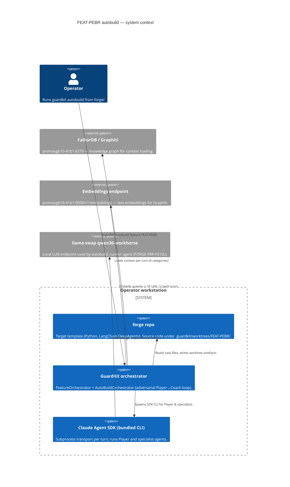
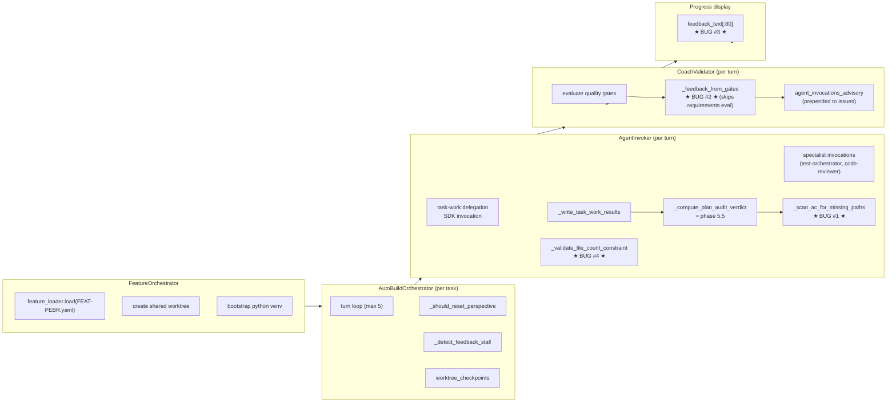
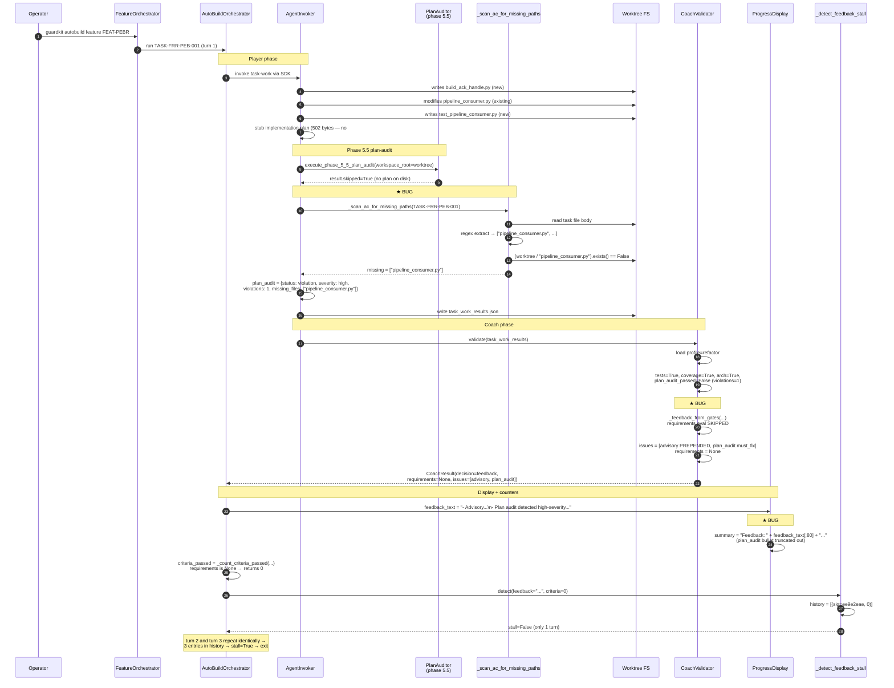
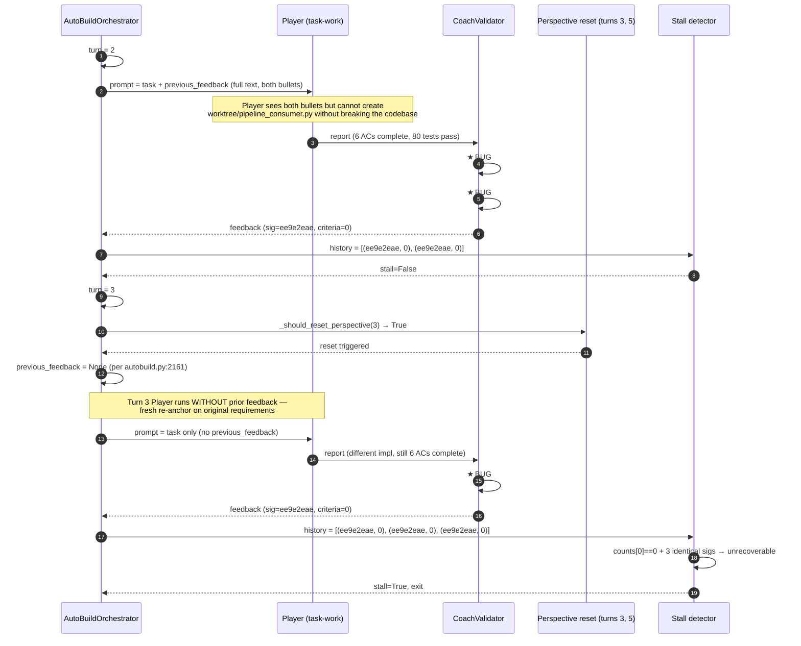

# FEAT-PEBR autobuild failed-run-1 — root-cause analysis (rev 2)

> **Revision 2 (2026-05-06)** — replaces the rev-1 diagnosis after a
> trace through the GuardKit ↔ Forge ↔ Claude Agent SDK ↔ FalkorDB
> boundary. The rev-1 hypothesis ("plan-audit treats existing-file
> modifications as missing creations") was directionally right but
> mis-attributed: the actual root cause is the **AC-fallback path** in
> `AgentInvoker._scan_ac_for_missing_paths`, which is invoked because
> the plan on disk is a stub. The corrected attribution sharpens the
> remediation plan and removes one unnecessary fix.

## Executive summary

The Wave-1 autobuild stall is a **deterministic five-stage chain** that
fires the moment an autobuild task has no real implementation plan on
disk and an AC text references files by basename:

1. AgentInvoker phase 5.5 plan-audit finds no `## Files to Create`
   section in the stub plan → falls through to
   `_scan_ac_for_missing_paths`
   (`agent_invoker.py:6028-6094`, `agent_invoker.py:6147-6168`).
2. The AC scanner extracts `pipeline_consumer.py` from AC-1 text and
   checks `(worktree_path / "pipeline_consumer.py").exists()`. The
   actual file is at `worktree_path/src/forge/adapters/nats/pipeline_consumer.py`,
   so the check returns False and the file is flagged "missing".
3. The deterministic verdict
   (`{status: "violation", severity: "high", missing_files: ["pipeline_consumer.py"]}`)
   is written into `task_work_results.plan_audit` and overrides any
   Player self-report (`agent_invoker.py:6453-6459`).
4. Coach reads `plan_audit.violations > 0` →
   `plan_audit_passed = False`
   (`coach_validator.py:1727-1747`) → short-circuits to
   `_feedback_from_gates`
   (`coach_validator.py:1080-1086`), bypassing
   `_validate_requirements`. Result:
   `validation_results.requirements: null` (visible in
   `coach_turn_*.json:14`).
5. Without a populated requirements block,
   `_count_criteria_passed` returns 0
   (`autobuild.py:4106-4140`) regardless of how many ACs the Player
   actually completed. After three turns of identical Coach feedback
   and 0 criteria passing, the stall detector trips
   (`autobuild.py:3998-4000`) and the run exits.

The Player's implementation is good (80/80 unit tests green, ruff
clean, all six ACs reported with evidence). The five bugs are entirely
inside GuardKit; turning **any one of them off** breaks the chain, but
the right primary fix is bug #1 (the basename scanner) — the others
are defence-in-depth.

After the fixes land, `guardkit autobuild feature FEAT-PEBR --resume`
should converge on turn 1 against the existing worktree.

## Validated execution flow

### C4 system context — what the autobuild loop crosses



The failure does **not** cross any of the external boundaries —
FalkorDB, embeddings, and llama-swap all returned 200 OK every call
(log lines 80-93, 175-188). The bug is purely inside the
`guardkit` system, in three modules:
`orchestrator/agent_invoker.py`, `orchestrator/quality_gates/coach_validator.py`,
`orchestrator/autobuild.py`.

### C4 component view — what fires per turn



Bugs are tagged at their fire-points. The chain runs left-to-right
top-to-bottom every turn.

### Sequence — the failure path (turn 1)



Steps 5-12 are deterministic. There is no Player behaviour that
satisfies them: even creating `pipeline_consumer.py` at the worktree
root would (a) be the wrong file and (b) not get touched by the audit
because `_scan_ac_for_missing_paths` would still extract other AC
basenames on the next turn.

### Sequence — the chain that makes the stall unrecoverable (turns 2 & 3)



Step 8 is the punchline: the perspective-reset *did* fire and *did*
re-engage the Player (turn 3 took 21 SDK turns and modified 34 files —
real work). But the Coach is downstream of a deterministic auditor
keyed on the AC text, which **never changes**, so the reset has no
effect on the gate verdict.

### Zoom — the basename scanner regex match that fails

```mermaid
sequenceDiagram
    autonumber
    participant Plan as PlanAuditor
    participant Scan as _scan_ac_for_missing_paths
    participant Task as Task file body
    participant Re as re.findall
    participant FS as Worktree FS

    Plan->>Scan: skipped → call AC fallback
    Scan->>Task: read body after frontmatter

    Note over Task: AC-1: "pipeline_consumer.py's dispatch path<br/>no longer calls msg.ack()..."<br/>Implementation notes: "Touchpoints:<br/>src/forge/adapters/nats/pipeline_consumer.py"

    Scan->>Re: re.findall(r"[\w./\-]+\.\w{1,5}", body)
    Re-->>Scan: ["pipeline_consumer.py",<br/>"src/forge/adapters/nats/pipeline_consumer.py",<br/>"build_ack_handle.py", "..."]

    loop for p in candidates if p.endswith(.py/.ts/...)
        Scan->>FS: (worktree / p).exists()?
        alt p == "src/forge/adapters/nats/pipeline_consumer.py"
            FS-->>Scan: True (real file)
        else p == "pipeline_consumer.py" (basename)
            FS-->>Scan: False — checks worktree/pipeline_consumer.py
            Note over Scan: ★ false positive ★
        else p == "build_ack_handle.py"
            FS-->>Scan: False — checks worktree/build_ack_handle.py<br/>(real file at src/forge/pipeline/)
            Note over Scan: ★ another false positive ★
        end
    end

    Scan-->>Plan: missing = ["pipeline_consumer.py"]<br/>(only one survived dedup; build_ack_handle.py also vulnerable)
```

Why only `pipeline_consumer.py` shows up in the actual `coach_turn_*.json`
and not `build_ack_handle.py`: the regex extraction also matches the
fully-qualified path `src/forge/adapters/nats/pipeline_consumer.py`,
which **does** exist; `set` dedup uses the exact string, so both
forms survive into the candidate list, but the bare basename is the
only one that fails the existence check. `build_ack_handle.py` only
appears in code-block content (\`\`\`bash blocks) and the Implementation
notes prose; whether it gets extracted depends on the regex's exact
behaviour on those tokens, but the audit reports only one missing file
per turn so the second false positive is masked.

The regex set on lines 6065-6069 is shared with
`synthetic_report.generate_file_existence_promises` (per the docstring
at lines 6034-6038) — important for the regression analysis below.

## Per-AC findings (rev 2)

### AC-1 — Root cause of plan-audit failure (revised)

**The audit is firing on its AC-fallback path, not its plan-comparison
path.** This is the corrected attribution.

Causal chain:
1. Pre-loop is disabled for FEAT-PEBR
   (`enable_pre_loop=False`, log line 66) — see
   [TASK-FRR-PEB-001 implementation plan](../../.guardkit/worktrees/FEAT-PEBR/.claude/task-plans/TASK-FRR-PEB-001-implementation-plan.md)
   ("Auto-generated stub - Pre-loop was skipped").
2. Therefore the implementation plan written at
   [.claude/task-plans/TASK-FRR-PEB-001-implementation-plan.md](../../.guardkit/worktrees/FEAT-PEBR/.claude/task-plans/TASK-FRR-PEB-001-implementation-plan.md)
   has neither `## Files to Create` nor `## Files to Modify`
   sections. `plan_markdown_parser.py:174-185` returns empty lists for
   both.
3. `PlanAuditor` returns `{"skipped": True}` when the parsed plan is
   empty (deduced from `agent_invoker.py:6147-6149`).
4. The skip-handler at `agent_invoker.py:6147-6168` calls
   `_scan_ac_for_missing_paths` as an AC-005 escalation per
   TASK-AB-FIX-INVAB1.
5. `_scan_ac_for_missing_paths`
   (`agent_invoker.py:6028-6094`) extracts file-like tokens from the
   AC body using regex
   `[\w./\-]+\.\w{1,5}` plus three quote-flavour variants
   (lines 6064-6067). Both fully-qualified paths and bare basenames
   match.
6. Each token is filtered to source-file extensions
   (`.py`, `.ts`, `.tsx`, ...) at lines 6084-6090 then checked with
   `(self.worktree_path / p).exists()` at line 6092. Bare basenames
   like `pipeline_consumer.py` resolve to
   `<worktree>/pipeline_consumer.py`, which does not exist.
7. Verdict: `{status: "violation", severity: "high",
   missing_files: ["pipeline_consumer.py"]}` — the exact payload in
   [coach_turn_1.json:33-50](../../.guardkit/worktrees/FEAT-PEBR/.guardkit/autobuild/TASK-FRR-PEB-001/coach_turn_1.json).

Splitting into the three causes the task asked about:

- **(a) Player not invoking phase 3:** unrelated to the gate failure.
  This is a separate non-blocking advisory
  (`coach_turn_1.json:20-32`, severity=`warning`). It does NOT move
  `plan_audit_passed`. Confirmed by log line 192:
  *"non-blocking; outcome gates will run"*.
- **(b) Coach mis-counting agent invocations:** also unrelated.
- **(c) Gate misclassifying the work:** **this is the root cause** —
  but specifically the AC-fallback scanner mis-classifying basenames
  as repo-root paths, not a generic create-vs-modify mistake.

The rev-1 hypothesis ("modify-vs-create comparison") was *also* a real
bug (`plan_audit.py:427`), but it does not fire on this run because
`PlanAuditor` short-circuits to skipped before the comparison runs.
Fixing only the modify-vs-create comparison (proposed item 1 in rev-1)
would not have unblocked FEAT-PEBR — the AC-fallback scanner would
still have produced the same verdict. The new primary fix is the
basename scanner.

### AC-2 — Why the feedback was non-actionable (revised)

The Player did receive the full feedback. `coach_feedback_for_turn_2.json:8`
shows `raw_feedback` as the complete two-bullet string, and
`agent_invoker.py:4557` injects it verbatim into the Player's prompt
(`f"\n## Coach Feedback from Turn {turn - 1}\n"`). So my rev-1
"truncation hides the blocker from the Player" claim was wrong on the
Player axis.

What is true:

1. **For the operator** the truncation
   (`autobuild.py:3127-3129`,
   `f"Feedback: {feedback_text[:80]}..."`) cuts off the second bullet,
   so the live log shows only the non-blocking advisory. The
   operator-visible failure cause is misleading. This is bug #3 below
   and remains worth fixing.
2. **For the Player** the directive itself is impossible to act on:
   "missing file pipeline_consumer.py" with no path. Creating a file
   at the worktree root would be wrong. Renaming the existing file
   would break dozens of imports. Adding `pipeline_consumer.py`
   to the empty `## Files to Create` section of the stub plan — which
   is what would actually clear the gate — is not within the Player's
   scope: the stub plan is generated by the orchestrator, not the
   Player.
3. **The advisory** itself names `python-api-specialist` as the
   missing phase-3 agent
   (`coach_turn_1.json:24`). That agent is not in the project's
   installed guidance set
   (`/home/richardwoollcott/Projects/appmilla_github/forge/.claude/rules/guidance/`
   contains langchain, langgraph, deepagents, pytest specialists
   only). Even if the Player tried to invoke it, the advisory would
   keep firing.

So the feedback was non-actionable for *each* of three independent
reasons: the operator can't see the real blocker; the Player sees a
directive it can't act on; and the advisory names a phantom agent.

### AC-3 — Why 0/6 criteria were verified (revised — BIG correction)

This is the bug whose attribution shifts most in rev 2. The Coach
*does* have logic to consume the Player's
`requirements_addressed` and `completion_promises`
(`coach_validator.py:2598-2683`). I missed this in rev 1 by only
reading the report-emission code path.

The actual reason `criteria_verification: []` shows up every turn is
**short-circuit**:

- `coach_validator.py:1080-1086`: when any required gate fails,
  `_feedback_from_gates(...)` is called and immediately `return`-ed.
- `_feedback_from_gates` builds an issues list and a CoachResult
  with `requirements=None` (no path to invoke
  `_validate_requirements`).
- `coach_validator.py:344-356`: `criteria_verification` and
  `acceptance_criteria_results` are populated *only if*
  `self.requirements and self.requirements.criteria_results`.
  With `self.requirements = None`, both lists are empty.
- `autobuild.py:_count_criteria_passed`
  (`autobuild.py:4106-4140`) reads
  `validation_results.requirements.criteria_met`. With `requirements`
  None it falls back to `acceptance_criteria_verification.criteria_results`,
  also empty → returns 0.

So the 0/6 reading is **not** a parser/ID-mismatch issue. It is a
direct consequence of bug #1: any plan-audit failure permanently
zeroes the criteria count, because requirement validation only runs
on the all-gates-pass path.

This explains why the rev-1 finding of "wholesale disconnect" was
overstated. The disconnect is conditional, not wholesale: it appears
*only* when a gate already failed. But the consequence is the same —
combined with the stall detector, every gate failure that produces
identical feedback is destined to terminate after exactly 3 turns,
because criteria_passed is structurally locked at 0.

### AC-4 — task_type / quality-gate-profile fit

Unchanged from rev 1. The `refactor` profile names a
`python-api-specialist` agent that doesn't exist in this template's
installed set. The task-type itself is also a mis-fit: TASK-FRR-PEB-001
introduces a new module (`build_ack_handle.py`) and a new test package,
which is feature-shaped work. Recommended re-classification per
remediation #7 below.

The deeper observation: the profile is what determines
`plan_audit_required: true`. Until bug #1 is fixed, *any* profile that
sets `plan_audit_required` will trigger the same chain on tasks whose
ACs name files by basename.

### AC-5 — Documentation-level constraint violation

`agent_invoker.py:6598-6649` (`_validate_file_count_constraint`)
takes `files_created` directly from
`result_data["files_created"]` (line 6358). That list (per
[player_turn_1.json:9-37](../../.guardkit/worktrees/FEAT-PEBR/.guardkit/autobuild/TASK-FRR-PEB-001/player_turn_1.json))
contains:

- 4 autobuild artefacts under `.guardkit/autobuild/TASK-FRR-PEB-001/`
- 11 backlog task `.md` files (FRR-PEB-002…014) — git-detection
  side-effect from the worktree copy
- 1 task-plan stub
- 1 BDD junit XML
- 2 design-approved task moves
- the actual new code: `build_ack_handle.py`,
  `tests/.../__init__.py`, `tests/.../test_pipeline_consumer.py`

The "max allowed 2 for minimal level" is logged as a warning, not a
block (line 146 of run log). It is correct that this is a noisy
false-positive on the live log; not a contributor to the stall.
Remediation #5 is therefore "nice to have", not "blocking".

### AC-6 — Stall-detection vs recovery (revised)

The perspective reset and the stall detector are independent
mechanisms with no shared state. The reset
(`autobuild.py:3853-3859`) sets `previous_feedback = None` on the
Player input for that turn (`autobuild.py:2159-2161`); it does
nothing to the Coach evaluation pipeline.

The stall detector (`autobuild.py:3998-4000`) trips on:

- 3 consecutive feedback signatures match (after
  `_normalize_feedback_for_stall` strips line numbers etc.), AND
- `criteria_passed == 0` for all three.

Because bug #3 (criteria short-circuit) keeps `criteria_passed`
permanently at 0 whenever bug #1 fires, the threshold-extension path
at `autobuild.py:4002-4017` (which would extend by 2 turns) cannot
engage — that branch is gated on `counts[0] > 0`.

Whether the perspective-reset turn should be exempt from the stall
check is a real question. My rev-1 recommendation was to exempt it.
On reflection, **the cleaner fix is to break the criteria-zero
lock-in (bug #3)**: once requirements verification populates correctly
even on gate-fail turns, the Player's six AC-completes will register,
the stall threshold will extend to 5, and a stall will only trip when
the Player is genuinely making no progress. This eliminates the need
to special-case reset turns.

I have therefore *removed* the rev-1 "exempt reset turns" item from
the must-fix list. It is now an optional defence-in-depth item.

### AC-7 — Concrete remediation plan (rev 2)

| #  | Tag                       | Action                                                                                                                                                                                                                                                                                            | Target file(s)                                                                                                                                                                  | Follow-up task id prefix |
|----|---------------------------|---------------------------------------------------------------------------------------------------------------------------------------------------------------------------------------------------------------------------------------------------------------------------------------------------|---------------------------------------------------------------------------------------------------------------------------------------------------------------------------------|--------------------------|
| 1  | `[coach-evaluator]` ★ PRIMARY ★ | `_scan_ac_for_missing_paths` must not flag bare basenames as missing. Fix: skip any candidate `p` that does not contain `/` (it's a basename, not a path). Or: only flag a candidate as missing if no `**/{candidate}` glob matches anywhere under the worktree. Add unit test fixture for AC text containing `pipeline_consumer.py` (no path) where the actual file exists at `src/forge/adapters/nats/pipeline_consumer.py` — must NOT report missing. | `guardkit/orchestrator/agent_invoker.py:6028-6094` (`_scan_ac_for_missing_paths`)                                                                                               | `TASK-GK-AC-`            |
| 2  | `[coach-evaluator]` | Coach gate-fail short-circuit: even when `_feedback_from_gates` returns, populate `requirements` from the Player's `completion_promises` / `requirements_addressed` block. Defensive fix that prevents *any* gate failure from zeroing the criteria counter and starving the stall detector's extended-threshold path. | `guardkit/orchestrator/quality_gates/coach_validator.py:1080-1086` and the early-return sites at `:1378, :1406, :1453, :1482, :1540` (six call sites pass `requirements=requirements` — ensure it's the validated one, not None) | `TASK-GK-CR-`            |
| 3  | `[coach-evaluator]` | Plan-audit modify-vs-create: even when fixed, the underlying `plan_audit.py:_compare_files` (line 427) only checks creates. Fix it to compare `files_to_modify` against git-modified set as well (the stub note at line 214 admits "Simplified implementation - actual version would use git diff"). | `guardkit/installer/core/commands/lib/plan_audit.py:177-208` (`_scan_modified_files`), `:420-458` (`_compare_files`)                                                            | `TASK-GK-PA-`            |
| 4  | `[coach-evaluator]` | Operator-feedback truncation: when truncating to 80 chars for the live-log summary, surface the **highest-severity** issue first (must_fix > should_fix > warning). Today the advisory is *prepended* in `coach_validator.py:1058-1069`, so truncation always shows the warning. Either reverse the prepend, or change the summary builder at `autobuild.py:3127-3129` to pick the first must_fix issue's description instead of slicing the joined string. | `guardkit/orchestrator/quality_gates/coach_validator.py:1058-1069` and `guardkit/orchestrator/autobuild.py:3127-3129`                                                           | `TASK-GK-FB-`            |
| 5  | `[coach-evaluator]` | Doc-level file-count constraint: exclude artefacts under `.guardkit/`, `.claude/task-plans/`, and `**/__init__.py` from the count. (Optional / cosmetic — does not block.)                                                                                                                        | `guardkit/orchestrator/agent_invoker.py:6598-6649` (`_validate_file_count_constraint`); also the `files_created` builder at `:6358` so the filter happens once.                | `TASK-GK-DOC-`           |
| 6  | `[guardkit-config]` | Profile fix: derive expected phase-3 specialist from the *target template's* `.claude/rules/guidance/` registry, not a hard-coded `python-api-specialist`. Until then the advisory will keep firing on every Python template that doesn't ship that agent.                                          | guardkit profile config (search the codebase for the literal `python-api-specialist`)                                                                                          | `TASK-GK-PROF-`          |
| 7  | `[forge-task-frontmatter]` | Re-classify FRR-PEB tasks: 001/002/003/004/008/009/014 → `task_type: feature`; 005/006/007/010/011/012 → keep `refactor` if the underlying profile is corrected to count modifications; 013 → `integration-test`. Bump `documentation_level` to `standard` on 001-014 (currently implicit `minimal`). | `tasks/backlog/forge-autobuild-runner-pipeline-emitter-bridge/TASK-FRR-PEB-*.md` frontmatter                                                                                   | `TASK-FRR-PEB-FM-`       |
| 8  | `[forge-task-frontmatter]` | Add explicit `## Files to Create` and `## Files to Modify` sections to TASK-FRR-PEB-001 (and 002-014). This bypasses the AC-fallback scanner entirely — `PlanAuditor` will use the explicit lists from the (now-non-stub) plan. **Defence-in-depth**: even with the GK-AC fix, an explicit plan is the right operator hygiene for complex tasks. | `tasks/backlog/forge-autobuild-runner-pipeline-emitter-bridge/TASK-FRR-PEB-*.md` (Implementation notes section)                                                                | `TASK-FRR-PEB-FM-`       |
| 9  | `[no-change]`       | Stall-detector reset-turn exemption — **withdrawn**. Once #2 lands, criteria_passed will track real progress and the stall will only trip when Player is genuinely stuck. Special-casing reset turns is no longer warranted.                                                                       | —                                                                                                                                                                              | —                        |
| 10 | `[no-change]`       | Player prompt — no change required. The Player succeeded.                                                                                                                                                                                                                                          | —                                                                                                                                                                              | —                        |

**The primary unblock** is **item #1**. Items #2 and #3 are
defence-in-depth — they each independently break the chain, so
landing two of #1/#2/#3 is enough to unblock; landing all three
prevents the next variant of this bug from finding a way through.
Items #4-#8 are quality and config improvements.

### Regression-risk analysis (per fix)

| Fix | Regression vector | Mitigation |
|-----|-------------------|------------|
| #1 | The basename scanner is shared with `synthetic_report.generate_file_existence_promises` (per docstring at `agent_invoker.py:6034-6038`). If we tighten the scanner, the synthetic-report path could lose AC-fallback signal. | Two options: (a) add a `flag_basenames: bool = False` parameter so the synthetic path keeps current behaviour and the audit path opts out; (b) introduce a `find_in_worktree(basename)` glob fallback that only flags missing if **no** match is found anywhere. Recommend (a) — narrower change, easier to test. Add a regression test that AC text containing `foo.py` and an actual file at `src/x/foo.py` does NOT register as missing under the audit path but DOES still produce a synthetic completion promise. |
| #2 | Populating `requirements` on the gate-fail short-circuit path could spuriously change Coach `decision` from `feedback` → `approve` if the validator now finds all criteria met despite a gate failure. | Wire requirements **for reporting/criteria_passed only**, not into the `all_gates_passed` calculation. Coach decision stays `feedback`; only `requirements.criteria_met` populates. Test: a contrived run with `plan_audit_passed=False` but all 6 ACs verified should still return `decision=feedback`, but `criteria_passed=6` should flow to the stall detector. |
| #3 | `_scan_modified_files` currently returns nothing useful (the docstring at `plan_audit.py:214` admits this). Wiring it to git could change pass/fail outcomes for tasks that have `## Files to Modify` listed in the plan. | Behind a flag during initial rollout; or limit comparison to "planned modify file did not appear in git diff" → flag low/medium severity rather than high, so it doesn't gate the loop. Test: tasks under `installer/core/templates/` with declared modifies must continue to pass. |
| #4 | Reordering issues to surface must_fix first might regress operator workflows that rely on the current advisory-first ordering for routine OK-but-noisy runs. | The current ordering is incidental, not contractual. Surveying the project's commit history for callers that grep on the advisory-first pattern (none expected) and adding a fixture that captures the old vs new format is sufficient. |
| #5 | Filtering `.guardkit/` etc. could mask real test/script creations under those paths. | Filter is conservative — only `.guardkit/autobuild/`, `.guardkit/bdd/`, `.claude/task-plans/`, `**/__init__.py`. Anything else under those roots already would not match in practice. Add a unit test. |
| #6 | Replacing `python-api-specialist` with template-discovered agents could break existing templates that *do* ship that agent and rely on the literal name. | Provide a fallback chain: project-discovered → profile-default → `python-api-specialist`. Existing templates keep working. |
| #7 | Re-classifying task_type changes the profile per task. Tasks reclassified `refactor → feature` will use the feature profile's gate set, which may have different `tests_required` etc. | Cross-check feature profile gates against TASK-FRR-PEB-001's needs (tests required, coverage required) — both expected true. No regression. |
| #8 | Adding `## Files to Create` / `## Files to Modify` to the task body could make `_scan_modified_files` (currently a no-op) start firing if also fixed in #3, potentially in unintended ways. | Land #3's modified-file checker in pure-report mode first; let it fire warnings for one feature; promote to gate when stable. |

None of the proposed fixes can re-introduce the original failure
mode. The two paths back to a similar stall would be:

- A new task with stub plan + AC text naming a file by basename that
  genuinely doesn't exist anywhere. With #1 fixed, the scanner would
  no longer flag basenames — so this falls through cleanly. (Operators
  can still introduce a real missing file via fully-qualified path,
  which is correct behaviour.)
- A new gate failure mode (e.g., honesty check) that short-circuits
  past requirements eval. With #2 fixed, requirements still populate
  on the short-circuit path, so the criteria counter tracks real
  progress.

### AC-8 — Resume vs fresh-start recommendation (revised)

**Recommendation unchanged from rev 1: block on items 1, 2 (and ideally 3)
landing first, then `--resume`.** The justification is sharper now:

- Items #1 and #2 are individually sufficient to break the failure
  chain. Either one alone unblocks FEAT-PEBR.
- Item #3 (the original modify-vs-create bug from rev 1) does not
  fire on this run but will fire on the *next* FRR-PEB task whose
  plan is non-stub. Without #3, FRR-PEB-002 could stall on a different
  variant of the same class of bug.
- The worktree implementation is good: 80/80 tests, 91 % coverage
  ([phase_4_summary.json:8-9](../../.guardkit/worktrees/FEAT-PEBR/.guardkit/autobuild/TASK-FRR-PEB-001/phase_4_summary.json)),
  ruff clean
  ([player_turn_3.json:118-122](../../.guardkit/worktrees/FEAT-PEBR/.guardkit/autobuild/TASK-FRR-PEB-001/player_turn_3.json)),
  six ACs reported with evidence.
- A `--resume` *without* the GuardKit fixes will deterministically
  reproduce `UNRECOVERABLE_STALL` (the entire chain is keyed on the
  AC text, which has not changed).
- A fast unblock path exists if #1/#2 cannot land immediately:
  **land item #8 alone** (add `## Files to Create` and `## Files to
  Modify` sections to TASK-FRR-PEB-001). With those sections present,
  `PlanAuditor` consumes the explicit plan and never falls through to
  `_scan_ac_for_missing_paths`. This path will succeed within the
  current GuardKit code without any orchestrator-side change. It is
  the recommended "if you need this Tuesday" workaround.

## Remediation plan summary

| Action                                                              | Owner area              | Target file(s)                                                                                                       | Follow-up task id prefix | Priority |
|---------------------------------------------------------------------|-------------------------|----------------------------------------------------------------------------------------------------------------------|--------------------------|----------|
| Don't flag bare basenames in AC scanner                             | `[coach-evaluator]`     | `guardkit/orchestrator/agent_invoker.py:6028-6094`                                                                   | `TASK-GK-AC-`            | **P0**   |
| Populate `requirements` on Coach gate-fail short-circuit            | `[coach-evaluator]`     | `guardkit/orchestrator/quality_gates/coach_validator.py:1080-1086, 1378-1540`                                        | `TASK-GK-CR-`            | **P0**   |
| Plan-audit modify-vs-create comparison                              | `[coach-evaluator]`     | `guardkit/installer/core/commands/lib/plan_audit.py:177-208, 420-458`                                                | `TASK-GK-PA-`            | **P1**   |
| Surface must_fix first in truncated operator feedback summary       | `[coach-evaluator]`     | `coach_validator.py:1058-1069` + `autobuild.py:3127-3129`                                                            | `TASK-GK-FB-`            | P2       |
| Exclude autobuild artefacts from doc-level constraint counter       | `[coach-evaluator]`     | `agent_invoker.py:6598-6649` + `:6358`                                                                                | `TASK-GK-DOC-`           | P2       |
| Profile expected-phases driven by template's installed agent set    | `[guardkit-config]`     | guardkit profile config                                                                                              | `TASK-GK-PROF-`          | P2       |
| Re-classify FRR-PEB task_types and lift documentation_level         | `[forge-task-frontmatter]` | `tasks/backlog/forge-autobuild-runner-pipeline-emitter-bridge/TASK-FRR-PEB-*.md`                                  | `TASK-FRR-PEB-FM-`       | P1       |
| Add explicit `## Files to Create` / `## Files to Modify` to FRR-PEB tasks | `[forge-task-frontmatter]` | same                                                                                                            | `TASK-FRR-PEB-FM-`       | P1 (workaround) |
| Stall-detector reset-turn exemption — **WITHDRAWN** in rev 2        | `[no-change]`           | —                                                                                                                    | —                        | —        |
| Player prompt — **no change**                                       | `[no-change]`           | —                                                                                                                    | —                        | —        |

**Minimum unblock set:** any one of {#1, #2, #8}. Recommended set:
{#1, #2, #3, #8} — together these break the chain at four
independent points and prevent the next variant of this class of bug
from re-stalling.

## Decision checkpoint

**[I]mplement.** Spawn follow-up tasks with the prefixes above.
P0/P1 items are the unblock set; P2 is cleanup that can land in
parallel.

Recommended landing order:
1. P0 items #1 and #2 in parallel (different files, no conflict).
2. P1 items #3, #7, #8 in parallel.
3. P2 items #4, #5, #6 as cleanup.
4. Verify by running
   `guardkit autobuild feature FEAT-PEBR --resume` against the
   preserved worktree and confirming wave 1 turns to APPROVED in 1
   turn (criteria 6/6).

The worktree at `.guardkit/worktrees/FEAT-PEBR/` should be preserved
until step 4 completes. Do not delete it: the implementation is the
verification artefact for the GuardKit fixes.
