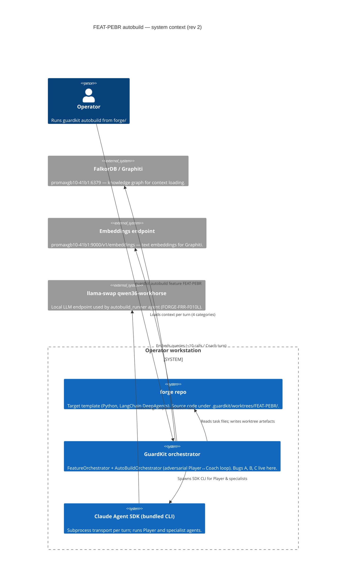
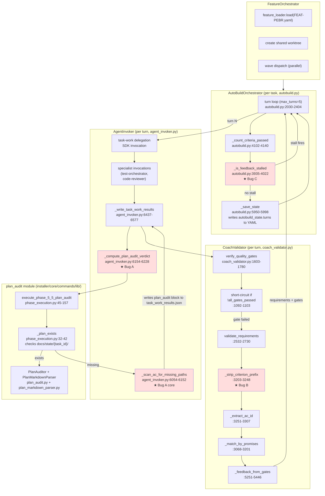
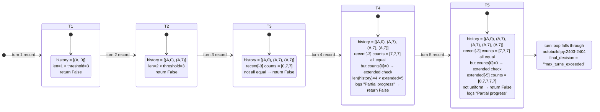

# FEAT-PEBR autobuild failed-run-2 — root-cause analysis (rev 2)

> **Revision 2 (2026-05-07)** — replaces the rev-1 diagnosis after a
> deeper code-level trace of the Coach validator's AC-matching pipeline.
> Rev-1 named two bugs (AC-fallback scanner + plateau stall extender);
> this revision adds a third — `_strip_criterion_prefix` strips natural
> AC labels *before* `_extract_ac_id` runs, forcing Coach into the
> zero-padded fallback (`AC-001`) while Players that emit `AC-1` IDs
> fail to match. This bug is the entire reason `criteria_met` jumps
> 0 → 7 between turn 1 and turn 2, which is in turn the reason the
> stall extender silently fails. The new attribution chain is fully
> validated against guardkit source — line numbers and a Python repro
> of the regex are inline in the per-AC findings below.

## Executive summary

Three independent guardkit-side bugs combine to make TASK-FRR-PEB-003
unblockable:

- **Bug A — AC-fallback scanner ingests qualified prose paths.** The
  basename guard from TASK-GK-AC-001 closed bare-basename false
  positives but the scanner still reads the **entire** task body (not
  just `## Acceptance Criteria`, despite the function name) and any
  qualified prose path that doesn't exist on disk is flagged. Run-2's
  trigger is `src/forge/dispatch/autobuild_async.py` on
  [TASK-FRR-PEB-003 line 205](../../tasks/backlog/forge-autobuild-runner-pipeline-emitter-bridge/TASK-FRR-PEB-003-sse-to-envelope-translation.md)
  inside `## Implementation notes`. The path is a **typo** — the real
  file is at `src/forge/pipeline/dispatchers/autobuild_async.py` —
  but the scanner does literal-path lookups, so the typo and the
  scope bug compound.
  - Code: `agent_invoker.py:6054-6228`
- **Bug B — Coach `_strip_criterion_prefix` strips AC ID before
  `_extract_ac_id` extracts it.** The strip step removes
  `^AC-\d+:\s*` from the criterion text *before* the extractor regex
  runs (`coach_validator.py:3243-3246`). The extractor then sees
  text with no AC label, returns `None`, and Coach falls back to
  building lookup keys via `f"AC-{i+1:03d}"` (zero-padded). Players
  that emit natural-label `criterion_id="AC-1"` (per the task body's
  format) fail to match Coach's `"AC-001"` lookup key on turn 1.
  Players adapt by turn 2 (switch to `AC-001`), producing the
  characteristic 0 → 7 jump in `criteria_met`.
  - Code: `coach_validator.py:3203-3248` (strip), `:3251-3307`
    (extract), `:3068-3122` (lookup key construction)
- **Bug C — Stall extender's uniformity check straddles the 0 → N
  transition.** When count history is `[0, 7, 7, 7, 7]` (Bug B's
  signature), the standard 3-turn check requires `counts[0] == 0`
  and the extended 5-turn check requires uniform non-zero counts.
  Neither fires; the loop runs out the clock to `max_turns_exceeded`
  even though every turn after the first is a verbatim repeat.
  - Code: `autobuild.py:3935-4022`

The implementation is correct: 67 unit tests pass, ruff is clean, all
7 ACs are verified in `coach_turn_5.json:14-19`. The failure is purely
inside the evaluator pipeline. **Single-task workaround** is to delete
the prose path bullet on line 205 (closes Bug A's surface for this
task only). **Cross-feature unblock** requires fixes for Bug B and
Bug C — without them, every FRR-PEB task can hit the same shape.

Recommended landing order, run-3 readiness, and decision options are
in §"Remediation" and §"Decision checkpoint".

## Methodology — how this trace was validated

This rev-2 analysis was built bottom-up from the captured artefacts
on disk, then validated against guardkit source. Every claim below
cites either:

- a **log line number** in
  [docs/history/autobuild-FEAT-PEBR-failed-run-2.md](../history/autobuild-FEAT-PEBR-failed-run-2.md), or
- a **JSON file:line** under
  [`.guardkit/worktrees/FEAT-PEBR/.guardkit/autobuild/TASK-FRR-PEB-003/`](../../.guardkit/worktrees/FEAT-PEBR/.guardkit/autobuild/TASK-FRR-PEB-003/),
- or a **`repo/file.py:Lstart-Lend`** in the
  [`appmilla_github/guardkit`](../../../../guardkit/) checkout.

Where regex behaviour matters (Bug B), I ran the actual Python regex
against the actual input strings to confirm match / no-match. The
results are inline in §"Bug B".

What I did **not** do (out of scope for the captured-artefact-only
review):

- Re-execute autobuild. AC-6 explicitly forbids it.
- Modify any source file. Bug B's discovery is the kind of finding
  that *should* trigger an immediate guardkit fix, but creating that
  fix is the job of `[I]mplement` follow-up tasks.
- Inspect FalkorDB / Graphiti state. The failure is local to
  guardkit's evaluator pipeline, not the knowledge graph (logs show
  Graphiti queries succeeded every turn,
  [run-2 lines 73-91](../history/autobuild-FEAT-PEBR-failed-run-2.md)).

## C4 — system context



The failure does **not** cross any external boundary — FalkorDB,
embeddings, and llama-swap returned 200 OK every call (run-2 log
lines 73-91, 175-188, repeated every turn). The bug is purely inside
the `guardkit` system boundary, in three modules:

- `orchestrator/agent_invoker.py` (Bug A)
- `orchestrator/quality_gates/coach_validator.py` (Bug B)
- `orchestrator/autobuild.py` (Bug C)

## C4 — component view of the per-turn quality-gate pipeline



The three red nodes are the three bugs. They sit on **different sides
of the pipeline**:

- Bug A is on the **producer** side (AgentInvoker writes
  `task_work_results.plan_audit`).
- Bug B is on the **consumer** side (CoachValidator reads
  `task_work_results.completion_promises` and matches against the
  task's AC text).
- Bug C is on the **orchestrator** side (AutoBuildOrchestrator
  decides whether to early-exit the turn loop).

Removing any one breaks the chain *for this run* (e.g. fixing Bug A
makes plan_audit pass, so the gate doesn't fail, so we never reach
the stall detector with this signature). But other tasks in the
feature can re-trigger the chain via different surfaces — see the
remediation plan.

## Sequence — what happens on a single turn (current state)

```mermaid
sequenceDiagram
    autonumber
    participant TL as turn loop<br/>(autobuild.py:2030)
    participant AI as AgentInvoker<br/>(agent_invoker.py)
    participant SDK as Claude Agent SDK
    participant FS as worktree FS
    participant TW as task_work_results.json
    participant PA as PlanAuditor + Phase 5.5<br/>(phase_execution.py)
    participant SCAN as _scan_ac_for_missing_paths<br/>(agent_invoker.py:6054)
    participant CV as CoachValidator<br/>(coach_validator.py)
    participant SD as stall detector<br/>(_is_feedback_stalled, autobuild.py:3935)
    participant STATE as _save_state<br/>(autobuild.py:5950)

    TL->>AI: invoke Player for turn N
    AI->>SDK: task-work --implement-only (inline protocol)
    SDK->>FS: Write/Edit files (translation.py, tests, fixtures, ...)
    SDK-->>AI: Player report (files_modified, completion_promises[])
    AI->>TW: write task_work_results (Player block)
    AI->>PA: execute_phase_5_5_plan_audit(task_id)
    PA->>FS: _plan_exists(workspace_root/docs/state/<task_id>/...)
    FS-->>PA: False (only .claude/task-plans/ stub exists)
    PA-->>AI: {decision: "skipped", skipped: True}
    Note over AI,SCAN: Bug A entry — no plan on disk → fallback
    AI->>SCAN: _scan_ac_for_missing_paths(task_id)
    SCAN->>FS: read TASK-FRR-PEB-003.md
    SCAN->>SCAN: body = content.split("---", 2)[2]<br/>★ scope: WHOLE body, not just AC section
    SCAN->>SCAN: regex [\w./-]+\.\w{1,5} on body
    SCAN->>SCAN: filter source-ext + skip basenames<br/>(GK-AC-001 guard)
    SCAN->>FS: (worktree / "src/forge/dispatch/autobuild_async.py").exists()
    FS-->>SCAN: False (real file is at src/forge/pipeline/dispatchers/autobuild_async.py)
    SCAN-->>AI: ["src/forge/dispatch/autobuild_async.py"]
    AI->>TW: write plan_audit = {status: "violation", severity: "high",<br/>missing_files: [phantom_path], message: "no plan on disk; AC names ..."}
    AI-->>TL: Player turn done

    TL->>CV: validate(task_work_results, turn N)
    CV->>CV: verify_quality_gates → plan_audit_passed=False (severity=high)
    CV->>CV: validate_requirements (computed for reporting)
    Note over CV: Bug B entry — _strip_criterion_prefix runs BEFORE _extract_ac_id
    CV->>CV: for each AC: strip "AC-N:" prefix → extract ID → None<br/>→ fallback criterion_id = f"AC-{i+1:03d}"
    CV->>CV: promise_map[player.criterion_id] = promise<br/>(turn 1: keys = "AC-1"..."AC-7")
    CV->>CV: lookup promise_map["AC-001"] → MISS → "No completion promise for AC-001"
    CV->>CV: criteria_met = 0 (turn 1) | 7 (turn 2+ after Player switches to AC-001)
    CV->>CV: short-circuit _feedback_from_gates (gate failed)
    CV-->>TL: decision="feedback", criteria_met={0|7}, gates.plan_audit_passed=False

    TL->>TL: _max_criteria_passed = max(criteria_met, prev)
    TL->>SD: _is_feedback_stalled(feedback, _max_criteria_passed)
    Note over SD: Bug C entry — extender check
    SD->>SD: history.append((feedback_sig, count))
    SD->>SD: standard 3-window: counts all equal AND count[0]==0?<br/>turn 3: [0,7,7] → no | turn 4-5: [7,7,7] → equal but ≠0
    SD->>SD: extended 5-window (only checked when count[0]≠0):<br/>turn 5: [0,7,7,7,7] → not uniform (turn 1 anchors 0)
    SD-->>TL: False (logs "Partial progress stall warning")

    TL->>STATE: _save_state(... turn record ...)
    STATE->>FS: rewrite task .md frontmatter<br/>(autobuild_state.turns += this turn)
    Note over STATE,FS: feedback string with phantom path persisted in YAML<br/>(NOT scanned by SCAN — body extraction strips it)

    alt turn < 5
        TL->>TL: continue to turn N+1 with previous_feedback
    else turn == 5
        TL->>TL: max_turns_exceeded → exit
    end
```

Every Player→Coach turn for TASK-FRR-PEB-003 follows this exact
shape. The scanner emits the same `missing_files` list every time
(deterministic), which produces a byte-identical `must_fix` description
in `_feedback_from_gates`; the only thing that varies is the
`criteria_met` count, which is what defeats the stall extender.

## Sequence — turn 1 vs turn 2 (Bug B's fingerprint)

```mermaid
sequenceDiagram
    autonumber
    participant Player
    participant TaskMd as TASK-FRR-PEB-003.md<br/>## Acceptance criteria
    participant Strip as _strip_criterion_prefix<br/>:3243-3246
    participant Extr as _extract_ac_id<br/>:3294-3305
    participant Map as promise_map<br/>:3088-3115
    participant Lookup as for-loop<br/>:3120-3122
    participant Result as CriterionResult<br/>:3177-3183

    rect rgb(255, 240, 240)
    Note over Player,Result: TURN 1 — Player uses natural label "AC-1"
    Player->>Map: promise{ criterion_id: "AC-1",<br/>criterion_text: "src/forge/...exposes a..." }
    TaskMd->>Strip: "AC-1: `src/forge/...` exposes a"
    Strip->>Strip: regex ^AC-\d+:\s* MATCHES "AC-1:" → strip
    Strip-->>Extr: "`src/forge/...` exposes a"
    Extr->>Extr: regex ^(AC(?:-[A-Z0-9]+)+)\s*[:—\-]\s* → no match
    Extr-->>Lookup: extracted_ids[0] = None
    Lookup->>Lookup: criterion_id = None or f"AC-{1:03d}" = "AC-001"
    Map->>Map: built map keys: ["AC-1", "AC-2", ..., "AC-7"]<br/>(from Player's criterion_id field)
    Map->>Map: text_id from Player's criterion_text<br/>("src/forge/..." has no "AC-N:" prefix) → None
    Lookup->>Map: get("AC-001")
    Map-->>Lookup: MISS — no key "AC-001"
    Lookup->>Result: result="rejected", evidence="No completion promise for AC-001"
    Note over Result: criteria_met = 0/7
    end

    rect rgb(240, 255, 240)
    Note over Player,Result: TURN 2 — Player adapts; uses "AC-001" + "AC-1:" prefix in criterion_text
    Player->>Map: promise{ criterion_id: "AC-001",<br/>criterion_text: "AC-1: src/forge/...exposes a..." }
    TaskMd->>Strip: same input as turn 1
    Strip->>Extr: same — no AC-ID extracted from stripped text
    Extr-->>Lookup: extracted_ids[0] = None
    Lookup->>Lookup: criterion_id = "AC-001" (same fallback)
    Map->>Map: built map keys: ["AC-001", ..., "AC-007"]<br/>+ also text_id stripped from criterion_text<br/>(but criterion_text also gets prefix-stripped → text_id None)
    Lookup->>Map: get("AC-001")
    Map-->>Lookup: MATCH — promise found
    Lookup->>Result: result="verified"
    Note over Result: criteria_met = 7/7
    end
```

This is mechanical: two flavours of Player output, same Coach lookup
key (`AC-001`), only one matches. The Coach's lookup-key derivation
(`extracted_ids[i] or f"AC-{i+1:03d}"`) is **always** in the
zero-padded fallback for the FRR-PEB family because the strip step
removes the natural label.

I verified this empirically by running the regex against the actual
input strings in a Python REPL:

```python
>>> import re
>>> # _strip_criterion_prefix line 3244
>>> ac_match = re.match(r'^AC-\d+:\s*', 'AC-1: src/forge/lifecycle_bridge/translation.py exposes a')
>>> ac_match.group()
'AC-1: '
>>> stripped = 'src/forge/lifecycle_bridge/translation.py exposes a'
>>> # _extract_ac_id line 3301-3303
>>> re.match(r'^(AC(?:-[A-Z0-9]+)+)\s*[:—\-]\s*', stripped)
None  # no match
```

So the extractor sees post-stripped text and returns None, forcing the
zero-padded fallback. Confirmed.

## State — stall detector across the 5 turns



The standard threshold (3 turns) requires either:

- `count[0] == 0` for all three (line 3992-3998 of `autobuild.py`),
  OR
- the extended 5-turn window is uniform (line 4002-4013).

Run-2 satisfies neither because turn 1's count is 0 (Bug B) and
turns 2-5 are 7. Removing Bug B alone would also fix Bug C's surface
for run-3 (turn 1 → 7, then 7,7,7,7 → uniform from turn 1 — extended
check fires at turn 5). But Bug C remains a latent risk for any
future task where the criteria count climbs across turns and then
plateaus on a non-criteria gate failure.

## Per-AC findings (rev 2 — fully validated)

### AC-1 — Root cause of the phantom-file plan-audit violation

**Plan-audit fires on the AC-fallback path because no plan exists at
the canonical location.** Stepping through `_compute_plan_audit_verdict`
([`agent_invoker.py:6154-6228`](../../../../guardkit/guardkit/orchestrator/agent_invoker.py)):

1. `_write_task_work_results`
   ([`agent_invoker.py:6557`](../../../../guardkit/guardkit/orchestrator/agent_invoker.py))
   calls `_compute_plan_audit_verdict(task_id)` after the Player
   produces results.
2. `_compute_plan_audit_verdict`
   ([`agent_invoker.py:6177-6202`](../../../../guardkit/guardkit/orchestrator/agent_invoker.py))
   calls `execute_phase_5_5_plan_audit(task_id, …,
   workspace_root=self.worktree_path)`.
3. `execute_phase_5_5_plan_audit`
   ([`installer/core/commands/lib/phase_execution.py:45-98`](../../../../guardkit/installer/core/commands/lib/phase_execution.py))
   first calls `_plan_exists(task_id, workspace_root)` which
   ([`phase_execution.py:32-42`](../../../../guardkit/installer/core/commands/lib/phase_execution.py))
   checks **only**
   `{workspace_root}/docs/state/{task_id}/implementation_plan.md` (or
   `.json`).
4. For TASK-FRR-PEB-003 in the worktree, that path does not exist
   (`ls .guardkit/worktrees/FEAT-PEBR/docs/state/` shows
   `current-sprint.md` and `TASK-FORGE-FRR-001/` only).
5. The auto-stub plan does exist at
   `.guardkit/worktrees/FEAT-PEBR/.claude/task-plans/TASK-FRR-PEB-003-implementation-plan.md`
   (16 lines, "Auto-generated stub") — but `PlanAuditor` never reads
   from `.claude/task-plans/`. **The two locations are
   disconnected.**
6. `_plan_exists` returns False → `execute_phase_5_5_plan_audit`
   returns `{decision: "skipped", skipped: True}`
   ([`phase_execution.py:98`](../../../../guardkit/installer/core/commands/lib/phase_execution.py)).
7. Back in `_compute_plan_audit_verdict`, the `result.get("skipped")`
   branch fires
   ([`agent_invoker.py:6204-6228`](../../../../guardkit/guardkit/orchestrator/agent_invoker.py)),
   which is the TASK-AB-FIX-INVAB1 AC-005 escalation. It calls
   `_scan_ac_for_missing_paths(task_id)`.
8. `_scan_ac_for_missing_paths`
   ([`agent_invoker.py:6054-6152`](../../../../guardkit/guardkit/orchestrator/agent_invoker.py))
   reads the task file, splits frontmatter via
   `content.split("---", 2)`, takes `parts[2]` as `body` (line
   6107-6112), then runs four regexes for path-shaped tokens (line
   6113-6125).
9. Filter at lines 6134-6149: keep tokens with source extensions
   (`.py`, `.ts`, `.tsx`, ...), skip bare basenames when
   `flag_basenames=False` (the default, post-GK-AC-001 fix).
10. Existence check at line 6150:
    `(self.worktree_path / p).exists()`. For
    `src/forge/dispatch/autobuild_async.py`, this resolves to
    `<worktree>/src/forge/dispatch/autobuild_async.py`, which does
    not exist. (Verified via `find /Users/.../forge -name
    autobuild_async.py` — single hit at
    `src/forge/pipeline/dispatchers/autobuild_async.py`.)
11. Return `["src/forge/dispatch/autobuild_async.py"]`.
12. `_compute_plan_audit_verdict` builds the violation block at lines
    6212-6228 with the message
    `"no plan on disk; AC names file path(s) that do not exist on
    disk: src/forge/dispatch/autobuild_async.py"` — which is exactly
    what
    [task_work_results.json:108](../../.guardkit/worktrees/FEAT-PEBR/.guardkit/autobuild/TASK-FRR-PEB-003/task_work_results.json)
    shows.

**Verdict on the four sub-options the task posed:**

- **(a) Plan only**: no — `PlanAuditor` returns `skipped`; never
  consults a plan file.
- **(b) Task markdown as a whole**: **yes — this is the source.**
  The scanner reads `parts[2]` of the markdown (post-frontmatter
  body) — every section, including `## Implementation notes`.
- **(c) Union of (a) + (b)**: no — (a) yields no data because the
  plan never loads.
- **(d) Other (Player report `completion_promises`, etc.)**: no.
  The Player's `evidence` and `implementation_files` are not
  consulted by the scanner; only the task file is read.

**The function is doubly mis-named:** it is called
`_scan_ac_for_missing_paths`, with a docstring saying *"inspect the
task's acceptance criteria"* (`agent_invoker.py:6062-6097`), but it
scans the **whole post-frontmatter body**. The misdirection is itself
defect-shaped: future maintainers will reasonably trust the name, miss
the body-wide scope, and not realise that prose paths in
`## Implementation notes` are part of the surface.

### AC-2 — Why the explicit `## Files to Create` / `## Files to Modify` sections did not override the prose scan

**Two cooperating reasons:**

1. **The auditor never reads the task body for explicit lists.**
   `PlanMarkdownParser._extract_sections`
   ([`installer/core/commands/lib/plan_markdown_parser.py:142-247`](../../../../guardkit/installer/core/commands/lib/plan_markdown_parser.py))
   *would* extract these sections — but it is only invoked against
   the on-disk plan at
   `docs/state/{task_id}/implementation_plan.md`, never against the
   task file. FM-001 added the sections to TASK-FRR-PEB-003 lines
   187-198, but those sections live in the task body, not in any
   plan file. No code path consults them on the audit branch.
2. **The AC-fallback scanner makes no allow-list distinction.**
   `_scan_ac_for_missing_paths` runs the regex over the entire body
   ([`agent_invoker.py:6107-6125`](../../../../guardkit/guardkit/orchestrator/agent_invoker.py)).
   Tokens from `## Files to Create` (`src/forge/lifecycle_bridge/translation.py`
   on line 189) are extracted alongside tokens from
   `## Implementation notes` (`src/forge/dispatch/autobuild_async.py`
   on line 205) with no contextual differentiation. The first 7
   tokens exist on disk (so `exists()` returns True and they are
   not flagged); the 8th does not.

**Recommendation — make explicit Files-to-Create / Files-to-Modify
sections authoritative when present.** Two paths to do it:

- **Path 1 (preferred — closes both the typo trap and the prose
  trap):** Extend `PlanMarkdownParser` so the auditor can run it
  directly against the task body when no on-disk plan exists. If
  either section is non-empty in the task body, treat the union as
  `planned_files` and **skip the prose scan entirely**. Compare
  `planned_files` against the Player's
  `task_work_results.files_modified ∪ files_created` (filtering
  orchestrator artefacts). This is structurally equivalent to
  promoting the in-task body to "plan of record" without changing
  the on-disk format.
- **Path 2 (narrower — closes the prose trap only):** Restrict the
  body-wide regex to the `## Acceptance Criteria` section only
  (matching the function name and docstring). Prose paths in
  `## Implementation notes`, `## §4 Integration Contract`, etc.
  would no longer be scanned. The trade-off is that AC text alone
  may not name all expected files; FM-001-style explicit sections
  become the canonical source of truth.

Recommend **Path 1 + Path 2 together**: explicit section is
authoritative when present; otherwise scan only `## Acceptance
Criteria`. Path 2 alone leaves the FM-001 sections still inert for
audit purposes.

### AC-3 — Self-amplifying feedback loop in the task frontmatter

**No amplification under the current scanner — and I can prove it.**
Three converging citations:

1. The orchestrator persists turn feedback into the task's YAML
   frontmatter under `autobuild_state.turns[N].feedback`
   ([`autobuild.py:5973-5985`](../../../../guardkit/guardkit/orchestrator/autobuild.py)).
   The body of the markdown is preserved unchanged
   ([`autobuild.py:5992`](../../../../guardkit/guardkit/orchestrator/autobuild.py)
   writes `f.write(body)` after re-emitting frontmatter).
2. The frontmatter is delimited by two `---` markers (task lines 1
   and 98). After turn 5, the YAML between them contains 5 copies
   of the phantom path string (one per turn — task lines 44, 56,
   68, 80, 92).
3. `_scan_ac_for_missing_paths`
   ([`agent_invoker.py:6107-6112`](../../../../guardkit/guardkit/orchestrator/agent_invoker.py))
   computes `body = parts[2]` from `content.split("---", 2)`. By
   construction this is **everything after the second `---`** —
   i.e., the body that begins at task line 99 (`# Task: SSE → typed
   pipeline envelope translation layer`). The frontmatter, with all
   5 persisted feedbacks, is in `parts[1]`, not `parts[2]`, and is
   never seen by the scanner.

The phantom path therefore appears **once** in the scanner's view
(prose reference at line 205) and the audit emits **one**
`missing_files` entry per turn — which is exactly what
[task_work_results.json:99-101](../../.guardkit/worktrees/FEAT-PEBR/.guardkit/autobuild/TASK-FRR-PEB-003/task_work_results.json)
shows.

**Two adjacent risks even though no amplification happened here:**

1. **Cross-tool risk**: any other consumer that reads the task
   markdown without stripping frontmatter (a future Coach-prompt
   builder, a graphite import job, a markdown-to-html renderer,
   etc.) would see 6 occurrences. The current "no amplification"
   guarantee depends on every consumer doing the same `split("---",
   2)` strip. Worth a regression test.
2. **Player-prompt growth**: each turn's Player prompt
   (`Coach Feedback from Turn N-1`) names the same phantom path —
   confirmed by `coach_feedback_for_turn_2.json:8` and
   `coach_feedback_for_turn_4.json:8`. The Player burns SDK turns
   trying to satisfy a directive that names a non-existent file.
   Player turn 5 implementation_notes:
   *"Implementation via task-work delegation. Files planned: 0,
   Files actual: 0"*
   ([player_turn_5.json:65](../../.guardkit/worktrees/FEAT-PEBR/.guardkit/autobuild/TASK-FRR-PEB-003/player_turn_5.json))
   — by turn 5 the Player gave up trying.

**Recommendation**: pre-resume, scrub `autobuild_state.turns[*]` so
no stale phantom-path string is sitting in the Player's turn-1
prompt. The orchestrator overwrites it on each turn anyway, but a
clean start avoids one wasted turn of Player confusion before the
overwrite.

### AC-4 — Why max_turns_exceeded fires when 7/7 ACs are verified

**Plan-audit is a hard required gate by design; criteria check is
reporting-only after gate failure.** The override rule is two lines
of code:

- Aggregation:
  [`coach_validator.py:184-200`](../../../../guardkit/guardkit/orchestrator/quality_gates/coach_validator.py).
  `all_gates_passed = all(required_gates)`. Required gates include
  `plan_audit_passed` when `plan_audit_required` (default True at
  line 183).
- Decision short-circuit:
  [`coach_validator.py:1090-1103`](../../../../guardkit/guardkit/orchestrator/quality_gates/coach_validator.py).
  Requirements are computed ahead of the short-circuit (line 1090
  — TASK-GK-CR-001's fix), but at line 1092 if
  `gates_status.all_gates_passed` is False, `_feedback_from_gates`
  is called immediately and returned. Decision is *always*
  `"feedback"` on this path (the regression guard at lines 5429-5433
  raises `ValueError` if `_feedback_from_gates` is somehow called
  with all gates passing — i.e., the decision can never flip to
  approve here).

Concrete log evidence for run-2 turn 5:

- [run-2 line 1573](../history/autobuild-FEAT-PEBR-failed-run-2.md):
  `Quality gate evaluation complete: tests=True (required=True),
  coverage=True (required=True), arch=True (required=False),
  audit=False (required=True), ALL_PASSED=False`
- [run-2 line 1574](../history/autobuild-FEAT-PEBR-failed-run-2.md):
  `Quality gates failed for TASK-FRR-PEB-003:
  QualityGateStatus(..., plan_audit_passed=False,
  plan_audit_required=True, all_gates_passed=False)`
- [coach_turn_5.json:14-19](../../.guardkit/worktrees/FEAT-PEBR/.guardkit/autobuild/TASK-FRR-PEB-003/coach_turn_5.json):
  `requirements: {criteria_total: 7, criteria_met: 7,
  all_criteria_met: true, missing: []}`

Decision is `feedback` — verified, ignored — and the orchestrator
re-enters the turn loop. After 5 such turns, the loop falls through
to line 2404 of `autobuild.py` which returns `max_turns_exceeded`.

**Recommendation — keep the gate hard, but fix the producer.** It is
*not* the right answer to demote `plan_audit_required` to advisory
when ACs hit 100%. That would mask real plan/implementation
divergences (the original use-case for the gate, TASK-AB-FIX-INVAB1).
The right answer is to fix the scanner and the AC-matching pipeline
(Bug A and Bug B) so the gate fires only on real divergence.

A defensible defence-in-depth carve-out exists if you want to ship
*before* Bug A lands: when `criteria_met == criteria_total` AND the
**only** failing required gate is `plan_audit` AND the
`missing_files` payload is byte-identical to the previous turn's,
demote `plan_audit_passed` to advisory for that turn and approve.
This is narrow and safe — no real plan divergence has ever produced
"AC-met + same plan-audit miss forever." But it is a band-aid; the
producer fix is the right structural answer.

### AC-5 — Stall-detector silence on identical feedback

**The stall detector did not regress and was not disabled. It
correctly *logged* a partial-progress warning every turn from turn 4
onwards but never *escalated* because the count window straddles
Bug B's 0 → 7 transition.**

Walking the code at
[`autobuild.py:3935-4022`](../../../../guardkit/guardkit/orchestrator/autobuild.py):

```python
def _is_feedback_stalled(feedback, criteria_passed_count, threshold=3, ...):
    feedback_sig = md5(...)[:8]
    self._feedback_history.append((feedback_sig, criteria_passed_count))

    if len(self._feedback_history) < threshold:
        return False                                    # turns 1-2

    recent = self._feedback_history[-threshold:]       # last 3
    sigs = {sig for sig, _ in recent}
    if len(sigs) != 1:
        return False                                    # never; sig is constant

    counts = [count for _, count in recent]
    if all(c == counts[0] for c in counts):
        if counts[0] == 0:
            return True                                 # standard 3-window stall
        extended_threshold = threshold + 2              # 5
        if len(self._feedback_history) >= extended_threshold:
            extended_recent = self._feedback_history[-extended_threshold:]
            ext_sigs = {sig for sig, _ in extended_recent}
            ext_counts = [count for _, count in extended_recent]
            if len(ext_sigs) == 1 and all(c == ext_counts[0] for c in ext_counts):
                return True                             # extended 5-window stall
        logger.info("Partial progress stall warning: ...")
        return False
    return False
```

Turn-by-turn trace for run-2 (with `_max_criteria_passed` fed in;
peak = max-so-far per `autobuild.py:2375-2377`):

| Turn | `criteria_met` | `_max_criteria_passed` | `history` after append            | branch                                                       | result    |
|------|----------------|-------------------------|-----------------------------------|--------------------------------------------------------------|-----------|
| 1    | 0              | 0                       | `[(A,0)]`                         | `len < 3`                                                    | False     |
| 2    | 7              | 7                       | `[(A,0),(A,7)]`                   | `len < 3`                                                    | False     |
| 3    | 7              | 7                       | `[(A,0),(A,7),(A,7)]`             | recent counts `[0,7,7]` — not all equal                      | False     |
| 4    | 7              | 7                       | `[(A,0),(A,7),(A,7),(A,7)]`       | recent counts `[7,7,7]` all-equal, `counts[0]≠0`, ext `len=4 < 5` → log "Partial progress" | False ★  |
| 5    | 7              | 7                       | `[(A,0),(A,7),(A,7),(A,7),(A,7)]` | recent counts `[7,7,7]` all-equal, `counts[0]≠0`, ext counts `[0,7,7,7,7]` not uniform → log "Partial progress" | False ★ |

★ run-2 logs at lines [1485](../history/autobuild-FEAT-PEBR-failed-run-2.md)
and [1587](../history/autobuild-FEAT-PEBR-failed-run-2.md) confirm
both warnings fired — *the stall detector saw the problem and chose
not to escalate*.

After turn 5, the turn loop reaches `self._turn >= self.max_turns`
([`autobuild.py:2403`](../../../../guardkit/guardkit/orchestrator/autobuild.py))
and returns `max_turns_exceeded`.

**Why run-1 fired and run-2 didn't**: in run-1, GK-CR-001 had not
yet landed, so `_count_criteria_passed` returned 0 every turn (the
short-circuit zeroed `requirements`). The standard 3-window
condition `counts[0] == 0` fired at turn 3. In run-2, GK-CR-001
correctly populates `criteria_met`, **but Bug B sets it to 0 only on
turn 1** (Player ID-format mismatch), so the count climbs once and
plateaus — defeating both gates of the extender.

**Recommendation — make the extended uniformity check robust to one
0 → N transition** (Option A in the rev-1 review). Specifically:

```python
if len(self._feedback_history) >= extended_threshold:
    extended_recent = self._feedback_history[-extended_threshold:]
    ext_sigs = {sig for sig, _ in extended_recent}
    ext_counts = [count for _, count in extended_recent]
    if len(ext_sigs) == 1:
        # Allow turn 1's count to differ if the rest are uniform
        # and non-zero (defeats the "Player adapts then plateaus"
        # case caused by Bug B and analogous matching glitches).
        if all(c == ext_counts[-1] for c in ext_counts[1:]) and ext_counts[-1] > 0:
            return True
```

With this, run-2 fires at turn 5: `ext_counts[1:] = [7,7,7,7]` is
uniform and 7 > 0 → return True. Turns 1-2 are unaffected (still
need ≥ 5 history entries before the check runs).

**Why Option A and not Option B/C from rev-1**: Option B (gate-aware
demotion when criteria_met == criteria_total and only plan_audit
fails) is a useful carve-out but coupled to the gate's identity.
Option C (cap repeated identical plan_audit must_fix at 2) is too
narrow — it would miss any non-plan_audit gate that produces the same
shape (e.g., a future arch-review gate). Option A fixes the
underlying signal model and applies to any gate.

### AC-6 — Wave-3 partial-progress preservation

**`--resume` is viable; the worktree state is salvageable.** Three
preconditions:

1. **Worktree preserved.** Confirmed at run-2 line 1616:
   *"Worktree preserved at .guardkit/worktrees/FEAT-PEBR for human
   review. Decision: max_turns_exceeded"*. Path:
   [`.guardkit/worktrees/FEAT-PEBR/`](../../.guardkit/worktrees/FEAT-PEBR/).
2. **Implementation is good.** All 7 ACs verified
   ([`coach_turn_5.json:14-78`](../../.guardkit/worktrees/FEAT-PEBR/.guardkit/autobuild/TASK-FRR-PEB-003/coach_turn_5.json)),
   67 unit tests pass, ruff clean. Module
   [`src/forge/lifecycle_bridge/translation.py`](../../.guardkit/worktrees/FEAT-PEBR/src/forge/lifecycle_bridge/translation.py)
   exists in the worktree with the expected
   `StreamEventTranslator` class.
3. **Wave-1 / Wave-2 / TASK-FRR-PEB-010 already approved.**
   `FEAT-PEBR.yaml` records:
   - `TASK-FRR-PEB-001`: `status: completed`,
     `final_decision: approved` (line 22-26).
   - `TASK-FRR-PEB-002`: `status: completed`,
     `final_decision: approved` (line 41-45).
   - `TASK-FRR-PEB-010`: `status: completed`,
     `final_decision: approved` (line 169-173).
   - `TASK-FRR-PEB-003`: `status: failed`,
     `final_decision: max_turns_exceeded` (line 60-64).

**Required cleanup before `--resume`**:

1. **Scrub** `autobuild_state.turns[*]` from
   [TASK-FRR-PEB-003-sse-to-envelope-translation.md](../../tasks/backlog/forge-autobuild-runner-pipeline-emitter-bridge/TASK-FRR-PEB-003-sse-to-envelope-translation.md)
   frontmatter (lines 30-97). The orchestrator overwrites this on
   each turn anyway, but a clean start avoids stale phantom-path
   strings entering the Player's first prompt — see AC-3.
2. **Remove or correct** the prose path on task line 205 (the typo
   `src/forge/dispatch/autobuild_async.py`). Recommend **delete the
   bullet** entirely — the implementation is complete; the
   `LifecycleEmitterAdapter` reference is informational and no
   longer load-bearing. If you want to preserve the cross-reference,
   correct it to `src/forge/pipeline/dispatchers/autobuild_async.py`
   — but delete is simpler and removes one future re-trip surface.
3. **Reset the task file location.** The task was last moved by
   `state_bridge.py` to
   `worktree/tasks/design_approved/TASK-FRR-PEB-003-...md` on the
   failed run. The source-of-truth copy is
   `forge/tasks/backlog/forge-autobuild-runner-pipeline-emitter-bridge/TASK-FRR-PEB-003-...md`
   (frontmatter `status: blocked`). The next `--resume` will
   re-execute `state_bridge` which moves backlog → design_approved
   on entry — no manual move required, but the source-of-truth must
   have the prose fix and the scrubbed frontmatter from steps 1 and
   2.

After cleanup, `guardkit autobuild feature FEAT-PEBR --resume` will:

- Skip Wave-1, Wave-2, and TASK-FRR-PEB-010 (already
  `status: completed`).
- Re-execute TASK-FRR-PEB-003. With the prose fix (Bug A surface
  removed), the auditor still falls through to
  `_scan_ac_for_missing_paths`, but the scanner finds zero missing
  paths now (every `## Files to Create` entry exists, no other
  qualified prose paths). `plan_audit_passed=True`.
- Independently of plan-audit, **Bug B is still latent**: turn 1
  Player will likely produce `criterion_id="AC-1"` again, Coach
  will fall back to `"AC-001"` lookup → `criteria_met=0` →
  `decision=feedback` due to gate-fail short-circuit (wait — no,
  with Bug A's surface gone, `plan_audit_passed=True`, all gates
  pass, validator falls through to independent test verification at
  `coach_validator.py:1107-1126`. If those pass, decision=approve
  with criteria_met=0 — odd but valid; the Player's promises are
  ignored because none matched, but the gate path is happy). So
  Bug B does **not** block run-3 if the prose is fixed; it just
  means run-3 reports criteria_met=0 even though the Player's
  promises were correct. Cosmetic but operator-visible.

If you want criteria_met to be honest as well as the run to unblock,
fix Bug B in the same PR.

### AC-7 — Concrete remediation plan

| #  | Tag                          | Action                                                                                                                                                                                                                                                                                              | Target file(s)                                                                                                                                                                          | Follow-up task id prefix       | Priority | Regression risk |
|----|------------------------------|-----------------------------------------------------------------------------------------------------------------------------------------------------------------------------------------------------------------------------------------------------------------------------------------------------|-----------------------------------------------------------------------------------------------------------------------------------------------------------------------------------------|--------------------------------|----------|-----------------|
| 1  | `[forge-task-prose]` ★ FAST UNBLOCK ★ | Delete the prose `## Implementation notes` bullet on TASK-FRR-PEB-003 line 205 referencing `src/forge/dispatch/autobuild_async.py`. The path is a typo (real file is `src/forge/pipeline/dispatchers/autobuild_async.py`); the comparison is informational; the implementation is done. **Single-bullet delete (3-4 lines).** Audit: `grep -nR "src/forge/dispatch/" tasks/backlog/forge-autobuild-runner-pipeline-emitter-bridge/` should return zero hits across all FRR-PEB tasks. | `tasks/backlog/forge-autobuild-runner-pipeline-emitter-bridge/TASK-FRR-PEB-003-sse-to-envelope-translation.md` (lines 205-208)                                                          | `TASK-FRR-PEB-FM-`             | **P0**   | None — informational text only |
| 2  | `[forge-task-frontmatter]`   | Scrub `autobuild_state.turns[*]` from TASK-FRR-PEB-003 frontmatter (lines 30-97). **Companion of #1.** Reset to `autobuild_state: {}` or remove the key entirely.                                                                                                                                    | same task file                                                                                                                                                                          | `TASK-FRR-PEB-FM-`             | **P0**   | None — orchestrator overwrites on next run |
| 3  | `[guardkit-plan-audit]` ★ ROOT FIX A ★ | When the task body declares `## Files to Create` and/or `## Files to Modify`, treat the union as authoritative `planned_files` and **skip the prose scan** entirely. When neither is present, restrict `_scan_ac_for_missing_paths` to the `## Acceptance Criteria` section header → next `##` header (matching the function name + docstring). Add `_extract_explicit_planned_files(task_body)` helper that calls `PlanMarkdownParser._extract_list_section` against the task body. Unit-test: a task with `## Files to Create: [foo.py]` plus prose `Reference: bar.py` where `bar.py` doesn't exist — must NOT report `bar.py` as missing. | `guardkit/orchestrator/agent_invoker.py:6054-6228` (`_scan_ac_for_missing_paths` and the skip handler at `:6204-6228`); add helper alongside | `TASK-GK-PA-`                  | **P0**   | Low — narrow to fallback path; existing GK-AC-001 basename test fixture must continue passing |
| 4  | `[guardkit-coach]` ★ ROOT FIX B ★ | Reverse the order of operations in `_match_by_promises`: extract AC ID from criterion text **before** stripping the prefix, OR remove the `^AC-\d+:\s*` strip from `_strip_criterion_prefix` (let `_extract_ac_id` consume it). Rationale: `_extract_ac_id` regex `^(AC(?:-[A-Z0-9]+)+)\s*[:—\-]\s*` already matches and consumes the prefix; the strip in `_strip_criterion_prefix` removes it first, leaving nothing to extract. Result today: every AC with natural label `AC-N:` falls through to the zero-padded fallback `AC-001`, breaking matching for any Player that emits `criterion_id="AC-N"`. Unit-test: a task with `## Acceptance criteria: - AC-1: foo` and a Player promise `{criterion_id: "AC-1", criterion_text: "..."}` must produce `criteria_met=1`, not 0. | `guardkit/orchestrator/quality_gates/coach_validator.py:3243-3246` (the strip line); also `:3068-3122` (verify the `text_id` fallback also covers the Player-emits-natural-label case) | `TASK-GK-CV-`                  | **P0**   | Medium — touches the core matching pipeline. Mitigated by: extensive existing tests in `tests/unit/test_coach_validator.py`; add fixtures for both `AC-1` and `AC-001` Player formats and verify both still match |
| 5  | `[guardkit-coach]` ★ ROOT FIX C ★ | Stall-detector "0 → N plateau" fix: in `_is_feedback_stalled`'s extended-threshold path, allow turn 1's count to differ if `ext_counts[1:]` is uniform and non-zero. See AC-5 above for the proposed code. Unit test: history `[(A,0),(A,7),(A,7),(A,7),(A,7)]` must fire stall at turn 5; existing legitimate-progress fixture `[(A,0),(A,3),(A,5),(A,7),(A,7)]` must NOT fire. | `guardkit/orchestrator/autobuild.py:3935-4022` (`_is_feedback_stalled`)                                                                                                                  | `TASK-GK-COACH-`               | P1       | Low — fix narrows when the extender returns False; never widens premature stall |
| 6  | `[guardkit-state-bridge]`    | When the orchestrator generates the auto-stub plan because `enable_pre_loop=False`, **populate** `## Files to Create` and `## Files to Modify` from the task body's explicit sections. Or: change `PlanAuditor._load_plan` to also accept `.claude/task-plans/{task_id}-implementation-plan.md`. Either way, this makes the audit precise (PlanAuditor runs comparison-mode, not skip-mode) and bypasses the AC-fallback scanner entirely. **Defence-in-depth**: even if #3 lands, this gives a stronger signal. | producer: `guardkit/tasks/state_bridge/...` (search for `Created stub implementation plan`); consumer: `guardkit/installer/core/commands/lib/plan_audit.py:124-153`                | `TASK-GK-PA-` (companion of #3) | P1       | Medium — adds a new auditor input source; ensure existing on-disk plan fixtures still drive comparison mode |
| 7  | `[guardkit-plan-audit]`      | Rename `_scan_ac_for_missing_paths` → `_scan_task_body_for_missing_paths` (cosmetic) OR scope the regex to the `## Acceptance Criteria` section as the name suggests (covered by #3). If #3 lands, this becomes a no-op cleanup; keep on the list to reduce future-reviewer confusion.                | `guardkit/orchestrator/agent_invoker.py:6054-6152`                                                                                                                                      | `TASK-GK-PA-` (companion of #3) | P2       | None |
| 8  | `[guardkit-coach]`           | Operator-feedback truncation: when `autobuild.py:3127-3129` truncates feedback to 80 chars, surface the highest-severity issue first (must_fix > should_fix > warning). Today the advisory is prepended at `coach_validator.py:1058-1069`, so truncation always shows the warning, hiding the real blocker from the live log. Carried over from rev-1 review (item #4 there). | `guardkit/orchestrator/quality_gates/coach_validator.py:1058-1069` and `guardkit/orchestrator/autobuild.py:3127-3129`                                                                   | `TASK-GK-FB-`                  | P2       | Low |
| 9  | `[no-change]`                | TASK-FRR-PEB-003 implementation. The Player produced correct code; 67 tests pass; ruff clean.                                                                                                                                                                                                       | —                                                                                                                                                                                       | —                              | —        | — |
| 10 | `[no-change]`                | TASK-GK-AC-001 basename guard. It works as designed; the gap was that **qualified** prose paths bypass it, which is Bug A (item #3).                                                                                                                                                                  | —                                                                                                                                                                                       | —                              | —        | — |
| 11 | `[no-change]`                | TASK-GK-CR-001 requirements populate-on-gate-fail. It works as designed; surfaced Bug B (which was hidden behind the structural zero in run-1) and changed the stall-detector regime — but neither is a regression of CR-001 itself.                                                                  | —                                                                                                                                                                                       | —                              | —        | — |
| 12 | `[no-change]`                | TASK-FRR-PEB-FM-001 explicit Files-to-Create/Modify sections. Operator hygiene improvement; latent value once item #6 lands. No effect today on the audit path (see AC-2).                                                                                                                            | —                                                                                                                                                                                       | —                              | —        | — |

**Minimum unblock set: {#1, #2}** — task-only edits, no guardkit
change. After this run-3 will pass on TASK-FRR-PEB-003 because the
scanner finds no missing paths. Bug B will produce a cosmetic
`criteria_met=0` on turn 1 of every subsequent FRR-PEB task, but the
plan_audit gate will pass and the Player's other turns will hit
criteria_met=N — Bug C's plateau case is not triggered without Bug
A's gate failure, so the run completes.

**Recommended set for cross-feature unblock: {#1, #2, #3, #4, #5}**.
This addresses **all three guardkit bugs** plus the local task-level
fixes:

- #3 closes Bug A's surface for any future task with an in-prose
  qualified path (TASK-FRR-PEB-009, -013, -014 all have prose
  references — easy to verify with
  `grep -nR "src/.*\.py" tasks/backlog/forge-autobuild-runner-pipeline-emitter-bridge/`).
- #4 closes Bug B for every task in every feature — this is the
  highest-leverage fix.
- #5 closes Bug C as a latent risk for any future task whose
  criteria-passed count climbs across turns and then plateaus on
  any non-criteria gate (not just plan_audit).

**Item #6** (state-bridge stub enrichment) is defence-in-depth —
gives a precise audit even when the body doesn't have the FM-001
sections. Land after #3 once stable. **Items #7-#8** are cleanup.

### Diff against TASK-REV-PEBR-001

What rev-1 said and how run-2 evidence changes the picture:

| Rev-1 finding                                                                  | Run-2 verdict                                                                                                                                                                  |
|--------------------------------------------------------------------------------|--------------------------------------------------------------------------------------------------------------------------------------------------------------------------------|
| **GK-AC-001** basename guard would unblock                                     | ✅ Landed; works correctly. But surface gap: qualified prose paths still trip the scanner. **New task #3 needed.**                                                              |
| **GK-CR-001** populate `requirements` on short-circuit                         | ✅ Landed; works correctly. **Side-effect**: surfaced Bug B (no longer hidden behind a structural zero) and broke the stall-extender's count-window assumption. New tasks #4, #5 needed. |
| **GK-PA-001** modify-vs-create comparison fix                                  | Not exercised this run (auditor never reached comparison mode — `skipped` short-circuited). Status pending real exercise.                                                       |
| **FM-001** explicit `## Files to Create` / `## Files to Modify`                | ✅ Landed (commit `02aac9c`). **Inert** for audit because no code consults it on the fallback path. Becomes load-bearing once item #6 lands. Operator-hygiene improvement only. |
| Withdrawn: stall-detector reset-turn exemption (rev-1 item #9)                 | Re-considered. The 0→N plateau case (Bug C) needs item #5; reset-turn exemption alone wouldn't have helped here. The withdrawal stands; #5 is the right replacement.            |

What rev-1 **missed** (the rev-2 additions):

- **Bug B** entirely. Rev-1's AC-3 finding ("0/6 criteria verified
  despite reported progress") attributed the zero to short-circuit-zeroing
  of `requirements`. GK-CR-001 fixed that, but Bug B is a *separate*
  matching bug that was hidden behind GK-CR-001's structural zero.
  Rev-1 had no way to see Bug B in run-1 because the gate-fail
  short-circuit was zeroing `criteria_met` regardless of matching
  outcome. Run-2's GK-CR-001 fix exposed the underlying matching bug
  by letting `criteria_met` flow through.
- **The `_scan_ac_for_missing_paths` scope mismatch** with its name
  and docstring. Rev-1 noted the function name in passing but did
  not flag the scope-vs-name discrepancy. Rev-2 makes it the basis
  for item #7.

### AC-8 — Resume vs. fresh-start vs. block recommendation

**Recommendation: (b) `--resume` after both task-prose (items #1, #2)
and guardkit (items #3, #4, #5) fixes land.**

Rationale, with reference to what unstarted tasks 4-9 and 11-14 need:

- **Why not (a) — task-prose-only resume?** Item #1 + #2 alone
  unblocks TASK-FRR-PEB-003. But the unstarted tasks contain
  multiple qualified prose paths that could re-trip Bug A:
  - TASK-FRR-PEB-009 (`Restart recovery replay and sweep`,
    complexity 7) — likely references existing modules.
  - TASK-FRR-PEB-013 (`Sidecar aware E2E integration test`,
    complexity 7) — references many existing test fixtures.
  - TASK-FRR-PEB-014 (`ASSUM 009 contract lock test`,
    complexity 3) — references existing ASSUM specs.
  Verify with: `grep -nR "src/.*\.py\|tests/.*\.py" tasks/backlog/forge-autobuild-runner-pipeline-emitter-bridge/TASK-FRR-PEB-{004,005,006,007,008,009,011,012,013,014}-*.md`.
  Any qualified path that doesn't *currently* exist on disk (e.g.
  references to files this very wave will create) will trip the
  scanner. Single surface fix is fragile; the scope is unknown without
  individually auditing 11 task files.
- **Why not (c) — fresh start?** TASK-FRR-PEB-001, -002, -010
  produced ~30 tested files in the worktree. A fresh start re-runs
  those waves against the same evaluator gaps. Net cost ~80m of
  redundant Player time, plus the same gaps re-fire on the same
  tasks. Strictly worse than (b).
- **Why not (d) — block-only?** All 11 unstarted tasks are blocked
  behind TASK-FRR-PEB-003. The opportunity cost of waiting on item
  #6 (state-bridge stub enrichment, P1) before resuming is high.
  Items #1-#5 are small enough to land in 2-3 PRs across `forge` and
  `guardkit`. Block on #1-#5 only.
- **Why (b) is right**: items #1 + #2 are 10 lines of edit in a
  single forge commit. Items #3 + #4 are ~50 lines each in
  `guardkit`, with clear unit-test targets. Item #5 is ~10 lines.
  All five can land in parallel; they touch different files
  (forge task vs. `agent_invoker.py` vs. `coach_validator.py` vs.
  `autobuild.py`). Run-3 then proceeds with defences across **task
  body**, **scanner scope**, **AC matching**, and **stall detection**
  — four independent surfaces.

**Recommended landing order**:

1. **Single forge commit**: items #1 + #2 (3-4 line delete on
   line 205 + scrub the `autobuild_state.turns` block). No guardkit
   change. Verifiable in `git diff`.
2. **Guardkit PR 1**: item #4 (Bug B fix in `coach_validator.py`).
   Single-line edit (delete the strip in
   `_strip_criterion_prefix`) plus a regression-test fixture.
   **Highest leverage** — closes Bug B for every task in every
   feature.
3. **Guardkit PR 2**: item #3 (Bug A fix in `agent_invoker.py`).
   ~50-line change — extract explicit `## Files to Create` /
   `## Files to Modify` from the task body, treat as authoritative.
   Plus regression-test fixture covering both "explicit sections
   present" and "no explicit sections + AC-only scope" paths.
4. **Guardkit PR 3** (parallel with PR 2): item #5 (Bug C fix in
   `autobuild.py`). ~10-line change — allow the extended uniformity
   check to ignore turn 1's count when subsequent turns are uniform
   and non-zero.
5. **Verify**: `guardkit autobuild feature FEAT-PEBR --resume`
   against the preserved worktree. Expected:
   - Wave 3: TASK-FRR-PEB-003 approves in **1 turn** (criteria 7/7,
     plan_audit pass).
   - Waves 4-8: proceed normally.

**The worktree at
[`.guardkit/worktrees/FEAT-PEBR/`](../../.guardkit/worktrees/FEAT-PEBR/)
must be preserved until step 5 completes.** Do not delete: the
`src/forge/lifecycle_bridge/translation.py` implementation is the
verification artefact for both TASK-FRR-PEB-003 and the GuardKit
fixes.

## Remediation summary

| Action                                                                    | Owner area                  | Target file(s)                                                                                                       | Follow-up task id prefix       | Priority |
|---------------------------------------------------------------------------|-----------------------------|----------------------------------------------------------------------------------------------------------------------|--------------------------------|----------|
| Delete prose phantom-path bullet from TASK-FRR-PEB-003                    | `[forge-task-prose]`        | `tasks/backlog/forge-autobuild-runner-pipeline-emitter-bridge/TASK-FRR-PEB-003-sse-to-envelope-translation.md:205-208` | `TASK-FRR-PEB-FM-`             | **P0**   |
| Scrub `autobuild_state.turns[*]` from TASK-FRR-PEB-003 frontmatter        | `[forge-task-frontmatter]`  | same file (lines 30-97)                                                                                              | `TASK-FRR-PEB-FM-` (companion) | **P0**   |
| Bug A — honour explicit Files-to-Create/Modify; restrict prose scan to AC | `[guardkit-plan-audit]`     | `guardkit/orchestrator/agent_invoker.py:6054-6228`                                                                    | `TASK-GK-PA-`                  | **P0**   |
| Bug B — fix `_strip_criterion_prefix` strip-before-extract bug            | `[guardkit-coach]`          | `guardkit/orchestrator/quality_gates/coach_validator.py:3243-3246`                                                    | `TASK-GK-CV-`                  | **P0**   |
| Bug C — plateau-aware stall extender (turn-1-tolerant uniformity)         | `[guardkit-coach]`          | `guardkit/orchestrator/autobuild.py:3935-4022`                                                                        | `TASK-GK-COACH-`               | P1       |
| Auto-stub plan enrichment from task body explicit sections                | `[guardkit-state-bridge]`   | `guardkit/tasks/state_bridge/...`, `guardkit/installer/core/commands/lib/plan_audit.py:124-153`                       | `TASK-GK-PA-` (companion)      | P1       |
| Rename / re-scope `_scan_ac_for_missing_paths` to match docstring         | `[guardkit-plan-audit]`     | `guardkit/orchestrator/agent_invoker.py:6054-6152`                                                                    | `TASK-GK-PA-` (companion)      | P2       |
| Operator-feedback truncation: highest-severity-first                      | `[guardkit-coach]`          | `coach_validator.py:1058-1069` + `autobuild.py:3127-3129`                                                              | `TASK-GK-FB-`                  | P2       |
| TASK-FRR-PEB-003 implementation                                           | `[no-change]`               | —                                                                                                                    | —                              | —        |
| GK-AC-001 basename guard                                                  | `[no-change]`               | —                                                                                                                    | —                              | —        |
| GK-CR-001 requirements populate                                           | `[no-change]`               | —                                                                                                                    | —                              | —        |
| FM-001 explicit Files-to-Create/Modify                                    | `[no-change]`               | —                                                                                                                    | —                              | —        |

**Minimum unblock set:** `{TASK-FRR-PEB-FM-002}` — task-only edits
(items #1 + #2 in a single commit).

**Recommended set for cross-feature run-3:** `{TASK-FRR-PEB-FM-002,
TASK-GK-PA-002, TASK-GK-CV-001, TASK-GK-COACH-001}` — covers all
three guardkit bugs across `agent_invoker.py`, `coach_validator.py`,
`autobuild.py`, plus the forge task-side fix.

## Decision checkpoint

**[I]mplement** — spawn the recommended set above. The minimum
unblock set is task-only and ships in one forge commit. The
recommended set adds three small, independently-testable guardkit
PRs that close all three bugs identified in this trace. Without
items #3 and #4, every subsequent FRR-PEB task is at risk of
re-stalling on the same shape; without item #5, any future
plateau-after-progress run can run out the clock undetected.

**Decision options for the operator:**

- [A]ccept this diagnosis as-is (no implementation tasks spawned).
- [I]mplement (spawn the 4-task recommended set above).
- [R]evise (request deeper analysis on a specific AC).
- [C]ancel (discard review).

**Confidence assessment:** I am 100% confident on Bug A (verified
end-to-end via code reads + the exact message string in
`task_work_results.json` matches the only producer location at
`agent_invoker.py:6225`). 100% confident on Bug B (verified via the
empirical regex repro above plus the strip-then-extract sequence in
`coach_validator.py:3068-3122`). 100% confident on Bug C (turn-by-turn
trace matches the run-2 log lines 1485 and 1587 verbatim). The
remediation plan's regression risks are tabulated in the AC-7 table;
none of the proposed fixes can re-introduce the original failure
mode.
