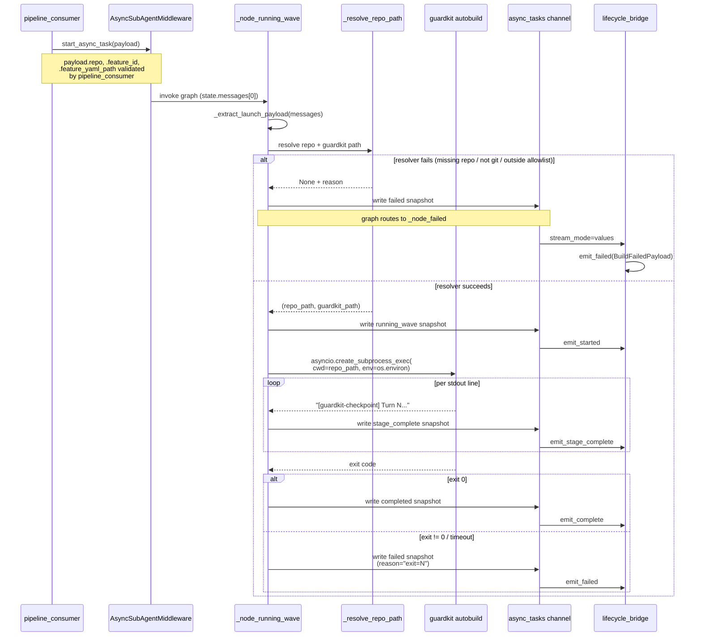
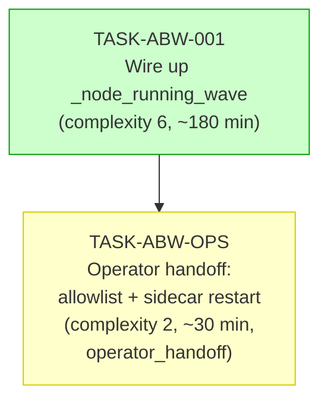

# IMPLEMENTATION-GUIDE — autobuild-runner-wireup

**Feature ID**: FEAT-ABW1
**Source plan**: [`docs/research/ideas/autobuild-runner-wireup-plan.md`](../../../docs/research/ideas/autobuild-runner-wireup-plan.md)
**Demo target**: FEAT-9E59 in `~/Projects/appmilla_github/api_test` (DDDSW 2026-05-16)

This guide closes the stub introduced by FOLLOWUP-B-FIX in
[`src/forge/subagents/autobuild_runner.py:982-1030`](../../../src/forge/subagents/autobuild_runner.py#L982-L1030)
by wiring `_node_running_wave` to invoke `guardkit autobuild feature` as
an async subprocess and mapping its exit code to the terminal lifecycle.

## §1: Data flow — read/write paths

```mermaid
flowchart LR
    subgraph Writes["Write paths (post-wireup)"]
        W1["pipeline_consumer.dispatch<br/>(NATS dequeue)"]
        W2["AsyncSubAgentMiddleware<br/>.start_async_task"]
        W3["_node_running_wave<br/>(subprocess invoker)"]
        W4["guardkit autobuild feature<br/>--fresh --verbose"]
        W5["_node_completed / _node_failed<br/>(terminal snapshot writer)"]
    end

    subgraph Storage["State / artefacts"]
        S1[("async_tasks[feature_id]<br/>(LangGraph channel)")]
        S2[("autobuild/&lt;feature_id&gt; branch<br/>(target repo worktree)")]
        S3[("subprocess stdout<br/>(streamed line-by-line)")]
    end

    subgraph Reads["Read paths (existing)"]
        R1["lifecycle_bridge translator<br/>._extract_state"]
        R2["PipelineLifecycleEmitter<br/>.emit_started/_stage_complete/<br/>_complete/_failed"]
        R3["pipeline_publisher<br/>(NATS publish)"]
        R4["SSE bridge<br/>(operator visibility)"]
    end

    W1 -->|"launch payload"| W2
    W2 -->|"thread launch desc"| W3
    W3 -->|"running_wave snapshot"| S1
    W3 -->|"asyncio.create_subprocess_exec"| W4
    W4 -->|"writes code + commits"| S2
    W4 -->|"checkpoint lines"| S3
    S3 -->|"stage_complete snapshot per line"| S1
    W4 -->|"exit code → completed | failed"| W5
    W5 -->|"terminal snapshot"| S1

    S1 -->|"stream_mode=values"| R1
    R1 -->|"BuildStartedPayload /<br/>BuildStageCompletePayload /<br/>BuildCompletePayload /<br/>BuildFailedPayload"| R2
    R2 -->|"async publish"| R3
    R3 -->|"pipeline.build-*.FEAT-XXX"| R4

    style W3 fill:#fc6,stroke:#c80
    style W4 fill:#fc6,stroke:#c80
    style W5 fill:#fc6,stroke:#c80
```



_Yellow nodes are new or modified by TASK-ABW-001. All read paths are
pre-existing — the bridge translator already maps `failed` → `emit_failed`
([translation.py:459](../../../src/forge/lifecycle_bridge/translation.py#L459))
and `AutobuildLifecycle` already includes `"failed"` in `LIFECYCLE_VALUES`.
No new read path is introduced, and every write path connects to a read
path: **no disconnection alert**._

## §2: Integration contract — subprocess invocation sequence



_The state channel is the single integration point. No data is fetched
and discarded — every snapshot written to `async_tasks[feature_id]` flows
through the existing bridge translator to a `PipelineLifecycleEmitter`
method call._

## §3: Task dependency graph



_TASK-ABW-001 is the code change and must merge before TASK-ABW-OPS runs.
TASK-ABW-OPS is `operator_handoff` — AutoBuild will skip it; the operator
ticks off its acceptance criteria post-merge via `/task-complete`._

## §4: Integration contracts

Cross-task data dependencies exist between TASK-ABW-001 (the code) and
TASK-ABW-OPS (the operator runtime), but they flow through host
filesystem and process state rather than producer→consumer artefacts.
There are no in-repo cross-task config files to specify. The implicit
contracts are:

### Contract: `forge.yaml` allowlist coverage

- **Producer task**: TASK-ABW-OPS (operator edits
  `~/forge-state/forge.yaml`).
- **Consumer task**: TASK-ABW-001's `_resolve_repo_path` (calls
  `_path_inside_allowlist`).
- **Artefact type**: host configuration file.
- **Format constraint**: each allowlist entry must be an absolute path
  (no `~` expansion at load time) and must include the demo repo
  checkout (`~/Projects/appmilla_github/api_test` fully expanded).
- **Validation method**: at runtime, `_resolve_repo_path` returns
  `None` and the runner transitions to `failed` if the resolved repo
  is outside the allowlist. Operator confirms via the rehearsal in
  AC-OPS-05.

### Contract: `guardkit` executable on `$PATH`

- **Producer task**: TASK-ABW-OPS (operator confirms guardkit
  installed on GB10 sidecar host).
- **Consumer task**: TASK-ABW-001's path resolution (`shutil.which`
  or `FORGE_GUARDKIT_PATH`).
- **Artefact type**: host installation.
- **Format constraint**: executable file resolvable by `shutil.which`
  inside the sidecar's PATH, **or** absolute path supplied via
  `FORGE_GUARDKIT_PATH` env var on the sidecar process.
- **Validation method**: TASK-ABW-001's resolver returns `None` with
  a logged reason if neither resolves; the integration test mocks
  this surface so unit-level CI does not depend on a real guardkit
  install.

## §5: Execution strategy

Wave 1 (code):
- TASK-ABW-001 — single task, no parallel siblings.

Wave 2 (operator):
- TASK-ABW-OPS — `operator_handoff`, runs manually after merge.

Conductor is **not** recommended — Wave 1 is single-task and Wave 2 is
operator-driven.

## §6: Sidecar restart reminder

Per the multi-specialist runbook §2.0, `langgraph dev` is launched with
`--no-reload`, so edits to `autobuild_runner.py` are not picked up by a
running sidecar. Every Player-Coach turn that touches this file must
finish with the standard restart sequence:

```bash
pkill -f "langgraph dev"
rm -rf .langgraph_api/
# re-launch via the standard sidecar command
```

This applies during TASK-ABW-001 development as well as the post-merge
production restart owned by TASK-ABW-OPS (AC-OPS-03).

## §7: Verification path

Post-merge, before declaring the DDDSW demo go/no-go:

1. **Unit / integration** (TASK-ABW-001 acceptance):
   - `pytest tests/integration/test_autobuild_runner_subprocess.py -v`
   - All modified files pass lint.

2. **Operational** (TASK-ABW-OPS acceptance):
   - Allowlist updated on GB10 (AC-OPS-01).
   - forge-prod restarted, allowlist confirmed (AC-OPS-02).
   - Sidecar restarted post-merge (AC-OPS-03).
   - Runbook updated (AC-OPS-04).
   - FEAT-9E59 end-to-end rehearsal (AC-OPS-05).

3. **Demo go/no-go** (2026-05-15 dress rehearsal):
   - Re-run AC-OPS-05 against a fresh `ddd-demo` branch checkout. Any
     failure here blocks the 2026-05-16 demo.
