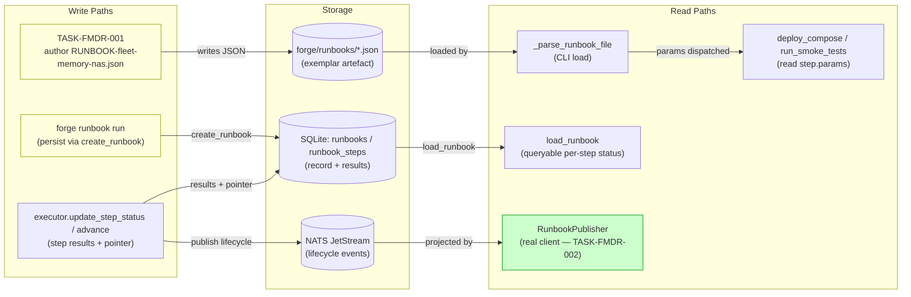
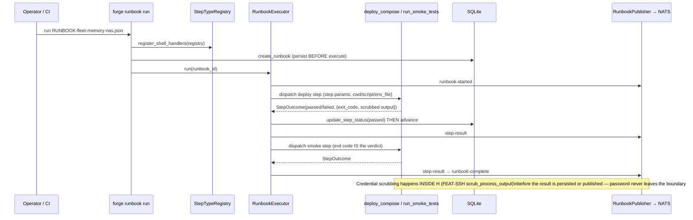
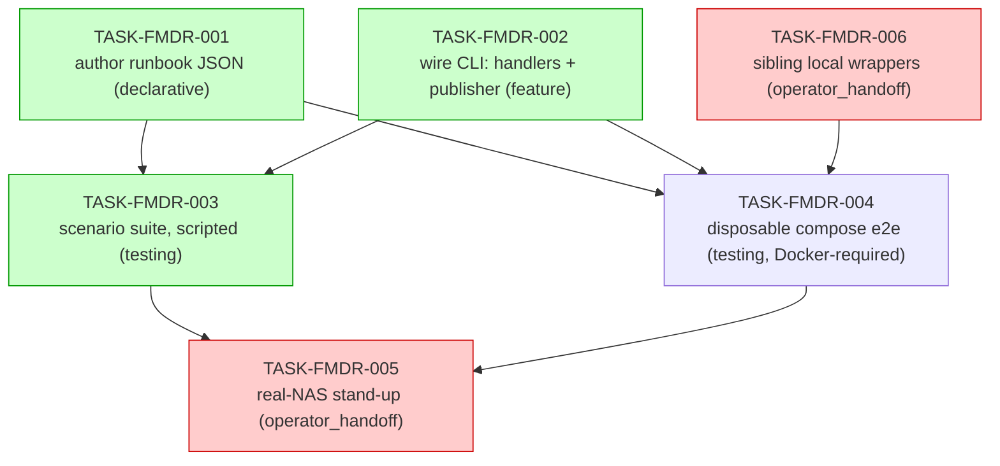

# IMPLEMENTATION-GUIDE — Fleet-memory Deploy Runbook (FEAT-FMDR / FORGE-OL-04)

The payoff feature of the output-side-loop exemplar. A hand-authored, typed two-step
runbook (`deploy_compose` then `run_smoke_tests`) is persisted via the runbook model and
executed through `forge runbook run`. Running it stands fleet-memory (Postgres + pgvector)
up and verifies it with the existing smoke script (gates G3–G5). The runbook JSON becomes
the first harvested exemplar; an automated e2e proves deploy → smoke → complete against a
disposable compose target, and the same executor then stands fleet-memory up on the real
NAS — closing TASK-MEM-008 and ticking FEAT-MEM-01's NAS acceptance criterion.

**Upstream-owned (NOT re-specified here):** the runbook data model, the executor dispatch
loop, resume pointer, claim-lease crash recovery, and lifecycle events (Runbook
Persistence, Runbook Executor, FEAT-SSH). FEAT-SSH is **merged on `main`**:
`register_shell_handlers`, `deploy_compose`, `run_smoke_tests` live in
`src/forge/executor/shell_steps.py`.

---

## §1 Data Flow: Read/Write Paths

_What to look for:_ every write path has a corresponding read path. The previously
**disconnected** read — `RunbookPublisher` fed by a `_NoOpNATSClient` — is **wired** by
TASK-FMDR-002 (green). No orphaned write paths remain.

**Disconnection Alert:** none. The one historically dangling path (events published to a
no-op client, never reaching JetStream) is the explicit subject of TASK-FMDR-002.

---

## §2 Integration Contracts (sequence)

_What to look for:_ persist-before-execute ordering; result-before-advance ordering; and
that the scrubbed `captured_output` is the only thing that crosses from the handler into
storage/events.

---

## §3 Task Dependency Graph

_Green = parallel-safe automated tasks. Red = operator_handoff (AutoBuild skips)._

### Execution waves

- **Wave 1:** TASK-FMDR-001, TASK-FMDR-002 (parallel automated — runbook JSON vs
  `cli/runbook.py`) + **TASK-FMDR-006** (operator_handoff; sibling-repo wrappers the
  operator must land before Wave 2).
- **Wave 2 (parallel):** TASK-FMDR-003, TASK-FMDR-004 — independent test modules; both
  depend on Wave 1, and 004 additionally depends on 006's wrappers + a running Docker
  daemon.
- **Wave 3:** TASK-FMDR-005 — operator_handoff; AutoBuild skips it.

> **Sequencing note:** TASK-FMDR-006 is operator_handoff but gates the automated
> TASK-FMDR-004. The operator must commit the sibling wrappers (or pre-commit them in the
> working tree) before `/feature-build` reaches Wave 2, else 004 fails fast pointing at 006.

---

## §4 Integration Contracts

### Contract: RUNBOOK_STEP_PARAMS
- **Producer task:** TASK-FMDR-001 (the runbook JSON artefact)
- **Consumer task(s):** TASK-FMDR-002 (CLI wiring/dispatch), TASK-FMDR-003, TASK-FMDR-004
- **Artifact type:** JSON `step.params` object, consumed by the FEAT-SSH handlers
- **Format constraint:** each step's `params` MUST provide `cwd` (deploy directory),
  `script` (`deploy.sh` / `smoke.sh`), and `env_file` (`.env.deploy`). The handlers read
  `step.params["cwd"]`, `step.params["script"]`, `step.params.get("env_file")` and pass
  `env_file` to the script via the `ENV_FILE` environment variable — **the file's contents
  are never read by Forge**. `env_file` is a path string only; it must not contain a
  password or a `://` connection string.
- **⚠️ Real binding is `cwd`, not `env_file`.** The fleet-memory `deploy.sh`/`smoke.sh`
  **ignore the `ENV_FILE` variable** and hardcode `source .env.deploy` relative to their
  working directory. So the operative requirement is: **`.env.deploy` must physically exist
  in the step's `cwd`** (`fleet-memory/deploy/nas/` on the GB10 for the NAS run;
  `fleet-memory/deploy/local/` for the disposable run). A correct `env_file` param with the
  file missing from `cwd` still fails pre-flight (`ERROR: .env.deploy not found`). Keep
  `env_file` set to `.env.deploy` for honesty/portability, but treat the cwd-placement as
  the contract that actually gates the run.
- **Validation method:** the seam test in TASK-FMDR-002 loads the exemplar and asserts
  `{cwd, script, env_file} ⊆ params.keys()` for every step, and that `env_file` carries no
  secret. The operator pre-flight in TASK-FMDR-005 verifies `.env.deploy` is present in the
  `cwd` directory on the GB10. Coach confirms the keys match the handler reads in
  `shell_steps.py`.

### Contract: DEPLOY_ENV_FILE (.env.deploy)
- **Producer:** operator (filled from `.env.deploy.example` on the executing host)
- **Consumer task(s):** TASK-FMDR-004 (disposable target), TASK-FMDR-005 (real NAS)
- **Artifact type:** environment file (path referenced by the runbook; provisioned out of
  band)
- **Format constraint:** the NAS `.env.deploy` holds `NAS_HOST`, `NAS_USER`,
  `NAS_SSH_PORT`, `NAS_DOCKER_ROOT`, `FLEET_MEMORY_PG_PASSWORD`; must be gitignored
  (`git check-ignore` returns the path). The disposable and NAS runbooks differ **only** in
  `cwd` + `env_file`; the typed step sequence and script basenames are identical (D3).
- **Validation method:** missing-file path is asserted by TASK-FMDR-003 (C4); presence +
  gitignore is an operator pre-flight check in TASK-FMDR-005.

### Contract: LOCAL_DEPLOY_WRAPPERS (deploy/local/{deploy.sh,smoke.sh})
- **Producer task:** TASK-FMDR-006 (coordinated fleet-memory change — sibling repo)
- **Consumer task:** TASK-FMDR-004 (disposable-compose e2e)
- **Artifact type:** executable shell scripts in the sibling `fleet-memory` repo
- **Format constraint:** same basenames (`deploy.sh`, `smoke.sh`) and same step-contract as
  the NAS scripts, but driving **local** `docker compose` instead of SSH. `deploy.sh` →
  `docker compose up -d --wait` (G2); `smoke.sh` → local analogues of G3 (pg_isready +
  pgvector), G4 (local DSN connect), G5 (pgdata volume present); exit non-zero on any
  failure. This is what makes the runbook's typed steps reusable across both targets (D3).
- **Validation method:** TASK-FMDR-004 fails fast with a pointer to TASK-FMDR-006 if the
  wrappers are absent; otherwise the green e2e exercises them end-to-end.

> **Finding (2026-06-22, during the Docker check):** the NAS `deploy.sh`/`smoke.sh` are
> hard-wired to SSH+rsync against the NAS and have **no local mode**, and `deploy/local/`
> shipped only a `docker-compose.yml` (no wrappers). TASK-FMDR-006 closes that gap so the
> disposable e2e can dispatch the same typed steps locally. Docker Desktop is installed on
> the build host but the daemon must be **running** for TASK-FMDR-004.

---

## Smoke gates (verdict source — ASSUM-006)

`smoke.sh` exit 0 is the green verdict, asserting:
- **G3** — Postgres ready with pgvector available
- **G4** — network / LAN-Tailscale path reachable
- **G5** — data on a backed-up volume

## Notes

- **No feature-level `smoke_gates:` block** is added to the YAML: the feature's own smoke
  verification *is* the `run_smoke_tests` step inside the runbook, and Wave 2's tests gate
  the build. A between-waves smoke gate would be redundant here.
- Credential scoping is enforced inside FEAT-SSH's `scrub_process_output`; this feature
  asserts the boundary holds (C3) but does not re-implement scrubbing.
