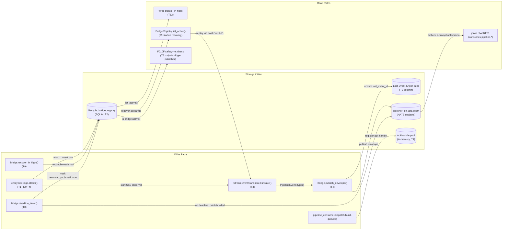
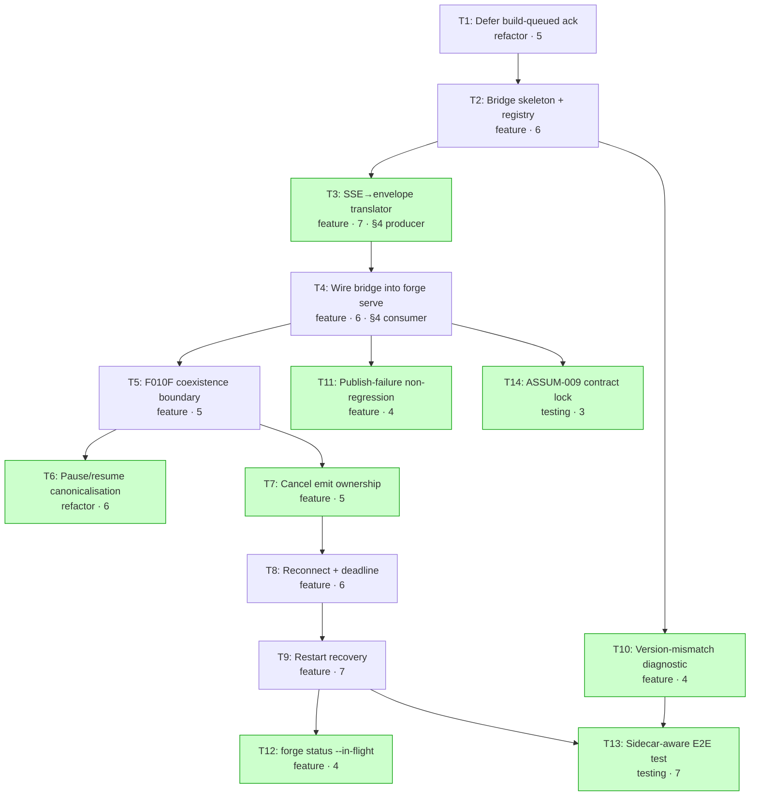

# Implementation Guide — Forge Autobuild-Runner Pipeline-Emitter Bridge

**Feature ID**: FEAT-PEBR
**Parent task**: TASK-FORGE-FRR-F010M
**Parent review**: TASK-REV-F010M
**Stack**: python
**Approach**: Option C (Streaming via `runs.join_stream` with `Last-Event-ID`); Option E (Hybrid) named fallback
**Tasks**: 14 across 5 waves
**Aggregate complexity**: ~75 (mean ~5.4 / task)

---

## §1: Goal

Wire the autobuild_runner sidecar lifecycle bridge into `forge serve` so
every state transition the autobuild reaches inside the langgraph-runner
sidecar (success, async failure, pause, resume, cancel) produces a
wire-visible `pipeline.*` envelope on JetStream. Closes the F010J → F010M
wire gap captured in RESULTS Addendum 5 (correlation_id
`e9433033-ea80-449f-885d-b2d1bdfb839e`).

---

## §2: Data Flow — Read/Write Paths



_Every write path has a corresponding read path. No disconnections._

**Read/write integrity**:
- `pipeline.*` envelopes (S3) are read by jarvis (R2) — that's the
  whole point of this feature.
- `lifecycle_bridge_registry` (S1) is read by `forge status --in-flight`
  (T12), startup recovery (T9), and F010F coexistence checks (T5).
- `Last-Event-ID per build` (S2) is read by the SSE observer task on
  recovery and steady-state.
- `AckHandle pool` (S4) is read by the bridge's terminal-observation
  path to invoke `ack()`.

---

## §3: Integration Contract Diagram (sequence)

```mermaid
sequenceDiagram
    participant Op as Operator (jarvis)
    participant NATS as JetStream PIPELINE
    participant Cons as pipeline_consumer<br/>(T1)
    participant Br as LifecycleBridge<br/>(T2/T4)
    participant Tr as StreamEventTranslator<br/>(T3)
    participant Side as langgraph-runner sidecar
    participant Pub as nats.publisher

    Op->>NATS: publish build-queued
    NATS->>Cons: deliver build-queued
    Cons->>Br: attach(build_context, ack_handle)
    Note over Cons: ack DEFERRED (T1) — not sent here
    Br->>Side: client.runs.join_stream(thread_id, run_id, last_event_id=...)

    loop while running
        Side->>Br: SSE: StreamPart(event=...)
        Br->>Tr: translate(stream_part, build_context)
        Tr-->>Br: PipelineEvent (typed, with correlation_id)
        Br->>Pub: publish(envelope)
        Pub->>NATS: publish pipeline.{stage,build}-*
        Br->>Br: persist last_event_id (T9 idempotency set)
    end

    Side->>Br: SSE: terminal event (success | error | interrupted)
    Br->>Tr: translate(terminal_part, build_context)
    Tr-->>Br: BuildCompletePayload | BuildFailedPayload | BuildCancelledPayload
    Br->>Pub: publish(terminal_envelope)
    Pub->>NATS: publish pipeline.build-{complete,failed,cancelled}
    Br->>Cons: ack_handle.ack()
    Note over Br: terminal_published=true; row deleted (T2/T11)
    NATS->>Op: terminal envelope (chat REPL render)
```

_The bridge is the only translation path. F010F's sync-raise safety net
(T5) is a parallel branch — it only fires when `dispatch_build` raises
synchronously, before `attach()` is called._

---

## §4: Integration Contracts

### Contract: STREAM_EVENT_SCHEMA

- **Producer task**: TASK-FRR-PEB-003 (SSE → typed envelope translation
  layer)
- **Consumer task(s)**: TASK-FRR-PEB-004 (Wire bridge into forge serve);
  TASK-FRR-PEB-006 (pause/resume — extends translator); TASK-FRR-PEB-007
  (cancel — extends translator); TASK-FRR-PEB-008 (deadline — uses
  failed payload shape); TASK-FRR-PEB-011 (publish-failure — reads
  `failure_reason` field)
- **Artifact type**: typed Python object (`PipelineEvent` union)
- **Format constraint**:
  - The translator's `translate(stream_part, build_context)` method
    returns one of `BuildStartedPayload`, `StageCompletePayload`,
    `BuildCompletePayload`, `BuildFailedPayload`, `BuildPausedPayload`,
    `BuildResumedPayload`, `BuildCancelledPayload` — all Pydantic v1
    models from `forge.pipeline.payloads`.
  - `correlation_id: str` field is **always populated** (sourced from
    `BuildContext.correlation_id`, never from the SSE event itself —
    this is the F010C contract under Option C, locked by T14).
  - Returns `None` for unknown event types (no exception).
  - Raises `MissingCorrelationIdError` if `BuildContext.correlation_id`
    is falsy (defensive, not expected to fire in production).
- **Validation method**:
  - T4 ships a **seam test** (`test_wireup_seam.py`) that imports the
    translator, feeds it a fixture from
    `tests/forge/lifecycle_bridge/fixtures/sse_stream_canonical.jsonl`,
    and asserts the returned `PipelineEvent` is a valid Pydantic
    instance with non-empty `correlation_id`.
  - T3 ships a **contract test** (`test_translation_contract.py`) that
    round-trips the canonical fixture through both success and failure
    paths.
  - The fixture is the **single source of truth** for both producer
    and consumer; bumps to `langgraph-sdk` upper bound require
    re-recording the fixture.

⚠️ **Fallback note**: if the SSE event shape proves insufficient during
T3 implementation (silent schema drift across `langgraph-api` minor
versions), Option E (Hybrid) is the named fallback per the scoping doc
§Recommended option. Pivot decision must be made **no later than the
Wave 2 smoke-gate failure** — do not pivot mid-implementation.

---

## §5: Task Dependency Graph



_Tasks with green background can run in parallel within their wave._

---

## §6: Wave-Plan and Smoke Gates

| Wave | Tasks | Smoke gate after wave | Notes |
|---|---|---|---|
| 1 | T1, T2 | none (foundation) | T1 must land first; T2 builds on T1's `BuildAckHandle`. |
| 2 | T3 → T4, T5 | **@smoke after Wave 2** (`pytest tests/bdd -m smoke -x`) | T3 producers, T4 consumes; T5 parallel after T4. The 2 @smoke scenarios are the headline F010M behaviour. |
| 3 | T6, T7 | @smoke continues green | Both extend T3's translator; serialise if file conflict, otherwise parallel. |
| 4 | T8, T9, T10, T11 | @smoke continues green | T10 is independent (depends only on T2); T11 is independent of T8/T9; T8→T9 sequential. |
| 5 | T12, T13, T14 | full @smoke + @regression | T13 is the canonical regression lock once landed. |

**Smoke gate command** (verified path against forge `tests/bdd/`):

```bash
pytest tests/bdd -m smoke -x
```

This invokes the 2 @smoke scenarios from
`features/forge-autobuild-runner-pipeline-emitter-bridge.feature` plus any
other smoke-tagged scenarios already in the suite. No new test directory
is created; the BDD-linker (Step 11) tags the scenarios so pytest-bdd's
existing fixtures discover them.

---

## §7: Cross-Cutting Concerns

1. **F010F coexistence (T5)** — sync-raise safety net stays unchanged;
   bridge handles async-terminal only. `terminal_published` flag on
   the registry coordinates the two paths.
2. **FW10-010 amendment (T6)** — `approval_subscriber.py`'s resume emit
   is **dropped** when the bridge is wired. FW10-010 folds into F010M's
   wave-plan; FW10-010's tests are amended (not deleted) to cover both
   bridge-wired and bridge-absent paths.
3. **SDK volatility mitigation (T3+T10+T13)** — four-way: `pyproject.toml`
   upper bounds (T3), translation contract test (T3), version-mismatch
   diagnostic (T10), sidecar-aware E2E (T13).
4. **Restart recovery (T9)** — `Last-Event-ID` replay (ASSUM-001) +
   `runs.get` recovery sweep (ASSUM-002). Idempotent via
   `published_lifecycles` set on the registry row.
5. **Operator UX (T12 + 300s deadline in T8)** — `forge status --in-flight`
   gives the operator a "where's my build?" surface; the 300s
   per-build SLA timer ensures a sidecar-unreachable build surfaces
   as `build-failed` within an operator-tolerable window.
6. **F010C correlation-id contract** — the AST guard fixture in
   `tests/forge/test_pipeline_consumer_correlation_id.py` is extended
   in T2/T4 to cover new bridge call sites; T14 locks the
   `BuildContext`-source-of-truth invariant in the translator.

---

## §8: Verifications Carried Forward

These two verifications were performed during /feature-plan and are
**committed inputs** to the wave-plan. Do not re-debate downstream.

### ASSUM-003 — Backoff numbers (T8)

```python
RECONNECT_INITIAL_BACKOFF: float = 1.0   # seconds
RECONNECT_MAX_BACKOFF: float = 30.0      # seconds
# Exponential ×2, reset on success, NO fixed retry maximum.
PER_BUILD_DEADLINE_SECONDS: int = 300    # 5 min — review's concrete commitment
```

Sourced from `src/forge/cli/_serve_daemon.py:90-93,447,468`. Tests
monkey-patch to 0.05s per existing precedent
(`tests/forge/test_cli_serve_daemon.py:364-367`).

### ASSUM-009 — Cross-process correlation-id (T14)

Under Option C, ASSUM-009's BDD scenario is a **no-op contract lock**
test. The translator (T3) sources `correlation_id` from
`BuildContext.correlation_id` only — never from the SSE event payload.
F010C's existing AST guard
(`tests/forge/test_pipeline_consumer_correlation_id.py:338-393`) extends
to cover the new bridge call sites.

If a future review flips the option to D/E, T14 must be upgraded to a
real cross-process validator that rejects in-receive emits whose
correlation-id does not match the registered build (per scoping doc
§Cross-cutting #4 line 797–799).

---

## §9: Acceptance for Feature-Level Closure

Feature is closed when:

- ✅ All 14 tasks completed via `/task-complete`.
- ✅ The 2 @smoke scenarios pass after Wave 2 and continue green
  through Waves 3–5.
- ✅ All 14 @regression scenarios pass at end of Wave 5.
- ✅ TASK-FORGE-FRR-F010M (parent scoping deliverable) marked complete
  per its AC-6/AC-7.
- ✅ TASK-FW10-010 marked amended (resume emit dropped) — coordinate
  with parent feature owner.
- ✅ FW10-011 unchanged and still passing (in-process composition lock
  preserved).
- ✅ A new sidecar-aware E2E test file exists at
  `tests/integration/test_lifecycle_bridge_sidecar_e2e.py` and passes
  deterministically across 5 consecutive runs.
