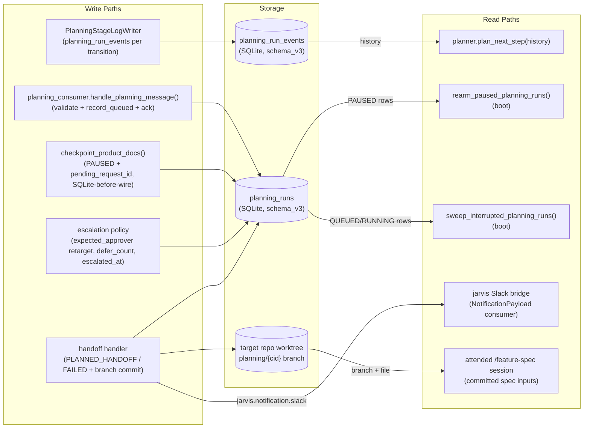
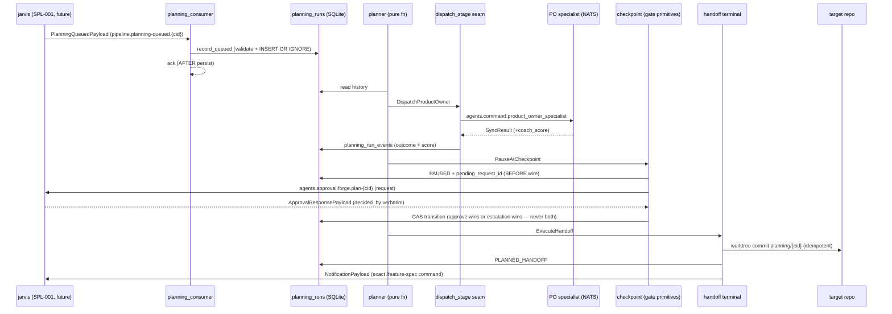
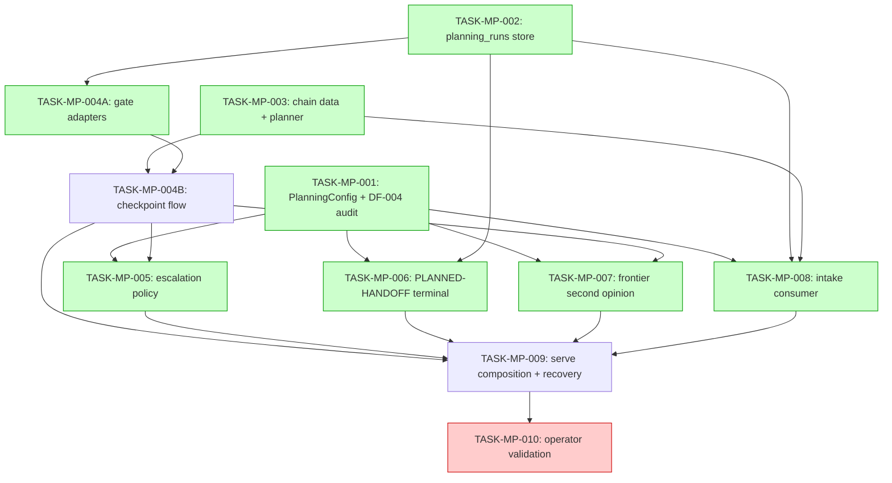

# Implementation Guide — Mode P Planning Chain (FEAT-SPL-002)

**Source spec**: `features/mode-p-planning-chain/` (33 scenarios, 16 assumptions — 7 panel-amended, all deferred for Rich)
**Decision review**: TASK-REV-83E4 (`.claude/reviews/TASK-REV-83E4-review-report.md`) — 3-agent panel, unanimous architecture
**Approach**: standalone planning subsystem in `src/forge/planning/` — additive-only; zero edits to builds machinery, Mode B logic, `ApprovalConfig`, or `src/forge/adapters/guardkit/run.py`

## Architecture in one paragraph

A second durable consumer (`forge-serve-planning`, filter
`pipeline.planning-queued.*`, non-overlapping with build intake on the PIPELINE
workqueue stream) validates the frozen `PlanningQueuedPayload` plus the
correlation-id trust boundary, records a `planning_runs` row (new additive
schema_v3 tables; PK = correlation_id; ack-on-persist), and hands to a
pure-function planner. The planner dispatches PRODUCT_OWNER through the first
production composition of the specialist-dispatch stack (behind one injectable
callable), then pauses at the `product_docs` checkpoint built from the D659 gate
primitives (`derive_request_id`, atomic pause-and-publish, per-run
ApprovalSubscriber pinned to the row's durable `expected_approver`). Escalation
re-targets the approver durably (originator → escalation approver → TIMED_OUT;
defer cap 3; injected clock over durable wall-clock anchors; never auto-approve).
Approval fires the registry-indirected PLANNED-HANDOFF terminal: idempotent
worktree commit of `feature_spec_inputs/{cid}.md` on `planning/{cid}`, then a
sanitised NotificationPayload to `jarvis.notification.slack` carrying the exact
attended `/feature-spec` command. Boot recovery = rearm of PAUSED runs (single
re-emit owner) + sweep of interrupted QUEUED/RUNNING runs.

## Data Flow: Read/Write Paths

*What to look for: every write path has a reader. The two boot readers (R2/R3) are
the compensating twin of ack-on-persist — without them, interrupted runs would be
orphaned (RT-05). No disconnected paths.*

**Disconnection check**: none. (The jarvis-side RENDERING of planning approval
requests is FEAT-SPL-001/003 territory — recorded as a cross-repo dependency, not
a forge read path; the AGENTS approval request itself reuses the existing jarvis
ApprovalRequestsSubscriber surface.)

## Integration Contracts (sequence)

*What to look for: no fetch-then-discard — the coach score lands in
planning_run_events; the approval response's decided_by is compared against the
ROW's expected_approver, not config.*

## Task Dependencies

_Green tasks run in parallel within their wave. Red = operator_handoff (AutoBuild skips)._

## Waves

| Wave | Tasks | Notes |
|------|-------|-------|
| 1 | MP-001, MP-002, MP-003 | zero mutual deps; three module clusters |
| 2 | MP-004A, MP-006, MP-008 | no shared files (gate_adapters vs terminal/handoff vs nats consumer) |
| 3 | MP-004B | checkpoint flow (consumes 004A adapters + 003 planner labels) |
| 4 | MP-005, MP-007 | escalation edits checkpoint.py wait loop; frontier is module-only — no overlap |
| 5 | MP-009 | serve composition + recovery (integration) |
| 6 | MP-010 | operator_handoff — live GB10 validation; gated on TASK-FWD-004 |

## §4: Integration Contracts

### Contract: SqlitePlanningRunStore (CAS transitions + DuplicateRun sentinel)
- **Producer task:** TASK-MP-002
- **Consumer task(s):** TASK-MP-004A, TASK-MP-005, TASK-MP-006, TASK-MP-008, TASK-MP-009
- **Artifact type:** Python class (`src/forge/planning/run_store.py`)
- **Format constraint:** transitions are CAS (`UPDATE … WHERE state=?`; affected-rows 1=win / 0=refused-sentinel, never raise); `record_queued` idempotent on correlation_id returning `DuplicateRun` that distinguishes terminal vs non-terminal
- **Validation method:** Coach verifies MP-002's race test exists and later tasks import the store rather than issuing raw SQL

### Contract: gate protocol adapters
- **Producer task:** TASK-MP-004A
- **Consumer task(s):** TASK-MP-004B, TASK-MP-009
- **Artifact type:** Python classes structurally satisfying `gating/wrappers.py` GateRepository/StateMachine Protocols
- **Format constraint:** run ids namespaced `plan-{correlation_id}`; `list_paused_runs()` snapshots carry (cid, expected_approver, pending_request_id, paused_at, escalated_at)
- **Validation method:** Coach verifies the Protocol-satisfaction test and that MP-009's rearm consumes `list_paused_runs()`

### Contract: SecondOpinionProvider Protocol
- **Producer task:** TASK-MP-004B (defines) · **Consumer:** TASK-MP-007 (implements), TASK-MP-009 (injects)
- **Artifact type:** Python Protocol in `src/forge/planning/checkpoint.py`
- **Format constraint:** provider returns opinion DATA only — the return type has no approve/decision field (DF-009 never-auto-approve, type-level)
- **Validation method:** Coach checks MP-007's type-level predicate test

### Contract: dispatch_stage callable seam
- **Producer task:** TASK-MP-009 (production composition) · **Consumers:** planner flow (built in MP-003/004B, tested with fakes)
- **Artifact type:** injected async callable `(stage, run_id, correlation_id, request_text) -> StageDispatchResult`
- **Format constraint:** outcome mapping Degraded→FLAG_FOR_REVIEW, transport exception→run FAILED, AsyncPending→ERROR; coach_score recorded when present
- **Validation method:** Coach verifies MP-009 composes DispatchOrchestrator/NatsSpecialistDispatchAdapter and the fake-seam tests in earlier tasks use the same signature

### Contract: planning notification payloads
- **Producer task:** TASK-MP-006 (`notifications.py`) · **Consumers:** TASK-MP-008 (terminal-duplicate notice), TASK-MP-009 (wiring)
- **Artifact type:** NotificationPayload (frozen nats-core 0.5.0) on `jarvis.notification.slack`
- **Format constraint:** built ONLY from validated components (repo, path, correlation_id); raw request_text never interpolated; handoff notice carries the exact `/feature-spec …` command string
- **Validation method:** Coach checks MP-006's injection-guard test; MP-008 imports the builder

## Hard-constraint compliance map

DF-009 never-auto-approve: MP-004B AC-3/AC-4, MP-005 AC-3, MP-007 AC-5 ·
DF-004: MP-001 AC-3, MP-009 AC-6 · DF-006: MP-007 all ACs ·
DF-001: frontier default-off + audit · Guardkit seam: no task touches
`adapters/guardkit/run.py` · ApprovalConfig closed: MP-001 AC-2 ·
Mode B untouched: MP-003 AC-4 (byte-identical predicate) ·
Wire contract frozen: MP-008 imports `PlanningQueuedPayload` from `nats_core.events`,
never redefines it · All runtime observation quarantined in MP-010 (operator_handoff).

## Test discipline (all tasks)

Offline only: fakes for NATS/Slack/frontier/git (recording fakes + tmp_path SQLite
+ tmp_path git repos); injected clocks — no sleeps; pattern sources named per task.
The live GB10 / jarvis / kill-NATS checks live exclusively in TASK-MP-010.
