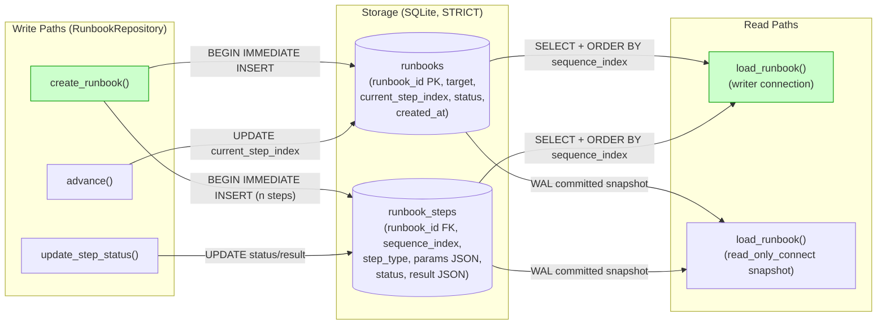
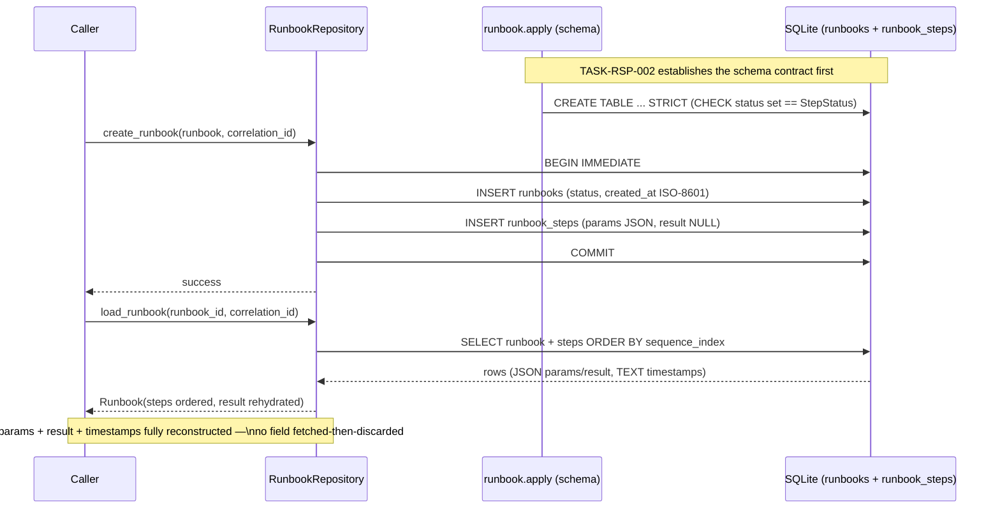
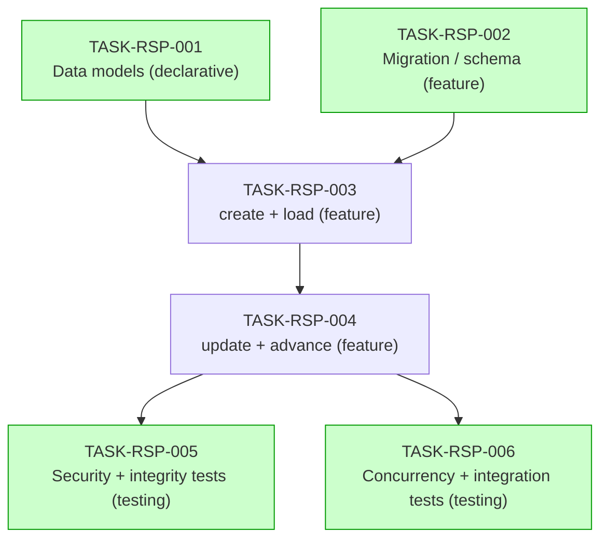

# Implementation Guide — Runbook and Step Persistence (FEAT-RSP)

**Source spec:** `features/runbook-and-step-persistence/runbook-and-step-persistence_summary.md`
**Review:** `TASK-REV-RSP-001`
**Approach:** Option 1 — sibling SQLite tables + repository mirroring
`forge.persistence.repositories.bridge_registry.BridgeRegistry`.
**Scope guard:** data model + persistence + repository only. NO executor,
NO NATS, NO subprocess, NO LLM. Gates are data-only this phase.

---

## Data Flow: Read/Write Paths

**What to look for:** every write path has a corresponding read path, and
every read reaches both tables. **No disconnected paths** — `create`/`update`/
`advance` all flow into storage, and both `load_runbook` entry points
(writer + read-only snapshot) read every column written. ✅

**Disconnection Alert:** _None._ All write paths are read back; the
`awaiting_approval` status is written by `update_step_status` and read by
`load_runbook` even though nothing **acts** on it this phase (gates-as-data
is intentional, not a disconnection).

---

## Integration Contracts (sequence)

_Feature complexity = 6 (≥ 5), so the integration-contract sequence is
mandatory. It traces the create→load round-trip across the migration
schema boundary — the place "fetch then discard" bugs hide._

**What to look for:** the loaded `Runbook` reconstructs **every** stored
field (params, result, timestamps, pointer, overall status). If any column
were selected but dropped during rehydration, that is the fetch-then-discard
anti-pattern — the round-trip ACs in TASK-RSP-003/004 guard against it.

---

## Task Dependencies

_Green tasks can run in parallel within their wave._

### Execution strategy (4 waves)

| Wave | Tasks | Parallel? | File ownership (no intra-wave conflict) |
|------|-------|-----------|------------------------------------------|
| 1 | TASK-RSP-001, TASK-RSP-002 | ⚡ yes | `runbook_models.py` + `repositories/__init__.py` vs `migrations/runbook.py` + `migrations/__init__.py` |
| 2 | TASK-RSP-003 | — | `repositories/runbook.py`, `test_runbook.py` |
| 3 | TASK-RSP-004 | — | extends `repositories/runbook.py`, `test_runbook.py` (same file as wave 2 → sequential) |
| 4 | TASK-RSP-005, TASK-RSP-006 | ⚡ yes | `test_runbook_security.py` vs `test_runbook_concurrency.py` |

`recommended_parallel: 2`.

---

## §4: Integration Contracts

Cross-task data dependencies exist (the migration's schema is consumed by
the repository; the model's status vocabulary is consumed by the migration's
`CHECK` set), so this section is mandatory.

### Contract: `runbooks_schema`

- **Producer task:** TASK-RSP-002 (runbook store migration)
- **Consumer task(s):** TASK-RSP-003, TASK-RSP-004 (repository SQL)
- **Artifact type:** SQLite table schema (`runbooks` + `runbook_steps`)
- **Format constraint:**
  - Both tables are **STRICT**.
  - `runbooks(runbook_id TEXT PRIMARY KEY, target TEXT NOT NULL,
    current_step_index INTEGER NOT NULL, status TEXT NOT NULL CHECK(...),
    created_at TEXT NOT NULL)`.
  - `runbook_steps(runbook_id TEXT REFERENCES runbooks(runbook_id) ON DELETE
    CASCADE, sequence_index INTEGER, step_type TEXT NOT NULL, params TEXT
    DEFAULT '{}', status TEXT CHECK(...), result TEXT NULL,
    PRIMARY KEY(runbook_id, sequence_index))`.
  - `params` and `result` are **JSON-encoded TEXT**; `result` is `NULL`
    until recorded.
  - Timestamps are **ISO-8601 TEXT** (`datetime.isoformat()`).
  - Steps are ordered **by `sequence_index`**, never by insertion order.
- **Validation method:** the repository seam tests
  (`-m seam`, in TASK-RSP-003/004) assert the repo's INSERT/UPDATE column
  names and the `status` CHECK set match the migration DDL via
  `PRAGMA table_info` + `sqlite_master.sql` inspection.

### Contract: `StepStatus_value_set`

- **Producer task:** TASK-RSP-001 (`StepStatus` StrEnum)
- **Consumer task(s):** TASK-RSP-002 (`CHECK` constraint),
  TASK-RSP-003/004 (Python-side status validation)
- **Artifact type:** closed status vocabulary
  `{pending, running, passed, failed, awaiting_approval}`
- **Format constraint:** the migration's `CHECK (status IN (...))` set MUST
  equal `{s.value for s in StepStatus}` exactly; the repository validates a
  status against `StepStatus` in Python **before** the write (so callers get
  `RunbookValidationError`, with the DB CHECK as backstop). Per ASSUM-001
  the runbook overall status uses the same set.
- **Validation method:** seam test asserts every `StepStatus` value appears
  in the `runbook_steps` DDL; a negative test asserts an out-of-set value is
  refused (Python `RunbookValidationError` and DB `IntegrityError`).

> ⚠️ These two contracts are the integration-boundary risk for this feature.
> Drift between the enum, the CHECK set, and the repo's column list is the
> single most likely defect — the seam tests exist to catch it.

---

## Locked assumptions (binding)

| ID | Decision |
|----|----------|
| ASSUM-002 | Empty step list is **refused** at create. |
| ASSUM-003 | Resume pointer starts at `0` on create. |
| ASSUM-004 | **(R1, reconciled with FEAT-RBX)** Advancing to the terminal position `current_step_index == step_count` (one past the last step) is **allowed** and marks completion; advancing **beyond** `step_count` is refused. |
| ASSUM-006 | A step is addressed by `sequence_index` (no standalone step id). |
| ASSUM-007 | A step has no result until recorded (`result = NULL`). |
| ASSUM-009 | Overall status is set at create and **not** mutated by `update`/`advance` this phase. |
| ASSUM-010 | `runbook_id` is the unique PK; duplicate create is refused (not upsert). |
| ASSUM-011 | `params`/`result` stored as JSON TEXT, round-trip without loss. |

## Out of scope (do not implement)

Executor logic, NATS publication, subprocess execution, LLM calls, acting
on `awaiting_approval` gates, deriving overall status from step transitions.

## Testing posture

TDD. The 33 Gherkin scenarios are the acceptance backbone. Pure-unit, one
`tmp_path` SQLite file per test, fixtures mirroring
`tests/forge/persistence/test_bridge_registry.py`. A feature-level smoke
gate runs the whole `tests/forge/persistence` suite after the final wave.
