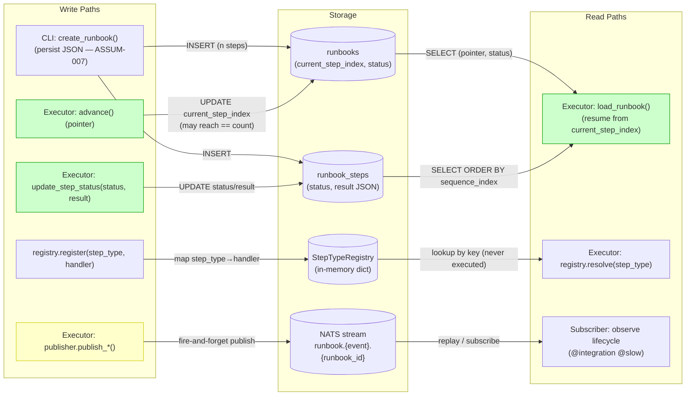
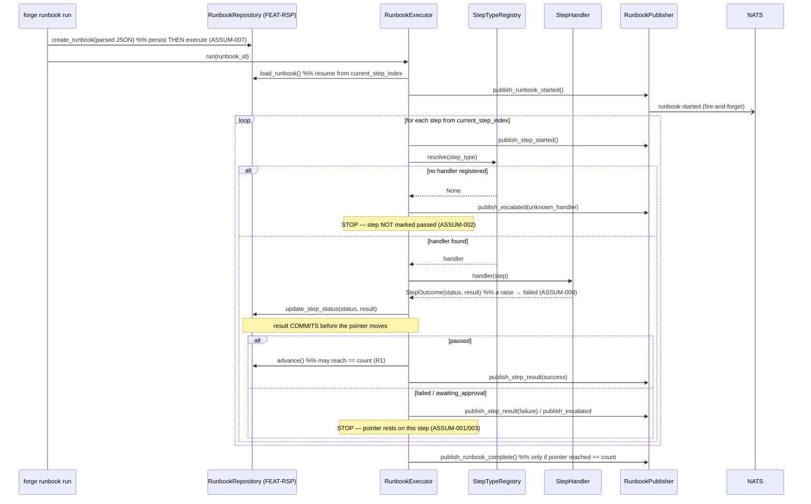
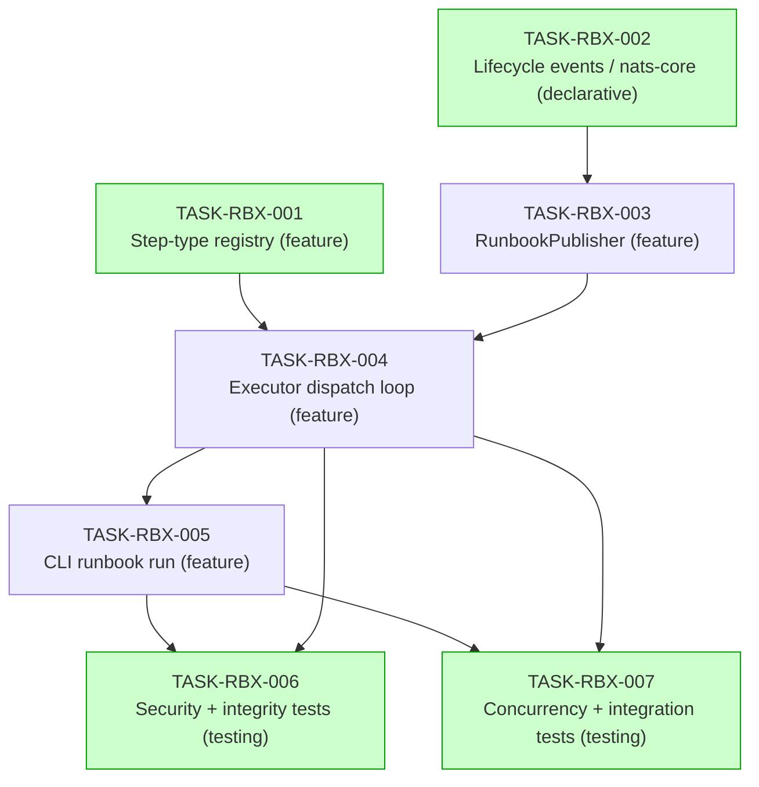

# Implementation Guide — Runbook Executor (FEAT-RBX)

**Source spec:** `features/runbook-executor/runbook-executor_summary.md`
(+ `.feature`, 28 scenarios; assumptions, all human-confirmed).
**Review:** `TASK-REV-RBX-001`.
**Approach:** Option 1 — dispatch-by-`step_type` loop with registry
indirection, reusing the `pipeline_publisher` envelope pattern.
**Depends on:** `FEAT-RSP` (Runbook and Step Persistence) — **build first**.
The executor composes the repository surface and the `Runbook`/`Step`/
`StepStatus` models; it adds **no** SQL of its own.

> **Locked decisions (from `TASK-REV-RBX-001`):**
> - **ASSUM-004 → R1:** `advance()` may rest the pointer at
>   `current_step_index == step_count`; that terminal position is the single,
>   unambiguous completion marker. Requires a one-line amendment to the
>   not-yet-built FEAT-RSP (see **Cross-feature reconciliation** below).
> - **Q2 → extend `nats-core`:** 5 new `EventType` members + payloads +
>   registry entries (TASK-RBX-002).

---

## Data Flow: Read/Write Paths

> The most important diagram in this guide. Every write path below has a
> corresponding read path — there are **no disconnected paths**.

**What to look for:** the executor only ever **reads** the runbook via
`load_runbook` and **writes** via `update_step_status` / `advance` — it owns no
SQL. `step_type` flows into the registry as a **lookup key only** (the security
property). The NATS write path (`publisher`, yellow) is fire-and-forget: a
publish failure is logged but **never** rolls back the green persistence writes.

**Disconnection Alert:** _None._ `update_step_status` and `advance` are read
back by `load_runbook` on resume; `register` is read by `resolve`; published
events are read by the subscriber (proven by the `@integration @slow`
scenario). The terminal pointer write (`== count`) is read back as the
completion marker.

---

## Integration Contracts (sequence)

> Aggregate complexity = 6 (≥ 5) → the integration-contract sequence is
> mandatory. It traces one step through dispatch → persist → announce, and
> highlights the **result-before-advance** ordering where "skip a step on
> crash" bugs hide.

**What to look for:** `update_step_status(result)` always precedes `advance()`.
A crash in that gap leaves the pointer on a `passed` step; the next run's
recovery shortcut advances it without re-running the handler — no step is ever
skipped, none is ever double-run. The publisher arrows are `-)` (async
fire-and-forget): none of them gates persistence.

---

## Task Dependencies

_Green tasks can run in parallel within their wave._

### Execution strategy (5 waves)

| Wave | Tasks | Parallel? | File ownership (no intra-wave conflict) |
|------|-------|-----------|------------------------------------------|
| 1 | TASK-RBX-001, TASK-RBX-002 | ⚡ yes | `src/forge/executor/registry.py` (+ pyproject marks) vs **nats-core** `envelope.py`/`events.py` |
| 2 | TASK-RBX-003 | — | `src/forge/adapters/nats/runbook_publisher.py` |
| 3 | TASK-RBX-004 | — | `src/forge/executor/executor.py` |
| 4 | TASK-RBX-005 | — | `src/forge/cli/runbook.py` (+ 1 line in `main.py`) |
| 5 | TASK-RBX-006, TASK-RBX-007 | ⚡ yes | `test_runbook_executor.py` (security/integrity) vs `..._integration.py` (concurrency/broker) |

`recommended_parallel: 2`.

---

## §4: Integration Contracts

Cross-task and cross-feature data dependencies exist, so this section is
mandatory.

### Contract: `runbook_lifecycle_events`
- **Producer task:** TASK-RBX-002 (nats-core EventType + payloads + registry).
- **Consumer task(s):** TASK-RBX-003 (publisher), TASK-RBX-004 (executor).
- **Artifact type:** shared event vocabulary (`EventType` members + Pydantic
  payloads + `_EVENT_TYPE_REGISTRY` entries).
- **Format constraint:** 5 members `{runbook_started, step_started,
  step_result, runbook_complete, escalated}`; each resolves via
  `payload_class_for_event_type()`; envelopes carry `source_id="forge"`;
  subjects are `runbook.{event}.{runbook_id}`; `StepResultPayload.status`
  set **equals** `{s.value for s in StepStatus}`.
- **Validation method:** seam tests in TASK-RBX-003 (`-m seam`) assert every
  member resolves and the status vocabularies match.

### Contract: `terminal_pointer`  ⚠️ cross-feature (R1 reconciliation)
- **Producer task:** **TASK-RSP-004** (FEAT-RSP `advance()` — **amended**).
- **Consumer task(s):** TASK-RBX-004 (executor completion logic).
- **Artifact type:** repository pointer semantics.
- **Format constraint:** `advance()` MUST allow `current_step_index` to reach
  `== step_count` (one past the last step); it refuses only `> step_count`.
  `current_step_index == step_count` is the completion marker.
- **Validation method:** seam test in TASK-RBX-004 (`-m seam`,
  `integration_contract("terminal_pointer")`) asserts the pointer can rest at
  `== count`.

### Contract: `persistence_repo_surface`  ⚠️ cross-feature
- **Producer task:** FEAT-RSP TASK-RSP-003 / TASK-RSP-004
  (`create_runbook` / `load_runbook` / `update_step_status` / `advance`).
- **Consumer task(s):** TASK-RBX-004 (executor), TASK-RBX-005 (CLI).
- **Artifact type:** repository method surface + write ordering.
- **Format constraint:** the CLI persists (`create_runbook`) **before** it
  executes (ASSUM-007); the executor commits a step's `result`
  (`update_step_status`) **before** `advance()`.
- **Validation method:** seam tests — TASK-RBX-005 asserts persist-then-execute;
  TASK-RBX-004 asserts result-before-advance via a call-order spy.

### Contract: `handler_outcome`
- **Producer task:** TASK-RBX-001 (`StepHandler` protocol + `StepOutcome`).
- **Consumer task(s):** TASK-RBX-004 (executor).
- **Artifact type:** in-process call contract.
- **Format constraint:** `handler(step) -> StepOutcome(status ∈ {passed,
  failed, awaiting_approval}, result)`; `resolve()` may return `None`
  (→ escalate, never crash); a handler that **raises** is contained and mapped
  to `failed` (ASSUM-008).
- **Validation method:** executor unit tests (TASK-RBX-004) with in-memory
  fakes covering each outcome + the raising handler.

> ⚠️ The two cross-feature contracts (`terminal_pointer`,
> `persistence_repo_surface`) are the integration-boundary risk for this
> feature. Settle the FEAT-RSP amendment **before** either feature builds.

---

## Cross-feature reconciliation (REQUIRED before build)

The executor's ASSUM-004 ("pointer rests beyond the final step,
`== step_count`") conflicts with FEAT-RSP's locked ASSUM-004 ("advancing past
the final step is refused"). Per `TASK-REV-RBX-001` the chosen long-term
solution is **R1 — relax persistence**.

> ⚠️ **Required, NOT yet applied.** FEAT-RSP's ASSUM-004 is a *human-confirmed*
> assumption baked into its BDD `.feature`. This planning run deliberately does
> **not** rewrite that confirmed spec for you. Apply the reconciliation below
> **atomically** before building **either** feature. Under R1 the boundary
> shifts: advancing *from* the final step now moves to the terminal position
> `== count`; what is refused is advancing *from* the terminal position
> (i.e. `> count`).

**Exact edits to make to FEAT-RSP:**

| File | Change |
|------|--------|
| `tasks/backlog/runbook-and-step-persistence/TASK-RSP-004-...md` | `advance()` accepts terminal `current_step_index == step_count`; refuses only `> step_count`. Update the matching AC ("Advancing past the final step raises…" → "Advancing **beyond** the terminal position raises; reaching `== count` is allowed"). |
| `tasks/backlog/runbook-and-step-persistence/IMPLEMENTATION-GUIDE.md` | Locked-assumptions table: ASSUM-004 → "advancing to the terminal `== count` is allowed; advancing beyond `count` is refused". |
| `features/runbook-and-step-persistence/runbook-and-step-persistence.feature` | Scenario "Advancing past the final step is refused" (≈L119) and "…stay consistent after a refused advance" (≈L360) → the refused advance happens **from the terminal position** (`== count`), not from the final step. Pointer-position outline (≈L104) → valid range extends to include the terminal index. |
| `features/runbook-and-step-persistence/runbook-and-step-persistence_assumptions.yaml` | ASSUM-004 text → terminal-position rule. |

FEAT-RSP's ASSUM-009 (overall status not mutated by `update`/`advance`) stays
**intact** — because the executor stops on failure, `(current_step_index,
per-step statuses)` fully determines runbook state with no redundant overall-
status write.

The executor's `terminal_pointer` §4 seam test (TASK-RBX-004) is the guard that
this reconciliation actually landed: it asserts the pointer can rest at
`== count` and will fail loudly against an un-amended FEAT-RSP.

---

## Out of scope (do not implement)

Concrete step handlers (the executor imports none — registry indirection only),
subprocess execution, LLM calls, retry/backoff policy, deriving overall runbook
status from step transitions, any new SQL (the repository owns all writes).

## Testing posture

TDD. The 28 Gherkin scenarios are the acceptance backbone. Unit gates use
in-memory fake handlers — **no subprocess, no NATS broker**. The single
real-broker scenario is `@integration @slow` and is excluded from the default
`pytest` run. Mirror the persistence suite's fixture style (one `tmp_path`
SQLite file per test).
