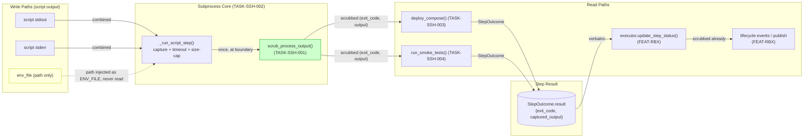
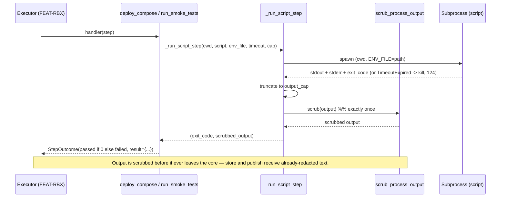
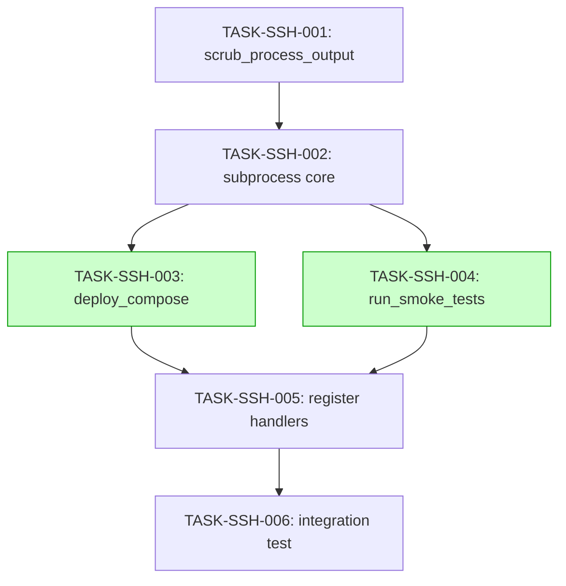

# Implementation Guide — Shell Script Step Handlers (FEAT-SSH)

**Review:** TASK-REV-SSH1 · **Slug:** `shell-script-step-handlers` · **Focus:** security + correctness

Two concrete runbook step handlers — `deploy_compose` and `run_smoke_tests` —
that wrap existing shell scripts as subprocesses and register into the executor's
step-type registry (FEAT-RBX, upstream). Each runs a named script in a working
directory with an env-file available **by path**, captures combined
stdout/stderr, scrubs credentials at the capture boundary, and maps the script's
exit status to a verdict.

**Planning decisions applied:**
- Shared subprocess core + two thin handlers (single credential-scrub site).
- New sibling scrubber `scrub_process_output` in `src/forge/memory/redaction.py`.
- **Hardened** timeout + output size-cap now (extends ASSUM-008/009).
- ASSUM-013 (env-file pre-validation) stays **deferred** — missing env file
  surfaces as the script's own non-zero exit.
- Step-type keys: `deploy_compose` / `run_smoke_tests`.

---

## Data Flow: Read/Write Paths



_What to look for: every output path funnels through the single `scrub_process_output`
site (green) before it can reach storage or publish. `env_file` (yellow) is a
dotted/never-read path — it is injected by path only. No disconnected read/write
paths: every write reaches a reader._

**Disconnection check:** ✅ none. Every capture write flows through scrub →
`StepOutcome.result` → executor persist/publish (both read paths have callers).

---

## Integration Contracts (sequence)



_What to look for: the scrub happens once, inside the core, before the handler or
executor ever sees the output. There is no "fetch-then-discard": every retrieved
value is passed onward scrubbed._

---

## Task Dependencies



_Tasks with green background (the two handlers) can run in parallel._

| Wave | Tasks | Notes |
|------|-------|-------|
| 1 | TASK-SSH-001 | Scrubber foundation (security boundary) |
| 2 | TASK-SSH-002 | Subprocess core (timeout + size-cap + scrub) |
| 3 | TASK-SSH-003, TASK-SSH-004 | Two handlers — **parallel-safe** |
| 4 | TASK-SSH-005 | Registry wiring |
| 5 | TASK-SSH-006 | `@integration @slow` real-script proof |

---

## §4: Integration Contracts

### Contract: SCRUB_MARKERS
- **Producer task:** TASK-SSH-001 (`scrub_process_output`)
- **Consumer task(s):** TASK-SSH-002 (subprocess core)
- **Artifact type:** pure function contract (`str -> str`)
- **Format constraint:** Captured output MUST pass through `scrub_process_output`
  **exactly once**, at the capture boundary, before being returned/stored.
  Postgres DSNs → `***REDACTED-DSN***`; `password=`/`PGPASSWORD=` values →
  `***REDACTED-PASSWORD***`. Idempotent — already-redacted output is unchanged.
- **Validation method:** Coach runs the SCRUB_MARKERS seam test in TASK-SSH-002;
  asserts a planted DSN/password is absent from returned output and the marker is
  present.

### Contract: STEP_OUTCOME
- **Producer task:** TASK-SSH-002 (subprocess core return shape) →
  TASK-SSH-003 / TASK-SSH-004 (handler return)
- **Consumer task(s):** Executor (FEAT-RBX) via `update_step_status(result=…)`
- **Artifact type:** `StepOutcome(status, result)` value object
- **Format constraint:** `status` ∈ {`passed`, `failed`} for shell steps
  (`0 → passed`, non-zero → `failed`; for `run_smoke_tests` the exit status *is*
  the verdict). `result` is a JSON-serializable dict (`exit_code`,
  `captured_output`) — persisted verbatim by the executor.
- **Validation method:** Coach asserts handler output is a `StepOutcome` with a
  terminal status and a JSON-serializable `result` dict.

---

## Deferred risks (acknowledged)

| Assumption | Disposition | Residual risk |
|------------|-------------|---------------|
| ASSUM-008 (timeout) | **Hardened** in TASK-SSH-002 | none (killed at timeout → `failed`) |
| ASSUM-009 (size cap) | **Hardened** in TASK-SSH-002 | none (truncate-then-scrub) |
| ASSUM-013 (env-file pre-validation) | **Deferred** | a missing env file surfaces as the script's own non-zero exit, not a handler-side rejection (matches spec scenario) |

---

## AutoBuild

```bash
/feature-build FEAT-SSH
```
