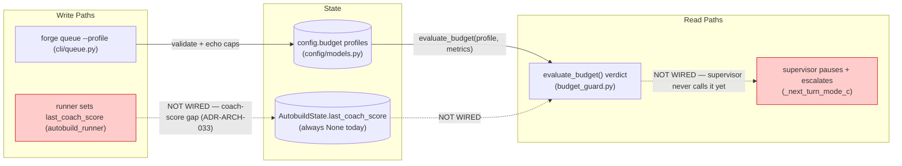
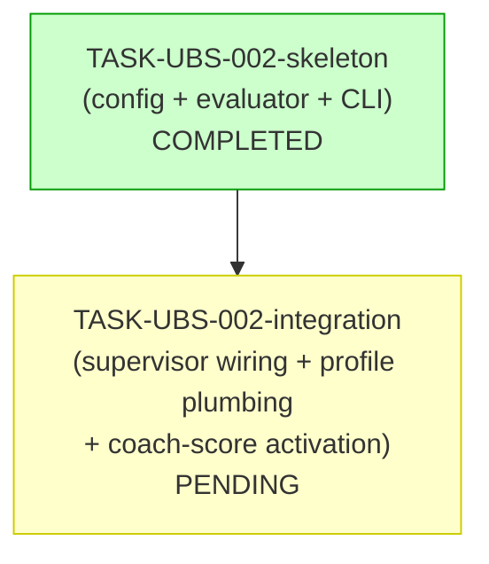

# Implementation Guide — FEAT-UBS-002 Unattended build-profile budget guards

**Retro-plan.** The skeleton (TASK-UBS-002-skeleton) is built + unit-tested; the
integration (TASK-UBS-002-integration) is the remaining work. This guide's data-flow
diagram is the point of the whole plan: it shows exactly which paths are wired and
which are not, so the disconnection is impossible to miss.

## Data Flow: Read/Write Paths

_What to look for: the solid path (queue → config → evaluator) is the shipped
skeleton and is unit-tested. Every dotted red path is DEFERRED to
TASK-UBS-002-integration — the evaluator produces a verdict that nothing consumes
in a live build yet, and the coach-score that would feed the quality floor is
never written._

**Disconnection Alert (acknowledged, not a defect).** The evaluator's verdict
(R1) has no live caller (R2) and the coach-score write (W2) is not wired. This is
**deliberate and tracked** — the skeleton is the decision core; the live wiring is
TASK-UBS-002-integration. Every DEFERRED BDD scenario is tagged
`@task:TASK-UBS-002-integration` so the gap is visible in the oracle, not hidden.

## Task Dependencies

_Wave 1 (skeleton) is done; Wave 2 (integration) is the remaining build._

## §4: Integration Contracts

### Contract: last_coach_score (the coach-score feed)
- **Producer:** the guardkit-autobuild runner path (`autobuild_runner.py`) — must
  parse the Coach verdict into `AutobuildState.last_coach_score`. **Not built**
  (the coach-score gap, ADR-ARCH-033).
- **Consumer:** `budget_guard.evaluate_budget` via `BuildBudgetMetrics.last_coach_score`.
- **Format constraint:** a float in `[0, 1]`, or `None` when unavailable. The
  evaluator's `min_coach_score` branch is inert while the value is `None`.
- **Validation:** the producer side is gated on capturing a real
  `guardkit autobuild --verbose` transcript (TASK-ABW-OPS AC-OPS-06) to build the
  parser against a verified format.

### Contract: selected profile (queue → daemon)
- **Producer:** `forge queue --profile <name>` (`cli/queue.py`).
- **Consumer:** the daemon's supervisor, which must resolve `config.budget.resolve(name)`.
- **Format constraint:** the profile name must be delivered per-build. `BuildQueuedPayload`
  (nats-core) has no field and the `builds` table no column — **not wired**. Options in
  TASK-UBS-002-integration: a `builds.profile` column (forge-only) or a nats-core field (ADR).

## Verification

- Skeleton oracle: 15 `@task:TASK-UBS-002-skeleton` BDD scenarios + the 3 unit-test
  files. All green.
- Integration oracle: the 3 `@task:TASK-UBS-002-integration` BDD scenarios (currently
  unimplemented behaviour) become Coach-blocking when that task is built.
